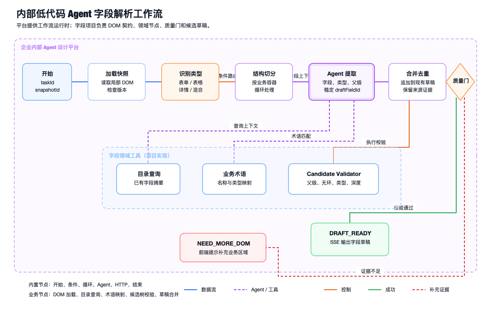
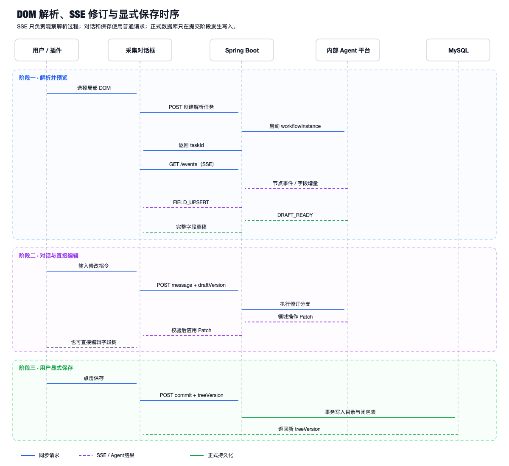
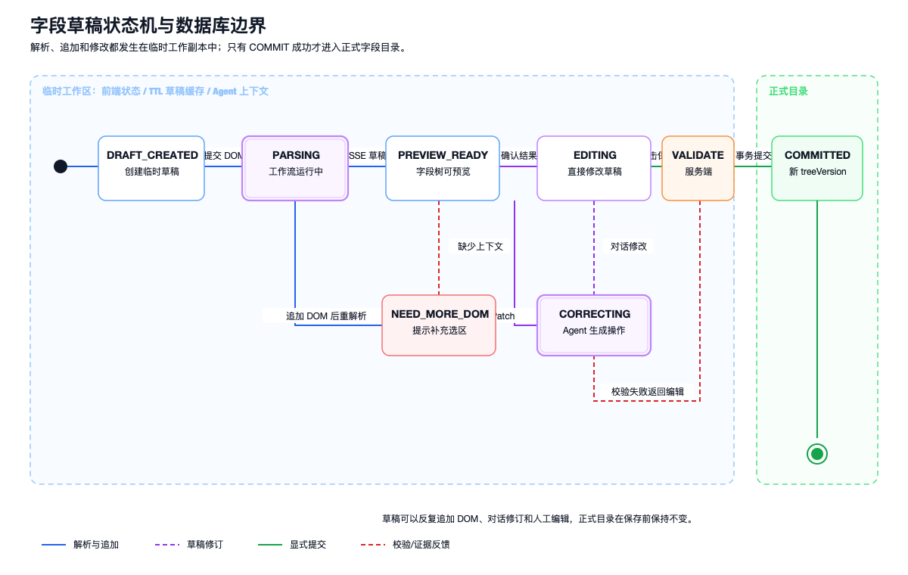

## 基于内部低代码平台的 Agent 字段解析

上一章解决了 Agent 的输入：用户通过插件选择局部 DOM，或者由 Agent + Playwright 为简单页面生成 DOM 快照。本章关注后半段链路：内部 Agent 工作流如何把 `DomSnapshot` 解析成字段树，前端如何实时预览和修改，以及为什么只有用户点击保存后结果才进入正式字段目录。

这套设计的核心不是让模型直接“生成数据库数据”，而是建立一层可检查、可修改、可放弃的字段草稿：

```text
DomSnapshot
  → Agent 解析工作流
  → FieldDraft
  → SSE 实时预览
  → 对话修改 / 直接编辑 / 追加 DOM
  → 用户点击保存
  → 正式字段目录
```

模型输出与正式目录之间始终存在草稿隔离层。

## 系统职责边界

项目依托公司内部低代码 Agent 设计平台完成模型接入和工作流运行，不重复建设通用 Agent 基础设施。

| 责任范围 | 内部 Agent 设计平台 | 字段目录项目 |
| --- | --- | --- |
| 模型能力 | 模型网关、参数配置、调用限额 | 为字段场景选择模型配置 |
| 工作流 | 开始、条件、循环、Agent、HTTP、结束节点 | 设计字段解析节点和条件路由 |
| 运行能力 | 实例调度、超时、重试、运行日志 | 维护业务 taskId 与实例 ID 映射 |
| 提示管理 | Prompt 版本和变量注入 | 字段规则、DOM 数据边界、输出 Schema |
| 领域工具 | 提供工具接入方式 | 目录查询、术语映射、候选树校验 |
| 前端交互 | 不负责字段业务界面 | 采集对话框、SSE 预览、字段树编辑 |
| 数据写入 | 不直接访问正式字段目录 | 权限校验、事务保存、闭包表和版本控制 |

一句话概括是：**平台提供 Agent 运行时，字段项目提供业务工作流和最终事实来源。**

## 工作流总体设计



工作流采用“低代码编排、高代码规则”的结构。低代码节点负责宏观流转和模型调用，字段领域服务负责确定性校验。复杂目录规则不会全部堆进 Prompt，也不会分散在难以测试的条件表达式中。

### 节点级流程

| 节点 | 类型 | 输入 | 输出 | 失败路由 |
| --- | --- | --- | --- | --- |
| 开始 | 内置开始节点 | `taskId`、`snapshotId`、`draftId` | 工作流上下文 | 输入缺失直接结束 |
| 加载快照 | 自定义 HTTP 节点 | `snapshotId` | 清洗后的 `DomSnapshot` | 快照不存在或版本不兼容 |
| 识别类型 | 条件节点 | DOM 结构摘要 | FORM、TABLE、DETAIL、MIXED | 不能分类时进入 MIXED |
| 结构切分 | 循环节点 | DOM 业务容器 | 带上下文的 DOM 分段 | 分段超限时返回质量告警 |
| Agent 提取 | Agent 节点 | 分段、规则、目录摘要 | 字段候选和父级候选 | 超时重试；证据不足不猜测 |
| 合并去重 | 业务节点 | 新字段候选、当前草稿 | 新草稿版本 | 草稿版本冲突时重新加载 |
| Candidate Validator | 业务节点 | 候选字段树 | 校验结果和原因码 | 可修复错误限定重试一次 |
| 草稿输出 | 结束节点 | 已校验 `FieldDraft` | `DRAFT_READY` | 不触发正式目录写入 |
| 补充 DOM | 结果分支 | 缺失证据说明 | `NEED_MORE_DOM` | 等待用户追加选区 |

输入按业务容器切分，而不是按固定 Token 长度机械截断。表单项、表头和所属标题必须位于同一分段，否则模型虽然能识别字段名称，却容易丢失父级关系。

## 为什么这里仍然称为 Agent

整个宏观流程由工作流固定，但 Agent 节点在局部任务中仍然具有受控决策能力。它可以根据当前 DOM 类型和歧义情况决定是否调用：

- `lookup_catalog_fields`：查询现有目录中相似字段；
- `lookup_business_terms`：查询字段名称、编码和类型映射；
- `inspect_dom_fragment`：补读当前快照中的局部结构；
- `validate_candidate_tree`：提前检查候选结构；
- `request_more_dom`：明确说明缺少哪类页面上下文。

Agent 的循环受最大步骤数和超时限制，工具输入输出都使用固定 Schema。它不能调用浏览器中的任意能力，不能执行目录写入，也不能绕过候选树校验器。

如果把工具顺序完全固定、每一步都不需要模型选择，就应该称为普通工作流；这里保留 Agent，是因为同名字段归属、控件语义和已有目录匹配仍然需要根据局部证据动态选择查询工具和判断路径。

## Prompt 上下文如何组织

Prompt 不直接拼接整页 HTML，而是由五层上下文组成：

1. **系统规则**：说明字段、分组、类型和父级的判断边界；
2. **DOM 数据**：经过清洗的当前分段，并明确标记为不可信页面内容；
3. **目录上下文**：目标目录附近的节点摘要，而不是整棵目录树；
4. **输出契约**：FieldDraft Schema、枚举值和错误返回形式；
5. **修订上下文**：校验错误、当前草稿版本或用户修改指令。

DOM 数据使用清晰的开始和结束标识包围，页面文字不能改变系统规则。模型也不会得到数据库连接、用户凭证或与当前目录无关的数据。

为了控制后续对话的上下文，修订请求只发送相关字段子树、当前草稿版本、最近对话和必要摘要，不会在每次修改时重新提交全部 DOM 和完整历史。

## FieldDraft 数据契约

Agent 的正式输出不是 Markdown，也不是一段自然语言说明，而是符合 Schema 的字段草稿。

```json
{
  "draftId": "draft_1001",
  "draftVersion": 3,
  "baseTreeVersion": 12,
  "snapshotIds": ["snap_01", "snap_02"],
  "fields": [
    {
      "draftFieldId": "df_group_refund",
      "nodeType": "GROUP",
      "name": "退款信息",
      "parentId": null,
      "sourceRefs": ["snap_01:n_01"]
    },
    {
      "draftFieldId": "df_refund_status",
      "nodeType": "FIELD",
      "name": "退款状态",
      "code": "refundStatus",
      "dataType": "STRING",
      "parentId": "df_group_refund",
      "sourceRefs": ["snap_01:n_02"],
      "confidence": "HIGH"
    }
  ],
  "warnings": []
}
```

`draftFieldId` 在草稿生命周期内保持稳定。后续对话修改通过 ID 定位节点，不能只使用可能重名的字段名称。

`baseTreeVersion` 记录打开采集会话时的正式目录版本。它不参与模型推理，但会在最终保存时用于并发冲突检查。

`sourceRefs` 将候选字段关联回 DOM 快照和来源节点，前端点击字段时可以展示对应页面文本和结构证据。人工新增字段可以使用 `MANUAL_INPUT` 来源并附加说明，不伪造 DOM 引用。

## 候选字段树质量门

模型能够生成结构化 JSON，不代表字段树可以直接使用。Candidate Validator 在服务端执行确定性规则：

- 每个字段只能有一个直接父节点；
- 父节点必须存在于当前草稿或目标目录；
- 字段树不能出现环；
- 节点深度不能超过平台限制；
- `nodeType` 和 `dataType` 必须属于允许枚举；
- 同一父节点下不能产生冲突编码；
- DOM 提取字段必须保留至少一个来源引用；
- 删除、移动已有字段等高风险操作不能由首次解析隐式产生。

校验结果分为三类：

- **通过**：输出 `DRAFT_READY`；
- **可修复结构错误**：把稳定原因码交给修订节点，限定重试一次；
- **证据不足**：输出 `NEED_MORE_DOM`，由用户补充页面选区。

“证据不足”和“系统失败”必须分开。前者是正常业务分支，后者才进入错误处理。

## SSE 如何把结果推回前端

解析是异步过程，前端创建任务后使用 SSE 观察进度。



接口交互分为两步：

```http
POST /api/dom-parse-tasks
GET  /api/dom-parse-tasks/{taskId}/events
```

创建接口立即返回 `taskId`，Spring Boot 后端启动内部工作流，并把 `taskId`、`workflowInstanceId`、工作流版本和快照 ID 关联起来。前端随后建立 SSE 连接。

事件类型保持业务语义，不暴露模型内部思维过程：

```text
TASK_STARTED
WORKFLOW_NODE_STARTED
DOM_SEGMENTED
FIELD_UPSERT
VALIDATION_WARNING
NEED_MORE_DOM
DRAFT_READY
TASK_FAILED
TASK_COMPLETED
```

单个字段增量事件包含单调递增的 `sequence` 和 `draftVersion`：

```text
event: FIELD_UPSERT
id: 37
data: {
  "taskId": "parse_1001",
  "sequence": 37,
  "draftVersion": 2,
  "field": {
    "draftFieldId": "df_refund_status",
    "name": "退款状态",
    "dataType": "STRING"
  }
}
```

内部平台即使提供 Token 级流式输出，后端也不会把半截 JSON 直接推给字段树组件。解析网关先聚合出完整字段对象，完成 Schema 校验后再转换成 `FIELD_UPSERT`，避免前端在每个 Token 到达时反复修复非法 JSON。

SSE 是单向通道，只负责服务器向浏览器推送任务进度。创建任务、对话修改和最终保存仍然使用普通 HTTP 请求。相比 WebSocket，这种职责划分更符合“请求由用户发起、过程由服务端持续通知”的交互模型。

连接通过心跳保持，事件携带 ID。浏览器重连时提交 `Last-Event-ID`；即使增量事件无法完整回放，前端也可以重新查询当前完整 FieldDraft，因此 SSE 断开不会改变解析任务和草稿事实。

## 对话修改如何工作

用户可以在对话框中输入：

> 删除“操作”字段，把“退款状态”移动到“退款信息”下，并把“申请时间”改成日期时间类型。

Agent 不重新生成整棵字段树，而是输出领域变更操作：

```json
{
  "baseDraftVersion": 3,
  "operations": [
    {
      "operation": "DELETE_FIELD",
      "fieldId": "df_operation"
    },
    {
      "operation": "MOVE_FIELD",
      "fieldId": "df_refund_status",
      "newParentId": "df_group_refund"
    },
    {
      "operation": "CHANGE_TYPE",
      "fieldId": "df_apply_time",
      "dataType": "DATETIME"
    }
  ]
}
```

支持的操作被限制在字段领域：

- `RENAME_FIELD`
- `CHANGE_CODE`
- `CHANGE_TYPE`
- `MOVE_FIELD`
- `DELETE_FIELD`
- `CREATE_GROUP`
- `MERGE_FIELDS`
- `SPLIT_FIELD`

服务端先校验操作，再应用到草稿并生成新版本。这样比重新生成整棵树更稳定，也保留了撤销、重放和变更说明。

## 直接编辑如何与对话编辑共存

字段树预览支持直接修改名称、编码和类型，拖拽父级，删除误识别字段，以及手工新增分组。直接编辑和对话编辑最终都转成同一组领域操作，并作用在同一份版本化草稿上。

版本控制解决异步覆盖问题：

```text
对话请求基于 draftVersion = 3
        ↓
用户先完成一次直接编辑，草稿变成 version = 4
        ↓
Agent 返回基于 version = 3 的操作
        ↓
服务端拒绝直接套用，要求基于 version = 4 重新执行
```

初次解析期间前端可以预览字段增量，但在 `DRAFT_READY` 前不开放结构性编辑，从交互上进一步减少流式解析与人工编辑竞争同一字段的情况。

## 草稿生命周期与正式数据库边界



草稿可以反复经历：

- 追加新的 DOM 快照；
- Agent 重新解析增量区域；
- 用户通过对话生成修改操作；
- 用户直接修改字段树；
- 质量门失败后返回编辑。

这些操作只改变临时工作副本。临时数据可以位于前端状态、带 TTL 的草稿缓存和 Agent 工作流上下文中，但不会更新正式目录节点和闭包关系。

只有用户点击保存，前端才提交：

```json
{
  "draftId": "draft_1001",
  "draftVersion": 7,
  "baseTreeVersion": 12,
  "idempotencyKey": "commit:draft_1001:v7",
  "fields": []
}
```

服务端保存流程包括：

1. 校验用户对目标平台的写权限；
2. 校验 `draftVersion`，防止保存旧草稿；
3. 重新执行字段树结构校验；
4. 比较正式目录当前 `tree_version` 与 `baseTreeVersion`；
5. 将草稿转换成新增、改名、移动等目录命令；
6. 按父节点优先顺序写入邻接关系；
7. 在同一事务中更新闭包表；
8. 递增平台 `tree_version` 并记录变更；
9. 提交事务后返回新的目录版本。

任意一步失败都会回滚。Agent 工作流没有正式目录写权限，SSE 事件也不能触发保存，因此模型超时、浏览器刷新和用户放弃草稿都不会污染已有目录。

## 失败、重试与用户反馈

| 错误码 | 含义 | 是否自动重试 | 前端处理 |
| --- | --- | --- | --- |
| `DOM_SNAPSHOT_INVALID` | 快照缺字段或 Schema 不兼容 | 否 | 提示重新采集 |
| `DOM_FRAGMENT_TOO_LARGE` | 选区超过处理上限 | 否 | 提示缩小业务区域 |
| `MODEL_RATE_LIMIT` | 模型网关限流 | 是，退避重试 | 保留任务和输入 |
| `MODEL_TIMEOUT` | 单次 Agent 调用超时 | 是，限定次数 | 展示当前解析阶段 |
| `MODEL_SCHEMA_INVALID` | 输出不符合 FieldDraft Schema | 可修复一次 | 失败后保留原草稿 |
| `NEED_MORE_DOM` | 缺少标题、页签或父级证据 | 否 | 引导追加 DOM |
| `DRAFT_VERSION_CONFLICT` | 异步结果基于旧草稿 | 否 | 重新基于新版本修订 |
| `SSE_DISCONNECTED` | 观察通道中断 | 自动重连 | 重取当前完整草稿 |
| `TREE_VERSION_CONFLICT` | 正式目录已被其他操作修改 | 否 | 重新加载并展示差异 |
| `COMMIT_VALIDATION_FAILED` | 最终结构校验失败 | 否 | 返回字段级错误 |

基础设施错误和业务证据不足不能使用同一种重试。限流、网络抖动可以自动重试；缺少父级上下文时重复调用同一个模型不会增加信息，只会重复消耗 Token，因此必须回到用户补充 DOM。

## 方案演进中的关键问题

### 1. 把完整 DOM 和全部目录都塞进 Prompt

这样做会同时增加 Token、噪声和敏感数据范围。最终改为局部 DOM、结构清洗和局部目录查询，Agent 根据需要调用工具补充上下文。

### 2. 流式输出直接拼 JSON

半截 JSON 会让前端树不断进入非法状态。最终由解析网关聚合并校验完整字段对象，再发送领域事件。

### 3. 每次对话重新生成整棵树

整树重生成容易丢失人工修改，也难以解释“这次到底改了什么”。最终使用稳定字段 ID 和领域操作 Patch。

### 4. 解析结果与正式目录缺少草稿隔离

如果解析完成后直接写入，模型输出即使结构合法，也不代表符合当前业务目录。方案因此增加草稿隔离和显式保存，正式写入必须经过权限、目录版本和事务校验。

### 5. 只依赖前端草稿版本

多个异步请求可能覆盖彼此。最终由服务端校验 `baseDraftVersion`，旧版本操作不能静默应用。

### 6. 工作流在线修改影响运行中任务

工作流实例绑定 `workflowVersion`、`promptVersion`、`schemaVersion` 和模型配置。新版本只影响新任务，旧任务仍然使用创建时的配置，便于复现问题。

## 如何评估解析质量

评估集由固定 DOM 快照和人工标注字段树组成，至少覆盖表单、表格、详情区、混合布局、同名字段和缺少上下文等类型。每次调整工作流、Prompt 或模型配置后记录：

- 字段识别准确率和召回率；
- 父级关系准确率；
- 字段类型准确率；
- FieldDraft 结构合法率；
- 首次解析后人工修改率；
- `NEED_MORE_DOM` 的原因分布；
- 单个快照的模型调用次数与 Token；
- SSE 重连后的草稿一致性；
- 对话操作应用成功率；
- 保存前目录版本冲突率。

评估报告同时记录 `workflowVersion`、`promptVersion`、`schemaVersion` 和模型配置，避免只保留最终分数却无法复现实验条件。

## 本章结论

这套 Agent 方案的价值不在于替代字段平台的业务规则，而在于把非结构化 DOM 转换成可编辑的字段草稿。内部低代码平台负责模型和工作流运行，字段项目负责 DOM 契约、领域工具、SSE 事件、草稿版本、前端修订和最终目录事务。

最终形成的可信边界是：**Agent 可以解析和建议，用户可以对话修改或直接编辑，只有显式保存才能改变正式字段目录。**
