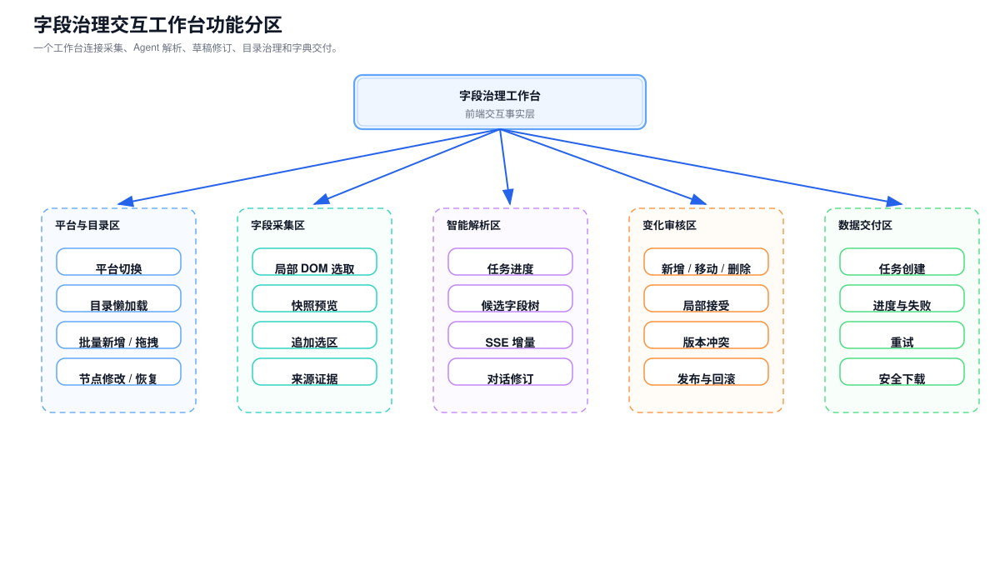
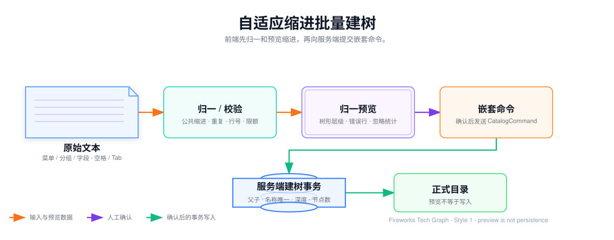
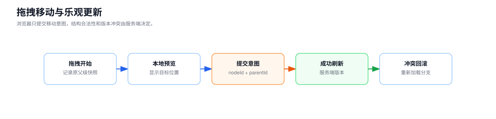
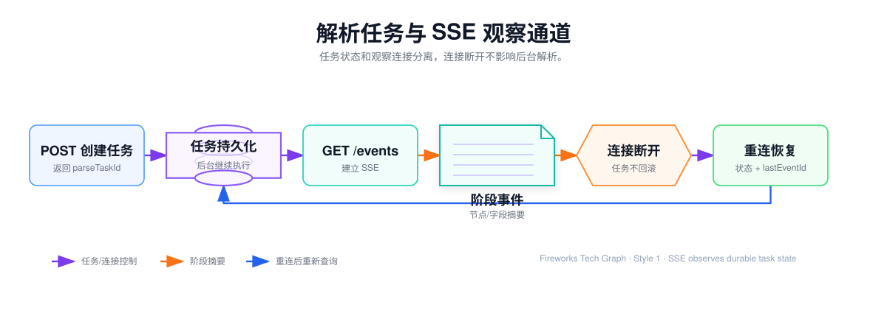

## 字段治理交互工作台

字段治理平台的前端不是目录树的静态展示页，而是连接采集任务、Agent 解析、人工审核、目录事务和异步导出的操作工作台。

工作台需要同时处理两类状态：一类是业务人员当前看到的页面状态，例如展开节点、选中节点、候选差异和筛选条件；另一类是服务端持久化的业务状态，例如解析任务、目录版本、变化集和导出任务。前端可以乐观更新交互，但不能成为业务状态的唯一事实来源。

## 功能分区

## 目录树交互

目录节点数量不设固定业务上限，因此前端默认按层懒加载，不能在进入页面时强制加载整棵树。

- 首次只请求平台根节点；
- 业务人员展开节点时请求直接子节点游标页；
- 展开状态与节点数据分开保存；
- `hasChildren` 决定是否展示展开入口；
- 面包屑通过祖先路径接口恢复；
- 定位搜索结果时，只补齐目标节点的祖先链；
- 完整树只用于节点数受保护的小规模场景；
- 大规模读取使用 NDJSON，不在浏览器中一次构造巨大响应对象。

目录响应携带 `tree_version`。如果业务人员停留期间目录发生变化，前端不尝试静默合并未知结构，而是失效受影响分支并重新加载。

## 自适应缩进批量建树

批量录入支持直接粘贴具有视觉层级的文本。前端先完成归一和预览，再向服务端发送嵌套命令。

归一过程处理：

- 空格、Tab、不换行空格和全角空格；
- 整段文本的公共缩进；
- 不固定宽度的缩进档位；
- 中间层缺失时的安全降级；
- 中文复制文本中的多余空格；
- 同一父节点下的重名节点和重复子树；
- 节点数量、最大深度、名称长度和输入长度。

预览区展示归一后的树、清洗行数、重复节点数和忽略空行数。解析错误定位到原始行号，避免业务人员在服务端返回失败后重新寻找问题。

## 拖拽移动与乐观更新

拖拽只负责产生“把节点移动到新父级”的意图，结构合法性仍由服务端判断。

前端提前禁止明显非法操作，例如拖到自身或已加载的后代节点中，但不能依赖本地树完成最终循环检测，因为浏览器中可能只有部分目录。

## 采集任务与 DomSnapshot 预览

主流程由业务人员先打开目标业务系统并进入正确的页签、弹窗或展开状态，再点击 Field DOM Scout 手动选取一个或多个业务区域。插件自动清洗选区，生成简化 HTML、页面上下文和结构事实；业务人员将结果复制到 Agent 输入工作台，并补充目标目录父级和业务说明后创建解析任务。对于结构简单、允许安全访问且没有复杂交互的页面，才启用 Agent + Playwright 自动入口；不同来源最终都转换为同一份 `DomSnapshot`。

工作台展示：

- 目标父节点与目录路径；
- 页面标题、路由、当前页签和选区说明；
- 快照来源、清洗前后体积和移除节点统计；
- 表单、表格、详情区等结构摘要；
- 敏感值脱敏结果和清洗警告；
- 选区过小、HTML 不可解析和超限等失败原因；
- 自动入口的状态指纹、动作预算和停止原因（仅在启用 Playwright 时展示）。

DOM-SCOUT 是默认来源；Easy Copy DOM 是无插件时的降级来源，Agent + Playwright 是受限自动入口。不同来源的差异只体现在 `sourceType`、采集方式和审计信息中，后续均使用相同的 `DomSnapshot` 契约。

## Agent 解析观察

解析任务是服务端持久化任务，SSE 仅用于实时观察。

工作台不展示模型的原始思维过程，也不直接消费 Agent 的 `HierarchyProposal`。它只展示可审计的阶段状态，以及后端编译、校验后的 `FieldTreeDraft`：Evidence Agent 补充了哪些关系、层级和字段语义是否完成、后端生成了多少可渲染节点、哪些节点需要人工确认。

执行状态的静态图：[Agent 编排：DOM 证据到 FieldTreeDraft](./assets/agent-execution-lifecycle.svg)，交互版：<a href="/media/projects/baozun-field-platform/diagrams/agent-execution-lifecycle/index.html" target="_blank" rel="noreferrer">打开 Agent 编排、校验与修复流程图</a>。工作台只消费后端阶段事件和结果摘要，不直接暴露底层模型调用细节。

## FieldTreeDraft 与差异审核

后端生成的 `FieldTreeDraft` 与正式目录并排展示，变化类型使用稳定语义而不是只依赖颜色：

`FieldTreeDraft` 使用人工采集页面已经支持的 `id`、`parentId`、`level`、`children`、节点类型和审核状态，因此 Agent 快速解析不需要新建一套树渲染器。只有业务人员确认变化后，前端才把草稿操作提交为正式目录命令。

- `ADD`：新增节点；
- `RENAME`：名称变化；
- `MOVE`：父级变化；
- `CHANGE_TYPE`：节点类型变化；
- `DELETE`：页面不再出现；
- `UNCHANGED`：身份匹配且定义未变化。

点击草稿节点可以查看 `sourceRefs`、解析方式、修订提示和校验结果。审核支持：

- 接受整个变化集；
- 只接受部分变化；
- 修改名称、类型或父级；
- 将错误节点标记为忽略；
- 填写反馈并触发局部重算；
- 拒绝变化集并记录稳定原因码。

删除和大范围移动默认属于高风险操作，需要显式确认，不能跟随普通新增自动批准。

## 版本冲突

审核页面打开时记录基线 `tree_version`。发布前如果平台树版本已经变化，服务端返回冲突节点和当前版本。

前端不覆盖服务端新数据，而是展示：

- 哪些节点在审核期间被修改；
- 原候选变化与当前目录的差异；
- 哪些操作仍可直接应用；
- 哪些操作必须重新生成或人工选择。

版本冲突解决后重新生成 CatalogCommand，再执行发布事务。

## 导出任务工作台

导出接口创建任务后立即返回 `202 Accepted`。任务列表按当前业务人员的权限范围查询，展示任务类型、平台、状态、进度、创建时间和文件状态。

- PENDING、RETRYING 使用轮询观察；
- RUNNING 展示已处理数量，只有总量确定后才展示百分比；
- FAILED 展示稳定错误摘要和是否可重新创建；
- CANCELED 不再提供执行操作；
- SUCCESS 且文件存在时开放下载；
- 文件到期清理后保留任务历史，但下载入口变为不可用。

轮询使用页面可见性控制频率，后台标签页降低请求频率，终态任务停止轮询。

## 统一错误交互

| HTTP / 业务状态 | 工作台处理 |
| --- | --- |
| 400 | 定位请求字段或批量输入行号 |
| 401 | 清理本地会话并返回登录页 |
| 404 | 移除失效节点或提示任务不存在 |
| 409 | 回滚乐观更新，展示版本冲突 |
| 422 | 展示结构、容量或质量门失败原因 |
| 429 | 保留业务人员输入，按 `Retry-After` 提示重试 |
| 500 | 保留操作上下文，提供 traceId 用于排查 |

## 前后端状态边界

浏览器可以保存：展开节点、当前选中项、面板大小、筛选条件和未提交表单。

服务端必须保存：采集任务、解析任务、DomSnapshot、HierarchyProposal、FieldTreeDraft、DraftOperation、目录版本、导出任务和文件元数据。

这条边界保证刷新页面、SSE 断开或浏览器关闭后，业务任务仍能恢复；也避免不同业务人员看到由本地状态推导出的不一致目录。

> 一句话收尾：全栈工作台的核心不是把所有能力放到一个页面，而是让前端交互状态与服务端业务状态正确衔接，使采集、Agent、审核、目录事务和异步交付形成可恢复的完整闭环。
