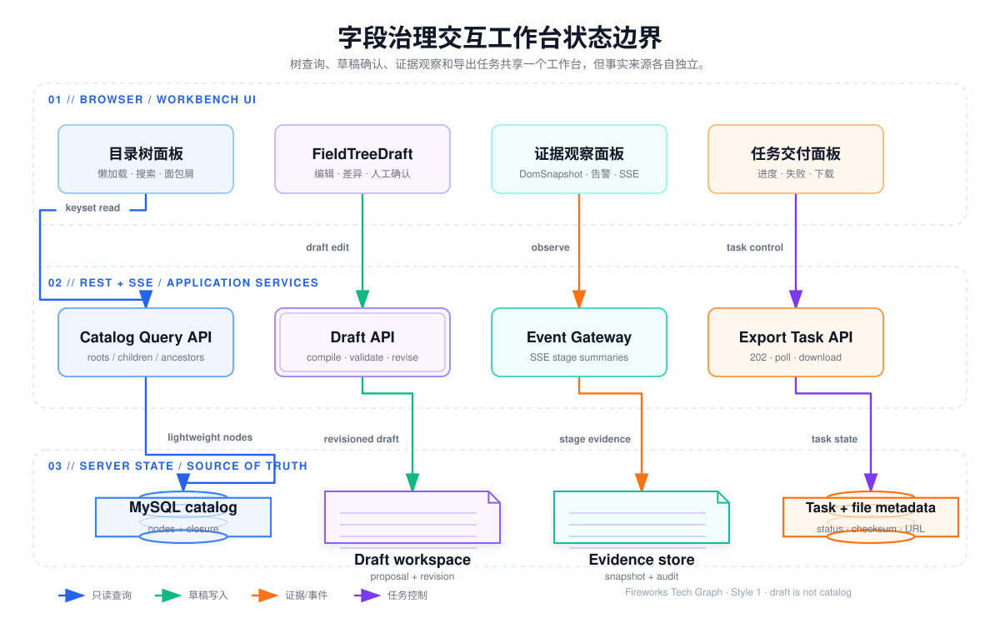
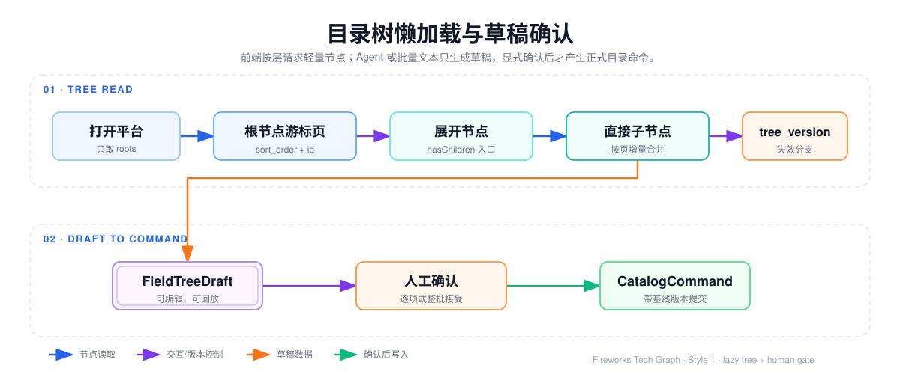
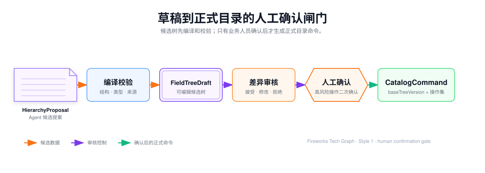

## 字段治理交互工作台

工作台不是把数据库树直接画在浏览器里，而是把页面证据、受限 Agent、人工审核、正式目录和交付任务接成一个有明确状态边界的前端应用。它同时处理三类对象：

1. **目录服务端状态**：平台、节点、祖先路径、节点版本和平台 `tree_version`；
2. **草稿服务端状态**：`DomSnapshot`、`HierarchyProposal`、`FieldTreeDraft`、`DraftOperation`、审核结果和解析任务；
3. **浏览器视图状态**：展开分支、选中节点、筛选条件、面板布局、未提交表单和正在观察的任务。

浏览器可以暂存交互状态和未提交编辑，但不能把本地树当成正式目录，也不能直接调用数据库。只有业务人员确认草稿变化后，前端才提交带基线版本的 `CatalogCommand`，由后端事务完成最终校验和写入。



## 1. 页面分区和数据责任

| 工作区 | 展示内容 | 数据来源 | 是否允许直接改正式目录 |
| --- | --- | --- | --- |
| 目录树 | 根节点、直接子节点、节点详情、祖先路径 | Catalog Query API | 否；仅发起编辑意图 |
| 批量录入 | 原始文本、归一结果、行级错误、嵌套预览 | 浏览器草稿 + 校验 API | 否；确认后提交批量命令 |
| 证据观察 | `DomSnapshot` 摘要、清洗告警、解析阶段、来源引用 | 采集/解析任务 + SSE | 否 |
| 草稿审核 | 候选树、变化类型、来源证据、校验结果 | `FieldTreeDraft` | 否；审核通过才生成命令 |
| 任务交付 | 导出状态、进度、错误摘要、下载入口 | `ExportTask` + 文件元数据 | 否 |

前端组件只消费接口契约。节点详情、证据正文和导出文件不混入树节点列表，避免首次渲染把大字段、HTML 或文件数据一起拉入内存。

## 2. 目录树前端模型

### 2.1 节点最小字段

树组件只需要渲染和交互所需的轻量字段：

```text
id, parentId, name, nodeType, level, sortOrder,
hasChildren, version, platformId, treeVersion
```

`hasChildren` 是服务端根据有效直接子节点计算的入口提示，不等同于前端已经加载了子节点。字段定义、定位器、扩展配置和来源证据通过节点详情接口按需获取。

### 2.2 前端状态拆分

每个分支至少维护以下状态，不能用一个 `loading` 标志覆盖所有情况：

| 状态 | 含义 | 处理方式 |
| --- | --- | --- |
| `idle` | 尚未展开 | 不发送请求 |
| `loading` | 当前游标页请求中 | 同一分支去重，并允许取消过期请求 |
| `ready` | 已有一页或多页数据 | 增量合并，保持服务端顺序 |
| `loadingMore` | 请求下一游标页 | 追加而不是替换已有节点 |
| `empty` | 已确认没有子节点 | 隐藏展开入口 |
| `stale` | `tree_version` 或节点版本过期 | 清理受影响分支后重新读取 |
| `error` | 本次请求失败 | 保留已展示数据，提供分支级重试 |

节点数据和展开集合分开存储。这样折叠节点不会丢失已取得的页面，重新展开也不会把全树重新构造一遍；但收到版本失效信号时，旧节点只能作为过渡展示，不能继续提交编辑。

## 3. 懒加载、游标和大树渲染

### 3.1 读取顺序

工作台进入平台时只请求根节点。展开某个节点时请求直接子节点；点击节点详情时再请求详情；面包屑和定位搜索只补齐目标节点的祖先链。接口职责如下：

```text
GET /api/v1/platforms/{platformId}/catalog/roots
GET /api/v1/platforms/{platformId}/catalog/nodes/{nodeId}/children
GET /api/v1/platforms/{platformId}/catalog/nodes/{nodeId}
GET /api/v1/platforms/{platformId}/catalog/nodes/{nodeId}/ancestors
```

根节点和子节点都使用 `(sort_order, id)` 作为稳定游标，而不是 `offset`。服务端查询 `pageSize + 1` 行来判断 `hasMore`，默认页大小为 50，最大页大小为 100；下一页只携带上页最后一行的排序键。这样前面插入节点不会让后续页整体偏移，`id` 又能消除相同排序值造成的重复或遗漏。

### 3.2 展开算法

1. 用户点击展开时，先检查该分支是否已有同一 `tree_version` 的数据；
2. 没有数据则创建该分支自己的请求状态，并请求首个游标页；
3. 返回后按 `sortOrder、id` 合并，禁止按名称重新排序；
4. 有 `hasMore` 时只显示“加载更多”，下一页追加到当前父节点；
5. 请求期间再次点击不重复发起同一请求，折叠只改变视图状态；
6. 接收到较新的 `tree_version` 时，只失效当前平台受影响分支，不在浏览器静默猜测节点移动结果。

搜索命中未加载节点时，前端先获取祖先链，再按祖先顺序逐层展开到目标节点；不能因为一个搜索结果而请求整棵树。完整树接口只用于节点数受保护的小规模场景，服务端超过 `maxNestedTreeNodes` 返回容量错误；大规模读取使用 `application/x-ndjson`，前端按行消费，避免一次性构造巨大 JSON。



### 3.3 版本失效和局部刷新

目录读取响应携带平台 `tree_version`，节点写操作还携带节点 `version`。前端保存读取时的两个基线：

- **平台基线**：用于判断审核草稿是否基于当前目录；
- **节点基线**：用于判断改名、移动和删除是否覆盖了其他业务人员的修改。

如果只发生了其他分支变化，可以保留当前展开分支；如果受影响节点属于当前分支，则清理该分支的游标、重新请求直接子节点并提示视图已刷新。前端不能把旧列表和新列表按名称拼接，否则会把同名节点、移动节点和删除节点错误合并。

## 4. 批量录入：从缩进文本到嵌套命令

批量录入是确定性输入能力，不经过 Agent。业务人员可以粘贴带有空格或 Tab 缩进的菜单、分组和字段文本；前端先归一并展示预览，服务端再次执行同等约束校验，最终才生成嵌套 `CatalogCommand`。


### 4.1 归一规则

- 将 Tab、不换行空格、全角空格和普通空格转换为可比较的缩进宽度；
- 去掉整段输入的公共前导缩进，但保留行间相对层级；
- 从实际出现的缩进宽度推导层级，不假设固定的 2 空格或 4 空格；
- 空行只计入清洗统计，不生成节点；
- 规范化中文复制文本中首尾空白，但不修改业务名称中间的合法空格；
- 缺少中间父级时报告原始行号和预期层级，不自动创建不可解释的隐式节点；
- 在同一父级下检测重名、重复 `clientKey` 和重复子树。

### 4.2 预览和容量约束

预览区必须同时展示原始行号、归一后的层级、节点类型、生成名称、忽略空行数和重复项。输入在前端先做长度和格式预检，服务端仍执行最终限制：嵌套批量最多 100 个节点、最大深度 64、名称长度受列约束、请求体受网关限制。批量命令在一个事务中提交，任意节点失败全部回滚，平台 `tree_version` 只递增一次。

## 5. 拖拽、编辑和乐观更新

拖拽只产生“将节点移动到新父级”的意图，不代表操作已经成功。当前接口由后端重新计算目标父级下的排序位置；前端可以先移动视觉节点以保持交互流畅，但必须保存原父级、节点 `version` 和平台 `tree_version`，用于失败回滚。


前端可提前阻止自身拖拽、已加载后代拖拽和跨平台拖拽，但最终无环校验必须由服务端完成，因为浏览器可能只加载了树的一部分。提交移动接口时，操作人通过 `X-Operator` 请求头传递，正文至少包含：

```json
{
  "newParentId": 456,
  "expectedVersion": 7
}
```

服务端执行 CAS、父级有效性、同级名称唯一、最大深度和闭包更新；成功后返回新节点版本、新排序值和新平台版本。返回 `409` 时前端撤销乐观状态，重新读取冲突节点及其父级；不能以客户端的旧排序结果覆盖服务端的新状态。

## 6. 采集证据与 Agent 任务观察

### 6.1 统一证据入口

主流程由业务人员打开目标业务页面，进入正确的页签、弹窗或展开状态，再使用 Field DOM Scout 选择一个或多个区域。插件清洗选区并输出简化 HTML、页面上下文和结构事实；无插件时可使用 Easy Copy DOM；页面结构简单且允许安全访问时才启用受限 Agent + Playwright。三种入口都转换为同一份 `DomSnapshot`，差异记录在 `sourceType`、采集方式和审计字段中。

工作台展示快照来源、页面标题、路由、页签、选区、清洗前后体积、移除节点统计、表格/表单摘要、敏感值脱敏告警、解析失败原因，以及自动入口的状态指纹、动作预算和停止原因。工作台不把原始页面文本当成指令，也不允许采集入口绕过清洗直接写目录。

### 6.2 SSE 只是观察通道

解析任务先在服务端持久化，SSE 只推送阶段摘要；断线后前端重新查询任务和草稿，不以浏览器内存中的最后一条事件作为事实来源。


可展示的阶段包括证据接收、结构事实提取、二次取证、层级分析、后端编译、结构校验、局部修复、草稿就绪和人工复核。工作台不展示模型原始思维过程，只展示可审计的阶段、耗时、计数、错误码和结果摘要。

## 7. FieldTreeDraft：可编辑但未发布的树

### 7.1 草稿和正式目录的边界

`HierarchyProposal` 是 Agent 输出的候选提案，`FieldTreeDraft` 是后端根据提案、来源证据和目录基线编译出的可渲染草稿。草稿可以被业务人员修改、部分接受、拒绝或要求局部重算，但它不是 `catalog_nodes` 的临时写入，也不是数据库正式目录的别名。

草稿至少保留：

```text
draftId, basePlatformId, baseTreeVersion,
id, parentId, level, children, nodeType,
sourceRefs, reviewRequired, validationIssues,
operation, reviewStatus
```

前端沿用目录树组件的 `id、parentId、level、children` 结构渲染草稿，因此不需要再造一套树组件；但草稿节点必须带 `draftId` 和审核状态，防止误把草稿 ID 当成正式节点 ID。

### 7.2 草稿变化类型

| 变化 | 含义 | 默认风险 |
| --- | --- | --- |
| `ADD` | 候选中出现而正式目录没有 | 中 |
| `RENAME` | 节点身份相同但名称变化 | 中 |
| `MOVE` | 节点父级或路径变化 | 高 |
| `CHANGE_TYPE` | 分组、字段等类型变化 | 高 |
| `DELETE` | 当前证据中不再出现 | 高 |
| `UNCHANGED` | 身份和定义均未变化 | 低 |

点击节点可查看 `sourceRefs`、匹配依据、解析方式、校验错误和修订提示。审核支持整批接受、按变化部分接受、修改名称/类型/父级、忽略错误节点、填写反馈并触发局部重算，或以稳定原因码拒绝整批变化。

### 7.3 人工确认闸门

提交路径和人工确认边界见图：



人工确认前，草稿只能存在于草稿存储、任务结果或工作区文件中；不得执行 `INSERT catalog_nodes`、`UPDATE catalog_nodes` 或闭包表更新。确认时前端只提交被接受的操作和基线，不提交整棵浏览器树；后端根据当前目录重新编译命令并在同一事务中完成最终校验。删除和大范围移动必须显式二次确认，不能随新增节点自动批准。

## 8. 版本冲突和审核恢复

审核打开时记录 `baseTreeVersion`，每个编辑操作记录节点基线版本。发布前后端先比较平台版本；如果审核期间目录已经变化，返回当前版本、冲突节点、原候选操作和可重算提示。

前端的冲突界面至少区分：

- 当前节点仍存在但版本变化：重新加载后由业务人员选择是否应用；
- 当前父级已被移动或删除：不能沿用旧 `parentId`；
- 同级名称已被占用：要求改名或选择现有节点；
- 候选删除与人工新增冲突：默认保留人工修改并要求重新审核；
- 平台版本变化但无关分支变化：允许后端重新计算可安全应用的操作。

冲突解决后必须重新生成 `CatalogCommand`，不能重放旧请求体。SSE 断开、浏览器刷新或页面关闭只影响观察状态，不影响已持久化的解析任务和草稿。

## 9. 导出任务面板

导出按钮创建任务并立即返回 `202 Accepted`，HTTP 请求不等待 MySQL 扫描、SQLite 构建或 POI 写文件。列表显示任务类型、平台、状态、进度、创建时间、错误摘要和文件状态：

- `PENDING`、`RETRYING`：等待调度；
- `RUNNING`：展示已处理数量；总量未知时不伪造百分比；
- `SUCCESS`：只有文件元数据已提交且文件存在、大小匹配时开放下载；
- `FAILED`：展示稳定错误码和是否可以重新创建；
- `CANCELED`：终止后不再继续执行；
- 文件达到保留期后，任务历史保留，下载入口关闭。

页面可见时按轮询间隔更新任务，后台标签页降低频率，终态任务停止轮询。任务创建使用 `Idempotency-Key` 时，重复点击返回同一个任务而不是重复生成文件。

## 10. 统一错误交互和恢复策略

| HTTP / 业务状态 | 前端动作 | 是否保留本地输入 |
| --- | --- | --- |
| `400` | 定位字段、原始行号或请求格式错误 | 是 |
| `401` | 清理会话并跳转登录 | 草稿保留在服务端 |
| `404` | 刷新失效节点、提示任务不存在 | 是 |
| `409` | 回滚乐观更新，显示版本冲突 | 是 |
| `422` | 展示深度、容量、类型或质量门原因 | 是 |
| `429` | 按 `Retry-After` 延迟重试，不重复提交 | 是 |
| `500` | 保留操作上下文并展示 `traceId` | 是 |
| SSE 断开 | 回退为任务查询，恢复后再连接 | 是 |

重试必须以请求是否幂等为前提：查询可自动重试，带幂等键的任务创建可安全重试，目录写命令需要由后端返回明确结果后再决定是否重放。前端不能把网络超时当成“写入失败”并立即再次创建节点。

## 11. 前后端状态边界清单

浏览器可以保存：展开集合、游标页缓存、选中节点、筛选条件、面板大小、乐观更新的回滚快照和未提交表单。

服务端必须保存：采集任务、`DomSnapshot`、解析任务、`HierarchyProposal`、`FieldTreeDraft`、`DraftOperation`、目录节点、节点版本、平台 `tree_version`、导出任务和文件元数据。

数据库是正式目录唯一事实来源，草稿是人工确认前的候选事实来源，浏览器状态只负责视图恢复。这个边界保证刷新页面、SSE 断开或多人同时编辑时，任务可以恢复、冲突可以解释、正式目录不会被未确认的树形草稿污染。

> 工作台的完成标准不是“所有节点都显示在一个页面”，而是每一次读取、编辑、草稿审核和任务观察都能说明数据来自哪里、是否已确认、基于哪个版本，以及失败后如何恢复。
