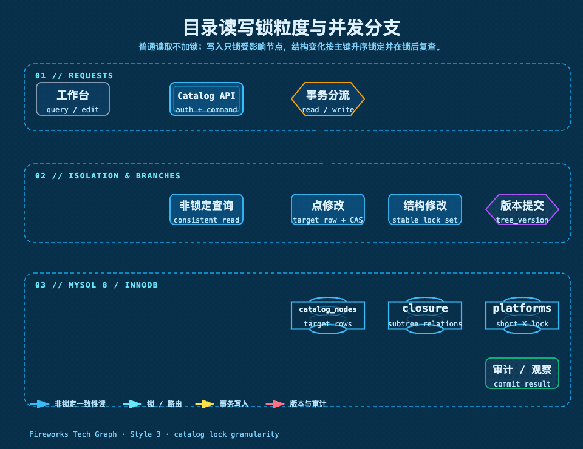
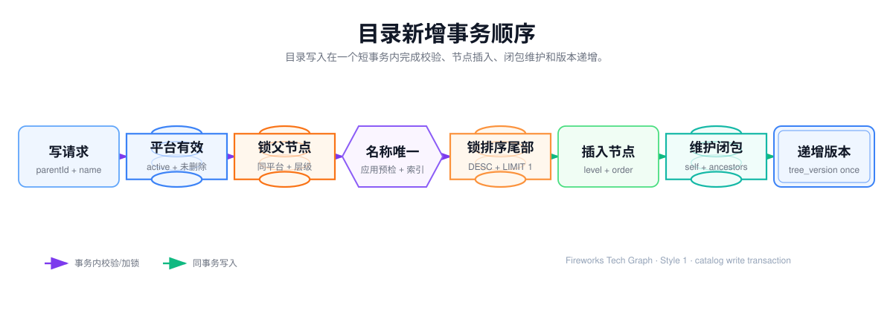

## 平台字段目录结构治理

字段目录不是一张把名称存下来的表，而是一个需要长期维护不变量的树形数据结构。本章讨论正式目录的数据库事实来源、锁粒度、读写事务、查询快照和并发边界；页面草稿的人工确认规则见 25 章，XLSX 快照、导出任务和交付文件见 40 章。



[查看目录读写锁粒度静态 SVG 源图](./assets/catalog-lock-granularity.svg)

## 1. 结构不变量

正式目录按 `platform_id` 隔离，每个有效节点必须满足：

- 根节点 `parent_id IS NULL`，根层级为 1；非根节点的父级属于同一平台且有效；
- 每个节点只有一个直接父级，`node_level = parent.node_level + 1`；
- 同一平台、同一直接父级下，未删除节点的规范化名称唯一；
- 兄弟节点按 `sort_order, id` 稳定排序，不能依赖名称排序；
- `node_type` 来自受控类型集合，组节点和字段/指标节点的业务规则由应用层校验；
- 节点不能成为自己的祖先，移动后不能形成环；
- 深度不超过配置的 `maxDepth`，当前配置基线为 64；
- 闭包表包含每个节点的自关系（`depth = 0`），并完整包含所有祖先关系；
- 删除是逻辑删除，正常查询排除 `deleted = 1`，闭包关系保留以支持恢复和审计；
- 任何节点结构或影响字典映射的详情变化，都在同一事务末尾递增平台 `tree_version`。

其中数据库唯一索引负责最容易被并发击穿的同级名称约束，父子合法性、环检测、层级和闭包完整性由领域服务在事务中共同保证。锁协议不是“一个平台一把锁”，而是只锁定本次命令实际需要互斥的事实行。

## 2. 关系模型和索引

| 表 | 责任 | 关键字段/索引 |
| --- | --- | --- |
| `platforms` | 平台身份和树版本 | `code` 唯一；`tree_version`；有效列表索引 |
| `catalog_nodes` | 轻量树节点 | `platform_id、parent_id、node_level、sort_order、version、deleted`；同级名称唯一索引；直接子节点分页索引 |
| `catalog_node_details` | URL、定位器、定义、展示配置 | `node_id` 主键；与节点逻辑一对一；不进入树列表查询 |
| `catalog_node_closure` | 任意层级祖先、后代和子树 | `(platform_id, ancestor_id, descendant_id)` 主键；祖先和后代双向查询索引 |


### 2.1 同级唯一的数据库兜底

`catalog_nodes` 使用两个存储生成列参与唯一索引：

```sql
unique_parent_id = CASE
  WHEN deleted = 0 THEN COALESCE(parent_id, 0)
  ELSE NULL
END

unique_name = CASE
  WHEN deleted = 0 THEN TRIM(name)
  ELSE NULL
END

UNIQUE (platform_id, unique_parent_id, unique_name)
```

根节点使用 `0` 作为唯一索引中的虚拟父级；已删除节点生成 `NULL`，因此删除后可以重新创建同名有效节点。应用仍需先做可读的名称冲突校验，数据库唯一索引是并发竞态下的最后防线。唯一键冲突必须转换为 `DUPLICATE_SIBLING_NAME`，不能把底层 SQL 异常直接返回给前端。

### 2.2 邻接表和闭包表各自解决的问题

`catalog_nodes.parent_id` 是写入的直接事实：新增、改名、移动和删除都围绕它执行。闭包表存储 `(ancestor_id, descendant_id, depth)`，节点自身的 `depth=0`，用于一次查询祖先链、子树和面包屑。

移动子树时，闭包表不是全量重建：先删除移动子树与外部祖先之间的关系，再把新父级及其祖先与移动子树的笛卡尔组合写入；移动子树内部关系保持不变，节点绝对层级按层差统一调整。闭包关系是可重建索引，正式节点和直接父级关系才是不可替代的业务事实。

### 2.3 锁粒度：按事实行锁定，不锁整个平台

当前实现的锁对象、范围和用途如下：

| 锁级别 | 实际对象或 SQL | 实际范围 | 用途 | 持有时间 |
| --- | --- | --- | --- | --- |
| 节点行 | `catalog_nodes ... WHERE platform_id = ? AND id = ? FOR UPDATE` | 一个目标节点或一个父节点 | 点修改校验、新增父级校验、恢复父级校验 | 从锁定到事务提交/回滚 |
| 影响节点集合 | `id IN (...) ORDER BY id FOR UPDATE` | 移动/删除/恢复的完整子树，加上需要协同校验的新父级或原父级 | 保护结构判断、阻止交叉结构写入 | 从集合锁定到事务提交/回滚 |
| 同级尾记录 | 按 `platform_id、parent_id、deleted、sort_order、id` 索引定位最大排序行并 `FOR UPDATE` | 指定父级下当前有效兄弟的最后一行 | 协调自动追加的排序值 | 从尾记录查询到事务提交/回滚 |
| 平台行 | `UPDATE platforms SET tree_version = tree_version + 1` | 一个 `platforms.id` 行 | 发布一次已提交的目录版本 | 事务末尾的短暂 X 锁 |
| 详情主键行 | `catalog_node_details.node_id` | 一个节点的详情行 | 详情 upsert 的唯一定位 | 必须与节点命令在同一短事务内 |
| 闭包关系 | `catalog_node_closure` 的批量删除/插入 | 当前移动子树涉及的祖先关系 | 与节点事实同步维护关系索引 | 同一写事务内 |

这里的“锁粒度”是应用协议和 InnoDB 行锁共同决定的结果：

1. `findByIdForUpdate` 和 `findStatesForUpdate` 使用显式锁定读。等锁期间不能继续使用旧的结构判断；锁拿到后必须重新读取并验证关键状态。
2. 结构命令第一次从闭包表读取子树 ID 只是发现候选锁集合，不是安全的最终快照。服务按节点 ID 去重、升序锁定后，再次读取子树 ID；集合不一致就抛出 `CatalogStructureChangedException`，整笔事务回滚并有限重试。
3. 主键等值 `FOR UPDATE` 通常落为目标记录锁；复合索引上的范围访问可能伴随索引记录/间隙保护，具体范围由执行计划、隔离级别和 MySQL 版本决定。当前协议不依赖“整段间隙一定被锁住”，而依赖显式锁到的事实行、唯一索引和锁后复查。
4. 写事务使用 `READ_COMMITTED`。这减少普通一致性读的旧快照范围，但不能把非锁定查询变成互斥查询；唯一键检查、外键检查（本项目没有物理外键）和 InnoDB 内部约束仍可能产生必要的索引锁。
5. 空兄弟集合没有“最大尾行”，因此不存在可锁的尾记录。此时并发新增允许产生相同的 `sort_order`，但 `(sort_order, id)` 仍能稳定排序；系统不承诺排序值连续，也不把排序值当作唯一键。
6. 当前移动命令锁定“移动子树 + 新父级”，恢复命令锁定“恢复子树 + 原父级”；不把整个平台、旧父级的全部兄弟或闭包表全表锁住。若未来增加跨兄弟批量排序命令，必须把它所修改的节点集合纳入同样的升序锁协议。

锁只能在数据库事务内保护事实数据，不能覆盖人工编辑、模型调用、浏览器采集、XLSX 生成或网络请求。所有这些耗时步骤都必须在事务外完成，确认后的命令只携带版本和结构变更意图进入短写事务。

## 3. 写入事务

所有目录命令都在 `REQUIRES_NEW`、`READ_COMMITTED` 事务中执行，单次事务超时基线为 10 秒。每次重试都会开启一笔全新的事务；不能在原事务中捕获异常后继续写。

通用写事务顺序为：

1. 在事务外完成认证、参数格式和草稿命令校验；命令带上 `platformId、nodeId、expectedVersion` 等稳定标识。
2. 开启新的写事务，先做平台存在/启用状态预检；平台预检是非锁定读。
3. 对点修改锁一个目标节点；对结构修改按升序锁定完整影响节点集合。
4. 锁定后重新读取当前节点、父级和闭包范围，校验版本、删除状态、平台归属、环和深度。
5. 在同一事务内写入 `catalog_nodes`、`catalog_node_details` 和 `catalog_node_closure` 的必要变更。
6. 事务末尾原子递增该平台 `tree_version`；成功提交后才返回新结果或发布成功事件。
7. 任一校验、唯一键、影响行数或数据库错误失败，整笔事务回滚，不返回部分树。

### 3.1 新增和批量新增

单节点新增的执行顺序见图；批量新增复用同一事务边界，并在事务内一次性校验全部嵌套节点。



单节点新增的锁和写入顺序是：

1. 根节点新增没有父行可锁；非根新增先用 `findByIdForUpdate` 锁定父节点，并确认父节点属于当前平台、未删除且启用。
2. 规范化名称先做非锁定预检，避免把明显错误带入写入；这次预检不是最终保证。
3. 通过 `findMaxSiblingSortOrder ... FOR UPDATE` 锁定当前同级最大排序行；当前自动追加按 10 的间隔计算新 `sort_order`。
4. 插入 `catalog_nodes`，随后插入自身闭包关系；非根节点再复制父级的祖先闭包关系。任一影响行数不符合预期都回滚。
5. 由数据库唯一索引最终处理两个请求同时新增同名节点的竞态；捕获到唯一键冲突后转换为 `409 DUPLICATE_SIBLING_NAME`。
6. 最后递增一次 `tree_version`。排序值只用于稳定顺序，不表示无空洞序列。

批量新增会先在内存中把输入归一为命令树，检查重复 `clientKey`、请求内重复兄弟名称、节点数和最大相对深度；当前单批最多 100 个节点。进入事务后只锁一次外部父级和同级尾记录，再按命令树写入所有节点及闭包关系，最后只递增一次平台版本。任意节点失败全部回滚，不能留下半棵树或“父节点已写入、子节点未写入”的中间状态。

### 3.2 改名、类型和详情更新

#### 3.2.1 节点名称和类型修改

节点更新不是“先查后覆盖”，而是当前读 + CAS 的双重保护：

1. 工作台打开节点时读取轻量节点的 `version`，用户确认草稿后将该值作为 `expectedVersion` 提交。
2. 写事务用 `findByIdForUpdate` 锁定目标节点，并在锁后校验节点仍属于平台、未删除且版本等于 `expectedVersion`。
3. 名称变化按同级规则重新规范化，并执行一次非锁定的可读性冲突检查；最终仍依赖唯一索引兜底。
4. 更新 SQL 同时带上 `platform_id、id、version、deleted = 0`：

```sql
UPDATE catalog_nodes
SET name = ?, node_type = ?, version = version + 1, updated_by = ?
WHERE platform_id = ?
  AND id = ?
  AND version = ?
  AND deleted = 0;
```

5. 影响行数必须为 1。为 0 表示版本已变化、节点已删除或标识不匹配，统一返回 `409 NODE_VERSION_CONFLICT`；不能用当前值覆盖他人的修改。
6. 成功后在同一事务递增 `platforms.tree_version`，提交后返回新节点版本。

同一节点并发修改的结果是确定的：A、B 都从版本 7 打开；A 先获得节点行锁，更新为版本 8 并提交；B 等待后拿到锁，看到当前版本 8，`expectedVersion=7` 校验失败，返回 409。即使 B 的旧请求随后执行到 CAS，影响行数也不会为 1。这样既避免丢失更新，也不需要把整个平台的所有修改串行化。

不同节点的名称并发修改不必互相阻塞；如果它们最终落到同一父级同一规范化名称，唯一索引只有一个能成功，另一个转换为 `DUPLICATE_SIBLING_NAME`。应用预检只改善错误提示，不承担并发正确性的唯一责任。

#### 3.2.2 详情更新的边界

`catalog_node_details.node_id` 是详情写入的主键粒度，但详情不应成为绕开目录版本的第二条写路径。详情命令必须遵守：

- 先锁定对应的 `catalog_nodes` 行，再读取当前版本和删除状态；不能只对详情表直接 `upsert`；
- 请求带 `expectedVersion` 时，详情变化必须使用节点版本 CAS；成功后节点版本加 1；
- 详情 upsert、节点版本更新和平台 `tree_version` 递增必须在同一 `REQUIRES_NEW` 事务内；
- 详情只影响展示而不影响采集映射时，也要明确是否递增平台版本，不能让工作台用旧版本继续提交；
- 节点逻辑删除时不允许单独恢复详情；恢复命令先恢复节点结构和唯一性，再恢复/写入详情；

### 3.3 移动子树

移动是最容易产生环、脏闭包和交叉锁等待的操作。当前执行顺序固定：

1. 使用非锁定闭包查询读取移动节点子树 ID；读取新父节点，这些数据只用于形成候选集合。
2. 对候选集合去重，并加入新父节点 ID；按节点 ID 升序执行 `id IN (...) ORDER BY id FOR UPDATE`。
3. 如果锁定结果缺少任一候选节点，或锁后重新读取的子树 ID 与第一阶段不一致，抛出结构变化异常，回滚整笔事务并有限重试。
4. 在锁后的当前数据上校验移动节点不等于新父节点，新父节点不在移动子树内，且两者属于同一平台。
5. 校验目标父节点未删除且启用、移动节点未删除、目标层级不超过 64、同级名称未冲突。
6. 再通过 `findMaxSiblingSortOrder ... FOR UPDATE` 锁定目标父级的排序尾记录，计算新的追加位置。
7. 用移动根节点的 `version` 做 CAS 更新 `parent_id、sort_order、version`。
8. 如果父级改变，删除移动子树与旧外部祖先的闭包关系，插入新父级及其祖先到子树全部节点的关系，并按层差批量修正子树 `node_level`。
9. 递增一次 `tree_version` 并提交。

移动不把闭包表当作唯一锁。闭包第一次读取可能已经过期，必须依赖节点行锁、锁后复查和整事务回滚来阻止基于旧范围继续写入。闭包关系的批量删除/插入可能产生额外索引锁，因此统一的节点 ID 升序锁只能降低死锁概率，不能宣称数据库永远不会死锁。

如果移动只改变同级顺序，仍由同一命令校验节点版本和目标排序位置；不能让前端以完整列表覆盖服务端排序。当前实现的移动锁集合是“移动子树 + 新父级”，并不锁定旧父级的所有兄弟，因此不提供跨请求的连续排序号承诺。

### 3.4 删除和恢复

删除先读取并锁定完整子树，锁集合按节点 ID 升序；随后对整棵子树执行逻辑删除，保留闭包关系以支持恢复和审计。批量更新必须使每个被删除节点的版本变化，并在成功后递增一次平台 `tree_version`。正常查询因为 `deleted = 0` 自动排除这些节点，新的同名有效节点可以通过生成列唯一索引重新创建。

恢复锁定“恢复子树 + 原父级”，并在锁后重新确认原父级未变化。它还必须检查：

- 原父级仍属于当前平台、未删除且启用；
- 恢复后节点层级和完整子树深度不超过 64；
- 同级有效节点没有占用规范化名称；
- 闭包表包含自关系和完整祖先关系；发现闭包不完整时阻止恢复，转入修复任务。

删除或恢复的任一节点缺失、影响行数异常、版本不匹配或唯一键冲突都会回滚，不返回部分恢复结果。

## 4. 并发控制、读写关系和失败边界

### 4.1 竞争矩阵

| 并发组合 | 是否互相持写锁 | 可能看到的结果 | 正确性保障 |
| --- | --- | --- | --- |
| 查询 vs 查询 | 否 | 各自的一致性读视图 | 只读事务、查询索引、版本字段 |
| 查询 vs 点修改 | 否 | 查询可能返回修改前版本 | `version` + `tree_version`，前端刷新后重读 |
| 查询 vs 移动/删除/恢复 | 否 | 查询可能返回旧树、旧父子关系或提交后的新树，取决于读视图 | 查询不写锁；写端原子提交；工作台按 `tree_version` 失效 |
| 同节点点修改 vs 点修改 | 是，目标节点行 | 后获得锁的一方读取到前一方提交后的版本 | 节点行锁 + `expectedVersion` CAS |
| 同级不同节点改名 | 只锁各自目标行 | 两者可并行；同名者只有一个成功 | 应用预检 + 同级唯一索引 |
| 同级新增/移动 vs 新增/移动 | 目标父级或尾记录竞争 | 自动追加顺序按 `sort_order,id` 稳定 | 父级行锁、尾记录 `FOR UPDATE`、空集合由唯一/稳定排序兜底 |
| 相交子树移动/删除/恢复 | 是，交集节点行 | 一方先提交，另一方锁后复查或重新判断 | ID 升序锁 + 闭包集合复查 + 有限重试 |
| 导出 vs 目录写入 | 否，不持写锁 | 导出保持自己的快照版本 | `REPEATABLE_READ` 只读事务、批量游标 |
| 导出 vs 采集同步 | 不共享目录写事务 | 采集继续写自己的同步链路 | 导出源读取与 SQLite/XLSX 写入分离，并受资源上限保护 |

“查询不加锁”不是“查询永远读到最新值”。它表示查询不会通过 `FOR UPDATE` 阻塞写事务，也不会给目录写入增加行锁；是否看到提交前或提交后数据取决于查询连接的隔离级别和快照建立时刻。业务上通过返回 `tree_version`、工作台草稿版本和提交时 `expectedVersion` 处理这种正常并发差异。

### 4.2 死锁、锁等待和重试

两个结构写请求可能分别先锁住不同子树，再在闭包索引或目标父级处交叉等待。当前方案分四层降低风险：

1. 候选锁集合去重后统一按节点 ID 升序获取，避免 A 按请求顺序、B 按相反顺序拿同一批节点。
2. 锁后重新查询闭包子树并比较集合；发现等待期间结构已变更就整笔回滚，不继续使用旧快照。
3. 事务只做数据库读写和轻量校验，默认超时 10 秒；不在锁内执行模型、采集、文件或网络操作。
4. `SpringCatalogTransactionExecutor` 只对结构变化异常和 MySQL 死锁错误码 1213 做有限次新事务重试，并使用 30–150ms 的随机短退避；达到上限返回 `409 CATALOG_WRITE_BUSY`。

MySQL 锁等待超时 1205、事务超时和容量限制不进入无限重试，直接转换为可识别的繁忙错误。死锁重试必须从事务入口重新执行，不能只重放最后一条 SQL，也不能在原事务中继续使用已经回滚的对象。

### 4.3 具体错误结果

| 场景 | 对外结果 | 前端动作 |
| --- | --- | --- |
| `expectedVersion` 不匹配或 CAS 影响行数为 0 | `409 NODE_VERSION_CONFLICT` | 丢弃本次旧草稿，重新加载当前节点并提示差异 |
| 同级规范化名称已存在或唯一键竞争失败 | `409 DUPLICATE_SIBLING_NAME` | 保留草稿内容，要求改名后重新确认 |
| 移动到自身或子树内 | `409 MOVE_CYCLE` | 重新选择目标父级 |
| 恢复后产生同级冲突/父级不可用 | `409 RESTORE_CONFLICT` 或层级错误 | 重新确认父级和名称 |
| 死锁重试耗尽、锁等待超时、事务超时 | `409 CATALOG_WRITE_BUSY` | 短暂退避后重新读取版本再提交 |
| 查询读到旧 `tree_version` | 不是写失败 | 按版本刷新工作台，不覆盖未确认草稿 |
| 树超过内存保护上限 | `422 TREE_TOO_LARGE` | 使用懒加载或 NDJSON 流 |

成功事件只在事务提交后发布。回滚、重试或失败期间不发送“目录已更新”通知，前端也不能根据中间 SQL 结果修改本地正式树。

## 5. 查询路径和读锁边界

### 5.1 根节点和直接子节点

根节点和子节点查询均走 `idx_catalog_nodes_parent_page`，条件包括平台、父级和 `deleted=0`，按 `sort_order, id` 做 keyset 分页。返回 `pageSize + 1` 行判断是否还有下一页；`hasChildren` 通过 `EXISTS` 判断有效直接子节点，不读取详情表。节点列表不使用 offset，也不把整棵树拼成一个服务端大对象。

### 5.2 祖先、子树和完整树

祖先路径使用闭包表按 `depth DESC` 读取，再校验路径长度与节点 `node_level` 一致；子树读取按闭包关系或稳定树扫描索引排序。完整树接口有 `maxNestedTreeNodes` 保护，超过上限返回 `TREE_TOO_LARGE`。

这些查询全部使用普通非锁定读，不使用 `FOR UPDATE`：

- `findRoots`、`findChildren` 和 `findNode` 只读取轻量节点字段和直接子节点存在性；
- `findAncestors`、`findSubtree` 使用闭包索引读取关系，不修改闭包；
- `findTree` 只读取阈值加一条，先触发容量保护再组装内存树；
- 查询应用服务统一是 `@Transactional(readOnly = true)`，但 `readOnly` 不等于数据库锁定，也不等于跨请求全局快照。

同一查询事务中的视图行为由实际连接隔离级别决定：在 `REPEATABLE_READ` 下，快照建立后同一长事务通常持续看到同一视图；若部署调整为 `READ_COMMITTED`，每条非锁定 SQL 可能建立自己的已提交视图。无论哪种配置，都不能把一次查询的 `tree_version` 当成未来写入的授权，写请求必须重新锁定并校验 `expectedVersion`。

### 5.3 懒加载和流式读取

字段工作台通过根节点页、直接子节点页和按需祖先路径实现懒加载。一次展开只访问目标父级下的一页，游标由 `sort_order + id` 组成；新增或移动发生后，若返回的 `tree_version` 与工作台本地版本不同，当前展开页应重新读取，不能用旧页做全量覆盖。

需要导出或大规模查看时使用 NDJSON 流：MyBatis forward-only cursor、fetch size 1000、每 200 行 flush 一次；同时用信号量限制活动流数量，当前 `maxConcurrentStreams=2`。流式读取虽然不持写锁，但会长时间占用一个数据库连接和一致性读资源，因此必须：

- 在服务层检查平台版本、权限和流数量，超过上限返回 `TOO_MANY_STREAMS`；
- 客户端断开、异常或完成时关闭 cursor、释放连接和信号量；
- 不在同一事务里混入 `FOR UPDATE` 或目录结构写；
- 控制最大持续时间，避免长读事务积压 InnoDB undo/history。

### 5.4 导出读取与采集同步

导出源读取使用单独的 `REPEATABLE_READ` 只读事务和 MyBatis cursor，不使用 `FOR UPDATE`，批量大小为 1000。它在 MySQL 中只建立一致性快照：

- 目录写入不会等待导出释放行锁，导出也不会占用目录写锁；
- 导出看到的是快照建立时的正式目录版本，不会把某笔未提交修改写入文件；
- 导出批次消费、SQLite 落库和 XLSX 生成不应继续持有 MySQL 源事务；源数据读取完成后释放源连接，再进行本地同步和文件写入；
- 源读取、SQLite 同步、XLSX 写入使用各自的资源上限和失败状态，不能把文件慢写速度反向施加到目录采集写事务；
- 当前源读取受并发许可控制，长任务仍需监控连接占用、undo 历史、批次延迟和取消后的 cursor 关闭。

因此，“导出不影响采集”不是依赖数据库锁粒度实现，而是依赖只读快照、短写事务、源连接与本地文件阶段解耦，以及并发/容量上限共同实现。导出文件完成后仍需记录快照版本；如果要求文件代表最新版本，应在任务结束重新比较 `tree_version`，将结果标记为“生成期间有目录变更”，而不是静默声称实时一致。

### 5.5 缓存和失效

当前不缓存持续变化的完整目录树，以实时查询结果和 `tree_version` 为准。若后续增加缓存，缓存键至少包含 `platformId、parentId、cursor、pageSize、treeVersion`；任何成功结构写都使旧版本失效，不能只按节点名称删除缓存。缓存命中也不能跳过写事务中的节点锁和版本校验。

## 6. 巡检、验证和修复边界

定期巡检应检查：节点的平台是否存在、父级是否同平台、根节点层级是否为 1、子节点层级是否连续、闭包自关系是否存在、闭包深度是否与父级链一致、已删除节点是否出现在正常查询索引和同级唯一约束中。巡检发现异常只生成报告和修复任务，不在在线请求中静默重建闭包。

锁协议的验收不能只看“接口返回 200”，还应在测试库和压测环境验证：

- `EXPLAIN ANALYZE` 确认目标锁定 SQL 命中主键或预期复合索引，不能因缺少 `platform_id` 条件退化为大范围扫描；
- `performance_schema.data_locks`、`data_lock_waits` 和 `SHOW ENGINE INNODB STATUS` 能定位等待双方、索引名和锁模式；
- 两个并发修改同一节点时，必须复现一个成功、一个 `NODE_VERSION_CONFLICT`，不能出现后写覆盖先写；
- 两个并发同名新增时，必须复现一个成功、一个 `DUPLICATE_SIBLING_NAME`，不能依赖应用预检偶然通过；
- 相交子树移动/删除时，验证锁后复查、死锁重试、1205 快速失败和提交后版本事件；
- 查询、流式读取和导出并发运行时，确认它们不持有目录写锁，并观察连接池、游标、undo/history 和内存上限。

闭包重建必须在受控维护窗口或按平台分片执行：以 `catalog_nodes` 的直接父级关系为输入，按拓扑顺序写入自关系和祖先关系，完成后再校验计数、深度和无环性。重建期间平台目录应进入维护状态，避免读请求看到部分闭包。

> 目录数据库的正确性来自四层共同作用：表结构提供唯一性和索引，节点/子树锁限定互斥范围，领域服务维护树不变量，事务与版本控制处理并发。查询、导出和采集不应通过扩大锁范围来换取一致性；它们应使用只读快照、懒加载、游标和资源上限，把读放在短写事务之外。
