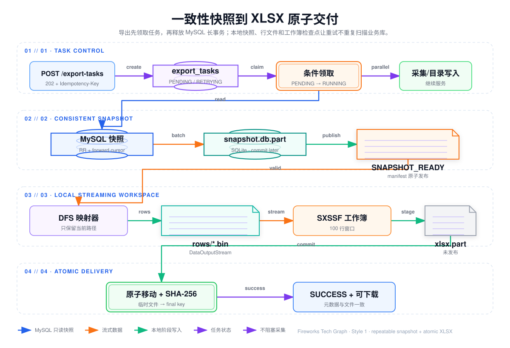
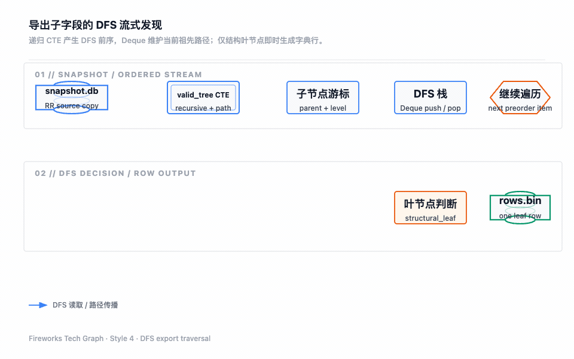
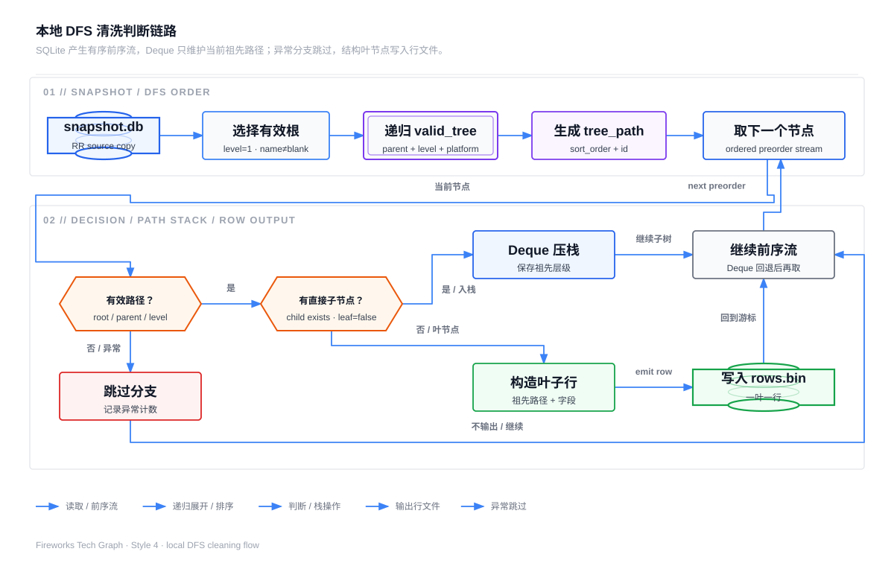

## 数据库并发与 XLSX 字典交付

本章是 30 章之后保留的唯一实现章节，集中说明数据库设计、数据库操作并发、异步导出和文件交付。目标不是把一个大查询包进 HTTP 响应，而是把“读取某一时刻的目录”“在本地完成清洗”“生成可下载 XLSX”“让采集与目录写入继续服务”拆成可恢复的边界。





[导出子字段 DFS 静态 SVG 图](./assets/catalog-dfs-export.svg)

## 1. 设计目标和不可变事实

导出必须同时满足以下约束：

- 导出结果对应一个明确的 `platform.tree_version`，同一任务内不能混读不同时间点的节点；
- 创建导出任务只登记意图并返回 `202 Accepted`，不能在请求线程同步扫描 MySQL 或生成工作簿；
- MySQL 只承担短暂、受保护的只读快照读取，不能持有目录写锁；
- 采集任务、解析任务和目录写入使用自己的事务与线程资源，不因 XLSX 磁盘处理被排队；
- 本地清洗和工作簿写入可以失败、重试、恢复，不能要求再次占用 MySQL 长事务；
- 文件未完整写入、校验或提交前，下载接口不能暴露半成品；
- 任务状态、文件元数据和实际文件必须可以相互核对，清理文件不能抹掉任务历史。

正式目录的结构不变量和树写入事务见 30 章；这里把它当成只读输入，不重复发明另一套树规则。

## 2. 数据库表和职责

| 表 | 关键职责 | 并发相关字段/索引 |
| --- | --- | --- |
| `platforms` | 平台身份、启停和快照版本 | `code` 唯一；`tree_version`；列表索引 |
| `catalog_nodes` | 目录轻量节点 | `(platform_id,parent_id,deleted,sort_order,id)` 直接子节点索引；树扫描索引 |
| `catalog_node_details` | URL、定位器和字段定义 | `node_id` 主键；树读取不联表 |
| `catalog_node_closure` | 祖先、后代和深度 | 祖先/后代双向索引；导出基线不修改它 |
| `export_tasks` | 对外任务、状态、进度和重试 | `task_id` 唯一；`(status,next_run_at,id)` 调度索引 |
| `export_task_details` | 文件位置、大小、校验和、保留期 | `task_id` 主键；存储位置唯一；清理索引 |

目录和任务表都使用逻辑外键，不在当前 schema 建立物理 `FOREIGN KEY`。服务层在事务中校验平台、节点和任务归属，巡检任务负责发现跨表孤儿。任务表的内部自增 `id` 只用于数据库排序，接口和未来消息关联使用 32 位无横线 `task_id`，避免把内部序列暴露给调用方。

## 3. 导出任务创建和数据库幂等

### 3.1 请求只做准入和登记

导出请求校验任务类型：`FULL_EXPORT` 不允许携带 `platformId`；`PLATFORM_EXPORT` 必须指向启用且未删除的平台。通过权限、平台存在性和容量准入后，事务写入 `export_tasks` 与 `export_task_details`，预分配稳定的存储 key：

```text
<taskId>/field-dictionary.xlsx
```

随后立即返回任务编号、状态 `PENDING` 和查询地址。中文文件名只作为展示元数据，实际存储路径使用安全的任务编号，避免路径穿越和同名覆盖。

### 3.2 `Idempotency-Key`

幂等键最大 128 个字符。当前实现用“创建人 + 分隔符 + 幂等键”的 SHA-256 前 16 字节生成确定性任务编号：

- 相同创建人、相同幂等键和相同命令返回原任务；
- 相同幂等键但任务类型、平台或其他命令不一致，返回 `EXPORT_IDEMPOTENCY_CONFLICT`；
- 没有幂等键时生成随机任务编号，并以数据库唯一索引冲突为依据有限重试。

幂等键解决的是重复点击、网络超时重试和重复消息，不等于任务执行锁。执行锁由状态条件更新解决。

### 3.3 准入和多实例边界

当前配置限制全局活动任务数 6、单创建人活动任务数 6；单实例内用计数和有界执行器快速拒绝过量请求。数据库唯一键保证任务编号不重复，但单实例内存计数不能提供多实例全局配额。部署多实例时，准入应迁移到数据库配额/租约、集中式限流或队列，而不是继续依赖 JVM 内存计数。

## 4. 任务状态机、领取和恢复

### 4.1 状态转换

状态转换和终态边界见图：


`PENDING` 和 `RETRYING` 由调度器扫描；执行器以条件更新原子领取：只有状态仍是可执行状态且 `next_run_at <= startedAt` 时，单个执行器才能改为 `RUNNING`。重复投递即使进入多个线程，也只有一个更新成功；未领取成功的线程直接退出。

进度更新只接受 `RUNNING` 任务，并用单调更新避免旧线程把计数写回较小值。当前进度更新按时间和最小步长节流，配置基线为 2 秒或 5000 行；进度更新失败只记录告警，不改变最终成功/失败判断。

### 4.2 调度、重试和中断恢复

调度器启动时把超过恢复阈值仍为 `RUNNING` 的任务改为 `RETRYING`，随后每 2 分钟按 `next_run_at、id` 扫描 `PENDING/RETRYING` 任务，批量投递到本地有界执行器。当前执行器为 2 个工作线程、队列 4；队列满时不丢任务，任务继续留在数据库，等待下一轮扫描。

可恢复的 IO、连接或临时资源错误进入重试，最多 3 次，使用配置的指数退避（初始 5 秒、上限 60 秒）；输入不存在、工作簿超过 Excel 行数、结构数据不可修复等业务错误直接 `FAILED`。成功、最终失败或取消都清理临时工作区；重试优先复用已经提交的 SQLite 快照和 `rows/*.bin`，避免重复占用 MySQL。

当前调度器是单实例本地实现。多实例部署仍可依赖 `tryMarkRunning` 避免同一任务重复执行，但需要消息队列、数据库租约或分布式调度补足“谁负责扫描、租约多久、实例宕机如何接管”等问题。

## 5. MySQL 一致性快照：不影响采集和目录写入

### 5.1 读取边界

`MySqlExportSourceReader` 在 `readOnly=true、REPEATABLE_READ` 事务中读取平台和节点。先读取平台 `id、name、sort_order、tree_version`，再按稳定顺序通过 MyBatis forward-only cursor 逐个平台读取节点，节点顺序为 `node_level、parent_id、sort_order、id`。每批默认 1000 行，写入本地快照后继续读取。

这是非锁定一致性读：导出不执行 `FOR UPDATE`，不锁住目录节点，采集或人工目录写入可以在导出进行时继续提交。导出看到的是事务建立时的一致性视图；之后发生的采集结果、草稿确认或目录修改进入下一次导出，不会半路改变本次任务的源数据。

### 5.2 为什么不会把连接拖垮

一致性快照仍会长时间占用一个 MySQL 连接，并可能延长 InnoDB undo 清理压力，因此不能把“无写锁”误认为“没有成本”。当前通过四道限制控制影响：

1. 导出任务在后台执行，不占用采集 HTTP 请求线程；
2. MySQL 源读取信号量当前最多允许 1 个任务同时持有快照；
3. Hikari 连接池配置上限为 12、最小空闲 4，导出不能吞掉全部连接；
4. 快照事务超时基线为 600 秒，获取信号量和读取超时都必须快速转为可识别失败。

MySQL URL 启用 `useServerPrepStmts=true、useCursorFetch=true、defaultFetchSize=1000`，避免把全量节点加载到 JDBC 或 JVM 内存。源读取完成并提交本地快照后立即释放连接，SQLite、映射和 POI 阶段不再持有 MySQL 事务。

### 5.3 采集链路的隔离

采集端产生 `DomSnapshot`，Agent 解析产生 `HierarchyProposal/FieldTreeDraft`，人工确认后才进入目录写事务；这些操作不等待 XLSX 完成。导出只读取已经提交的正式目录，不能读取未确认草稿，也不能把导出进度写回目录节点表。这样采集继续产生证据、目录继续接受确认，导出只得到明确版本的可复现交付物。

## 6. SQLite 阶段工作区、DFS 清洗和恢复协议

### 6.1 快照文件

任务工作区位于 `data/result/.tmp/<taskId>`。源数据先写 `snapshot.db.part`，SQLite 使用 `journal_mode=DELETE、synchronous=NORMAL、temp_store=FILE、cache_size=-32768`，表至少包括 `snapshot_platforms` 和 `snapshot_nodes` 及平台/节点查询索引。写入完成后关闭 writer，并通过原子移动发布为 `snapshot.db`，再原子写入 `manifest.json`，阶段标记为 `SNAPSHOT_READY`。

发布前的 `.part` 文件不参与后续阶段。进程中断后只删除或覆盖未完成的临时文件；发现已发布 manifest 时可以从快照继续，不必重新开启 MySQL 一致性事务。

### 6.2 本地 DFS 清洗

本地阶段先按平台统计源节点、有效路径节点和叶子行，再为平台创建流式映射器。平台名称为空的平台单独隔离并记录告警，不让它污染其他平台的路径列。



[查看本地 DFS 清洗图稿源文件](./assets/fireworks/catalog-dfs-cleaning-flow.json)

有效树从 `parent_id IS NULL、node_level=1、TRIM(name) <> ''` 的根开始递归；子节点必须满足父级存在、层级连续且名称非空。遇到不完整路径时跳过异常分支并记录 `sourceNodes、validNodes、skippedNodes、exportedRows`，不把无父级字段伪装成根字段。这里的 DFS 不是把整棵嵌套树复制到 JVM，而是先在 SQLite 快照中得到稳定的前序流，再在 JVM 中只保留当前路径；叶节点转换成 `FieldDictionaryRowModel`，以 `DataOutputStream` 写入 `rows/<platformId>.bin`。

#### 6.2.1 子字段发现的真实遍历模型

项目中的“子字段”不是通过“查询一个节点，再为每个节点递归查询子节点”的 N+1 方式发现的，也不是 Java 代码递归构造完整树。真实实现分为两个连续阶段：SQLite 负责把正式目录快照组织成 DFS 前序流，`FieldDictionaryStreamingMapperModel` 负责消费这个有序流并维护祖先路径。只有确认当前节点没有任何结构子节点时，当前节点才被视为可以导出的字段叶子。

SQLite 使用递归 CTE `valid_tree` 表达树的传递闭包。其执行逻辑如下：

1. **种子节点**：只选当前平台中 `parent_id IS NULL`、`node_level = 1` 且 `TRIM(name) <> ''` 的一级根节点。没有有效根的孤儿节点不会被提升成新的根，也不会因为“找不到父级”而被伪装成一级字段。
2. **递归找子节点**：用 `child.parent_id = valid_tree.id` 连接直接子节点，同时要求 `child.platform_id` 相同、`child.node_level = valid_tree.node_level + 1` 且子节点名称非空。也就是说，子字段必须从一条有效的父级路径上连续到达；断层、跨平台挂载和空名称分支不会进入有效路径流。
3. **生成排序路径**：每个节点把自己的 `(sort_order, id)` 编码成固定宽度片段，并追加到父节点的 `tree_path`。当前实现使用 `printf('%011d:%020d', sort_order + 2147483648, id)`：前者将有符号排序值平移到非负区间，后者作为稳定的同序号裁决键，固定宽度则避免字符串排序出现 `10` 排在 `2` 前面的错误。
4. **按路径排序**：最终按 `tree_path ASC` 输出。父节点的路径是子孙路径的前缀，因此父节点先于所有后代；同一父节点下的兄弟按 `(sort_order, id)` 稳定排序。这等价于“先访问节点，再按顺序访问每棵子树”的 DFS 前序遍历。
5. **流式消费**：SQLite `ResultSet` 每次只交给映射器一个 `ExportTraversalNodeModel`。结果不需要在 JVM 中保存为 `List<TreeNode>`，也不需要为每个父节点再次访问 MySQL 或 SQLite。

因此，严格地说，这是“SQLite 递归 CTE 计算树的有效传递闭包 + `tree_path` 排序得到 DFS 前序 + JVM `Deque` 维护当前祖先栈”的组合，而不是单独的一段 Java DFS 递归代码。递归发生在本地快照查询中，路径状态发生在流式映射器中。

#### 6.2.2 `Deque` 如何维护当前祖先路径

映射器维护一个按根到当前节点排列的 `Deque<NodeName> ancestors`。栈中的元素不是整棵树节点，而是生成字段路径所需的“层级 + 名称”。对于 DFS 前序流中的每个节点，使用以下规则：

1. 先弹出所有 `level >= current.nodeLevel` 的栈尾元素；
2. 当前节点存在结构子节点时，把当前节点压入栈尾，但不产出 Excel 行；
3. 当前节点没有结构子节点时，不把它压入祖先栈，而是复制当前祖先名称，加上当前叶节点名称，生成一行字典记录；
4. 生成叶子行后继续读取下一个前序节点，栈自然回退到该节点的父路径。

之所以使用 `>=` 而不是只弹出 `>`，是因为同级兄弟必须先弹出前一个兄弟；当遍历从深层子节点返回到祖先时，更深层级也必须全部弹出。叶节点不入栈是有意设计：叶节点是字段名称，不是后续字段的菜单祖先，避免下一个兄弟字段错误地继承上一个字段名称。

等价逻辑如下，实际代码使用项目中的模型和字段名实现：

```java
for (ExportTraversalNodeModel current : orderedDfsStream) {
    while (!ancestors.isEmpty()
            && ancestors.peekLast().level() >= current.nodeLevel()) {
        ancestors.removeLast();
    }

    String name = current.name().trim();
    if (!current.structuralLeaf()) {
        ancestors.addLast(new NodeName(current.nodeLevel(), name));
        continue;
    }

    FieldDictionaryRowModel row = toDictionaryRow(
            platformMenus, copy(ancestors), name);
    rowWriter.write(row);
}
```

例如，节点顺序如下：

```text
一级(10)
├─ 二级A(10)
│  └─ 字段a(10)
└─ 二级B(20)
   └─ 子组(10)
      └─ 字段b(10)
```

SQLite 输出顺序是 `一级 → 二级A → 字段a → 二级B → 子组 → 字段b`。映射器先压入 `一级、二级A`，遇到 `字段a` 时产出 `[一级, 二级A] + 字段a`；随后 `二级B` 的层级与 `二级A` 相同，先弹出 `二级A` 再压入 `二级B`；进入 `子组` 后，遇到 `字段b` 产出 `[一级, 二级B, 子组] + 字段b`。这正是“沿树向下压栈、沿树向上回退”的 DFS 路径语义。

空间复杂度只与最大树深度和当前输出行有关：`Deque` 保留 `O(depth)` 个祖先，叶节点生成菜单列时会复制当前路径，行文件和 SXSSF 窗口承担后续阶段的落盘/流式缓冲；不会因平台节点总数 `N` 增长而把整棵树保留在 JVM 中。单个节点的栈调整是摊还线性的，叶节点的路径复制成本为 `O(depth)`，整体更接近 `O(N + L × depth)`，其中 `L` 是叶节点数。

#### 6.2.3 `structural_leaf`、异常分支和边界处理

`structural_leaf` 的判断基于 `snapshot_nodes` 中是否存在当前节点的任意直接子节点，而不只是判断递归 CTE 中是否存在“有效子节点”。这是一个保守边界：

- 没有任何原始直接子节点的有效节点是叶子，生成一行字段字典记录；
- 只要原始快照中存在子节点，当前节点就不是叶子，即使该子节点因空名称、层级断裂或其他结构错误没有进入 `valid_tree`，父节点也不会被错误地同时导出成字段；
- 被 CTE 排除的异常子节点不会被拼接进路径，也不会继续递归到它的后代；异常统计必须让运维看到数据问题，而不是用“放宽规则”制造看似完整的导出结果。

边界规则需要与 30 章的目录结构不变量保持一致：

- `platform_id` 是树的隔离边界；所有递归连接和叶子判断都必须带平台条件，不能让同一 `id` 在不同平台之间串树；
- 根节点必须是一级且名称非空；孤儿、错误层级节点不能自动补成根；
- 子节点必须严格比父节点深一级；不能跳过中间层级把三级节点直接挂到一级节点下；
- 名称统一 `trim` 后判空并写入输出，空白名称不能成为菜单段或字段名；
- 兄弟排序采用 `sort_order`，以 `id` 做稳定的并列裁决；不允许依赖数据库没有保证的物理返回顺序；
- 30 章定义的最大层级约束应在快照准入/结构校验阶段拦截超限数据。递归 CTE 的职责是按有效父子关系展开，不是通用的环检测器；发现层级、孤儿、重复父子关系或超深数据时，应记录结构错误并阻止不可信结果交付。

这里的“叶子”是**结构叶子**，不等同于“该节点名称看起来像字段”。是否导出只由有效路径、原始子节点关系和字段字典映射规则共同决定；父节点有子节点时不能因为名称像字段就提前导出，子节点名称为空也不能把父节点降级为字段。

#### 6.2.4 DFS 阶段与恢复、并发的关系

DFS 只运行在已经原子发布的 `snapshot.db` 上。MySQL 的 `REPEATABLE_READ` 事务只负责把一致性视图复制到本地快照；快照写完并发布后立即释放 MySQL 连接，后续递归 CTE、祖先栈、`rows/*.bin` 和 SXSSF 工作簿都不持有 MySQL 事务或目录写锁。因此导出不会因为子字段展开时间变长而延长目录写入锁的持有时间，也不会把导出查询和采集写入绑在同一个事务里。

每个平台独立生成 `rows/<platformId>.bin`。平台名称为空时单独隔离并记录告警；一个平台的异常路径或行文件损坏不能静默混入其他平台。阶段完成后校验 `sourceNodes、validPathNodes、leafRows、mappedRows、writtenRows`，再把 manifest 推进到 `ROWS_READY`；重试优先复用已经提交的快照和已校验的行文件。这样 DFS 的确定性不仅用于找子字段，也用于让失败恢复、重复执行和最终 XLSX 行数比对使用同一条可复现的输入流。

所有平台行文件生成并校验数量后，manifest 进入 `ROWS_READY`。本地清洗和 POI 写入共用本地处理信号量，当前最多 1 个本地重处理阶段，避免 SQLite 文件和临时 XLSX 同时产生不可控磁盘压力。

## 7. XLSX 生成的实现细节

### 7.1 流式工作簿

工作簿使用 Apache POI `SXSSFWorkbook(null, 100, true, true)`，内存窗口保留 100 行，行文件按平台顺序读取，不把所有结果加载到内存。输出先写入 `output/field-dictionary.xlsx.part`，工作簿关闭时回收 POI 临时文件。

当前固定 16 列为：

```text
一级菜单、二级菜单、三级菜单、四级菜单、五级菜单、六级菜单、路径、数仓表名、
字段英文名、字段中文名、字段类型、字段角色、是否核心字段、是否可筛选、是否可分组、推荐聚合方式
```

当前实现按字符串或空白单元格写入一级至六级菜单、路径和字段中文名；数仓表名、字段英文名、字段类型、字段角色及后续治理属性列保留为空，不能在文档中宣称这些列已经完成映射。表头使用宋体加粗，设置固定列宽和自动筛选，所有用户可控值写成 `STRING`，不生成公式。

### 7.2 行数和内容安全

Excel 2007 单表上限由 `SpreadsheetVersion.EXCEL2007.getLastRowIndex()` 校验，数据行加表头超过上限时抛出不可重试的工作簿容量错误。每个叶子结果只生成一行；源节点数、有效路径节点数、映射行数和最终写入行数在阶段间比对，不一致则任务失败，不能交付部分文件。

值全部按字符串写入，避免以 `=、+、-、@` 开头的业务文本被 Excel 当成公式执行。工作簿不负责公式计算和外部链接；列宽、自动筛选和中文表头是交付格式，字段类型/角色等空列在后续映射实现前保持明确为空。

## 8. 原子文件提交和下载

文件阶段检查以下条件：路径在工作区允许范围内、文件是普通文件、大小大于零、SHA-256 已计算。然后把 `.part` 文件原子移动到 `<bucket>/<taskId>/field-dictionary.xlsx`，写入 `export_task_details` 的 storage key、文件名、大小、内容类型、etag/sha256 和上传时间，最后才把 `export_tasks.status` 更新为 `SUCCESS`。

下载接口必须同时满足：任务属于当前调用方权限范围、状态为 `SUCCESS`、`uploaded_at` 非空、`file_deleted=0`、实际文件存在且大小与元数据一致。任一条件失败都不返回文件；原子移动不受支持时只能使用受控替换移动，并确保成功元数据提交前不会暴露 final key。

保留策略每日按 Asia/Shanghai 执行，当前文件保留 7 天；临时工作区每小时清理，TTL 为 24 小时。清理只删除物理文件并设置 `file_deleted/file_deleted_at`，保留任务状态、失败原因、校验和和审计信息，便于历史查询。

> 可信交付的关键不是把 XLSX 尽快写出来，而是让数据库快照、任务状态、本地阶段文件、工作簿内容和最终下载元数据形成一条可验证的链；这条链建立后，采集、目录维护和导出才能在高并发下各自推进而不互相污染。
