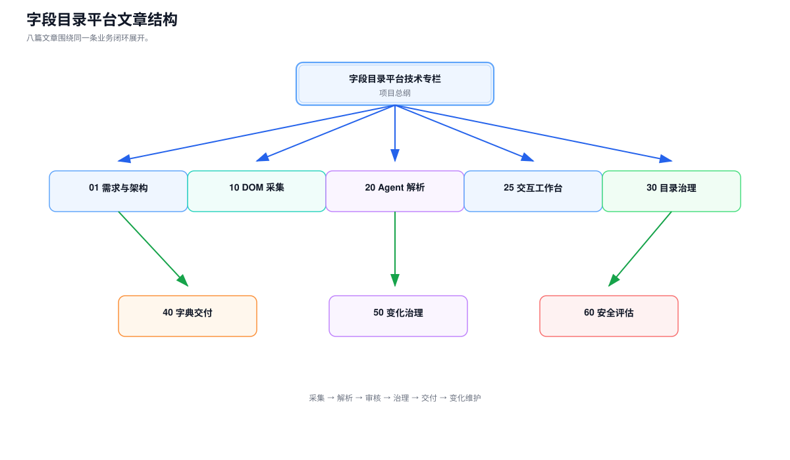

## 字段目录平台

> 这是一份字段目录平台的全栈技术专栏。它系统拆解 DOM-SCOUT 内部定制采集、受限 Agent 业务语义解析、交互工作台、目录树事务并发、异步字典交付和页面变化治理。

---

## 先看这一页

如果你要系统理解项目需求、完整技术方案和核心实现，先读：

- **[00 · 字段目录平台项目技术总纲](/projects/baozun-field-platform/project-knowledge-directory)**：从全栈职责、端到端架构、关键取舍到完整文章目录的技术地图。

然后阅读 **[01 · 完整需求定位与架构](/projects/baozun-field-platform/01-platform-catalog-architecture)**，建立项目边界、端到端链路和关键取舍。

如果你要深聊技术，按这个顺序往下读：

- **[10 · DOM-SCOUT 驱动的页面字段采集](/projects/baozun-field-platform/10-dom-field-capture)**：开源能力如何内部定制，人工如何选区，插件如何清洗，证据如何进入 Agent。
- **[20 · 受限 Agent 层级解析](/projects/baozun-field-platform/20-agent-hierarchy-parsing)**：Agent 怎么把证据变成可验收的候选字段树。
- **[25 · 字段治理交互工作台](/projects/baozun-field-platform/25-full-stack-workbench)**：采集、解析、目录审核和导出任务如何形成统一交互闭环。
- **[30 · 平台字段目录结构治理](/projects/baozun-field-platform/30-platform-field-structure-management)**：目录树不变量、生命周期与一致性。
- **[40 · 字段字典数据交付](/projects/baozun-field-platform/40-field-dictionary-data-delivery)**：从快照到异步导出与原子交付。
- **[50 · 采集与变更治理](/projects/baozun-field-platform/50-collection-and-change-governance)**：再采集、变化集与业务人员审核。
- **[60 · 可靠性、安全与评估](/projects/baozun-field-platform/60-reliability-security-and-evaluation)**：横切能力与边界。

---

## 阅读导航

| 章节 | 主题 | 你会带走什么 |
| --- | --- | --- |
| [00 · 字段目录平台项目技术总纲](/projects/baozun-field-platform/project-knowledge-directory) | 全栈职责、整体架构、技术取舍、知识目录 | 一份可逐章展开的项目技术地图 |
| [01 · 完整需求定位与架构](/projects/baozun-field-platform/01-platform-catalog-architecture) | 需求边界、角色、链路、取舍 | 一张端到端架构图 |
| [10 · DOM-SCOUT 驱动的页面字段采集](/projects/baozun-field-platform/10-dom-field-capture) | 插件定制、人工选区、清洗、补采与降级 | `DomSnapshot` 证据契约 |
| [20 · 受限 Agent 层级解析](/projects/baozun-field-platform/20-agent-hierarchy-parsing) | 解析编排、提示、反馈 | 可验收的候选字段树 |
| [25 · 字段治理交互工作台](/projects/baozun-field-platform/25-full-stack-workbench) | 采集、解析、审核、目录和导出交互 | 一条完整的前后端状态链路 |
| [30 · 平台字段目录结构治理](/projects/baozun-field-platform/30-platform-field-structure-management) | 树不变量、生命周期、一致性 | 目录结构的"地基" |
| [40 · 字段字典数据交付](/projects/baozun-field-platform/40-field-dictionary-data-delivery) | 快照、导出、原子交付 | 可复现的交付物 |
| [50 · 采集与变更治理](/projects/baozun-field-platform/50-collection-and-change-governance) | 再采集、变化集、审核 | 目录如何"长青" |
| [60 · 可靠性、安全与评估](/projects/baozun-field-platform/60-reliability-security-and-evaluation) | 可靠性、安全、评估 | 工程化的边界意识 |

---

## 平台全景（可交互）

<InteractiveDiagram
  title="字段目录平台端到端全景"
  src="/media/projects/baozun-field-platform/diagrams/platform-overview/index.html?embed=1"
  poster="/media/projects/baozun-field-platform/diagrams/platform-overview/preview.png"
  description="从字段采集、层级解析、目录治理、字典交付到变更审核的闭环能力地图。"
/>

---

## 建议阅读顺序

建议按这个顺序读：

1. **00 → 01**：先理解项目目标、职责、边界与术语。
2. **30 → 40**：优先吃透目录治理和字段字典交付。
3. **10 → 20**：再理解字段证据、确定性解析和受限 Agent。
4. **50 → 60**：最后补齐变化发布、评估、安全与运维闭环。

---

## 一张图看懂文档结构

---

> **说明**：新增的技术流程图采用 Fireworks Tech Graph 生成，源描述保存在 `assets/fireworks/*.json`，静态 SVG 用于文档内嵌，交互版本由对应的 HTML 查看器打开；既有平台全景仍保留 `InteractiveDiagram` 入口。图中只展示公开的架构、契约和流程，不包含公司内部代码、密钥或真实业务数据。
