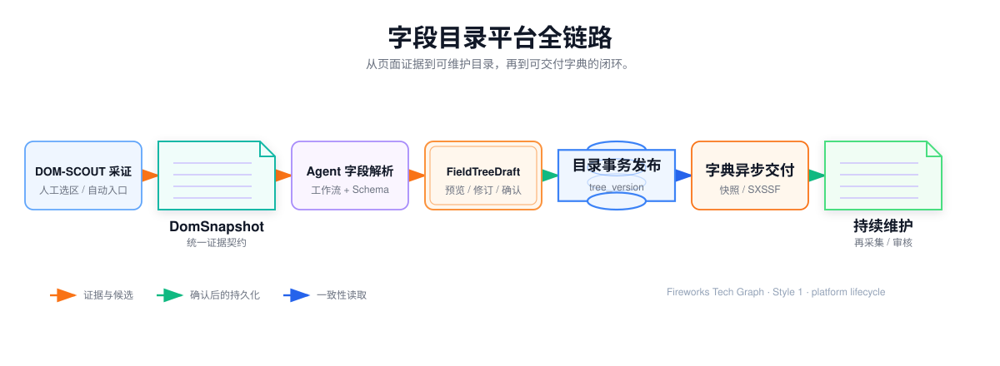
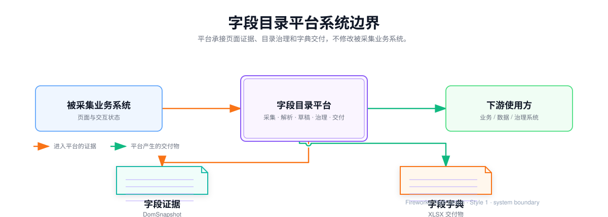
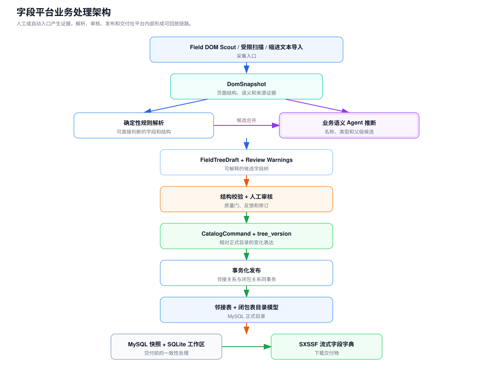
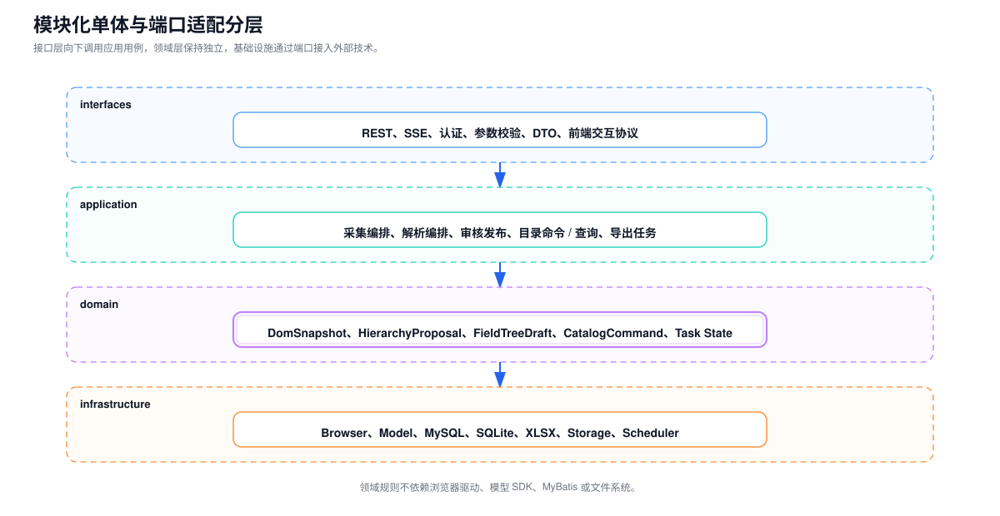
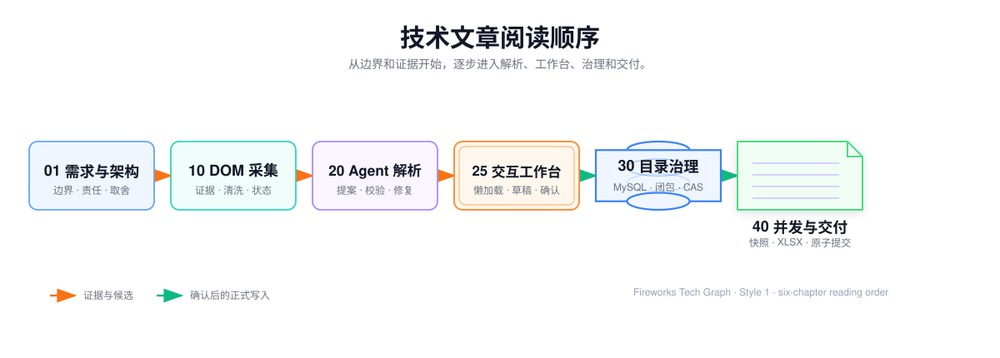

## 字段目录平台项目技术总纲

字段目录平台把业务后台中的菜单、页面、页签、区块、表单字段、表格列和指标定义，沉淀为具有统一身份、层级关系、来源证据和版本记录的目录资产。

平台通过 DOM-SCOUT 内部定制插件采集页面证据，经客户端清洗、输入归一和受限 Agent 生成 HierarchyProposal，再由后端编译为 FieldTreeDraft，在交互工作台中完成预览、修订和审核，最后通过 CatalogCommand 事务写入正式目录。目录可被分层查询、持续维护，并通过一致性快照和异步任务交付为字段字典。

整个项目关注的不是单点页面功能，而是下面这条全栈技术链路：

## 1. 全栈职责与系统边界

### 1.1 全栈职责

项目工作横跨页面交互、服务端业务、数据存储和智能化编排：

- **采集端**：DOM-SCOUT 内部定制、人工选区、多选区与父子级导航、受限 Playwright 自动入口、证据预览与补采；
- **平台前端**：目录树懒加载、批量录入、拖拽移动、FieldTreeDraft 审核、任务进度和文件下载；
- **应用后端**：采集任务、解析任务、目录命令、目录查询、变化发布和导出任务；
- **领域模型**：DomSnapshot、HierarchyProposal、FieldTreeDraft、草稿操作、目录不变量和任务状态机；
- **数据与文件**：MySQL 目录数据、闭包关系、SQLite 导出快照、XLSX 和本地/对象存储；
- **Agent 工程**：规则路由、Prompt 组装、白名单工具、结构校验、人工反馈和评估；
- **工程化**：认证、OpenAPI、SSE、测试、Nginx、部署、日志、安全和容量保护。

### 1.2 系统边界

平台负责字段从“页面痕迹”到“目录资产”和“字典产物”的完整生命周期，但不修改被采集系统的业务逻辑，也不定义下游数据仓库的指标计算公式。

## 2. 总体技术架构

### 2.1 业务处理架构

### 2.2 工程分层

采用模块化单体和端口适配结构，确保领域规则不依赖浏览器驱动、模型 SDK、MyBatis 或文件系统。外部技术可以替换，目录不变量、变化发布和任务状态不随之改变。

### 2.3 关键设计原则

1. 页面内容只作为不可信数据，先转换为结构化证据；
2. 插件负责选区和结构清洗，输入归一负责安全校验与结构事实，Agent 负责结合业务上下文判断字段语义与相对层级；
3. Agent 只能调用白名单领域工具，不能直接写正式目录；
4. Agent 输出先形成 HierarchyProposal，再由后端编译为 FieldTreeDraft，经过结构校验和业务人员审核；
5. 正式修改以带基线版本的 CatalogCommand 为单位事务提交；
6. 目录树同时维护直接父子关系和可重建闭包索引；
7. 大数据量字典从一致性快照异步、流式生成；
8. 采集、解析、审核、发布和导出都保留可回放状态。

## 3. 关键方案演进

### 3.1 录入方式：逐节点操作 → Easy Copy DOM 验证 → DOM-SCOUT 内部定制

逐节点录入准确但效率低；Easy Copy DOM 证明了“人工确定业务范围、DOM 提供结构证据”的路线可行，但单选复制、人工粘贴和缺少采集元数据限制了完整工作流。DOM-SCOUT 提供多选、高亮、父子级导航、可访问性摘要、定位器指纹和 Token 预估，内部定制再补齐字段专用输出、脱敏、上下文和 Agent 输入格式。

确定性缩进解析保留下来，作为批量文本输入的归一能力，与 DOM 采集共享后续的草稿和保存链路。

### 3.2 层级解析：固定模板 → 全量模型 → 结构证据驱动的受限 Agent

固定模板难以覆盖不同组件库和动态页面；全量模型解析容易受到 HTML 噪声、上下文长度和提示注入影响。最终采用 DOM-SCOUT 人工定界、双层清洗、结构事实抽取、Agent 语义解析、领域校验和业务人员审核的组合方式。

Agent 的作用是结合目标目录和页面上下文判断字段含义、业务分组与相对层级，并通过受控工作流输出可编辑草稿，而不是自由浏览和自由写库。

### 3.3 目录写入：逐节点执行 → FieldTreeDraft → CatalogCommand

逐节点写入会把解析过程中的中间状态暴露给正式目录。FieldTreeDraft 用于承载与人工采集页面同构的可编辑候选结构，DraftOperation 用于表达草稿内的新增、改名、移动和删除，保存适配层再把确认后的操作转换成 CatalogCommand。

保存命令携带基线 `tree_version`，发布前重新校验，避免审核期间的目录修改被覆盖。

### 3.4 数据交付：同步响应 → 异步任务 → 可恢复工作区

同步导出会占用 HTTP 线程、数据库连接和 JVM 内存。异步任务把源数据快照、清洗映射、XLSX 生成、文件提交和下载解耦；SQLite 快照与阶段检查点让本地处理可以恢复，并提前释放 MySQL 长事务连接。

## 4. 技术文章目录与实现范围

整套专栏只保留八篇相互依赖的技术文章。术语、API、测试、安全、性能和故障案例不再拆成独立空泛章节，而是放入对应功能章节中解释。

## 01 · 完整需求定位与全栈架构

这一章建立整个项目的共同上下文。

### 需要讲清

- 字段散落、定义漂移、页面改版返工和字典交付困难；
- Platform、DomSnapshot、HierarchyProposal、FieldTreeDraft、DraftOperation、Catalog Node、CatalogCommand、Export Task；
- 采集、解析、审核、治理、交付和维护的端到端边界；
- 前端、后端、Agent 和数据存储之间的责任划分；
- 模块化单体与端口适配的依赖方向。

### 需要实现和展示

- 一张端到端组件图；
- 一张正常流程时序图；
- 核心领域对象关系；
- 系统输入、输出和错误边界；
- 从人工目录工具演进为字段治理平台的关键决策。

## 10 · DOM-SCOUT 驱动的半智能字段采集

这一章解决字段证据从哪里来，以及如何证明采集范围。

### 需要讲清

- DOM-SCOUT 上游能力评估、内部定制边界和版本治理；
- 多选区、自动扫描、Easy Copy DOM 降级和缩进导入如何进入统一证据契约；
- heading、label、table header、ARIA、placeholder 和 DOM 包含关系；
- Tab、折叠、弹窗、滚动、分页和条件字段的状态探索；
- Shadow DOM、iframe、虚拟列表和 Canvas 的降级方式；
- 最小权限、定位器稳定性、证据去重、敏感信息剥离和部分完成。

### 需要实现和展示

- DomSnapshot JSON Schema，以及简化 HTML 与结构事实的输入契约；
- 客户端预清洗、输入归一和复制证据协议；
- Capture Snapshot 与页面状态指纹；
- 采集动作白名单和停止条件；
- 页面夹具与覆盖率计算；
- 证据预览、补采和错误原因展示。

## 20 · 受限 Agent 层级解析

这一章解决如何把字段证据变成可验收的候选字段树。

### 需要讲清

- DomSnapshot 与局部 DOM 清洗边界；
- DOM-SCOUT 负责结构证据，Agent 负责业务语义判断；
- 二次取证、层级分析、字段命名/类型、反思和定向重试这条最小节点链；
- `HierarchyProposal` 与 `FieldTreeDraft` 的分层契约，尤其是 Agent 提案与前端渲染树的边界；
- FieldTreeDraft 的字段、父级、层级、子树、来源证据和 `reviewRequired`；
- 证据不足、结构冲突、模型超时和人工复核的处理边界。

### 需要实现和展示

- DomSnapshot、EvidencePack、HierarchyProposal 和 FieldTreeDraft 的最小契约；
- 二次取证 → 层级分析 → 字段命名/类型 → 反思 → 后端编译/校验的编排图；
- 父级存在、唯一父级、无环、类型约束、来源证据和前端契约校验；
- 校验错误 → RepairFeedback → ReAct 局部修复 → 重新编译的闭环；
- SSE 阶段事件、`TREE_DRAFT_READY`/`REVIEW_REQUIRED`/`PARTIAL` 结果和人工复核入口；
- 父级准确率、人工修改率、证据缺口率和平均耗时等必要指标。

## 25 · 字段治理交互工作台

这一章承载全栈职责中最重要的业务人员交互闭环。

### 需要讲清

- 平台切换、目录懒加载、面包屑、搜索和节点详情；
- 缩进文本批量建树、格式归一、预览和错误定位；
- 拖拽移动、乐观更新、失败回滚和版本冲突提示；
- 采集任务创建、页面覆盖进度和证据查看；
- Agent 解析进度、FieldTreeDraft 与现有目录差异；
- 局部接受、人工修订、拒绝原因和重新解析；
- 导出任务列表、状态轮询、失败详情和安全下载。

### 需要实现和展示

- 前端页面状态模型；
- REST、SSE 与轮询的职责划分；
- 树组件增量更新和大树渲染策略；
- FieldTreeDraft 与正式目录的差异视图；
- 401、409、422、429 和任务失败的统一交互；
- Nginx 静态资源、API 代理和下载配置。

## 30 · 平台字段目录结构治理

这一章解释目录树怎样在关系数据库中保持可查询、可移动和可并发修改。

### 需要讲清

- 邻接表、闭包表、物化路径、嵌套集合和图数据库对比；
- `parent_id`、`node_level`、`sort_order` 和闭包深度；
- 同级名称唯一、跨平台隔离、无环和最大深度；
- 新增、批量新增、移动、删除和恢复的事务；
- 节点 `version`、范围行锁、锁后复查和平台 `tree_version`；
- 游标分页、祖先路径、受保护子树和 NDJSON 流式查询。

### 需要实现和展示

- ER 图和关键索引；
- 移动子树前后的闭包关系推导；
- 结构写事务时序；
- 并发修改冲突矩阵；
- 逻辑外键与闭包一致性巡检 SQL；
- 大树懒加载与缓存失效协议。

## 40 · 字段字典数据交付

这一章解释目录资产怎样稳定转换为可下载、可复现的字段字典。

### 需要讲清

- 目录叶子到固定字典列的映射规则；
- PENDING、RUNNING、RETRYING、SUCCESS、FAILED、CANCELED 状态机；
- Idempotency-Key、创建准入、原子领取和任务归属；
- MySQL 一致性快照的并发可见性；
- SQLite 快照、阶段检查点和恢复；
- 异常分支隔离、迭代 DFS 和流式映射；
- SXSSF 行窗口、Excel 行数、临时文件和公式注入防护；
- 原子提交、SHA-256、下载鉴权、重试和保留期清理。

### 需要实现和展示

- 导出任务状态机；
- 快照并发实验；
- 工作区文件协议；
- 异常分类与重试属性；
- XLSX 内容验收；
- 十万级内存、磁盘、连接和耗时记录。

## 50 · 采集与变化治理

这一章解决页面改版后目录如何增量更新，而不是全量重建。

### 需要讲清

- 字段身份由稳定 key、路由、定位器、文本、类型和祖先路径共同确定；
- 新增、删除、改名、移动、类型变化和证据变化；
- 模糊身份匹配与确定性 diff 分离；
- 变化集的基线快照、基线树版本、前置条件和风险等级；
- 审核期间目录变化时的冲突检测；
- 目录快照、变化日志、反向变化集和字典版本绑定；
- 正式节点到证据、解析、审核和发布的血缘。

### 需要实现和展示

- 身份匹配评分模型；
- Snapshot Diff 和变化集 Schema；
- 差异审核界面；
- 发布事务与版本冲突流程；
- 回滚演示；
- 血缘查询链路。

## 60 · 可靠性、安全与评估

这一章把贯穿所有功能的工程约束集中收口。

### 需要讲清

- 页面文本与系统指令隔离，防止 Prompt Injection；
- Agent 工具、域名、凭证和数据访问的最小权限；
- 采集、解析、发布和导出任务的幂等、超时、重试与取消；
- traceId、captureTaskId、parseTaskId、changeSetId 和 exportTaskId 串联；
- 领域测试、事务集成测试、DOM 页面夹具、模型回放和端到端测试；
- 字段召回率、父级准确率、整树正确率、人工修改率和任务成功率；
- 单实例向消息队列、对象存储和多实例任务租约演进的条件。

### 需要实现和展示

- 信任边界图和攻击样例；
- 统一错误码、日志字段和 Trace 关系；
- 评估集与回归报告；
- 故障恢复矩阵；
- 容量阈值和架构升级条件；
- Docker、Nginx、配置隔离和部署拓扑。

## 5. 最终保留的项目闭环

八篇文章共同形成下面这条技术叙事，不再增加与项目功能无关的独立章节：

