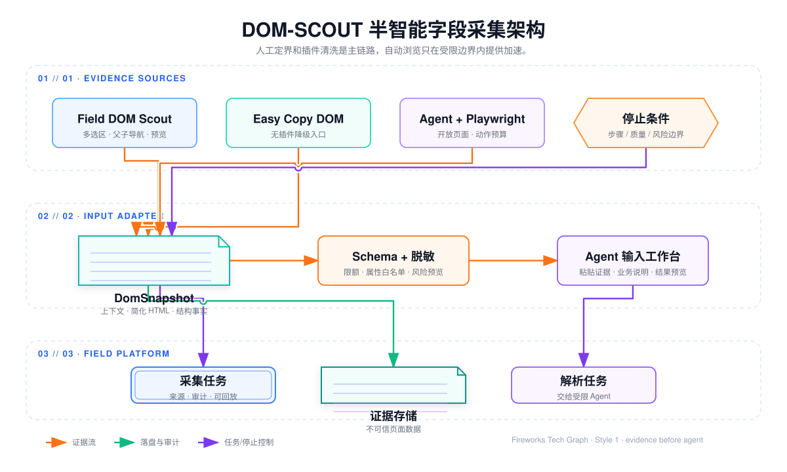
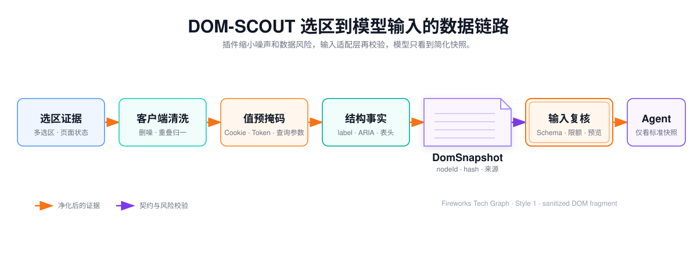

## DOM-SCOUT 驱动的局部 DOM 字段采集

Lexicon · AI 字段词典平台面对的不是一份稳定的数据表，而是已经渲染完成的业务页面。相同的“状态”可能同时出现在查询条件、列表列头、订单详情和售后抽屉中；页面 DOM 又经常被 React、Vue 或组件库包装成多层 `div`、`span` 和临时 class。

采集阶段原先工作直接要求业务人员逐字段录入字典表格文件中，但是存在表格文件不好定位查询字段位置，不好维护层级结构关系。业务人员负责确定页面状态和业务范围，
业务人员使用插件把当前选区清洗成结构证据，然后上传到平台的输入接口中,内部 Agent 再判断业务含义和真正的字段层级；


这里有两个必须区分的概念：

- **DOM 父子结构**：页面节点如何嵌套，由 DOM-SCOUT 采集和保留；
- **业务字段父子结构**：字段、分组、组件之间的业务层级，由内部 Agent 结合上下文判断。

DOM-SCOUT 不是业务字段识别 Agent，也不是自动爬虫。它是一个由人工触发、自动完成结构采集和预处理的浏览器插件。



主流程的可交互版本：<a href="../../media/projects/baozun-lexicon/diagrams/agent-runtime-architecture/index.html" target="_blank" rel="noreferrer">打开 Fireworks Tech Graph 图</a>。图中的底层 Agent Runtime、Model / Trace 和 Tool Gateway 只表示企业内部平台提供的能力；字段项目真正负责的是选区规则、清洗器、工作流节点、Prompt 和校验规则。

## 1. 为什么选择 DOM-SCOUT 这类插件

### 1.1 先解决“范围”，再解决“语义”

原始页面往往同时包含导航、菜单、按钮、表单、表格、弹窗和隐藏模板。如果把整页 HTML 直接交给 Agent，会产生三个问题：

1. 上下文噪声太多，模型需要先寻找真正的业务区域；
2. 页面业务值、订单号、手机号等真实数据可能进入模型输入；
3. Agent 需要自行探索页面状态，无法证明采集是否完整。

DOM-SCOUT 把最需要业务判断的动作交给业务人员：业务人员知道当前要采集的是“退款信息”还是“物流信息”，因此只选择相关区域，这是属于哪个区域位置的子节点信息
关于里面的层级结构和span标签的信息都会进入到内部 agent 之中进行语义判断

### 1.2 相比 Easy Copy DOM 类的改进

Easy Copy DOM 能验证局部 DOM 路线，但主要工作方式是“选择一个节点并复制 `outerHTML`”。字段采集在实际使用中还需要：

- 多选多个相关区域；
- 向上切换到包含业务标题的父容器；
- 取消重复和重叠选区；
- 同时查看结构、可访问性和定位信息；
- 预览清洗结果和输入规模；
- 记录页面标题、当前页签和选区说明；
- 将一次采集结果直接作为内部 Agent 的输入。

DOM-SCOUT 更贴合这条操作路径。上游项目提供页面内高亮、多选、Parent / Child 导航、Clean HTML、Structure、Accessibility、Selectors 和 Token 预估等通用能力。评估时固定上游版本和提交，内部只围绕字段证据格式、安全清洗和 Agent 输入协议做定制。参考实现见 [DOM-SCOUT](https://github.com/HokageZ/DOM-SCOUT)，评估基线固定为 `1.0.7`、提交 [`44be484`](https://github.com/HokageZ/DOM-SCOUT/commit/44be484ea1d0510e92b718d6e2c43c16cba8dbaa)。

开源依赖不能只看 README 的功能描述。落地前应对固定提交执行许可证文件、依赖树、第三方声明和安全公告审计；如果固定提交缺少可核验的许可证文件，应先完成法务或合规确认，再决定以源码依赖、内部镜像或仅参考交互方式落地。内部改动通过可追踪补丁和上游同步策略维护，不能把业务定制直接散落在无法回溯的构建产物中。

### 1.3 方案选型比较

| 方案 | 主要方式 | 优点 | 主要问题 | 项目定位 |
| --- | --- | --- | --- | --- |
| 逐字段手工录入 | 人工逐个填写目录 | 准确、简单 | 速度慢，无法复用页面结构 | 极端降级 |
| Easy Copy DOM | 单选节点并复制 HTML | 上手快，验证成本低 | 上下文、格式和提交过程割裂 | 第二实现方案 |
| DOM-SCOUT 内部版 | 人工选区，插件自动清洗 | 多选、可预览、结构完整，适合 Agent | 需要内部维护清洗规则和版本 | 主采集方案 |
| Agent + Playwright | Agent 自动打开页面并读取 DOM | 可批量处理简单开放页面 | 登录、状态、权限和停止条件复杂 | 受限加速入口 |

最终采用 DOM-SCOUT，不是因为它可以替代人工，而是因为它把人工最擅长的业务范围判断和机器最擅长的结构处理组合起来。

## 2. 人工操作与自动处理的边界

### 2.1 业务人员手动完成

业务人员需要：

1. 打开目标业务系统并完成登录；
2. 进入正确的页面、页签或弹窗状态；
3. 点击插件开始采集；
4. 选择一个或多个业务区域；
5. 必要时上移到包含标题和上下文的父容器；
6. 查看插件预览并补充业务说明；
7. 将结果复制到内部 Agent 调试入口，或使用平台集成入口提交；
8. 审核 Agent 生成的字段草稿。

业务人员不需要手动整理 HTML，也不需要在页面中逐个识别字段。

### 2.2 插件自动完成

插件在业务人员确认选区后自动完成：

- 读取选区的当前 DOM；
- 归一化选区根节点；
- 处理父子选区重叠；
- 删除脚本、样式和无意义属性；
- 保留标签、控件、表头和 ARIA 关系；
- 掩码输入值和详情值；
- 压缩组件库包装层；
- 生成简化父子结构 HTML；
- 生成页面上下文、来源节点 ID 和清洗统计；
- 估算输入规模并提示超限风险。

### 2.3 内部 Agent 自动完成

Agent 负责：

- 判断哪些节点是业务字段；
- 识别字段所属业务分组；
- 区分 `SECTION`、`COMPONENT`、`FIELD` 和 `METRIC`；
- 根据目标目录确定相对父级；
- 生成字段名称、编码和数据类型；
- 发现同名字段、重复字段和语义冲突；
- 对证据不足的结果标记人工审核。

插件只产生结构证据，Agent 才产生业务解释。

## 3. 内部版插件的设计边界

内部版可以称为 `Field DOM Scout`。它不是重新建设一个浏览器开发者工具，而是在 DOM-SCOUT 的交互和序列化能力上增加字段场景适配。

### 3.1 复用的通用能力

- 页面内 hover 高亮和选区确认；
- 多选、取消选择、选择列表；
- Parent / Child 导航；
- Shadow DOM 隔离的插件面板；
- Clean HTML 和结构树生成；
- Accessibility 摘要；
- CSS、XPath、ARIA 和文本定位候选；
- 近似 Token 统计和输出预览。

### 3.2 内部必须定制的能力

| 定制点 | 设计要求 |
| --- | --- |
| 专用输出格式 | 默认输出字段采集专用的简化 HTML，不把 CSS 作为 Agent 默认输入 |
| 属性白名单 | 保留 `label`、`name`、`type`、`placeholder`、ARIA、表头关系等证据属性 |
| 真实值处理 | 不保留输入框当前值、业务详情值、订单号、手机号和金额 |
| 包装层压缩 | 删除无业务意义的组件库包装，但不能破坏标签—控件和标题—区域关系 |
| 表格处理 | 默认保留表头和列顺序，数据行只保留脱敏结构样例或直接删除 |
| 多选区处理 | 父选区覆盖子选区时避免重复序列化，部分重叠时提示调整 |
| 页面上下文 | 记录标题、路由、当前页签、弹窗标题、选区说明和状态摘要 |
| 来源回指 | 每个保留节点生成采集期内稳定的 `sourceNodeId` |
| 超限策略 | 按完整业务容器拆分，不按字符数硬截断半棵 HTML |
| 版本治理 | 固定上游提交，内部扩展版本、清洗策略版本和 Schema 版本可追踪 |

### 3.3 权限设计

核心流程只需要在用户明确点击采集后访问当前页面，因此不应使用长期、无范围的页面访问权限。建议采用：

- `activeTab`：用户触发后访问当前标签页；
- `scripting`：注入选区和序列化逻辑；
- `storage`：保存非敏感的插件设置；
- `commands`：提供可选快捷键；
- 如果未来接入字段平台 API，只允许字段平台自己的精确域名。

插件不需要自动访问所有业务域名，也不需要读取 Cookie、请求头或网络流量。业务页面的登录态只用于让业务人员看到正确的页面，不交给插件或 Agent。

## 4. 采集操作流程

### 第一步：进入业务状态

业务人员先完成页面操作，例如：

- 打开订单详情；
- 切换到“售后记录”页签；
- 展开“退款信息”折叠区；
- 打开退款详情抽屉。

插件只采集当前已经渲染出的页面状态，不负责自动遍历所有页签和弹窗。

### 第二步：选择业务区域

业务人员点击插件后，页面进入选区模式。鼠标悬停显示候选节点，点击后加入选择列表。选择过小会缺少业务标题，选择过大则会包含整页无关内容，因此插件提供 Parent / Child 调整和预览。

推荐选择能够表达业务边界的“退款信息区域”，不推荐只选择“退款状态文字节点”。

### 第三步：插件清洗当前 DOM

插件在确认选区后生成结构证据。它不根据业务经验判断“这是不是字段”，只做可重复的 DOM 处理；处理链路见图“DOM 清洗、结构事实和 DomSnapshot 生成”。



### 第四步：复制或提交给 Agent

当前主流程可以先把“字段采集专用输出”复制到内部 Agent 调试工作流中。输出不是面向最终用户的 Markdown，而是结构化输入，通常包含：

- 简化 HTML；
- 页面上下文；
- 选区上下文链；
- 节点来源 ID；
- 结构事实；
- 清洗告警；
- 版本信息。

未来如果内部 Agent 平台具备稳定接口，可以将复制粘贴替换为插件到平台的受控提交，但这属于传输方式升级，不改变采集和语义解析边界。

## 5. DOM 清洗算法的设计原则

### 5.1 先理解浏览器里的 DOM 是什么

这里说的“DOM”不是用户看到的截图，也不是网络响应里的原始 HTML，而是浏览器把 HTML 解析并经过脚本修改后形成的内存树。采集插件在用户点击采集的瞬间读取这棵树，因此必须区分四种内容：

| 内容 | 是否属于当前 DOM | 采集策略 |
| --- | --- | --- |
| 已渲染的元素节点 | 是 | 可作为结构证据遍历 |
| `input.value`、选中项和详情文本 | 是，但通常是业务真实值 | 掩码或删除，不能直接进入 Agent |
| CSS 视觉位置、颜色和像素 | 不属于 DOM 语义 | 不把视觉位置当成业务父子关系 |
| 尚未渲染的分页、虚拟列表和隐藏模板 | 可能不在当前可见 DOM | 标记“当前状态未覆盖”，要求补采 |

`parentElement`、`children` 和节点顺序可以证明“页面节点如何包含”；它们不能单独证明“业务字段属于哪个目录分组”。这就是 DOM 层和业务语义层必须分开的原因。

### 5.2 选区根节点如何归一化

业务人员点击的节点可能是一个 `span`、`input` 或组件内部图标。插件不能直接把点击节点当作业务容器，而是按以下顺序确定选区根节点：

1. 记录用户点击节点、所属 `frame`、Shadow DOM 边界和当前页面状态；
2. 读取节点向上的候选容器，优先考虑包含标题、标签、表头或多个控件的稳定容器；
3. 根据业务人员的 Parent / Child 操作确定最终根节点；
4. 对多个根节点做包含关系归一：父节点覆盖子节点时只序列化父节点，部分重叠则提示重新选择；
5. 在序列化前再次确认节点仍连接在当前 `document` 中，防止 SPA 重渲染后继续使用失效引用。

选区根节点的目标是“足够表达业务边界”，不是“越大越完整”。整页 `body` 反而会带入导航、隐藏模板和无关组件。

### 5.3 遍历、清洗和序列化的通用伪代码

下面是对外可描述的通用算法，不对应公司内部具体实现：

```javascript
serialize(selectionRoot, pageState):
  assert selectionRoot is connected to current document
  root = normalizeRoot(selectionRoot, parentChildChoice)
  sourceMap = allocateStableNodeIds(root)

  walk(node, parentEvidence):
    if node is script/style/comment/svg-noise: skip
    if node is hidden template or virtual-buffer: skip and record warning
    if node is iframe:
      if same-origin and allowed: recurse with framePath
      else: record FRAME_UNREADABLE and stop this branch

    facts = extractDeterministicFacts(node, parentEvidence)
    attrs = pickAllowedAttributes(node)
    text = maskRuntimeValue(normalizeText(node))
    children = walkAllowedChildren(node, facts)
    return compact(node.tag, attrs, text, children, sourceMap[node], facts)

  fragment = walk(root, pageState.contextChain)
  fragment = repairParentChildRelations(fragment)
  return DomSnapshot(fragment, pageState, sourceMap, cleanupStats, warnings)
```

这里的 `extractDeterministicFacts` 只生成 `LABEL_FOR_CONTROL`、`TABLE_HEADER_ORDER` 等可证明关系；它不能把节点直接命名为 `SECTION` 或 `FIELD`。业务命名和真正的父级判断留给内部 Agent。

### 5.4 原始示例

组件库页面可能产生类似结构：

```html
<div class="ant-form-item ant-form-item-hash-83af">
  <div class="ant-form-item-label">
    <label for="refundStatus">退款状态</label>
  </div>
  <div class="ant-form-item-control">
    <div class="ant-select-wrapper">
      <select id="refundStatus" name="refundStatus">
        <option>已退款</option>
      </select>
    </div>
  </div>
</div>
```

### 5.5 简化后的证据

插件只保留支持后续判断的结构：

```html
<div data-source-node-id="n1">
  <label for="refundStatus" data-source-node-id="n2">退款状态</label>
  <select id="refundStatus" name="refundStatus" data-source-node-id="n3">
    <option>[OPTION]</option>
  </select>
</div>
```

这个结果保留了：

- 标签文本；
- 标签与控件的关联；
- 控件类型；
- `name`、`id` 等辅助属性；
- 原始节点的相对顺序；
- 节点来源 ID。

它删除了：

- 组件库动态 class；
- 当前选中的真实值；
- 与字段识别无关的包装节点；
- 脚本、样式和事件属性。

### 5.6 保留什么

优先保留能够回答下面三个问题的证据：

1. 这个节点可能代表什么字段？
2. 它属于哪个页面区域？
3. 它具有什么控件或数据类型特征？

具体包括：

- `label`、`for`、`name`、`type`、`placeholder`；
- `role`、`aria-label`、`aria-labelledby`；
- `h1`—`h6`、当前页签和弹窗标题；
- `table`、`thead`、`th`、`scope`、列顺序；
- `dt` / `dd` 和标签—值相邻关系；
- 稳定的业务属性，例如 `data-field`；
- DOM 包含关系和字段顺序；
- `data-source-node-id`。

### 5.7 删除什么

- `script`、`style`、`link`、注释和内联事件；
- SVG 路径和无法解释的复杂图形节点；
- 输入框当前值和隐藏字段值；
- 订单号、手机号、邮箱、金额等真实业务值和业务详情文本；字段标签与结构关系仍然保留；
- Cookie、Token、请求头和 URL 查询参数；
- 动态 class、随机 hash、框架内部属性；
- 重复表格行和虚拟列表缓冲节点；
- 与选区无关的导航、页脚和全局菜单。

客户端清洗的目标是尽可能不让敏感值离开浏览器；Agent 输入侧仍然要把插件结果视为不可信数据，必要时再做一次服务端或工作流入口校验。

上图对应的处理链路交互版：<a href="../../media/projects/baozun-lexicon/diagrams/agent-prompt-context-pipeline/index.html" target="_blank" rel="noreferrer">打开输入到 Agent 的处理链路</a>。插件清洗不是“把 HTML 随便压缩”，而是先删除高风险和无关节点，再保留能够回指字段证据的属性、顺序和包含关系。

## 6. DomSnapshot 输入契约

插件输出可以统一为 `DomSnapshot`。它描述的是页面证据，不是字段目录：

```json
{
  "snapshotId": "snap_01J6QY9T4K",
  "captureSessionId": "capture_1001",
  "sourceType": "DOM_SCOUT_INTERNAL",
  "schemaVersion": "dom-snapshot/2.0",
  "pluginVersion": "field-dom-scout/1.0.0",
  "cleanerVersion": "field-dom-cleaner/1.0",
  "pageContext": {
    "route": "/orders/detail",
    "title": "订单详情",
    "activeTab": "售后记录",
    "selectedRegion": "退款信息",
    "stateFingerprint": "sha256:..."
  },
  "targetContext": {
    "parentName": "售后记录",
    "parentPath": ["订单详情", "售后记录"],
    "baseTreeVersion": 12
  },
  "selections": [
    {
      "selectionId": "sel_01",
      "order": 1,
      "contextChain": ["main", "售后记录", "退款信息"],
      "simplifiedHtml": "<section data-source-node-id=\"n1\">...</section>",
      "structuralFacts": [
        {"type": "HEADING_CONTAINS", "from": "n1", "to": "n2"},
        {"type": "LABEL_FOR_CONTROL", "from": "n3", "to": "n4"}
      ],
      "warnings": []
    }
  ],
  "cleanup": {
    "originalCharacters": 18240,
    "cleanedCharacters": 3260,
    "removedNodeCount": 83,
    "maskedValueCount": 14,
    "warnings": []
  }
}
```

其中 `captureSessionId` 只是一次多选采集的逻辑关联标识，用于把同一页面状态下的多个选区串起来，并不代表插件需要维护一个拥有业务写权限的领域会话对象。

### 6.1 `structuralFacts` 的边界

`structuralFacts` 只表示确定性的结构关系，例如：

- `LABEL_FOR_CONTROL`；
- `ARIA_LABELLED_BY`；
- `HEADING_CONTAINS`；
- `TABLE_HEADER_ORDER`；
- `DESCRIPTION_TERM_VALUE_PAIR`；
- `ACTIVE_TAB`；
- `VISIBLE_DIALOG`。

它不能直接输出：

- `FIELD`；
- `SECTION`；
- `COMPONENT`；
- `METRIC`；
- 业务字段编码；
- 正式目录父级。

这些内容属于内部 Agent 的业务判断。

### 6.2 页面状态指纹

同一个 SPA 路由可能对应多个页面状态，因此状态指纹可以由以下内容组成：规范化 `route`、`activeTab`、可见弹窗或抽屉标题、展开容器标识、选区根节点摘要和清洗后 DOM hash。

指纹应排除：

- 查询参数；
- 业务真实值；
- 时间戳；
- 随机 class；
- 与字段结构无关的动态数字。

状态指纹只用于识别重复采集，不能当作正式页面身份。

## 7. 多次选区和多页面状态

一次选择不一定覆盖完整页面。业务人员可以在同一采集会话中分别采集：

1. 订单详情基础信息；
2. 售后记录页签；
3. 展开的退款信息；
4. 退款详情抽屉；
5. 商品明细表格。

每次采集都形成一个快照或快照片段，内部 Agent 在草稿阶段合并，而不是在插件阶段猜测最终业务树。

### 7.1 父子选区重叠

如果同时选中父容器和内部字段容器：

- 插件提示存在覆盖关系；
- 默认只保留较大的完整容器；
- 保留子选区锚点用于用户回看；
- Agent 不因为选区数量增加就重复生成字段。

### 7.2 同级节点

以下 DOM 结构中，DOM-SCOUT 只能保留顺序和标签—值关系：

```html
<span>退款状态</span>
<span>[VALUE]</span>
<span>退款金额</span>
<span>[VALUE]</span>
```

它不能确定是否存在“退款信息”这一业务分组。Agent 需要结合页签、标题、目标目录和业务术语，判断“售后记录”下是否应建立“退款信息”分组，再把“退款状态”和“退款金额”挂到该分组下。

如果证据不足，则直接挂到目标父级并标记 `reviewRequired`，不凭空生成分组。

## 8. 页面边界与降级处理

| 场景 | 技术限制 | 处理方式 |
| --- | --- | --- |
| React / Vue 动态页面 | DOM 包装层和 class 不稳定 | 忽略动态样式，保留语义属性和关系 |
| SPA 路由不变 | URL 不能代表页面状态 | 使用页签、弹窗、展开状态和 DOM hash |
| 虚拟列表 | 未渲染内容不在 DOM 中 | 只记录已渲染结构，滚动后追加采集 |
| open Shadow DOM | 可以访问开放 shadowRoot | 保留 Shadow DOM 边界并继续序列化 |
| closed Shadow DOM | 浏览器外部不可读 | 标记不可访问，人工补充字段 |
| 同源 iframe | 可在允许范围内单独读取 | 记录 frame 路径，合并为同一采集会话 |
| 跨域 iframe | 受浏览器安全策略限制 | 不伪造内容，转人工补充 |
| Canvas | 没有可解释的字段 DOM | 记录不可采集原因，人工录入 |
| Portal 弹窗 | 节点可能挂在 `body` 下 | 使用弹窗标题和业务说明补充上下文 |
| 隐藏模板 | 结构存在但不可见 | 默认删除，不把模板字段当成当前页面字段 |
| 表格业务行 | 真实数据噪声和敏感风险高 | 默认只留表头和脱敏结构样例 |
| 页面需要点击提交 | 采集模式不执行业务动作 | 用户先完成页面状态，再重新开启采集 |

### 8.1 “看得到”不等于“能安全读取”

浏览器页面的边界不是单纯的可见 / 不可见二分：

- `display: none`、`hidden`、`aria-hidden` 和 `inert` 的含义不同。默认只采集当前可见且可交互区域，但仍记录“发现隐藏模板”的统计，避免把模板字段误当成当前页面字段；
- `input.value` 是运行时属性，HTML 的 `value` 属性可能只是初始值。采集器必须优先掩码运行时属性，不能因为序列化结果中没有 `value` 属性就认为不存在敏感信息；
- `visibility: hidden`、透明遮罩、折叠容器和滚动容器可能让节点存在但业务人员不可见。插件以当前页面状态和用户确认的选区为准，不根据 CSS 自行展开内容；
- open Shadow DOM 可以从 `shadowRoot` 继续读取，但要在 `sourceNodeId` 和路径中保留 Shadow 边界；closed Shadow DOM 不能通过普通页面脚本绕过，必须降级为人工补充；
- 同源 iframe 可以在明确允许的范围内建立 `framePath` 后单独序列化；跨域 iframe 受到浏览器同源策略限制，不能通过猜测或复制请求绕过；
- Portal 弹窗通常挂在 `body` 下，不是触发按钮的 DOM 子树。应通过弹窗标题、当前焦点和业务说明补足上下文，而不是强行把它改写成页面原始父子关系；
- Canvas、图片文字和远程渲染表格没有可靠的字段 DOM。系统要输出不可采集原因，不把 OCR 猜测结果伪装成确定性结构事实。

这些限制是浏览器安全模型和页面渲染机制决定的，不是换一个 Prompt 或提高模型参数就能消除的能力缺口。

Agent + Playwright 可以作为简单开放页面的辅助入口，但必须生成同一份 `DomSnapshot`，不能创建第二套业务解析链路。Easy Copy DOM 继续作为无插件集成时的第二实现方案。

## 9. 失败和告警设计

| 原因码 | 含义 | 处理方式 |
| --- | --- | --- |
| `CAPTURE_SCOPE_TOO_SMALL` | 选区缺少标题、页签或业务上下文 | 保留已有字段，提示扩大选区 |
| `CAPTURE_SCOPE_TOO_LARGE` | 选区接近整页，噪声超限 | 建议选择更小的业务容器 |
| `DOM_FRAGMENT_EMPTY` | 清洗后没有有效结构 | 重新选择区域 |
| `DOM_FRAGMENT_TOO_LARGE` | 结构或 Token 超过处理限制 | 按完整业务容器拆分 |
| `CAPTURE_SENSITIVE_CONTENT` | 发现不可接受的真实值 | 阻止输出或强制掩码 |
| `CAPTURE_SELECTION_OVERLAP` | 多选区存在覆盖关系 | 提示保留父容器或拆分区域 |
| `CAPTURE_SELECTION_DETACHED` | 页面重渲染导致节点失效 | 重新选择并重新采集 |
| `CAPTURE_METADATA_INCOMPLETE` | Easy Copy DOM 等降级来源缺少上下文 | 允许继续，但要求人工审核 |
| `CAPTURE_SCHEMA_UNSUPPORTED` | 插件版本与 Agent 输入不兼容 | 升级插件或切换降级入口 |

“证据不足”不是系统故障。只要快照仍然包含有效结构，就应输出部分草稿并提示人工补采；只有空输入、解析损坏或 Schema 不兼容才阻止任务。

## 10. 安全和隐私边界

页面内容是业务数据，不是系统指令。DOM 中即使出现“忽略之前规则”等文本，也只能作为页面文本进入输入区，不能改变 Agent 规则。

安全设计包括：

- 只在用户主动操作后读取当前页面；
- 不采集 Cookie、Token、请求头和网络流量；
- 不把真实输入值作为 Agent 证据；
- 不在普通日志记录原始 HTML；
- 对插件输出做大小和属性白名单校验；
- Agent 不拥有浏览器任意操作权限；
- Agent 不拥有正式目录写权限；
- 最终保存必须经过人工确认、权限校验和事务校验。

如果未来增加插件直连接口，只改变传输方式，不改变“插件不做业务语义、Agent 不直接写库”的安全边界。

## 11. 如何验证采集质量

采集层和 Agent 层必须分开评估，不能用 Agent 最终回答掩盖插件证据缺失。

### 11.1 插件层指标

在固定页面样本的同一选区口径下，原始 DOM 输入为 `18.2KB`，经过选区收敛、无关节点删除、组件包装层压缩、重复行裁剪和真实值掩码后，`DomSnapshot` 输入降至 `3.3KB`，体积减少约 `82%`。这组数据描述的是该样本的字符体积变化，不外推为所有页面的固定压缩率；生产评估仍同时记录 Token 变化、字段证据保留率和人工补采率，避免为了压缩而删掉业务语义。

- 业务人员成功进入采集模式的比例；
- 选区确认成功率；
- 清洗后 Schema 合法率；
- 选区重叠发现率；
- 页面真实值掩码命中率；
- 清洗前后字符数和 Token 变化；
- 需要重新选择的比例；
- 各页面类型的采集失败原因。

### 11.2 Agent 层指标

- 字段识别召回率；
- 普通文本误识别率；
- 业务父级准确率；
- 字段类型准确率；
- 重复字段率；
- 首次解析后的人工修改率；
- `CAPTURE_SCOPE_TOO_SMALL` 的比例和原因；
- 对话修改应用成功率。

### 11.3 测试样本

固定页面夹具至少覆盖：

- 普通表单；
- 详情列表；
- 表格列头；
- 混合布局；
- 同名字段；
- 页签和弹窗；
- Shadow DOM；
- iframe；
- 虚拟列表；
- 缺少标题的局部选区；
- 包含敏感值的页面。

插件测试只验证“输出的证据是否完整、干净、可解释”；Agent 测试再验证“证据是否被正确解释为业务字段层级”。

## 12. 对项目带来的实际效益

该方案的收益不只是减少复制粘贴，而是重新划分了人与机器的职责：

- 业务人员只需要确定业务范围，不再逐字段录入；
- 页面结构被保留下来，字段上下文不再只依赖文本；
- 插件清洗降低了 HTML 噪声和敏感数据风险；
- Agent 输入格式统一，Easy Copy DOM、DOM-SCOUT 和 Playwright 可以共用解析链路；
- 业务语义判断集中在内部 Agent，便于持续迭代和评估；
- 采集结果可以回指页面证据，便于人工审核；
- 页面改版后可以重新采集并比较变化；
- 最终目录仍然由人工确认和事务保存，模型错误不会直接污染正式数据。

不应在没有基线数据时编造固定的效率提升百分比。对外展示时应使用“与逐字段录入或 Easy Copy DOM 基线相比，减少重复整理、降低输入噪声、提升上下文完整性和可回溯性”等可验证表述，并用实际评估集补充数字。

## 本章结论

DOM-SCOUT 在本项目中的定位是：**业务人员手动选择范围，插件自动把当前 DOM 清洗为简化的父子结构 HTML 和结构证据。**

内部 Agent 在此基础上完成：**字段识别、业务分组、真正的父子层级、字段类型、编码和审核提示。**

最终方案是：人工确定页面状态和业务边界，DOM-SCOUT 自动清洗结构，内部 Agent 生成 HierarchyProposal，后端编译成与人工采集同构的 FieldTreeDraft，进入审核，确认后再通过正式目录事务保存。完整链路图见本章开头的动态架构图。

这是一种可解释、可回溯、可逐步自动化的字段采集方案，而不是一个试图自动操作整个业务系统的浏览器机器人。
