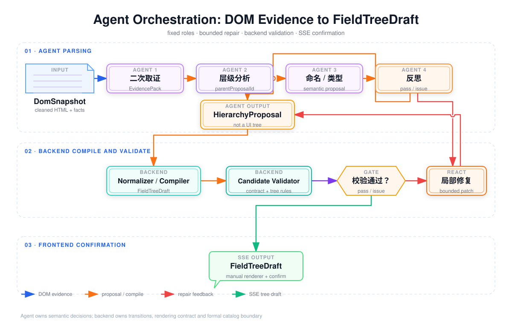
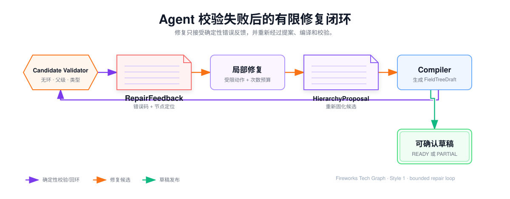

## Agent 编排：从 DOM 证据到可确认字段树

第 10 章解决“业务人员如何选择页面范围并得到干净 DOM 证据”。本章只解决后半段：**内部 Agent 如何把这份证据编排成真正的业务层级，并安全地推送给前端确认。**

这不是让一个 Agent 自由浏览页面，而是把 Agent 放在固定的业务流程中：每个 Agent 只处理一个局部问题，节点之间用结构化产物交接，后端负责确定性校验和前端树转换，失败时只把可定位的错误反馈给修复 Agent。



交互版本：<a href="../../media/projects/baozun-lexicon/diagrams/agent-execution-lifecycle/index.html" target="_blank" rel="noreferrer">打开 Agent 编排、校验与修复流程图</a>。

## 1. 先看完整运行链路

一次解析任务的主链路固定为：

1. 工作流创建 `ParseTaskContext`，绑定快照、目标父级和运行预算；
2. Evidence Agent 对 DOM-SCOUT 结果进行二次取证；
3. Hierarchy Agent 判断业务分组、组件和相对父子关系；
4. Field Semantics Agent 判断标准名称、编码候选和数据类型；
5. Reflection Agent 检查证据、层级和字段语义是否互相矛盾；
6. Agent 组装 `HierarchyProposal`，结束模型推理阶段；
7. 后端 Normalizer / Compiler 把提案转换为人工采集页面同构的 `FieldTreeDraft`；
8. Candidate Validator 执行确定性校验；
9. 校验通过后，SSE 推送 `FieldTreeDraft` 给前端确认；
10. 校验失败时生成 `RepairFeedback`，交给受限 ReAct 修复节点局部重算。

Agent 不能跳过层级分析直接写前端树，也不能跳过后端校验直接发 SSE。修复成功后仍然必须重新经过编译和校验。

## 2. 编排上下文：Agent 每次运行拿到什么

### 2.1 ParseTaskContext

工作流开始时先创建上下文，后续所有节点只读取自己需要的字段：

```json
{
  "taskId": "parse_1001",
  "snapshotId": "snap_01",
  "targetParentId": 519,
  "sourceType": "DOM_SCOUT",
  "inputSchemaVersion": "dom-snapshot.v2",
  "promptBundleVersion": "field-hierarchy.v3",
  "workflowVersion": "agent-orchestration.v2",
  "attempt": 1,
  "maxRepairAttempts": 2,
  "requestedBy": "operator_01"
}
```

其中 `targetParentId` 是业务人员在人工采集页面中确定的挂载父级，Agent 只能在这个锚点下判断局部层级，不能为了让树完整而擅自创建整条目录祖先链。

### 2.2 运行状态和中间产物

服务端为每个任务保存当前阶段和已完成产物：

| 阶段 | 状态 | 产物 |
| --- | --- | --- |
| 初始化 | `STARTED` | `ParseTaskContext` |
| 二次取证 | `EVIDENCE_READY` | `EvidencePack` |
| 层级分析 | `HIERARCHY_READY` | `HierarchyDraft` |
| 字段语义 | `SEMANTICS_READY` | `SemanticDraft` |
| 反思 | `REFLECTION_READY` | `ReflectionReport` |
| 提案组装 | `PROPOSAL_READY` | `HierarchyProposal` |
| 后端转换 | `COMPILED` | `FieldTreeDraft` |
| 校验 | `VALIDATED` / `VALIDATION_ISSUE` | `ValidationResult` |
| 修复 | `REPAIRING` | `RepairFeedback`、`RepairPatch` |
| 输出 | `READY_FOR_REVIEW` / `PARTIAL` | SSE 可推送草稿 |

节点失败时保留上一个成功产物，不重复执行无关阶段。例如，类型枚举错误只重跑语义或修复节点，不重新读取整份 DOM。

## 3. Agent 节点如何编排

### 3.1 Evidence Agent：先把证据补完整

**输入**：`DomSnapshot`、`sourceRefs`、`structuralFacts`、选区上下文。

**职责**：

- 补读已保留节点的祖先和兄弟关系；
- 确认标签—控件、表头—列、ARIA 关系；
- 判断标题、页签、弹窗和选区边界是否足够支持后续层级判断；
- 输出证据覆盖率和缺口，不做字段命名。

**可用工具**：`read_snapshot_fragment`、`locate_related_node`、`read_structural_fact`。

**输出**：`EvidencePack`。

```json
{
  "snapshotId": "snap_01",
  "relations": [
    {"type": "LABEL_FOR_CONTROL", "labelRef": "snap_01:n1", "controlRef": "snap_01:n2"},
    {"type": "UNDER_SECTION_HEADING", "nodeRef": "snap_01:n2", "headingRef": "snap_01:h1"}
  ],
  "coverage": "SUFFICIENT",
  "gaps": [],
  "evidenceRefs": ["snap_01:h1", "snap_01:n1", "snap_01:n2"]
}
```

Evidence Agent 不能恢复插件已经删除的真实值，也不能把“看起来像标题”的文本直接命名为业务分组。证据不足时返回 `EVIDENCE_GAP`，由后续反思决定补采还是部分完成。

### 3.2 Hierarchy Agent：只判断业务父子

**输入**：`EvidencePack`、`targetParentId`、目录路径摘要和业务说明。

**职责**：

- 判断哪些节点是 `SECTION`、`COMPONENT`、`FIELD`；
- 判断同级字段是否属于同一个业务分组；
- 用 `parentProposalId` 表达相对父级；
- 保留 DOM 顺序作为候选顺序，不直接生成前端 `level`。

**判断规则**：

- 有标题和多个相关字段证据，才建立 `SECTION`；
- 地址、联系人、商品明细等有明确对象边界时，才建立 `COMPONENT`；
- 没有分组证据时，字段直接挂到 `targetParentId`；
- DOM 嵌套只作为证据，不能直接等同业务父子；
- 同名字段先保留为不同候选，不因文本相似自动合并。

**输出**：`HierarchyDraft`。它表达业务层级候选，但不包含前端 `children`、展开状态或正式 ID。

### 3.3 Field Semantics Agent：再判断名称和类型

**输入**：`HierarchyDraft`、字段局部证据、业务术语、已有目录摘要。

**职责**：

- 生成标准字段名称；
- 给出编码候选；
- 判断 `STRING`、`DATE`、`DATETIME`、`NUMBER`、`BOOLEAN` 等数据类型；
- 识别与已有字段的潜在同义关系；
- 对无法确认的结论设置 `reviewRequired`。

Field Semantics Agent 不能改变采集边界，不能移动到另一个未提供证据的父级，也不能输出前端渲染属性。

### 3.4 Reflection Agent：只发现问题，不偷偷改结果

**输入**：`EvidencePack`、`HierarchyDraft`、`SemanticDraft`。

**检查项**：

1. 每个结论是否有真实 `evidenceRefs`；
2. 是否出现多个父级、环或越过目标父级；
3. 名称、编码和数据类型是否互相冲突；
4. 同级节点是否重复或明显不同义；
5. 当前证据是否足以让业务人员确认。

**输出**：`ReflectionReport`，只返回 `PASS` 或结构化 `ISSUE`，不直接覆盖前面节点的产物。

```json
{
  "status": "ISSUE",
  "issues": [
    {
      "code": "MISSING_SECTION_EVIDENCE",
      "nodeIds": ["p_refund_status", "p_refund_amount"],
      "suggestedAction": "RE_EVIDENCE",
      "reviewRequired": true
    }
  ]
}
```

### 3.5 Proposal Assembler：结束 Agent 主推理

当反思通过后，编排器把各阶段结果合成为 `HierarchyProposal`。这是 Agent 阶段的最终产物：

```json
{
  "proposalId": "proposal_1001",
  "snapshotId": "snap_01",
  "targetParentId": 519,
  "revision": 2,
  "nodes": [
    {
      "proposalNodeId": "p_refund",
      "parentProposalId": null,
      "semanticKind": "SECTION",
      "name": "退款信息",
      "dataType": null,
      "evidenceRefs": ["snap_01:h1"],
      "confidence": "HIGH"
    },
    {
      "proposalNodeId": "p_refund_status",
      "parentProposalId": "p_refund",
      "semanticKind": "FIELD",
      "name": "退款状态",
      "dataType": "STRING",
      "evidenceRefs": ["snap_01:n2"],
      "confidence": "HIGH"
    }
  ]
}
```

Agent 不返回 `level`、`children`、前端 ID、展开状态、权限状态或目录写入命令。这样 Agent 可以负责真正的业务层级判断，但不能接管前端树和正式数据。

## 4. Agent 产物如何经过后端进入前端

### 4.1 Normalizer / Compiler

后端把 `HierarchyProposal` 编译为当前人工采集页面使用的 `FieldTreeDraft`：

1. 严格解析 Agent JSON，拒绝缺字段、非法枚举和超限结果；
2. 校验 `proposalNodeId` 唯一，并生成草稿级稳定 `id`；
3. 以 `targetParentId` 为根锚点；
4. 根据 `parentProposalId` 计算 `parentId`、`level` 和 `children`；
5. 按 `orderHint` 与 DOM 来源顺序确定展示顺序；
6. 附加 `sourceRefs`、`reviewRequired`、告警和可编辑状态；
7. 输出前端可以直接渲染的 `FieldTreeDraft`。

后端不替 Agent 猜一个新的业务分组。发现语义冲突时返回错误给修复流程，而不是静默改成另一种含义。

### 4.2 FieldTreeDraft 是人工采集同构结果

```json
{
  "draftId": "draft_1001",
  "revision": 3,
  "status": "READY_FOR_REVIEW",
  "renderer": "MANUAL_FIELD_TREE_V1",
  "targetParentId": 519,
  "nodes": [
    {
      "id": "draft_refund",
      "parentId": 519,
      "level": 1,
      "nodeKind": "SECTION",
      "label": "退款信息",
      "children": [
        {
          "id": "draft_refund_status",
          "parentId": "draft_refund",
          "level": 2,
          "nodeKind": "FIELD",
          "label": "退款状态",
          "fieldType": "STRING",
          "children": [],
          "sourceRefs": ["snap_01:n2"],
          "reviewRequired": false,
          "display": {"expandable": false, "editable": true}
        }
      ],
      "sourceRefs": ["snap_01:h1"],
      "reviewRequired": false,
      "display": {"expandable": true, "editable": true}
    }
  ]
}
```

前端只依赖 `id`、`parentId`、`level`、`children`、节点类型和审核状态。因此人工逐节点采集和 Agent 快速解析可以共用同一个一级、二级树渲染器，区别只在草稿来源和审核提示。

## 5. 校验失败后的 Agent 二次生成

### 5.1 Candidate Validator 是流程闸门

Candidate Validator 不依赖模型，执行确定性规则：

- `id`、`parentId` 和 `children` 是否能构成一棵树；
- 是否存在多个父级、环、越过目标父级或超过最大深度；
- `nodeKind` 和 `fieldType` 是否属于允许枚举；
- 每个 Agent 结论是否能回指至少一个 `sourceRef`；
- 同一父级下是否存在冲突名称或编码；
- `FieldTreeDraft` 是否满足 `MANUAL_FIELD_TREE_V1` 前端契约。

常见原因码：`MALFORMED_AGENT_OUTPUT`、`PARENT_NOT_FOUND`、`MULTIPLE_PARENT`、`CYCLE_DETECTED`、`INVALID_NODE_KIND`、`SOURCE_REF_MISSING`、`DUPLICATE_SIBLING`、`DEPTH_EXCEEDED`、`FRONTEND_CONTRACT_ERROR`。

### 5.2 RepairFeedback 回到修复 Agent

后端把错误压缩成 Agent 可以执行的修复上下文，不把整份服务端日志塞回 Prompt：

```json
{
  "stage": "BACKEND_VALIDATE",
  "proposalId": "proposal_1001",
  "baseRevision": 2,
  "errors": [
    {
      "code": "PARENT_NOT_FOUND",
      "path": "nodes[1].parentProposalId",
      "proposalNodeId": "p_refund_status",
      "actual": "p_refund_missing",
      "expected": "existing proposalNodeId or null",
      "evidenceRefs": ["snap_01:n2"]
    }
  ],
  "allowedActions": ["REPAIR_PARENT", "ASK_REVIEW"]
}
```

Repair Agent 只能返回局部补丁：

```json
{
  "baseRevision": 2,
  "actions": [
    {
      "op": "SET_PARENT",
      "proposalNodeId": "p_refund_status",
      "parentProposalId": "p_refund"
    }
  ]
}
```

允许的动作包括 `SET_PARENT`、`RENAME`、`SET_TYPE`、`DROP_AMBIGUOUS_NODE` 和 `ASK_REVIEW`；不允许 `SET_LEVEL`、`SET_CHILDREN`、`WRITE_CATALOG` 或全量覆盖 JSON。

修复后的重新编译和校验闭环见图：



每个任务最多两次局部修复。超过次数后保留最后一次可编译草稿，标记 `PARTIAL` 和 `reviewRequired=true`，交给业务人员确认或重新采集 DOM。

## 6. SSE 如何把 Agent 结果交给前端

SSE 只推送后端已经处理过的业务事件，不推送模型思维链和未经编译的 Agent JSON：

| 事件 | 触发时机 | 前端行为 |
| --- | --- | --- |
| `TASK_STARTED` | 上下文创建完成 | 展示任务开始 |
| `EVIDENCE_READY` | 二次取证完成 | 展示证据摘要 |
| `PROPOSAL_COMPILED` | HierarchyProposal 编译完成 | 展示“正在校验” |
| `TREE_DRAFT_READY` | FieldTreeDraft 校验通过 | 用现有人工树组件渲染 |
| `REPAIR_STARTED` | 后端生成 RepairFeedback | 标记问题节点处理中 |
| `TREE_DRAFT_UPDATED` | 修复后重新编译通过 | 用新 revision 替换草稿 |
| `REVIEW_REQUIRED` | 证据不足或修复耗尽 | 保留树并突出人工确认项 |
| `TASK_FAILED` | 无法形成可用草稿 | 展示错误和补采入口 |

SSE 断开后，前端按 `taskId + revision` 重新读取服务端草稿，不依赖浏览器缓存恢复 Agent 状态，也不覆盖已经发生的人工编辑。

## 7. Prompt 和工具怎样保证 Agent 可控

### 7.1 Prompt 的固定结构

每个节点使用相同的上下文分层，但角色规则不同：

1. **系统规则**：当前节点能判断什么、不能判断什么；
2. **任务上下文**：目标父级、页面标题、页签、业务说明；
3. **结构证据**：本节点需要的 `DomSnapshot` 或上游中间产物；
4. **输出 Schema**：只允许节点自己的字段和枚举；
5. **修复上下文**：仅在 Repair Agent 中加入 `RepairFeedback` 和问题节点。

页面 HTML、标题和业务说明始终是不可信数据，不能覆盖系统规则、工具权限和输出格式。对外文档只描述 Prompt 结构和约束，不暴露公司内部具体提示词。

### 7.2 工具白名单

| Agent | 工具 | 工具目的 |
| --- | --- | --- |
| Evidence Agent | `read_snapshot_fragment`、`locate_related_node` | 读取已采集证据 |
| Hierarchy Agent | `read_catalog_context` | 查询目标父级附近的目录摘要 |
| Field Semantics Agent | `lookup_business_terms`、`lookup_catalog_fields` | 查询术语和潜在同义字段 |
| Reflection Agent | `check_evidence_refs` | 检查来源引用是否存在 |
| Repair Agent | `build_repair_patch` | 根据后端允许动作生成局部补丁 |

Agent 没有任意浏览器控制、数据库连接、正式目录写入和任意 HTTP 调用权限。

## 8. 完整示例：退款信息区域

业务人员在售后页签展开“退款信息”，用 DOM-SCOUT 选择包含标题、状态和金额的容器，并指定目标父级“售后记录”。

1. Evidence Agent 发现标题—字段和标签—控件关系，输出 `EvidencePack`；
2. Hierarchy Agent 判断“退款信息”是 `SECTION`，“退款状态”和“退款金额”是其子字段；
3. Field Semantics Agent 为两个字段补充标准名称和类型；
4. Reflection Agent 检查所有节点都能回指标题或控件证据；
5. 编排器输出 `HierarchyProposal`；
6. 后端生成一级“退款信息”、二级“退款状态”和“退款金额”的 `FieldTreeDraft`；
7. Candidate Validator 通过后发送 `TREE_DRAFT_READY`；
8. 前端使用现有人工采集树渲染，业务人员修改或确认；
9. 确认操作才转换为 `CatalogCommand`。

如果“退款状态”的 `parentProposalId` 指向不存在的节点，后端返回 `PARENT_NOT_FOUND`，Repair Agent 只修复这个父级关系，再重新编译和校验，不重新读取整页 DOM，也不重写无关字段。

## 9. 失败、边界和评价指标

| 场景 | Agent / 后端处理 | 最终结果 |
| --- | --- | --- |
| `DomSnapshot` 为空 | 在 Agent 启动前终止，返回 `DOM_FRAGMENT_EMPTY` | 要求重新选择区域 |
| 证据不足 | Evidence Agent 标记缺口，Reflection Agent 建议补采或人工确认 | `REVIEW_REQUIRED` / `PARTIAL` |
| Agent 输出格式错误 | 后端生成 `MALFORMED_AGENT_OUTPUT`，允许一次格式修复 | 不直接渲染 |
| 父级、环或重复冲突 | Validator 生成 `RepairFeedback`，Repair Agent 局部修复 | 修复后重新校验 |
| 类型无法确定 | 保留安全候选并设置 `reviewRequired` | 可渲染但需确认 |
| 修复次数耗尽 | 保存最后可编译草稿和原因码 | `PARTIAL` |
| SSE 断开 | 按任务和 revision 查询服务端草稿 | 恢复当前树 |
| 用户在修复期间编辑 | 以最新草稿版本为基线重新校验 | 不覆盖人工修改 |

Agent 编排的核心指标是：

- `HierarchyProposal` 生成成功率；
- `FieldTreeDraft` 编译成功率和前端渲染成功率；
- 父级关系准确率、证据回指有效率；
- 局部修复成功率和平均修复次数；
- 人工修改率、确认耗时和 `PARTIAL` 比例。

## 本章结论

本章的核心不是“调用了几个模型”，而是把业务层级判断组织成一条可控的 Agent 编排：Evidence Agent 补证据，Hierarchy Agent 判父子，Field Semantics Agent 判名称和类型，Reflection Agent 找问题，Proposal Assembler 固化语义结果，后端编译和校验为人工同构 `FieldTreeDraft`，SSE 推送确认，Repair Agent 只根据错误码做有限局部修复。

Agent 负责业务解释，工作流负责顺序和预算，后端负责契约和确定性质量门，前端负责展示与人工确认。四者边界清楚，方案才能既能快速解析层级，又不会让 Agent 全盘接管系统。
