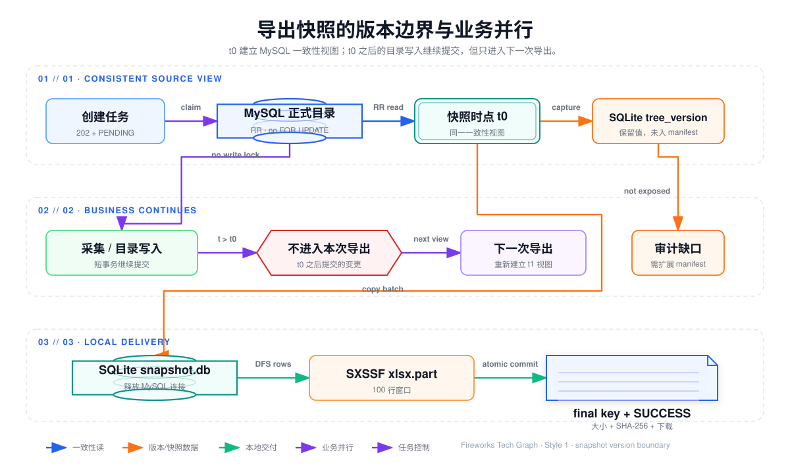
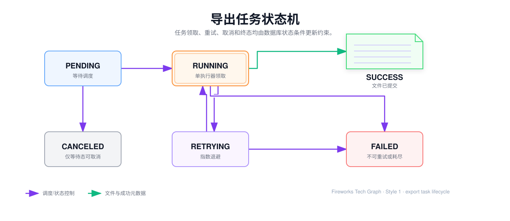
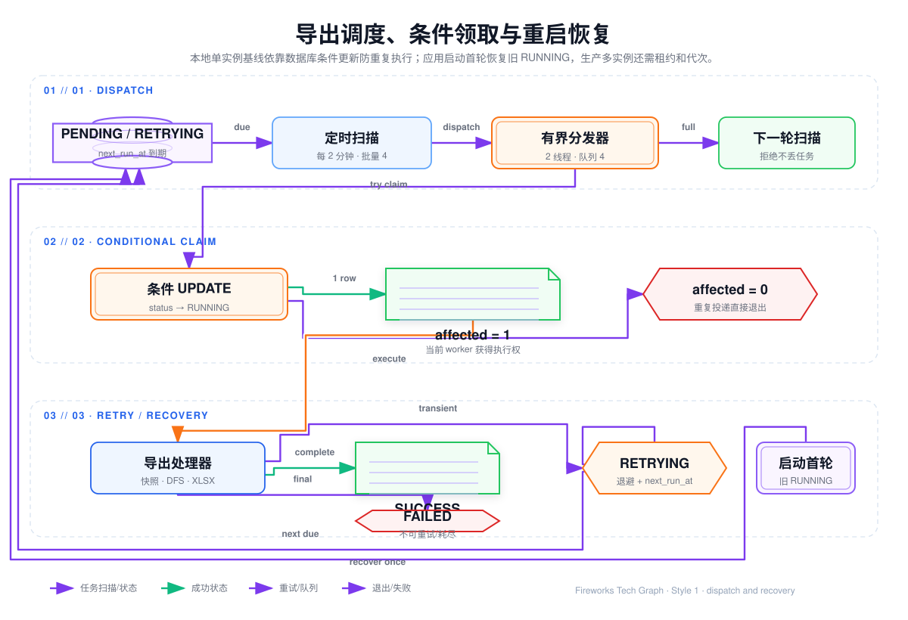
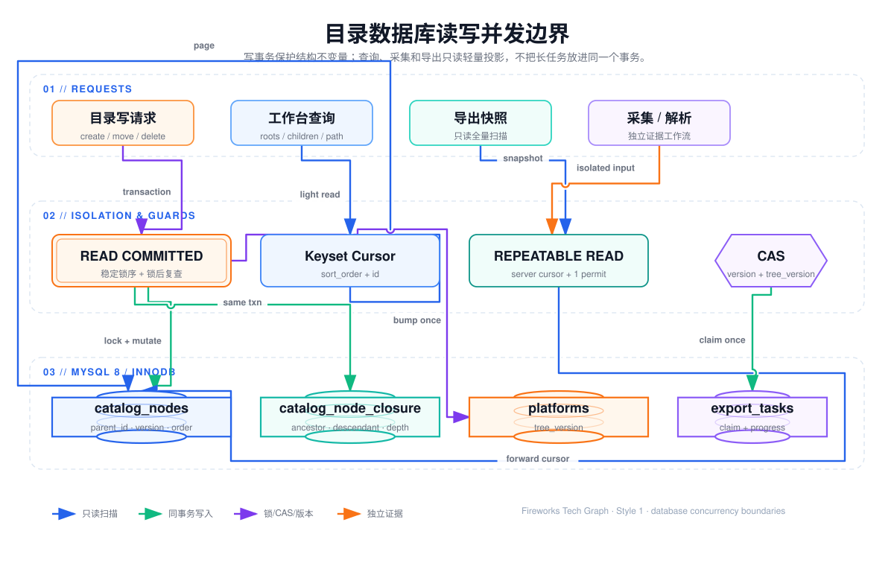
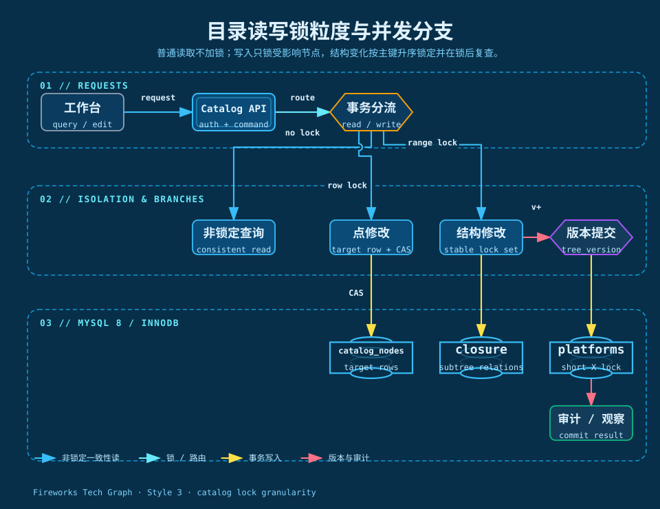
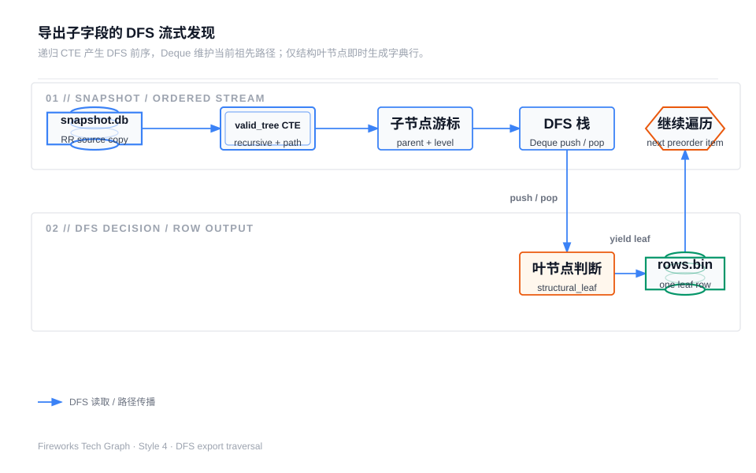
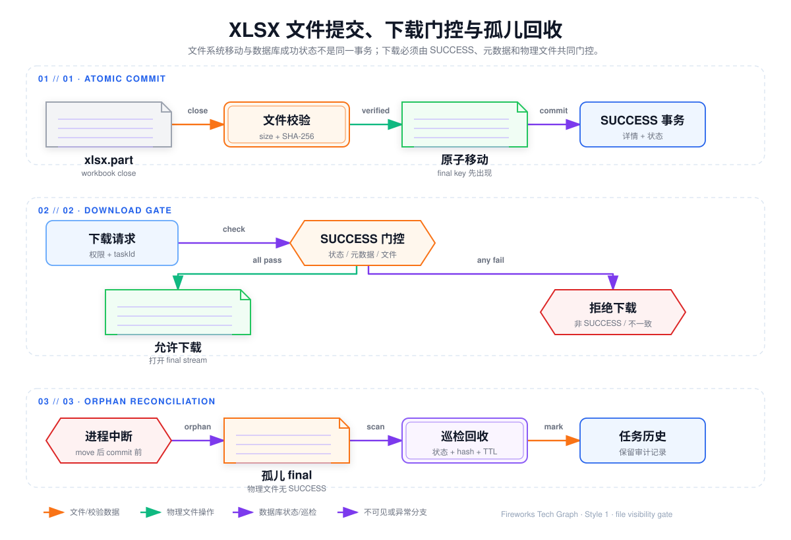

## 数据库并发与 XLSX 字典交付

本章以 `/Users/jiang/Item/baozun/Field-level-data` 当前源码为实现基线，项目文档中的读写隔离、目录锁粒度和生产化演进作为设计背景。文中使用以下标记，避免把规划方案误说成已经上线的代码：

- **源码已实现**：可以从当前 Java、MyBatis XML 或测试文件直接定位。
- **目录治理方案**：30 章定义的正式目录写事务、节点锁、闭包和 CAS 规则。
- **生产化建议**：多实例、对象存储、只读副本和全局配额等需要结合部署环境落地。
- **待验证**：需要压测、故障注入或运行监控支撑，不能从代码结构直接推导。

## 0. 先看全链路




```text
HTTP 创建任务
  -> export_tasks / export_task_details 短事务登记
  -> PENDING/RETRYING 条件领取为 RUNNING
  -> MySQL RR 只读快照 + forward-only cursor
  -> snapshot.db.part 提交并原子发布为 snapshot.db
  -> SQLite recursive CTE + tree_path 生成 DFS 前序流
  -> JVM Deque 维护当前祖先路径
  -> 结构叶节点写 rows/<platformId>.bin
  -> SXSSF 100 行窗口写 field-dictionary.xlsx.part
  -> 关闭工作簿、计算大小和 SHA-256
  -> 原子移动到 final key，事务更新文件详情和 SUCCESS
  -> 下载接口校验权限、状态、元数据和物理文件
```

## 1. 设计目标和已确认边界

### 1.1 结果一致性不是“任务创建时刻一致性”

导出任务的实际源快照建立在后台执行阶段，而不是 HTTP 创建瞬间。当前 MySQL 查询会读取平台的 `id、name、sort_order、tree_version`，并把 `tree_version` 写入任务私有 SQLite 的 `snapshot_platforms`；但是当前 `manifest.json` 和 `export_task_details` 没有独立的 `snapshotTreeVersion` 字段，也没有把它直接返回给下载接口。

因此当前准确口径是：**文件对应各平台在 MySQL 源读取事务建立时看到的正式目录视图，SQLite 中保留了当时读取到的版本值；若需要面向用户审计版本，还应把版本摘要补入 manifest 或任务详情。** 不能写成“任务创建时锁定了一个全局 `tree_version`”。

### 1.2 当前导出范围和平台启用语义

当前只支持 `FULL_EXPORT` 和 `PLATFORM_EXPORT`：全量任务不能带 `platformId`，指定平台任务必须提供正数平台 ID。源读取 SQL 只过滤 `platforms.deleted = 0` 和 `catalog_nodes.deleted = 0`，没有在导出源查询中增加 `platforms.is_active = 1`。

指定平台创建时，当前命令服务调用的是按 ID 查询且只排除逻辑删除的平台，再由返回对象生成任务；并没有强制停用平台不能导出。若业务规则要求“只能导出启用平台”，应把创建校验改为 `findActiveById`，并让全量源查询同步增加 `is_active = 1`。这项区别必须在文档和接口契约中明确，不能沿用“启用且未删除”的不准确描述。

### 1.3 其他不可变事实

- 创建接口只做参数校验、准入、幂等和任务登记，返回 `202 Accepted`；不在请求线程扫描 MySQL 或创建工作簿。
- 导出使用普通一致性读，不使用 `FOR UPDATE`，不主动取得目录节点写锁；这不代表长读没有连接、undo/history、CPU 和 IO 成本。
- MySQL 源事务只覆盖源数据读取和本地 SQLite 批次写入；快照发布后释放 MySQL 连接，SQLite、DFS、行文件和 POI 阶段不继续持有源事务。
- 只有有效路径上的结构叶节点输出一行；父节点存在直接子节点时不能因为名字像字段而提前输出。
- 当前工作簿固定一个 `字段导出` Sheet 和 16 列，实际填充 A-G、J；H、I、K-P 创建为空单元格。
- 当前调度器和本地工作区是单实例基线；多实例需要可靠队列或租约、共享/对象存储工作区和全局资源配额。

## 2. 数据库表和职责

| 表 | 当前职责 | 导出或并发关注点 |
| --- | --- | --- |
| `platforms` | 平台身份、启停状态和 `tree_version` | 导出保存读取到的版本；当前导出源只过滤 `deleted` |
| `catalog_nodes` | 目录邻接表节点 | 导出只读取轻量字段；`platform_id、parent_id、sort_order、id` 决定树边界和顺序 |
| `catalog_node_details` | URL、定位器和字段定义 | 当前导出源不联表，避免把无关详情带入大扫描 |
| `catalog_node_closure` | 祖先、后代和深度关系 | 目录移动/删除使用；当前导出不依赖它，而是在 SQLite 快照上递归 |
| `export_tasks` | 任务类型、状态、进度、重试和时间 | `task_id` 唯一；调度按状态、`next_run_at、id` 扫描 |
| `export_task_details` | 文件 key、大小、hash、上传时间、删除状态和错误 | 任务详情和物理文件共同决定是否可下载 |

当前任务表和详情表由同一个 Repository 的短事务一起创建、更新。任务内部自增 `id` 仅用于数据库排序和游标分页；对外使用 32 位无横线 `task_id`。任务与平台、节点之间主要由服务层校验和巡检保证，不能因为没有物理外键就允许控制器绕过领域规则写库。

## 3. 创建任务、幂等和准入

### 3.1 请求线程只登记意图

创建顺序如下：

1. 校验任务类型、用户和平台参数；`FULL_EXPORT` 不允许平台 ID，`PLATFORM_EXPORT` 必须是有效正数。
2. 规范化可选 `Idempotency-Key`，长度为 1–128 个非空字符。
3. 预分配 `<taskId>/field-dictionary.xlsx` 作为稳定存储 key，中文文件名仅用于下载展示，并做文件名非法字符清洗。
4. 一个短数据库事务内插入 `export_tasks` 和 `export_task_details`。
5. 返回任务 ID、`PENDING` 状态和进度初值，随后尝试投递；当前创建响应没有单独返回查询地址，客户端使用任务 ID 调用查询、进度、详情和下载接口。投递失败时任务仍保留在数据库等待调度扫描。

### 3.2 幂等键和执行领取不是一回事

当前把“创建人 + `\0` 分隔符 + 幂等键”做 SHA-256，取前 16 字节生成确定性任务号：相同用户、相同 key 和相同命令返回原任务；相同 key 但任务类型或平台不一致返回幂等冲突；没有 key 时生成随机任务号，数据库唯一键冲突后有限重试。

幂等键解决重复请求，状态条件更新解决重复执行。即使多个调度器都投递同一个任务，只有这一条更新成功的执行者才能继续：

```sql
UPDATE export_tasks
SET status = 'RUNNING',
    started_at = COALESCE(started_at, ?),
    finished_at = NULL
WHERE task_id = ?
  AND status IN ('PENDING', 'RETRYING')
  AND next_run_at <= ?;
```

### 3.3 当前准入的多实例缺口

当前通过数据库 `COUNT(*)` 统计 `PENDING/RUNNING/RETRYING` 任务，并在单实例内用 monitor 串行化“检查后创建”的代码路径；配置基线是全局 6、单用户 6。这个实现能减少单实例内的竞争，但 **count 和 insert 不是一个数据库原子配额操作**，多实例仍可能同时通过检查并超出全局上限。

生产环境应改为配额行 `SELECT ... FOR UPDATE`、集中式限流、带租约的容量令牌或先入队再由消费者控制并发，不能把 JVM monitor 说成全局限流。

## 4. 状态机、调度和重试



### 4.1 状态和条件更新

任务状态为 `PENDING -> RUNNING -> SUCCESS/FAILED`，瞬时错误从 `RUNNING -> RETRYING -> RUNNING`，等待状态可以被创建人取消为 `CANCELED`。成功、失败、取消和进度写入都带状态条件，旧执行者在任务状态已经变化后不能继续覆盖新状态。

进度使用“阶段工作量”而不是单纯的 Excel 行数。当前处理器的 `totalWork` 为 `sourceNodes * 2 + mappedRows`：一份源节点扫描量、一份本地检查量和一份最终映射行写入量。快照、清洗和工作簿阶段分别上报相应计数；应用服务按 2 秒或 5000 步节流落库，进度写失败只告警，不影响最终状态。面试时不要把这个进度值直接解释成“百分比等于已写 Excel 行数”。

### 4.2 调度器当前真实行为



当前是 Spring 定时调度 + 应用内有界线程池：调度周期 2 分钟，扫描到期的 `PENDING/RETRYING` 任务，单批最多 4 个；导出执行线程池 2 个线程、队列 4 个；调度扫描自身使用独立的单线程执行器和队列 1。队列满时不删除任务，任务继续留在数据库等待下一轮。

应用就绪事件会异步提交第一轮扫描。调度器在构造时记录本次进程的启动基准时间，第一轮扫描只把 `updated_at` 早于该基准且仍为 `RUNNING` 的任务恢复为 `RETRYING`，而不是每次扫描都按一个独立的“恢复阈值”反复处理。生产多实例需要把这段启动恢复升级成基于租约、心跳和代次 token 的接管协议，避免旧实例恢复后又回来提交结果。

### 4.3 重试和清理边界

当前配置的最大重试次数为 3，初始退避 5 秒，上限 60 秒；代码默认值在未覆盖配置时是 2 秒和 30 秒，因此以实际配置文件为准。连接短暂失败、存储 IO、临时资源不足等可能恢复的系统异常进入退避重试；平台不存在、任务处理器缺失、工作簿行数超限、结果行数核对失败等当前被标记为不可重试的错误直接 `FAILED`。空平台名和不完整目录路径当前按隔离/跳过处理，只有在额外质量门禁被实现后才能把任意结构异常统一升级为任务失败。

重试任务保留工作区，优先复用已原子发布的 `snapshot.db`；如果 manifest 已推进到 `ROWS_READY`，处理器会复用对应的 `rows/*.bin`，否则会从 `SNAPSHOT_READY` 重新生成行文件。当前行文件没有独立的 `.part` 原子发布和 checksum，完整性主要由阶段 manifest、读取是否成功和最终行数核对共同判断。成功或最终失败会由执行服务尝试清理工作区；待执行取消通常尚未建立工作区，但已经建立的取消任务工作区不会由取消接口立即清理，遗留目录由每小时一次的工作区清理器按 24 小时 TTL 回收。成品保留期清理每天按 `Asia/Shanghai` 运行，启动时还会按配置补跑一次，当前基线为 7 天，并把 `file_deleted/file_deleted_at` 写入详情，保留任务历史。

## 5. MySQL 一致性快照和读写隔离





### 5.1 当前源读取实现

源读取方法使用 Spring：

```text
readOnly = true
isolation = REPEATABLE_READ
timeout = export.task.source.snapshot-timeout-seconds
```

当前配置超时为 600 秒。它先读取平台列表，再按 `sort_order、id` 顺序逐个平台打开 MyBatis Cursor；节点只取 `id、platform_id、parent_id、name、node_level、sort_order`，按 `node_level、parent_id、sort_order、id` 排序。Mapper 使用 `fetchSize=1000` 和 `FORWARD_ONLY`，Java 再按 1000 个节点组成批次，由同步回调写进 SQLite。

这里的回调必须在 Cursor 和事务仍有效时消费完当前批次；它不是把批次放到一个无限异步队列后立即返回。这样 Reader 只负责一致性读取，处理器负责把批次写到本地快照，同时避免 JDBC 驱动和 JVM 形成全量缓存。

### 5.2 为什么不使用 `FOR UPDATE`

导出要的是稳定输入视图，不是抢占目录写权限。普通一致性读依赖 InnoDB MVCC，不取得目录节点的写锁；快照建立前已提交的数据可被本次看到，快照建立后才提交的数据进入下一次导出，未提交数据不进入本次导出。

`FOR UPDATE` 会把大范围读取变成锁定读，人工修改、采集同步、移动和删除可能等待导出完成；文件阶段越慢，锁持有时间越长。因此当前不用 `FOR UPDATE`。但应准确说“导出不持目录节点写锁”，不能说“数据库完全没有锁”：长 RR 事务仍占一个连接，并可能延迟 undo purge，索引和元数据也有服务器成本。

### 5.3 资源隔离和真实代价

当前配置用三个边界控制影响：

| 资源 | 当前基线 | 作用 | 注意事项 |
| --- | ---: | --- | --- |
| MySQL 源读取信号量 | 1 | 同时只有一个导出任务持有 RR 游标 | `acquire()` 本身没有超时，等待信号量可能阻塞，需由线程中断、任务超时或生产租约治理 |
| 本地处理信号量 | 1 | SQLite 清洗和 SXSSF 写入不同时争抢本地资源 | 当前清洗和工作簿阶段共用一个闸门 |
| Hikari 连接池 | 最大 12、最小空闲 4 | 给普通接口保留连接容量 | 这是配置意图，不是对每种故障的绝对保证 |

源读取完成并发布 SQLite 快照后，事务返回，MySQL 连接释放；递归 CTE、路径栈、行文件和 POI 不再占用这个连接。采集和目录写入仍可能和导出竞争 CPU、磁盘、undo 以及连接池，因此“不中断采集”必须用并发压测和监控证明。

### 5.4 目录写事务的锁粒度

30 章的正式目录治理方案采用短事务和事实行粒度，而不是“一把平台大锁”：

| 操作 | 锁定对象 | 保护内容 | 结果 |
| --- | --- | --- | --- |
| 普通查询/工作台查询 | 非锁定读 | 展示视图和游标分页 | 不阻塞写；通过 `tree_version` 识别需要刷新 |
| 点修改 | 目标节点行 `FOR UPDATE` | 锁后重新读取、版本校验和名称冲突检查 | `expectedVersion` 不匹配返回 409 |
| 同级新增/改名 | 应用预检 + 同级唯一索引 | 规范化名称唯一性 | 并发竞争由数据库决定一个成功 |
| 移动/删除/恢复 | 影响子树按节点 ID 升序锁定，加新父级等协同节点 | 防环、父级状态、层级和闭包更新 | 锁后复查，不一致则回滚/有限重试 |
| 平台版本发布 | 事务末尾更新一个 `platforms` 行 | 发布目录结构版本 | 提交后才向外部发布成功结果 |

两个编辑请求都从版本 7 打开时，先拿到节点锁的一方更新到版本 8 并提交；另一方拿锁后重新读取版本 8，`expectedVersion=7` 失败，不能用旧内容覆盖。相交子树移动或删除不能只依赖第一次闭包查询，因为候选集合可能已过期；应去重、按固定顺序锁、锁后复查，死锁从事务入口重新执行有限重试。导出不加入这些写事务，也不参与闭包表修改。

## 6. SQLite 工作区和阶段检查点


任务目录当前为：

```text
data/result/.tmp/<taskId>/
├── snapshot.db.part       # SQLite 写入未完成，不供后续阶段读取
├── snapshot.db            # 快照提交并原子发布
├── manifest.json          # 阶段检查点
├── manifest.json.part
├── rows/<platformId>.bin  # 每个平台的标准字段行
└── output/field-dictionary.xlsx.part
```

SQLite writer 建表 `snapshot_platforms` 和 `snapshot_nodes`，建立 `(platform_id,parent_id,sort_order,id)` 索引，并设置 `journal_mode=DELETE、synchronous=NORMAL、temp_store=FILE、cache_size=-32768`。源数据虽然按 1000 个节点分批插入，但当前 writer 使用一个关闭前才提交的 SQLite 事务；所有源批次写入完成后提交事务、关闭连接，再把 `snapshot.db.part` 原子移动为 `snapshot.db`。这能保证快照文件只在完整提交后被读取，但 SQLite 事务日志和磁盘水位仍必须纳入大数据量压测。manifest 使用自己的 `.part` 文件写完后原子替换。

manifest 当前字段是任务标识、导出范围、阶段、源节点总数、映射行总数和完成文件详情。它没有保存每个平台完整的 `validNodes/skippedNodes/leafRows` 明细，也没有保存独立的快照版本摘要。处理器会在运行时统计平台有效节点、跳过节点和叶行，用于期望行数、映射行数、最终写入行数的核对，并在日志中记录异常；若需要审计、断点到平台或用户查看质量明细，应扩展 manifest 或单独的质量结果表。

## 7. 子字段发现：递归 CTE + DFS 前序 + Deque





### 7.1 不是 N+1，也不是 Java 全树递归

当前实现把“找子字段”拆成两个职责：SQLite 用递归 CTE 从任务快照展开可达的有效节点并生成稳定前序流；JVM 用 `Deque` 在消费流时恢复当前祖先路径。它不是对每个节点再次查询子节点的 N+1，也不是把整棵树构造成 `List<TreeNode>` 后递归。

### 7.2 `valid_tree` 的五步逻辑

1. **种子根**：同一平台、`parent_id IS NULL`、`node_level = 1`、`TRIM(name) <> ''`。孤儿不会被提升为根。
2. **递归子节点**：`child.parent_id = parent.id`，平台相同，`child.node_level = parent.node_level + 1`，名称 trim 后非空。
3. **路径编码**：每个节点把 `(sort_order,id)` 编成固定宽度片段，当前 SQL 为 `printf('%011d:%020d', sort_order + 2147483648, id)`，并追加到父级 `tree_path`。
4. **DFS 排序**：`ORDER BY tree_path ASC`。父路径是后代路径的前缀，因此父先于后代；同级按 `sort_order`，再按 `id` 稳定裁决。
5. **流式消费**：SQLite ResultSet 一次交给映射器一个遍历节点，处理后立即进入下一节点，不在 JVM 聚合整棵树。

这里的 CTE 是本地快照内的“可达有效路径展开”：每个可达节点带一条 `tree_path`，但不会把所有祖先—后代对物化成新的闭包表，也不是 MySQL `catalog_node_closure` 的替代写入，更不是通用环检测器。正式目录写入和巡检仍要负责自环、移动成环、父级缺失、层级断裂、超深和闭包完整性。当前导出处理器会跳过不满足 CTE 条件的异常分支，并可能继续交付正常兄弟分支；如果业务要求“发现任意结构异常即禁止交付”，还需要增加显式质量门禁和对应的不可重试失败状态。

### 7.3 `Deque` 的压栈和回退

节点按 DFS 前序流到达时，算法是：

```text
先弹出栈尾所有 level >= currentLevel 的祖先
如果当前节点有原始直接子节点：压入当前节点，不产出行
如果当前节点是结构叶：复制祖先路径 + 当前字段名，产出一行；叶不入栈
```

`>=` 不能改成 `>`：从二级 A 切到同级二级 B 时，必须先弹出 A，否则 B 的路径会错误继承 A。叶节点不入栈，是为了防止下一个字段把上一个字段名当菜单祖先。

例如：

```text
一级
├─ 二级A
│  └─ 字段a
└─ 二级B
   └─ 子组
      └─ 字段b
```

流顺序为“一级、二级A、字段a、二级B、子组、字段b”。处理字段 a 时栈是“一级、二级A”；处理二级 B 时先弹出同级二级 A，再压入 B；处理字段 b 时栈是“一级、二级B、子组”。

### 7.4 叶节点和异常分支

`structural_leaf` 不是看名称，而是看原始快照中是否存在当前节点的任意直接子节点：

- 有效节点没有任何原始子节点，才可能作为结构叶输出；
- 原始节点有子节点，但子节点名称为空、层级错误或不在有效 CTE 路径中，父节点仍不降级为叶；
- 异常子节点不会拼进合法路径，也不会继续递归到它的后代；
- 一个坏分支可以被跳过，正常兄弟继续导出；快照打不开、行数核对失败、工作簿超限则升级为任务级失败。当前导出处理器没有新增 `maxDepth=64` 的源数据拦截器，不能把目录治理约束误说成导出阶段已经实现的质量门禁。

平台名称先按第一个 `-` 切成一级菜单和二级菜单；一级菜单为空的平台被隔离。运行时会计算平台级有效节点、跳过节点和叶行，但当前 manifest 不保存完整的平台质量明细。有效祖先前四级填入 C-F，路径列保留二级菜单和全部祖先，因此超过四级的祖先不会丢失，只是不再进入固定菜单列。叶节点名称进入 J 列；根节点本身就是叶子时，路径可以为空。

### 7.5 复杂度和真实上限

栈本身是 O(depth)，每个叶节点复制当前祖先路径为 O(depth)，整体可表达为 O(N + L × depth)，其中 N 是有效流节点数、L 是叶节点数。SQLite 快照、平台行文件和 SXSSF 临时 XML 把总量放到磁盘，所以 JVM 不按总节点数保存完整树或全部输出行；但总耗时、临时文件和磁盘容量仍随数据增长。

最大深度 64 是 30 章目录写入治理的不变量，但当前实现没有在导出处理器中把它做成新的源数据拦截器。生产上应在写入准入和导出前巡检都检查最大深度、单平台节点、单行路径长度和磁盘剩余，不能把 O(depth) 误解成“任意深度都安全”。

每个平台独立生成 `rows/<platformId>.bin`。当前实现用 `leafRows` 与 `mappedRows` 核对清洗产出，再把 manifest 推进到 `ROWS_READY`；行文件没有独立的 `.part` 原子发布和 checksum，读取失败或最终 `writtenRows` 不一致会使任务失败。重试优先复用已经提交的快照和 `ROWS_READY` 阶段文件，但不能把阶段标记误说成每个行文件都已独立校验。本地清洗和 POI 写入共用本地处理信号量，当前最多 1 个本地重处理阶段，避免 SQLite 文件和临时 XLSX 同时产生不可控磁盘压力。

## 8. XLSX 流式生成

### 8.1 当前工作簿写入


当前工作簿使用：

```java
new SXSSFWorkbook(null, 100, true, true)
```

含义是内存窗口保留 100 行、启用临时文件压缩和共享字符串。写入器创建一个名为 `字段导出` 的 Sheet，写入固定 A-P 表头和列宽，按平台顺序读取 `rows/<platformId>.bin`，逐行写入。A-G、J 使用字符串或空单元格，H、I、K-P 创建真正的 `CellType.BLANK`；当前没有数仓表名、字段英文名、字段类型、字段角色和治理属性的运行时映射，不应写成已经完成 AI 字段匹配。

SXSSF 只控制工作簿行对象的内存窗口，不会让数据库读取、SQLite 临时排序、字符串复制、ZIP 压缩和磁盘空间变成零成本。窗口 100 是当前单机基线，应通过目标数据的堆峰值、临时文件、IO 和总耗时重新校准。

### 8.2 行数、内容和安全边界

Excel 2007 单 Sheet 最大行索引是 1,048,575；由于表头占第 0 行，当前写入器允许最多 1,048,575 条数据行，超过后抛出不可重试容量错误。真实公司最好在清洗统计后提前判断：超过上限时按平台分 Sheet、拆多个 XLSX，或改用 CSV/Parquet；如果产品只允许一个 Sheet，就在准入阶段拒绝并返回拆分建议。

目录名称和字段名称按字符串写入，不调用公式 API，`=1+1、+1、-1、@cmd` 等文本不会被写成公式。工作簿不计算公式，不创建外链；如果未来增加数值或日期列，要先定义允许类型和注入防护，再扩展行模型。

## 9. 文件原子提交、下载和清理



### 9.1 当前提交顺序

1. 在任务工作区写 `output/field-dictionary.xlsx.part`，该路径不对外下载。
2. `workbook.close()`，让 POI 完成工作簿写出并回收 SXSSF 临时文件。
3. 读取普通文件大小，计算 SHA-256；当前代码读取并记录大小，但没有单独的 `size > 0` 断言，不能把“大小大于零检查”写成已实现的显式规则。
4. 本地存储优先以 `ATOMIC_MOVE + REPLACE_EXISTING` 把 `.part` 移到 `<bucket>/<taskId>/field-dictionary.xlsx`；不支持原子移动时降级为受控替换移动。final key 可能在数据库成功状态提交前物理出现，下载接口必须继续由状态和元数据门控。
5. 任务详情事务写入 storage key、文件名、大小、etag/hash、上传时间并清空错误，同时把任务从 `RUNNING` 更新为 `SUCCESS`；状态和详情更新在同一个数据库事务内，详情更新失败会让这笔事务回滚。

### 9.2 下载不可见窗口

下载服务先校验当前用户拥有任务、任务状态为 `SUCCESS`，再读取详情并检查上传时间、文件大小元数据、文件删除标记、最终文件是普通文件、实际大小等于元数据。当前下载路径不再次计算 SHA-256。只有这些条件全部满足才打开输入流。因此 final key 物理上可能先于数据库成功状态出现，但在成功状态和完整详情提交前不会成为可下载文件。

如果进程恰好在 final move 后、数据库提交前退出，会留下“有物理文件但没有成功元数据”的孤儿 final 文件；当前下载保护不会把它返回给用户，但需要生产巡检按 taskId、hash、状态和时间窗口回收。对象存储版本要使用 multipart complete、checksum、临时 key、幂等提交和孤儿对象清理，不能把“上传成功”直接等价于“任务成功”。

### 9.3 成品和工作区清理

成品保留期清理只删除实际文件，再以带 cutoff 条件的事务更新 `file_deleted/file_deleted_at`；任务状态、失败原因、hash 和审计记录保留。工作区清理按任务目录最后修改时间和 TTL 回收，不应把运行中的目录误删。多实例或共享存储下还要加入任务 lease、目录 lock 或正在运行标记，避免清理器与执行器同时操作同一工作区。

## 10. 故障恢复矩阵

| 故障点 | 当前可复用边界 | 状态/处理 |
| --- | --- | --- |
| MySQL 读取中断 | 没有完整 manifest；未完成 `snapshot.db.part` 不复用 | writer abort，下一次从源快照重新读取 |
| SQLite 已提交 | `snapshot.db + SNAPSHOT_READY` | 跳过 MySQL，重新统计并映射 |
| DFS/行文件失败 | 快照可复用；`ROWS_READY` 不推进 | 修复/重试本地阶段，覆盖行文件 |
| 行文件已完成、工作簿失败 | `ROWS_READY` | 跳过清洗，重写 `.xlsx.part` |
| `.xlsx.part` 写入中断 | `.part` 不可作为 final | 覆盖重写，不能下载 |
| final move 后 DB 提交失败 | 可能有孤儿 final 文件 | 下载仍被状态拦截；生产巡检回收或补写元数据 |
| 任务执行进程宕机 | 启动首轮将旧 `RUNNING` 恢复为 `RETRYING` | 多实例要用 lease/代次 token 防旧 worker 回写 |
| 最终失败或成功 | 任务工作区由执行服务尝试删除 | 清理失败由 TTL 清理器兜底 |

重试应从新的事务入口开始，不能在已经回滚的事务中继续使用旧 Cursor 或数据库对象。阶段文件的“存在”不等于“完整”，必须依赖原子发布的 manifest、文件边界、行数、大小和 hash 共同判断。

## 11. 当前文章的修正结论

下列说法已经在本章修正：

| 原有容易误解的说法 | 当前准确表述 |
| --- | --- |
| “导出结果对应任务创建时明确锁定的 `platform.tree_version`” | 快照读取事务建立时形成一致性视图；版本值被写入 SQLite 平台快照，但当前 manifest/详情未单独审计暴露 |
| “指定平台必须启用且未删除、全量也只导出启用平台” | 当前创建和源读取路径只保证未逻辑删除；`is_active` 未被导出 SQL 过滤，若要求启用需补代码 |
| “单实例用内存计数保证全局任务上限” | 当前用数据库 count + 单实例 monitor；count/insert 在多实例下有竞态，生产需集中式配额 |
| “每轮扫描按恢复阈值恢复 RUNNING” | 当前应用启动后第一轮扫描按本次启动基准恢复旧 RUNNING，一次性执行；多实例生产需 lease/心跳 |
| “获取源读取信号量会快速超时” | 当前 `Semaphore.acquire()` 没有 timeout，可能等待；需另加超时、取消或租约治理 |
| “manifest 保存所有平台 valid/skipped/leaf 明细” | 当前运行时统计并日志记录，manifest 主要保存阶段、源节点数、映射行数和完成详情 |
| “提交前显式校验文件大小大于零” | 当前读取文件大小并记录，未单独断言 `> 0`；应作为生产校验补强 |
| “当前已完成 AI 字段匹配映射” | 当前只填 A-G、J，其余列为空；AI 字段匹配不属于本导出实现范围 |
| “原子移动后 final key 完全不存在可见窗口” | final key 可能物理先出现，但下载由 `SUCCESS + 完整详情` 门控；仍需孤儿文件巡检 |

## 12. 生产化建议和验收指标

### 12.1 生产化顺序

1. 明确导出版本契约：把各平台快照版本摘要写入 manifest/任务详情，决定是否需要“生成期间发生变化”提示。
2. 若业务要求启用平台，统一修改创建校验和源查询过滤，增加停用平台回归测试。
3. 把 count/insert 准入升级为集中式配额或数据库租约，给任务增加 lease/代次，防止旧 worker 回写。
4. 多实例使用可靠消息队列或集中式调度；工作区放到执行节点可恢复的本地卷或对象存储，最终文件使用 multipart/checksum。
5. 增加平台级 manifest、行文件 checksum、孤儿 final 扫描、磁盘水位和取消/超时的 cursor 关闭。
6. 超大结果在任务创建或统计阶段拆分 Sheet/文件，避免写到 Excel 上限才失败。

### 12.2 必测指标

| 指标 | 证据要求 | 当前状态 |
| --- | --- | --- |
| “50 万字段 35 秒” | 明确字段是叶行还是源节点，固定数据分布、机器、JDK、缓存、并发和计时边界，给出分阶段耗时和重复统计 | Xerina 提供的实测口径；原始压测证据待归档 |
| 百万级内存平稳 | JFR/GC、堆峰值、线程、SXSSF 临时文件、SQLite 文件、磁盘水位 | 代码提供 O(depth)+固定窗口的设计基础；实测待验证 |
| 数据库影响 | 源事务时长、连接占用、undo/history、锁等待、采集写入 P95 | 待测 |
| 结果正确性 | `sourceNodes、validPathNodes、leafRows、mappedRows、writtenRows` 核对；异常分支抽样；XLSX 可打开 | 小规模测试覆盖；大规模和故障注入待测 |
| 恢复正确性 | 在快照、manifest、行文件、SXSSF、hash、final move、DB commit 各点 kill -9 | 阶段代码和小规模测试已有；完整故障矩阵待测 |
| 并发正确性 | 同节点 CAS、同名唯一键、相交移动、导出与目录写入同时运行 | 30 章方案定义；测试库压测待测 |

当前开发环境没有可用 `mvn` 命令，不能把本轮说成完整 Maven 测试已通过。已有候选测试包括源读取批次、处理器端到端、任务重试/进度、调度去重、XLSX 结构和公式注入；CI 应在具备 Maven 的环境执行并归档测试、压测和故障注入结果。

> 可信交付的关键不是把 XLSX 尽快写出来，而是让“快照版本、任务状态、本地阶段文件、工作簿内容、文件 hash 和下载条件”形成一条可核对的链。只有这条链被测量和审计，才能把“导出与采集并行”讲成工程事实，而不是一句性能口号。

## 13. 本章配图源文件

本章配图均使用 `fireworks-tech-graph` 的 SVG 生成和校验流程，源 JSON 保存在 `assets/fireworks/`：

- [导出总链路 JSON](./assets/fireworks/export-xlsx-pipeline.json)
- [快照版本边界 JSON](./assets/fireworks/export-consistency-boundary.json)
- [任务状态机 JSON](./assets/fireworks/export-task-state-machine.json)
- [数据库并发边界 JSON](./assets/fireworks/catalog-db-concurrency.json)
- [锁粒度 JSON](./assets/fireworks/catalog-lock-granularity.json)
- [DFS 清洗判断 JSON](./assets/fireworks/catalog-dfs-cleaning-flow.json)
- [DFS 流式发现 JSON](./assets/fireworks/catalog-dfs-export.json)
- [文件提交、下载门控与孤儿回收 JSON](./assets/fireworks/export-download-gate.json)
- [任务调度与重启恢复 JSON](./assets/fireworks/export-dispatch-recovery.json)
