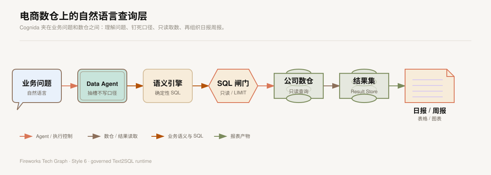

## 我参与的 Text2SQL 报表查询架构

> 本文中的数据源、表名、字段名、日期和结果均为脱敏或泛化示例，不包含公司源码、连接信息、内部配置和未公开的业务口径。

### 1. 我解决的实际问题

在我参与的 Cognida 项目中，我重点关注的是自然语言转 SQL 这条数据查询链路。业务人员通常会提出这样的需求：

> 查看某一天各渠道的销售额、支付订单量和退款金额，并与上周同日进行比较，形成日报。

业务人员关注的是业务结果，数仓关注的是表、字段、时间条件、聚合方式和指标口径。两者之间存在明显的信息差：

- 业务人员不一定知道指标对应哪张表；
- 同一个业务词可能对应多个物理字段；
- 统计时间可能是下单时间、支付时间或退款发生时间；
- 明细表和汇总表的计算方式不同；
- SQL 即使能够执行，也可能因为过滤条件或 JOIN 方式错误而得到错误结果。

我参与的这条能力链路，就是把业务语言转换成可验证的查询条件，再生成一条受控的只读 SQL，查询数据后输出日报或周报所需要的表格、图表和摘要。

### 2. 我对数仓的理解

在这个项目场景中，数仓是公司统一沉淀业务数据的数据库层。订单、商品、渠道、会员等数据经过采集、清洗、关联和汇总后，形成可以被 SQL 查询的明细数据或主题汇总数据。

日报和周报属于数仓上层的数据应用：

1. 明确统计周期和对比周期；
2. 选择统计维度；
3. 按业务口径计算指标；
4. 通过 SQL 从数仓读取结果；
5. 生成表格、图表和文字说明。

所以，Cognida 在这条链路中不是替代数仓，而是作为“自然语言查询入口和受控 SQL 执行层”。它帮助用户从“我想看什么”进入“系统如何正确查询”，查询本身仍然遵循数仓的表结构和指标规范。

### 3. 系统在日报周报中的位置

Cognida 的核心链路可以概括为：

业务问题 → 意图解析 → Schema 探查 → 语义匹配 → SQL 生成 → SQL 安全检查 → 只读查询 → 结果集 → 日报 / 周报。

<InteractiveDiagram
  title="Text2SQL 报表查询架构"
  src="../../media/projects/baozun-lexicon/diagrams/text2sql-runtime-architecture/index.html?embed=1"
  poster="../../media/projects/baozun-lexicon/diagrams/text2sql-runtime-architecture/preview.png"
  description="业务问题经过意图解析、语义匹配和 SQL 安全检查后，以只读方式查询数据源，再形成日报或周报结果。"
/>

我在这条链路中关注的功能包括：

- 让系统理解时间、维度、指标和对比关系；
- 让 SQL 生成建立在真实 Schema 之上；
- 让业务词和物理字段之间有可解释的映射；
- 让模型只能发起查询，不能直接修改数据；
- 让查询结果可以被复用到报表和后续分析中。

### 4. 一次日报查询的完整过程

下面使用一个泛化后的案例：

> 查询 2026 年 8 月 30 日各渠道销售额、支付订单量和退款金额，并与上周同日比较，按销售额从高到低输出日报。

我会先把这句话拆成一组查询要素：

| 查询要素 | 识别内容 |
| --- | --- |
| 当前周期 | 2026-08-30 |
| 对比周期 | 2026-08-23 |
| 统计维度 | 渠道 |
| 业务指标 | 销售额、支付订单量、退款金额 |
| 衍生计算 | 差值、环比变化率 |
| 排序方式 | 按当前销售额倒序 |

之后，系统通过元数据查询确认真实可用的表和字段。为了避免暴露实际业务结构，本文使用泛化后的示例表 daily_sales_summary：

| 业务含义 | 示例字段 | 用途 |
| --- | --- | --- |
| 统计日期 | stat_date | 过滤日报日期 |
| 渠道 | channel | 分组维度 |
| 支付金额 | paid_amount | 销售额的基础度量 |
| 支付订单数 | paid_orders | 订单量 |
| 退款金额 | refund_amount | 退款指标 |

如果系统的语义层已经登记了“销售额”的业务定义，就应该使用已确认的支付金额口径。如果没有足够的语义信息，系统应当要求补充或把结果标记为待确认，而不是根据字段名称随意猜测。

### 5. Cognida 在这条链路中做了什么

**第一步是意图解析。** Data Agent 将自然语言拆成时间范围、统计维度、指标、筛选条件、排序方式和对比关系。对于“上周”“本月”“最近完整一天”等相对时间，还要结合统一的业务时区和报告规则进行换算。

**第二步是 Schema 探查。** 系统查询数据源的表、列和类型信息，确认候选 SQL 使用的对象确实存在。列画像还可以辅助判断字段的空值率、基数和常见值，减少把不适合分组的字段用于日报的情况。

**第三步是语义匹配。** 语义层保存业务表、维度、度量、指标和关联关系。它解决的是“数据库里有这个字段”和“这个字段在业务上应该怎样计算”之间的差异。例如，销售额不能仅因为字段名中含有 amount 就自动确定，还需要确认它代表支付金额、下单金额还是其他金额。

**第四步是 SQL 生成。** 当业务问题能够匹配已登记的语义对象时，系统可以按照确定的表、字段和聚合方式生成 SQL；当语义覆盖不足时，只能结合 Schema 生成候选 SQL，并降低自动发布权限。

**第五步是受控执行。** 生成的 SQL 必须经过只读策略、安全检查、结果数量控制和超时控制，再由后端查询工具访问数据源。模型负责提出查询意图和 SQL 候选，不直接持有数据库连接。

**第六步是结果处理。** 查询结果保存为可追溯的结果集，报表可以从结果集中生成渠道明细、排名、趋势图和文字摘要。报告中的数字来自查询结果，模型只能解释已经返回的数据，不能自行补写数字。

### 6. Lexicon 字段词典如何承接这条链路

Lexicon 负责从业务页面中沉淀菜单、路径和字段中文名称，帮助形成统一的业务词汇。Cognida 负责把这些业务词汇与数据源 Schema 和语义模型连接起来。

两者之间的关系是：

> Lexicon 提供业务语言，Cognida 完成可查询对象识别、指标理解、SQL 生成和结果查询。

例如，Lexicon 中的“销售分析 / 渠道销售额”可以作为业务名称和语义提示，但不能直接当成物理表名或物理列名。正式 SQL 使用的表名、英文列名、字段类型和指标公式，必须以实际数据源元数据和已确认的业务口径为准。

因此，我会把这两个项目的关系描述为“业务字段词典承接到智能查询”，而不会描述为“字段词典已经自动完成公司数仓映射”或“系统已经自动写入公司数仓”。

### 7. 这个功能能带来什么价值

对业务人员来说，价值是降低 SQL 使用门槛：业务人员可以先描述要看的数据，再由系统辅助生成查询。

对数据和技术人员来说，价值主要体现在：

- 减少重复编写相似的日报、周报 SQL；
- 把表、字段和指标口径集中到 Schema 与语义层管理；
- 让自然语言查询具备安全检查和审计边界；
- 将临时分析问题和固定报表查询放进同一条链路；
- 通过结果集和查询记录复盘报表数据来源。

对于固定日报和周报，我不会让模型每天随机重写一套查询逻辑。更稳妥的方式是先由自然语言生成 SQL 草稿，经过确认后保存成带日期参数的查询模板，后续只替换统计周期并执行。自然语言转 SQL 更适合负责查询草稿、临时分析和结果解释，正式报表仍然以审核后的 SQL 为准。

### 8. 我的项目总结

我参与的 Cognida 项目把自然语言转 SQL 做成了一条受控的数据查询链路：先理解业务问题，再确认数据源 Schema 和指标口径，生成 SQL 后进行只读和资源边界检查，查询结果进入报表数据处理环节。它的价值不是让模型绕过数仓直接操作数据，而是让业务语言能够在可解释、可验证、不可写入的边界内转化为 SQL 查询，并为日报和周报提供稳定的数据结果。
