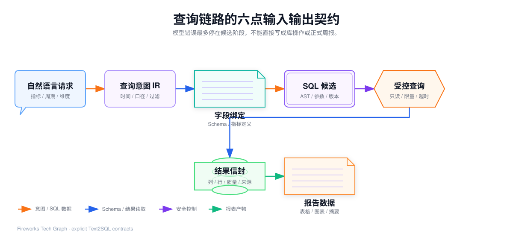
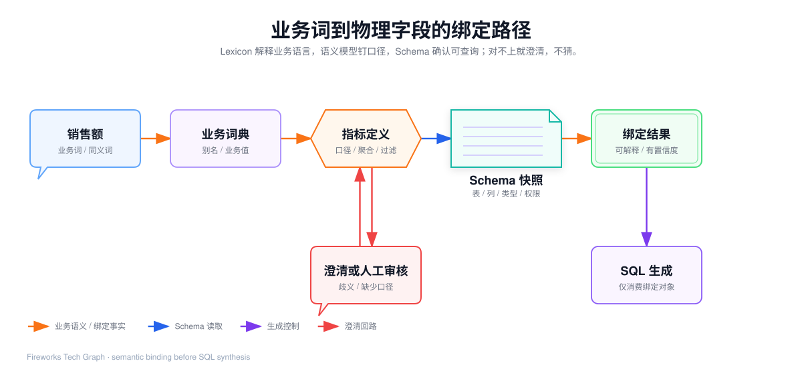

## 我参与的 Text2SQL 报表查询架构

> 本文中的数据源、表名、字段名、日期和数值均为脱敏或泛化示例，不包含公司源码、连接信息、内部配置和未公开的业务口径。

## 1. 我先把项目功能说清楚

我选择这个项目里最适合和数仓结合的一项能力：**自然语言转 SQL，并在受控权限下读取数据**。

业务人员可以提出“查询昨天各渠道销售额”“对比本周和上周订单量”“生成一份渠道日报”这样的业务问题。Cognida 的 Data Agent 负责理解问题、选择数据工具、组织查询过程，并把查询结果交给表格、图表和文字摘要组件。

它不是数仓本身，也不是让模型直接拿数据库连接执行任意命令。准确的定位是：

> Cognida 位于业务问题和数仓查询之间，承担自然语言入口、语义指标治理、SQL 候选生成、只读执行、结果引用和结果解释。

数仓仍然负责沉淀业务事实、主题数据和统一口径；报表仍然需要明确统计周期、指标定义和发布审核。Cognida 解决的是“业务语言怎样变成一条可验证的查询”，而不是越过数仓治理直接改数据。

## 2. 数仓在这条链路里的含义

在这个项目场景中，我把数仓理解为公司对订单、商品、渠道、客户等业务数据进行采集、清洗、建模和汇总后形成的统一数据存储与分析层。它通常包含明细事实、主题汇总和面向报表的服务数据。

日报和周报是数仓数据的消费方式：

1. 明确统计时间和对比周期；
2. 选择维度，例如渠道、品牌、地区；
3. 按统一口径计算指标，例如支付金额、支付订单数和退款金额；
4. 用 SQL 从数仓读取聚合结果；
5. 把结果组织成表格、图表和摘要。

因此，Cognida 更像数仓上层的“自然语言查询和验证层”。它可以降低业务人员写 SQL 的门槛，也能让正式报表的 SQL 生成、执行和审核过程更容易被记录，但不能替代指标 Owner、数仓开发和报表发布流程。

## 3. 项目中真实存在的三条数据查询路径


<InteractiveDiagram
  title="Text2SQL 报表查询架构"
  src="../../media/projects/baozun-lexicon/diagrams/text2sql-runtime-architecture/index.html?embed=1"
  poster="../../media/projects/baozun-lexicon/diagrams/text2sql-runtime-architecture/preview.png"
  description="业务问题经过语义治理、Schema 探查和只读执行后，形成可复用的日报或周报结果。"
/>

我会把项目里的路径分成三类，而不是笼统地说“AI 会写 SQL”。

| 路径 | 适用问题 | 实际链路 | 主要特点 |
| --- | --- | --- | --- |
| 即席 Text2SQL | 一个数字、一张明细或一个排行 | `get_schema → SQL 生成 → sql_execute` | 依赖真实表列，适合探索和临时问数 |
| 治理指标查询 | GMV、营收、订单数、转化率等有固定口径的指标 | `semantic_models → 术语对齐 → semantic_query → sql_execute` | 由语义模型和指标引擎生成受治理 SQL |
| 综合报告 | 日报、周报、经营概览、多块指标分析 | 拆分报告块，分别走语义查询或 SQL，再交给分析和渲染 | 多段取数，结果通过引用复用 |

三条路径最终都会通过受控的查询工具读取数据。区别在于：即席路径由 Schema 和模型协作生成候选 SQL；治理路径先把业务词映射成指标、维度和度量，再由确定性引擎装配 SQL；综合报告是对多个查询结果进行组合，不是让模型一次性凭空写出整份报告。

## 4. 六点链路的输入、处理和输出契约

Text2SQL 不能只描述成“用户问题进入模型，模型返回 SQL”。我会把它拆成六个阶段，每个阶段都有明确输入和输出，下一阶段只消费上一个阶段已经确认的结构化事实。



<InteractiveDiagram
  title="Text2SQL 的六点输入输出契约"
  src="../../media/projects/baozun-lexicon/diagrams/text2sql-contracts/index.html?embed=1"
  poster="../../media/projects/baozun-lexicon/diagrams/text2sql-contracts/preview.png"
  description="自然语言、查询意图、字段绑定、SQL 候选、受控查询和结果信封逐级传递。"
/>

| 阶段 | 输入 | 处理 | 输出 | 不能越过的边界 |
| --- | --- | --- | --- | --- |
| 1. 请求接收 | 自然语言、会话、租户和数据源上下文 | 判断是查数、分析还是报告 | 带 request_id 的查询任务 | 未明确数据源时不能静默切换库 |
| 2. 意图解析 | 用户问题和上下文 | 抽取时间、维度、指标、过滤、排序、对比关系 | 查询意图 IR | 时间或指标有歧义时进入澄清 |
| 3. 语义绑定 | IR、Schema、语义模型、业务词典 | 将业务词绑定到真实维度、度量和指标 | 绑定结果与未覆盖项 | 不能用中文翻译结果冒充物理列 |
| 4. SQL 生成 | 绑定结果、方言和查询限制 | 确定性引擎生成，或受限模型生成候选 | SQL、参数、版本和覆盖状态 | 只能引用已发现或已治理对象 |
| 5. 受控执行 | SQL、database_id、行数上限 | 只读校验、资源控制、执行和结果暂存 | 结果信封与 result_id | 模型不能直接持有数据库连接 |
| 6. 报表产出 | 结果信封、结果引用和报告模板 | 代码计算数字，模型组织解释，前端渲染 | 表格、图表、摘要和审计记录 | 没有审核的结果不能成为正式口径 |

这个契约设计带来一个很重要的效果：即使模型生成了错误 SQL，也只能把错误带到“候选”阶段，不能直接把错误扩散成数据库写操作或正式报告。

## 5. 查询意图为什么要有中间结构

自然语言中有很多信息不能靠字符串替换完成。例如：

> 查询 2026 年 8 月 30 日各渠道销售额、支付订单量和退款金额，并与上周同日比较，按销售额降序输出日报。

我会先得到类似下面的中间结构。它是说明性 IR，不是公司内部 DTO 或源码：

```json
{
  "output": "daily_report",
  "time": {
    "timezone": "business_timezone",
    "current": { "start": "2026-08-30", "end": "2026-08-31" },
    "comparison": { "start": "2026-08-23", "end": "2026-08-24", "relation": "same_day_last_week" }
  },
  "dimensions": ["渠道"],
  "metrics": ["销售额", "支付订单量", "退款金额"],
  "filters": [],
  "order_by": [{ "field": "销售额", "direction": "desc" }],
  "limit": 100
}
```

中间结构的价值有三点：

- **把业务问题拆成可验证字段**：时间、维度、指标和排序都能单独检查；
- **把歧义暴露出来**：比如“上周”到底是前七天、上一个自然周还是上周同日；
- **让 SQL 生成可重复**：同一个意图和同一个语义模型版本，可以生成稳定的 SQL 或命中受信查询缓存。

如果只让模型从原句直接写 SQL，模型很可能选择错误的时间字段、聚合方式或对比周期。中间结构让这些决策先被看见，再进入 SQL 生成。

## 6. 业务词、Lexicon 与数仓字段怎样衔接

Lexicon 字段词典和 Cognida 的关系是“业务语言承接”与“物理可查询性确认”的关系。



<InteractiveDiagram
  title="业务词到物理字段的绑定路径"
  src="../../media/projects/baozun-lexicon/diagrams/text2sql-semantic-binding/index.html?embed=1"
  poster="../../media/projects/baozun-lexicon/diagrams/text2sql-semantic-binding/preview.png"
  description="业务词先经过词典和指标口径，再与真实 Schema 绑定；歧义时回到澄清或人工审核。"
/>

Lexicon 可以提供字段中文名、菜单路径、业务上下文、同义词和人工确认状态。这些信息适合回答“业务人员说的销售额位于哪个页面、属于哪个业务模块”。

Cognida 还要继续确认：

| 业务词 | 语义对象 | 物理对象 | 需要确认的事实 |
| --- | --- | --- | --- |
| 销售额 | Metric 或 Measure | 支付金额列，或支付金额表达式 | 是支付金额、下单金额还是含税金额；是否过滤成功状态 |
| 支付订单量 | Metric | 汇总列或去重订单 ID | 汇总表是否已经聚合；明细表是否需要 `COUNT(DISTINCT ...)` |
| 渠道 | Dimension | 渠道列或标准渠道维表 | 渠道名称是否需要值映射；是否允许空渠道 |
| 退款金额 | Metric | 退款金额列 | 按退款发生日还是订单日统计；负数展示规则是什么 |

所以页面上的“销售额”不能直接变成 `sales_amount`。正式 SQL 使用的表名和列名必须来自真实 Schema；指标公式、关联条件和聚合方式必须来自已确认的语义模型。字段词典是召回和解释证据，不是物理数据库的替代品。

## 7. SQL 生成的两条路径

### 7.1 治理主路径：结构化请求转确定性 SQL

当指标和维度已经进入语义模型时，Data Agent 先查看可用的指标目录，完成术语对齐，再提交结构化的 `metrics`、`dimensions`、`filters`、`order_by` 和 `time_grain`。指标引擎根据逻辑表、度量、维度、关联和指标表达式装配 SQL。

这条路径的核心不是“模型写得更聪明”，而是把高频、重要、需要对齐的指标从概率生成变成集中治理：

1. 同一个业务词映射到统一指标名；
2. 同一个指标使用统一表达式和过滤条件；
3. 语义模型版本进入缓存键，模型更新后旧查询自然失效；
4. 语义模型绑定的数据源以明确标识传给执行工具，避免查错库；
5. 如果指标、维度或过滤字段没有完整覆盖，返回 `covered=false`，不能假装已经治理。

### 7.2 回退路径：Schema 感知的 Text2SQL

对于语义模型还没有覆盖的临时字段，系统回到即席路径：先通过 `get_schema` 获取表、列、类型和注释，再由 SQL 生成器根据真实结构提出查询，最后交给 `sql_execute`。

这条路径提高了可用性，但可信等级低于治理主路径。结果应带有“未命中语义口径、按物理 Schema 推断”的提示；当问题涉及正式日报、核心经营指标或对外报告时，我不会让回退结果直接成为发布数据，而是把它转成补充语义模型或人工审核的任务。

| 判断 | 处理 | 报告权限 |
| --- | --- | --- |
| 指标和维度完整命中语义模型 | 确定性生成 SQL，再只读执行 | 可以进入已审核模板候选 |
| 只命中部分语义对象 | 返回未覆盖项，澄清或回退 | 只能作为候选结果 |
| 只适合临时明细查询 | Schema 探查后生成 SQL | 可用于即席分析 |
| 指标口径、时间或 JOIN 有歧义 | 停止生成并请求确认 | 不允许执行或发布 |

## 8. “AI 可以执行 SQL”到底是什么意思

准确说法是：**AI 可以生成或选择一条 SQL，并通过工具请求后端执行；真正建立连接、检查权限、执行查询和保存结果的是后端。**

调用链可以简化为：

```text
用户问题
  → Data Agent 判断需要查数
  → semantic_query 或 get_schema
  → SQL 候选
  → sql_execute 工具
  → 只读校验、数据源路由、LIMIT、超时
  → 数仓返回结果
  → Result Store 保存完整行集
  → Agent 收到有界结果信封
```

模型看不到数据库密码，也不能绕过工具直接发起连接。外部数据源被当作只读资源；查询工具负责把请求路由到显式数据源或会话数据源，并把执行结果转换成后续工具可以消费的结构。

这就是项目和数仓结合时最重要的安全边界：模型可以“提出查询”，但没有“直接改数仓”的能力。

## 9. 查询结果如何进入日报周报

查询结果不是直接拼成一段模型文字。项目的结果处理采用“数据引用”思路：完整结果存入 Result Store，Agent 上下文里只保留列名、类型、行数、样本、聚合摘要和 `result_id`。后续分析、图表和报告模块通过 `result_id` 回源取完整数据。

这能解决三个问题：

- 大结果集不会被完整塞进模型上下文；
- 多个报告模块可以引用同一份查询结果，避免重复打库；
- 报告中的数字有结果来源，能够追到执行过的 SQL 和数据源。

正式日报周报建议采用两段式：

1. **生成阶段**：自然语言生成 SQL 草稿，完成语义、Schema、安全和结果验证；
2. **运行阶段**：把确认后的 SQL 保存为带日期参数的模板，由调度器按日或按周执行。
