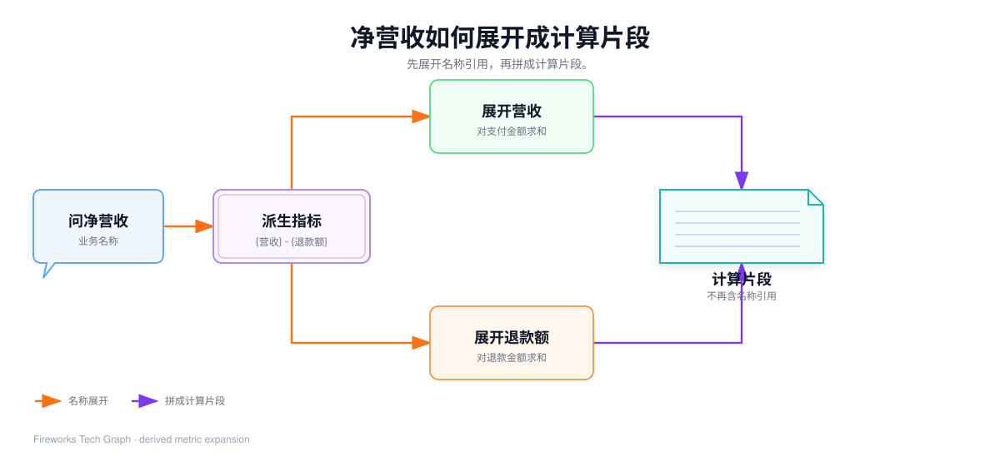
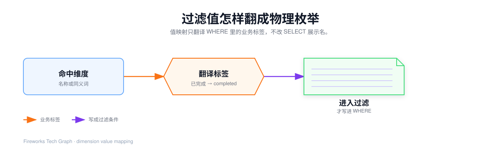
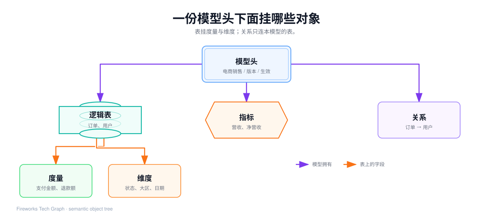
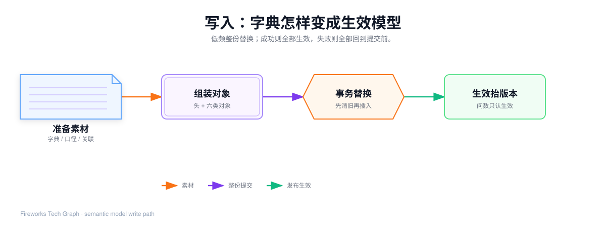
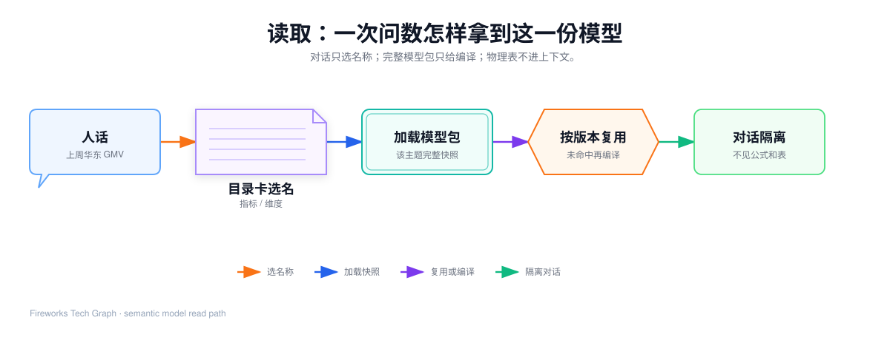

## 这篇要让你看懂什么

[上一篇](./50-semantic-model-from-dictionary) 说明了为什么要把字典升级成语义模型。本篇只讲语义模型这一层：对象长什么样、怎么整份生效、问数时怎么加载。编译每一步如何使用这些对象，见 [60](./60-metricsql-compile-engine)；Agent Query 如何变成 SQL，见 [61](./61-metricsql-name-resolution)。谁决定调用见 [71](./71-agent-hit-path)，未覆盖怎么回退见 [72](./72-agent-fallback-and-report)。

1. 一份语义模型的外壳是什么，下面挂哪些对象；
2. 每个对象保存什么语义、查询时怎么被用、不做什么；
3. 数据工程师写入时，整份模型如何一次替换生效；
4. 业务人员查询时，系统如何加载**某一个**生效模型；
5. 为什么对话只能看到目录卡，编译才能看到完整映射；
6. 用「上周华东区 GMV，按天」把模型层从 0 走到交给编译为止。

---

## 1. 先认外壳：一份模型头

语义模型不是一个随便丢在磁盘上的 JSON 文件，也不是图数据库里的另一套本体。它是**按业务主题持久化的一份登记**：一个主题一份模型头，头下面再挂逻辑表、维度、度量、指标、关系。

模型头至少要能回答这些问题：

| 模型头要记住的 | 语义 | 查询时怎么用 |
| --- | --- | --- |
| 业务名 | 例如「电商销售」 | 问数入口按名字选模型，不按内部编号选 |
| 租户 | 谁能看到这份模型 | 不同租户的同名模型不能串 |
| 版本 | 口径改过几次 | 编译结果失效的锚点，怎么缓存是引擎章的事 |
| 状态 | 草稿 / 生效 / 停用 | 问数只加载生效模型 |
| 说明 | 这个主题覆盖什么 | 给人看，也可进目录卡 |

**一个业务域对应一行模型头。** 「电商销售」和「商品销售」是两份模型，查询时只加载被选中的那一份，不会把全库所有主题混在内存里。

状态机很短，但必须硬：

- **草稿**：可以改，不能拿去给业务人员出数；
- **生效**：问数和编译只认这个状态；
- **停用**：名称还在，不再被日常查询命中。

任何一次会改变口径的发布，都应该抬升版本。版本不抬，旧公式会继续被当成当前口径。

---

## 2. 六类对象的具体语义

模型头下面是 1 对 N 的对象树：逻辑表、维度、度量、指标、关系都挂在同一个模型 ID 上。另有一类**覆盖记录**，不参与编译，只记录这次查询有没有被模型接住。

### 2.1 逻辑表：业务表名怎么落到物理表

逻辑表解决「我说订单，你去哪张表」。

| 要记住的 | 语义 | 缺了会怎样 |
| --- | --- | --- |
| 业务名 | 订单、用户 | 问数入口无法用业务语言指表 |
| 物理表 | 数仓里真正的表 | 编译无法生成 FROM |
| 数据源 | 打到哪一个库 | 多品牌、多环境时打错库 |
| 主键 | 这一行的身份 | 后面判断 JOIN 会不会一对多放大 |
| 说明 | 订单事实表 / 用户维表 | 给人建模时对齐 |

查询时的用法：

- 指标和维度都通过「归属逻辑表」找到 FROM 的候选；
- 数据源标识会随编译结果交给执行侧，模型自己不连库；
- 主键不直接出现在 SELECT 里，但扇出安全会用到它。

边界：逻辑表**不是**把所有数仓表都登记一遍。只登记这个主题真正允许被问到的表。

### 2.2 度量：最细的数字原材料

度量是指标的食材：最细粒度的数值列，加上默认聚合。

| 要记住的 | 例子 | 语义 |
| --- | --- | --- |
| 名称 | 支付金额、订单数、退款额 | 给公式引用，业务人员不一定直接说这个名字 |
| 归属逻辑表 | 订单 | 数字从哪张表来 |
| 表达式 | 支付金额列；或已经写好的去重计数 | 物理列或已确认的计算片段 |
| 默认聚合 | 求和 / 计数 / 不再外套 | 被指标引用或降级命中时怎么包一层 |

三种常见形态必须分开记：

1. **普通列 + 默认求和**：支付金额、退款额。引用时变成对这一列求和。
2. **普通列 + 默认计数**：订单数用主键计数。不能对主键再求和。
3. **表达式已经完整 + 不再外套**：客户数如果已经是「去重客户标识再计数」，默认聚合必须是「不要再包一层」。否则会出现套娃聚合，口径直接错。

业务人员通常不直接点度量名。度量存在的意义是：指标公式有原材料，未单独定义指标时还可以降级命中度量。怎么降级，是 [编译引擎](./60-metricsql-compile-engine) 的规则。


### 2.3 指标：业务人员真正说出口的口径

指标才是「GMV」「净营收」「客单价」。

| 要记住的 | 例子 | 语义 |
| --- | --- | --- |
| 名称 | 营收 | 业务语言 |
| 公式 | 对订单支付金额求和 | 建模期钉死，运行时不改写 |
| 口径说明 | 「已支付金额之和」 | 给人看，也会出现在目录卡上 |
| 展示格式 | 金额 / 百分比 | 前端怎么渲染，不影响计算 |
| 同义词 | GMV、销售额、成交额 | 多名称指向同一公式 |

公式有两种写法，语义不同：

| 写法 | 例子 | 含义 |
| --- | --- | --- |
| 直接写计算 | 支付总额 / 订单数 | 原子指标，不再引用别的指标名 |
| 用名称引用 | `{营收} - {退款额}` | 派生指标，编译时再展开被引对象 |

派生展开的语义（本篇只需建立这张图，算法细节在编译章）：



必须事先存在的约束：

- 被引用的名称必须在本模型里；
- 引用不能成环（A 引 B、B 再引 A）；
- 指标引用度量或其他指标，**不引用维度**。维度负责切，不负责算。

### 2.4 维度：分组和筛选的尺子

维度回答「按什么切开、按什么过滤」。

| 要记住的 | 例子 | 查询时 |
| --- | --- | --- |
| 名称 | 订单状态、大区、下单日期 | 出现在 GROUP BY 或 WHERE |
| 归属逻辑表 | 订单或用户 | 决定要不要 JOIN |
| 表达式 | 状态列、区域列、创建时间 | 真正参与 SQL 的字段 |
| 数据类型 | 文本 / 整数 / 时间 | 过滤值怎么比较、时间能不能分桶 |
| 同义词 | 状态、区域、日期 | 人话别名 |
| 值映射 | 已完成 → completed | 只在过滤时翻译 |

几个容易混的点：

- **层级目录 ≠ 维度。** 前面章节的字段树描述页面结构；这里的维度描述数仓怎么切。
- **有时间类型的维度，才允许按天 / 按周 / 按月分桶。** 「最近两个月」是过滤范围，不是粒度。粒度和范围的分工在编译章，但维度必须先被标成时间。
- **没有值映射的文本维，过滤值会原样比对。** 「大区 = 华东」如果库里存的就是「华东」，可以不建映射；「订单状态 = 已完成」如果库里是英文枚举，就必须建。

### 2.5 值映射：业务标签怎么变成物理值

值映射挂在维度上，不是独立主题。它只翻译**过滤值**，不翻译 SELECT 里的展示名。

处理顺序是固定的：



缺第 2 步的后果在上一篇已经说过：0 行。多值过滤时（「已完成或已支付」），每个标签都要能翻译；有一个标签不在映射里，这次过滤就不应假装成功。

给对话看时只给标签列表（已完成、已取消），不给物理值。否则模型上下文里会出现 `completed` 这种库内编码，既泄露结构，也引诱对话去拼 SQL。

### 2.6 关系：只允许怎么连表

关系是预定义的边，不是查询时的临时 ON。

| 要记住的 | 例子 | 语义 |
| --- | --- | --- |
| 左表 | 订单 | 通常是事实表 |
| 右表 | 用户 | 通常是维表 |
| 连接类型 | 左连接 | 没有维表匹配时事实是否保留 |
| 连接条件 | 订单.用户标识 = 用户.主键 | 唯一允许的 ON |
| 基数 | to-one | 保证聚合不被放大 |

「华东区 GMV 按城市」如果城市在用户表：


多跳也一样：明细 → 商品 → 品类，每一跳都要事先登记。桥接表可以不出现在用户点名的对象里，但必须能沿关系走到。怎么走是编译章的规划，本篇只保证**边存在且是 to-one**。

### 2.7 覆盖记录：不属于这棵树

覆盖记录不进入模型包，不参与编译。它只记下这次查询有没有被模型接住、缺了哪个词。怎么判定覆盖、未覆盖之后怎么回退，分别是编译引擎和 Agent 循环的事。建模同学要看的是「哪些词一直漏」。

---

## 3. 对象之间怎么引用

把上一节收成一张引用图：



硬规则：

1. 度量、维度必须能指回逻辑表；
2. 指标通过公式引用度量或其他指标，不引用维度；
3. 关系只连接本模型里的逻辑表；
4. 值映射只属于维度；
5. 覆盖记录不属于这棵树。

---

## 4. 写入链路：数据工程师怎样把字典变成生效模型

写入是**低频、整份替换**的。不要理解成「每次问数改一行公式」。

从 0 到 1 的写入步骤：



同一事务里先写模型头、清掉该模型旧对象、再插入新对象。缺一类就缺一类，不要指望运行时补；口径、表达式、关系或值映射一变，版本必须抬。问数侧只认生效状态。

为什么用整份替换，而不是逐对象补丁：

- 指标引用度量，关系引用两张表，局部更新很容易留下悬挂引用；
- 编译依赖的是一份自洽快照，不是一串可能互相打架的补丁；
- 版本只对「整份快照」有意义。

写入侧不做的事：不执行 SQL，不访问数仓明细，不让对话改公式。

---

## 5. 读取链路：一次查询怎样拿到这一份模型

读取是**高频**的。每次问数都要拿到**被选中的那一个生效模型**的全部对象，而不是全库所有主题。



用租户、模型业务名和生效状态定位模型头，再取出该主题全部对象，在内存里组装成一份**模型包**。完整快照只给编译；问数对话只看目录卡。

模型包包含什么、不包含什么：

| 包含 | 不包含 |
| --- | --- |
| 这一个主题的模型头 | 其他主题的对象 |
| 该主题全部逻辑表、维度、度量、指标、关系 | 覆盖埋点 |
| 公式、物理列、JOIN、完整值映射 | 其他租户的模型 |

加载模型包是为了口径以生效版本为准。SQL 怎么生成、是否复用，是 [执行引擎](./60-metricsql-compile-engine) 的事。

---

## 6. 内存里那一份模型包

假设库里有两份生效模型：「电商销售」「商品销售」。业务人员问「华东区的 GMV」，问数入口选中「电商销售」。加载到内存的是类似下面这份快照（脱敏、只保留语义，不是内部结构体）：

- **头**：名称「电商销售」，版本 1，状态生效。
- **逻辑表**：订单（事实表，绑定数仓源），用户（维表，同一源）。
- **维度**：订单状态（带已完成 / 已取消 / 已支付的值映射）、下单日期（时间）、大区、VIP 等级（普通 / 银卡 / 金卡 / 钻石 → 0/1/2/3）……
- **度量**：支付金额（求和）、订单数（计数）、客户数（已是去重计数，不再外套）、退款额（求和）。
- **指标**：营收（对支付金额求和，同义词含 GMV）、客单价、净营收（`{营收} - {退款额}`）、退款率。
- **关系**：订单 → 用户，左连接，to-one。

这份快照足够让编译器在不访问登记处的情况下做完一次名称解析。它仍然不是 SQL。

---

## 7. 目录卡：对话为什么不能看完整模型包

完整模型包里有物理表、列表达式、JOIN、数据源、值映射的物理值。如果整包塞进对话，会出现三件事：

1. 物理结构进入模型上下文；
2. 对话被引诱去改公式、改表、自己写 SQL，口径被改写；
3. 上下文被表达式和关系撑得很长，真正要选的业务名反而变少。

所以读取之后立刻做一次收敛：问数入口只看**目录卡**，编译继续看模型包。

### 7.1 字段级对照

| 内容 | 完整模型包（编译可见） | 目录卡（对话可见） |
| --- | --- | --- |
| 指标公式 | 有，例如对支付金额求和 | 无 |
| 指标口径说明 | 有 | 有，给人理解「营收是什么」 |
| 指标同义词 | 有 | 有，用来对上 GMV / 销售额 |
| 维度物理列 | 有 | 无 |
| 值映射 | 有完整「已完成 → completed」 | 只给业务标签「已完成」 |
| 度量表达式 | 有 | 至多暴露度量名称，不给列 |
| JOIN 条件 | 有 | 无 |
| 数据源 | 有 | 无 |
| 模型说明 / 版本 | 有 | 有 |

### 7.2 对话实际看到的内容长什么样

举个例子，返回的模型卡是轻量的，并不会把数据全部返回。就像餐厅点菜：给前厅看的是菜单，给后厨才会给完整的配方。


```json
{
  "name": "电商销售",
  "version": 1,
  "description": "订单销售域：营收、净营收、客单价等受治理指标",
  "metrics": [
    {
      "name": "营收",
      "caliber": "已支付金额之和",
      "format": "金额",
      "synonyms": ["GMV", "销售额", "成交额"]
    },
    {
      "name": "客单价",
      "caliber": "支付总额 / 订单数",
      "synonyms": ["客单"]
    }
  ],
  "dimensions": [
    {
      "name": "订单状态",
      "data_type": "文本",
      "synonyms": ["状态"],
      "allowed_values": ["已完成", "已取消", "已支付"]
    },
    {
      "name": "大区",
      "data_type": "文本",
      "synonyms": ["区域", "地区"]
    },
    {
      "name": "下单日期",
      "data_type": "时间",
      "synonyms": ["日期", "下单时间"]
    }
  ]
}
```

注意：没有物理表，没有 `completed`，没有 JOIN，没有数据源。

### 7.3 对话只允许返回名称

看完目录卡之后，问数入口只应产出结构化取数请求，例如：

```json
{
  "model": "电商销售",
  "metrics": ["营收"],
  "dimensions": ["大区", "下单日期"],
  "filters": [{ "field": "大区", "op": "=", "values": ["华东"] }],
  "time_grain": "day"
}
```

不允许返回：SQL、物理列名、JOIN、值映射里的物理值。那些由编译侧用完整模型包填写。

这是职责分离，不是功能不全：

| 设计考虑 | 含义 |
| --- | --- |
| 口径安全 | 公式和 JOIN 是建模确认过的可信片段，不能被对话改写 |
| 成本 | 上百个指标的完整表达式塞进上下文又贵又噪 |
| 确定性 | 同一名称必须得到同一公式，不能靠临场发挥 |
| 泄露 | 物理表、数据源、枚举编码不应出现在对话里 |

---

## 8. 从 0 到 1 走一遍：上周华东 GMV，按天

这句话是业务人员的输入：

> 上周华东区的 GMV 是多少？按天展示

下面只走**模型这一层**，不进入编译五步和 Agent 循环。

### 8.1 选模型、看目录

问数入口列出生效模型，选中「电商销售」，拿到第 7 节那种目录卡。目录卡里能看到：

- 指标「营收」，同义词含 GMV；
- 维度「大区」「下单日期」；
- 没有「实时库存」这类未登记词。

于是人话被收成结构化请求：模型=电商销售，指标=营收，维度=大区 + 下单日期，过滤=大区等于华东，时间粒度=天。

### 8.2 加载完整模型包

服务端用租户 +「电商销售」+ 生效，取出模型头和全部对象。此时内存里有：

- 营收的公式（对支付金额求和）；
- 大区的物理列；
- 下单日期是时间维；
- 若「华东」需要翻译，值映射在大区或相应维度上；
- 若大区实际在用户表，订单 → 用户的关系也在。

对话仍然看不到这些。

### 8.3 交给编译时，模型包已经提供的事实

编译还不开始，但输入已经齐：

| 名称 | 模型包里已经有的事实 |
| --- | --- |
| 营收 | 公式、口径、同义词 |
| 大区 | 列、类型、可能的值映射 |
| 下单日期 | 时间维标记 |
| 华东 | 要么原样比对，要么翻成一组物理值 |
| 订单 / 用户 | 逻辑表、数据源、关系 |

[编译引擎](./60-metricsql-compile-engine) 会按对象逐步消费这些事实。[61](./61-metricsql-name-resolution) 用同一句话把 Query 装配成 SQL。本篇到此为止。

### 8.4 如果目录里没有这个词

例如有人问「实时库存」。目录卡没有这个指标，结构化请求不该硬凑一个相近列。模型层应让这次成为未覆盖：覆盖记录记下缺的词，编译不得输出半截 SQL。回退路径见 [72](./72-agent-fallback-and-report)。

---
