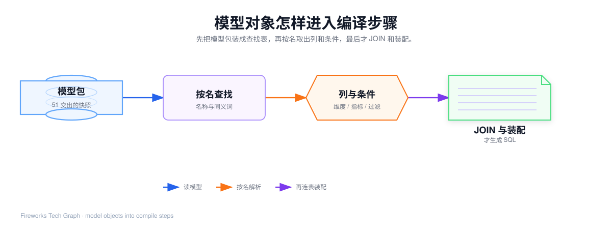
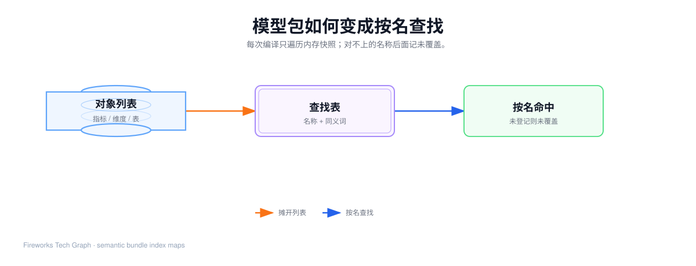

## 这篇要让你看懂什么

[51](./51-semantic-objects-and-runtime-flow) 已经交出一份生效的**模型包**。本篇只讲执行引擎怎样**读这些对象**。Agent 吐出的 Query 如何变成一条完整 SQL，见 [61](./61-metricsql-name-resolution)。跨表 JOIN、空 SQL 和复用，见 [62](./62-metricsql-join-and-assemble)。

1. 为什么编译开头要把模型包摊成查找表，而不是边编译边查库；
2. 维度、指标、时间、过滤各自消费模型里的哪些字段；
3. 中间结果为什么还不是 SQL；
4. 名称对不上时，为什么这一步只记账、不猜。

贯穿例子仍是：「上周华东区的 GMV 是多少？按天展示」。本篇只走到「列和条件已经准备好」。

---

## 1. 51 交出来的，还不是 SQL

模型包里有逻辑表、度量、指标、维度、值映射、关系。问数入口另外给出一份只含业务名的请求。引擎的合同是：

> 用模型包里已经钉死的口径，把名称请求变成确定性 SQL；任一名称不在模型里，SQL 必须为空。

信任边界也在这里钉死：公式、维度表达式、JOIN 条件是建模侧写好的可信片段，直接进后续 SQL。Agent 只能改**名称**和**过滤值**。名称用来查找对象，找到就丢掉这个字符串；过滤值要转义，还要走值映射。

读图的顺序：先读模型 → 按名查找 → 得到列与条件 → 最后才 JOIN 与装配。本篇覆盖前三格。

---

## 2. 索引：先能按名字找到对象

### 2.1 为什么需要这一步

模型包里的对象是**列表**。每次用名称去扫一遍列表，编译会又慢又不稳定。索引把「数组遍历」变成「按名查找」。

它**不是**从登记处再查一次库。51 已经把该主题的对象装进内存。本步只遍历这份快照。

### 2.2 输入、读模型、输出

| | 内容 |
| --- | --- |
| 输入 | 整份模型包 |
| 读哪些对象 | 逻辑表、度量、指标、维度、关系的名称和同义词 |
| 输出 | 若干张平级查找表（不是六层嵌套 key） |
| 失败 | 索引本身不失败；对不上的词在后面的步骤暴露 |

查找表至少要能回答：

| 用名称查 | 得到 |
| --- | --- |
| 「营收」「GMV」「销售额」 | 同一条指标 |
| 「大区」「区域」 | 同一条维度 |
| 「支付金额」 | 一条度量（给降级用） |
| 逻辑表内部编号 | 物理表名和 SQL 别名 |

名称会做大小写和首尾空格的归一，避免 Agent 传来 `GMV` 和 `gmv` 当成两个东西。同义词在**建模期**就写进对象，索引只是把它们铺开。引擎不会在运行时发明「省份大概等于大区」。

### 2.3 贯穿案例这一步

「GMV」能查到指标「营收」；「大区」「下单日期」能查到维度。若有人写「实时库存」，查找表没有这个键——本步还不报失败，只是后面取指标时会拿不到对象。

### 2.4 常见误解

- **索引有遗漏所以要模糊匹配。** 错。索引穷尽的是模型里已登记的入口。没登记的词就是未覆盖。
- **每次问数都要打数据库建索引。** 错。打库发生在 51 加载模型包；编译只扫内存。
- **同义词是引擎猜的。** 错。同义词是 51 的指标/维度字段。

---

## 3. 维度解析：用维度对象变成分组列

### 3.1 为什么单独一步

维度在 SQL 里同时进 SELECT 和 GROUP BY，还可能被标成时间维。指标没有这两件事。所以请求里的 `dimensions` 必须单独处理。

### 3.2 输入、读模型、输出

请求字段：`dimensions: ["大区", "下单日期"]`。

| 维度对象上的字段 | 这一步拿来做什么 |
| --- | --- |
| 名称 / 同义词 | 对上请求里的词 |
| 归属逻辑表 | 决定这列挂在哪张表的别名下 |
| 表达式 | 真正的物理列 |
| 数据类型 | 是不是时间，供下一步分桶 |

成功时每一条维度变成一个「分组列」零件：业务别名、已加表别名的表达式、来自哪张逻辑表、是否时间。这些列还会记入 **needed**：后面 JOIN 必须能连到这些表。

名称在查找表里不存在 → 把这个词记入未覆盖，**不**用相近维度顶上。

### 3.3 贯穿案例这一步

| 请求名 | 模型对象 | 中间列（尚未分桶） |
| --- | --- | --- |
| 大区 | 订单上的区域列，无值映射 | `orders.region`，别名「大区」，不是时间 |
| 下单日期 | 订单创建时间，类型=时间 | `orders.created_at`，别名「下单日期」，标成时间维 |

needed 目前只有订单。

### 3.4 常见误解

- **过滤里的「华东」也在这一步翻译。** 错。翻译在过滤步。本步只处理 `dimensions` 里要展示、要分组的名。
- **城市在用户表，这里就要写 JOIN。** 错。这里只把城市列记下来，并给 needed 加上用户表。JOIN 在 62。

---

## 4. 指标解析：用指标（或度量）变成计算列

### 4.1 为什么单独一步

指标进 SELECT，不进 GROUP BY。公式可能还带 `{营收}` 这种名称引用，必须在进 SELECT 之前展开干净。

### 4.2 三条命中路径

请求字段：`metrics: ["营收"]`。查找顺序固定：

1. **先当指标名 / 同义词。** 命中则取公式。公式里若有 `{名称}`，再回查找表取被引对象，递归换成计算片段。
2. **再当度量名。** 指标库没有时，用度量的表达式套上默认聚合（求和 / 计数 / 不再外套）。
3. **两张表都没有。** 该名称记入未覆盖。

51 已经规定：引用必须在本模型、不能成环、不能引用维度。本步执行这些约束。成环或缺引用，整条指标失败，不能留下半截 `{营收}` 进 SQL。

展开时从公式里的表别名推断还需要哪些逻辑表，并进 needed。营收和退款额都在订单上，needed 仍只有订单。

「不再外套」的度量（例如已经写好的去重客户数）不能再套一层 `SUM()`。否则口径直接错。

### 4.3 贯穿案例这一步

`营收`（或 Agent 写成 `GMV`）→ 公式「对支付金额求和」→ 计算列 `SUM(orders.pay_amount)`，别名「营收」。本例不是净营收，不走 `{ }` 展开。

### 4.4 常见误解

- **引擎会根据「毛利」临时写一个收入减成本。** 错。没有指标对象就未覆盖。
- **降级到度量可以改聚合。** 错。用建模时钉死的默认聚合。

---

## 5. 时间智能：只改已经标成时间的维度

### 5.1 粒度不是范围

| 人话 | 进 Query 的哪一格 | 本步动不动 |
| --- | --- | --- |
| 按天 / 按周 / 按月 | `time_grain` | 动。改时间列的表达式 |
| 上周、最近两个月 | `filters` 里的日期区间 | 不动。留给过滤步 |

原始时间列带时分秒。直接 GROUP BY 会按秒拆开，看起来不像「按天」。本步按粒度套分桶函数。方言只换函数写法（例如一种库用日期格式化，另一种用 `TO_CHAR`），不改口径。

### 5.2 读模型的哪些字段

| 来自哪里 | 怎么用 |
| --- | --- |
| 维度.数据类型 = 时间 | 才允许套分桶 |
| 模型主时间维 | 要了粒度但 `dimensions` 里没选时间维时，自动注入这一条 |
| 逻辑表 + 维度表达式 | 分桶套在「表别名.时间列」上 |

要分桶但模型里没有任何时间维 → 未覆盖。不能静默返回一条不分桶的全时段汇总，否则会被当成命中并被复用。

### 5.3 贯穿案例这一步

`time_grain = day`，下单日期已被标成时间维，表达式改成按天分桶。SELECT 和 GROUP BY 必须用**同一份**表达式，否则按天展示和按天汇总会对不上。

本步结束后，下单日期列不再是原始 `created_at`，而是「截成天」的表达式。过滤步里的「上周」仍然打在原始时间列上，见下一节。

### 5.4 常见误解

- **上周 = time_grain 设成 week。** 错。上周是范围，按天是粒度。本例两者同时存在。
- **分桶之后 WHERE 也打在分桶结果上。** 错。范围过滤作用在未分桶的物理时间列，避免边界误差。

---

## 6. 过滤器：维度 + 值映射，只生成 WHERE

### 6.1 为什么是安全网关

进入 WHERE 的值来自用户或 Agent，必须：字段是已登记维度、算子在白名单、业务标签能翻译、字面量要转义。这一步不生成 SELECT。

### 6.2 输入、读模型、输出

请求字段：`filters`。

| 模型对象 | 怎么用 |
| --- | --- |
| 维度（含同义词） | 确认过滤的是哪一列，并加上表别名 |
| 值映射 | 「已完成」→ 库内枚举；没有映射则原样比对 |
| 算子白名单 | `=` `!=` `>` `>=` `<` `<=` `like` `in` |

多值过滤时每个标签都要能翻译。算子不在白名单、字段不是维度，记未覆盖。

时间范围（上周）也是过滤：字段是下单日期，算子是 `>=` / `<`，值是日期字面量。它作用在**原始**时间列，不是分桶后的表达式。

### 6.3 贯穿案例这一步

| 条件 | 翻译结果 |
| --- | --- |
| 大区 = 华东 | 无值映射，`orders.region = '华东'` |
| 下单日期 ≥ 2026-09-07 | `orders.created_at >= '2026-09-07'` |
| 下单日期 < 2026-09-14 | `orders.created_at < '2026-09-14'` |

本例没有「已完成」。若过滤订单状态，才会写成 `status = 'completed'`。

### 6.4 常见误解

- **值映射也会改 SELECT 里显示的「已完成」。** 错。只改 WHERE。
- **过滤字段可以是指标名。** 错。必须是维度。

---

## 7. 到这里还不能 JOIN

维度、指标、过滤都会往 needed 里塞逻辑表。本篇只要求你记住：**needed 是表的集合，不是 FROM 子句**。

选哪张当事实表、沿哪条关系走、没有边怎么办，是 [62](./62-metricsql-join-and-assemble) 的事。本例 needed 只有订单，62 会看到「不用 JOIN」。

覆盖判定也还没做完：上面每一步只是把缺口记进列表。列表不空，62 会直接空 SQL。

---

## 8. 对象 × 步骤对照

| 51 的对象 | 索引 | 维度 | 指标 | 时间 | 过滤 | JOIN（62） |
| --- | --- | --- | --- | --- | --- | --- |
| 逻辑表 | 别名表 | 给列加限定 | 推断 needed | 同左 | 同左 | FROM |
| 度量 | 度量名 | — | 降级聚合 | — | — | 选事实表 |
| 指标 | 名称/同义词 | — | 公式与 `{ }` | — | — | needed |
| 维度 | 名称/同义词 | 分组列 | — | isTime | 过滤字段 | needed |
| 值映射 | — | — | — | — | 翻译标签 | — |
| 关系 | 边列表 | — | — | — | — | 唯一允许的 ON |

交给 61 的接口是：分组列、计算列、过滤零件、needed、未覆盖列表。还没有完整 SQL。
