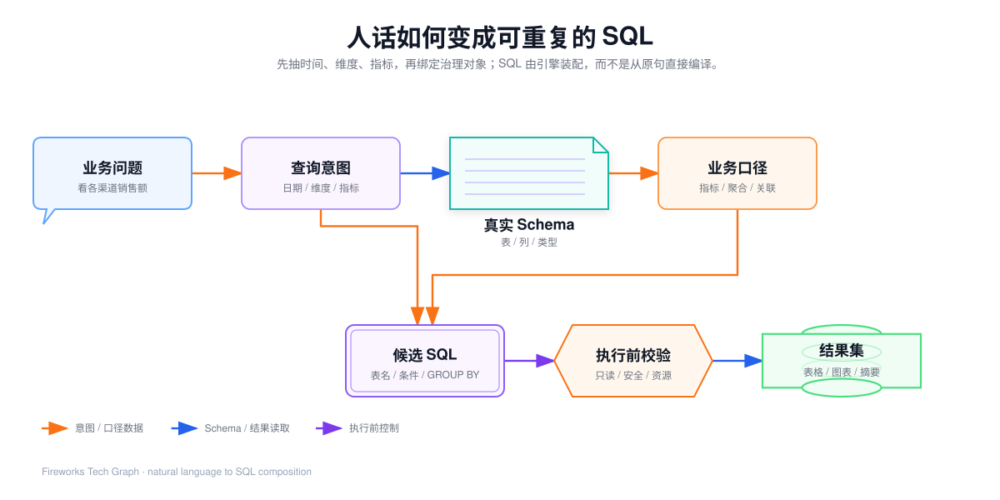
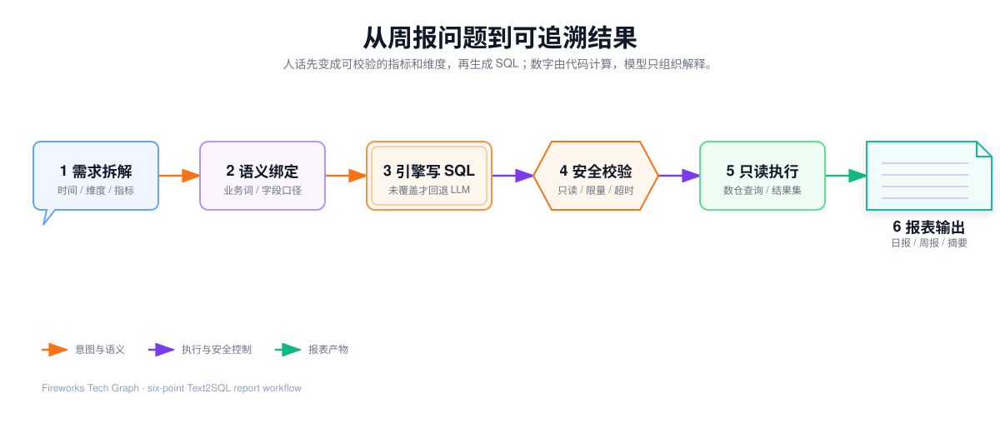

## 60 · 从一句周报到受治理 SQL

> 表名、字段名、日期和接口名称均为脱敏示例。这一章按「面试官让你从 0 讲到 1」来写：先分清日报周报和普通问数，再用一句话把整条链路跑通。架构职责见 [55](./55-governed-report-architecture)，语义对象见 [51](./51-semantic-objects-and-runtime-flow)。


<InteractiveDiagram
  title="从一句周报到只读结果"
  src="../../media/projects/baozun-lexicon/diagrams/text2sql-report-flow/index.html?embed=1"
  poster="../../media/projects/baozun-lexicon/diagrams/text2sql-report-flow/preview.png"
  description="从业务问题、意图解析和 Schema 探查，到 SQL 生成、只读执行、结果保存和报告交付。"
/>

## 1. 先分清「查一个数」和「出一份周报」

| 场景 | 结果 | 允许的生成方式 | 质量要求 |
| --- | --- | --- | --- |
| 即席问数 | 一个数、一张明细或一个排行 | `get_schema → LLM 写 SQL → sql_execute` | 结果可解释，失败可重试 |
| 日报 | 当日指标、维度分布、对比值 | 语义查询优先 | 日期边界和口径必须可复核 |
| 周报 | 周期汇总、趋势、环比 | 同一口径，只换周期参数 | 不能每周换一套公式 |

落地原则：**自然语言负责提出需求，已审核的语义模型或 SQL 模板负责稳定取数，代码负责计算数字，模型负责组织解释。**

## 2. 用户点下去之后，系统先分类而不是直接写 SQL

假设运营说：「帮我出一份上周电商经营周报。」

入口把请求送进 Data Agent。进循环前有一组 BeforeHook：

1. **硬工具门**：read 会话拦住写库和 ETL；
2. **意图路由**：小模型把问题分成取数 / 趋势 / 归因 / 报告 / 歧义 / 通用，失败则用关键词兜底。「周报、日报、看板、综合」落到 **report**；
3. 命中报告后，确定性注入技能 `report-composition`，并加一段很薄的 playbook：多主题拆开、重活委派子代理、轻活自己做；
4. 可选召回历史上类似问法，只作参考，**必须重新查实时数据**。

到这里模型已经知道：这不是「查一个数」，而是「出一份多段报告」。

## 3. 周报怎么拆，才是在取代重复 SQL 劳动

技能里的骨架和分析师脑子里的模板是对齐的：

1. 核心指标总览：GMV、订单数、客单价；
2. 趋势：按周或按日；
3. 分群 / 复购；
4. 洞察和建议；
5. **数据来源与口径**（必须写清，不然业务不信）。

多主题不会都堆进主 Agent 上下文。每个主题一个 Insight 子代理，内部自己取数和分析，只回传 `result_id` + 一段摘要；主 Agent 只做汇总和出图。这不是为了炫多 Agent，是防止周报把上下文撑爆。

取数优先级也写死：

**能走语义层的指标，禁止直接对物理表猜 SQL。**  
没建模的（例如复购率）才允许 `get_schema` 写 SQL，并且回答里必须说「这是推断口径」。

## 4. 人话如何变成可重复的 SQL



<InteractiveDiagram
  title="人话如何变成可重复的 SQL"
  src="../../media/projects/baozun-lexicon/diagrams/text2sql-intent-to-sql/index.html?embed=1"
  poster="../../media/projects/baozun-lexicon/diagrams/text2sql-intent-to-sql/preview.png"
  description="先抽取查询意图，再绑定真实对象，最后生成并校验可执行查询。"
/>

业务原句：

> 查询 2026 年 8 月 30 日各渠道销售额、支付订单量和退款金额，并与上周同日比较，生成日报，按销售额从高到低输出。

我不会把它直接塞进 SQL 字符串，而是先得到可校验的中间结构：

```json
{
  "report_type": "daily",
  "time_zone": "business_timezone",
  "period": { "start": "2026-08-30", "end": "2026-08-30" },
  "compare": { "start": "2026-08-23", "end": "2026-08-23", "kind": "same_day_last_week" },
  "dimensions": ["渠道"],
  "metrics": ["销售额", "支付订单量", "退款金额"],
  "order_by": [{ "name": "销售额", "direction": "desc" }],
  "limit": 100
}
```

「上周」是前七天、上一个自然周还是上周同日，必须在这一层暴露出来。如果「销售额」还没被确认是支付金额，系统应先澄清。



<InteractiveDiagram
  title="从周报问题到可追溯结果"
  src="../../media/projects/baozun-lexicon/diagrams/text2sql-six-point-overview/index.html?embed=1"
  poster="../../media/projects/baozun-lexicon/diagrams/text2sql-six-point-overview/preview.png"
  description="需求拆解、语义绑定、引擎写 SQL、安全校验、只读执行到报表输出。"
/>

## 5. 治理主路：模型只填槽，引擎写 SQL

```text
semantic_models  → 看到生效指标、同义词、允许取值
ground_terms     → 「流水」对齐到「营收」；对不上就反问
semantic_query   → {metrics, dimensions, filters, time_grain}
metricsql.Build  → 确定性 SQL
sql_execute      → 带上模型绑定的 database_id
```

提交给引擎的不是中文 SQL，而是：

```json
{
  "model": "渠道销售模型",
  "metrics": ["销售额", "支付订单量", "退款金额"],
  "dimensions": ["渠道"],
  "filters": [{ "field": "统计日期", "op": "=", "values": ["2026-08-30"] }],
  "order_by": [{ "field": "销售额", "desc": true }],
  "limit": 100
}
```

引擎逐步做这些事：

1. 用名称和同义词解析指标、维度；解析失败记入 uncovered；
2. 按建模口径展开表达式（客单价可以是 GMV/订单数，循环引用算未覆盖）；
3. 过滤值经 ValueMap 把「已完成」翻成物理枚举 `completed`；
4. 需要时间上卷时按方言生成分桶；模型没有时间维度就失败，绝不静默聚成一个总数当趋势；
5. **任一名称未覆盖：不生成半截 SQL，返回 `covered=false`**；
6. 覆盖完整：选基表（跨表指标从事实表出发）、按 Relation 规划 JOIN、装配 SELECT / GROUP BY / WHERE。

信任边界要能讲给面试官：

- 指标表达式和 JOIN 条件是管理员建模写入的，视为可信 SQL 片段；
- 用户只能影响「名字」和「过滤值」：名字解析后丢掉原文，过滤值转义，算子走白名单。

命中受信查询时按「租户 + 模型 + 版本 + 查询结构」缓存。口径升版本，旧缓存失效。周报结构稳定、数字要新，缓存的是 SQL 语义，执行仍走实时库。

## 6. Schema 探查：回退路径才需要「先认识表」

即席路径的第一步是 `get_schema`。不确定表名时先给轻量表目录，禁止一次灌全库。

| 逻辑含义 | 示例表 | 字段 | 用途 |
| --- | --- | --- | --- |
| 渠道日报汇总 | `daily_sales_summary` | `stat_date` | 日期过滤 |
| 渠道日报汇总 | `daily_sales_summary` | `channel` | 分组维度 |
| 渠道日报汇总 | `daily_sales_summary` | `paid_amount` | 支付金额 |
| 渠道日报汇总 | `daily_sales_summary` | `paid_orders` | 已聚合订单数 |
| 渠道日报汇总 | `daily_sales_summary` | `refund_amount` | 退款金额 |

Schema 只回答「有什么」，不回答「应该怎么统计」。`paid_orders` 在汇总表可以直接 `SUM`，换成明细表就可能必须 `COUNT(DISTINCT order_id)`。看到名为 `amount` 的列不能直接当销售额。

回退是可用性机制，不等于已经获得正式报表口径。

## 7. 脱敏 SQL：每个子句都要说得出原因

假设汇总表口径已确认，对比查询可能是：

```sql
WITH current_day AS (
    SELECT channel,
           SUM(paid_amount) AS current_sales,
           SUM(paid_orders) AS current_orders,
           SUM(refund_amount) AS current_refund
    FROM daily_sales_summary
    WHERE stat_date = '2026-08-30'
    GROUP BY channel
), previous_day AS (
    SELECT channel, SUM(paid_amount) AS previous_sales
    FROM daily_sales_summary
    WHERE stat_date = '2026-08-23'
    GROUP BY channel
)
SELECT
    current_day.channel,
    current_day.current_sales,
    previous_day.previous_sales,
    current_day.current_sales - COALESCE(previous_day.previous_sales, 0) AS sales_difference,
    (current_day.current_sales - COALESCE(previous_day.previous_sales, 0))
        / NULLIF(previous_day.previous_sales, 0) AS wow_rate,
    current_day.current_orders,
    current_day.current_refund
FROM current_day
LEFT JOIN previous_day ON current_day.channel = previous_day.channel
ORDER BY current_day.current_sales DESC
LIMIT 100;
```

| SQL 部分 | 作用 | 错了会怎样 |
| --- | --- | --- |
| `current_day` | 当前周期按渠道聚合 | 日期错则整份日报错位 |
| `previous_day` | 上周同日，同一口径 | 不能误用上一个自然周 |
| `SUM(paid_amount)` | 已确认的支付金额 | 可能把下单金额当销售额 |
| `LEFT JOIN` | 保留本期新出现的渠道 | `INNER JOIN` 会丢掉新渠道 |
| `NULLIF` | 避免对比值为 0 时除零 | 执行失败或无穷值 |
| `LIMIT 100` | 限制报告规模 | 不限制可能拉无界结果 |

周报只替换周期参数，不随机重写口径。日期用半开区间：

```sql
WHERE stat_date >= :period_start
  AND stat_date < :period_end
```

避免把当天 00:00:00 算进前一天，也更好处理带时分秒的字段。

## 8. 结果怎样进报告：数字不让模型口算

查询成功后分三层：

1. **结果数据层**：完整行集进 Result Store，得到 `result_id`；
2. **确定性分析层**：代码算总计、差值、变化率、趋势或归因；
3. **展示层**：表格、图表、指标卡；模型只解释已经返回的数据。

Agent 上下文里只有列名、行数、样本、聚合摘要和 `result_id`。大结果不进模型。「销售额增长 15%」必须来自结果集和代码；LLM 可以写成自然语言，不能重新计算或补没有返回的数。

失败修复也不是无限重试：错误分级（列不存在、表不存在、语法、超时），回注候选列名/表名，让模型改写。权限错误直接停。同一失败反复出现会触发再规划，避免空转。

## 9. 面试时把这条路径讲成 STAR

**Situation：** 分析师每周为经营周报手写 SQL，口径容易漂，业务不敢让 ChatBI 直接出数。

**Task：** 让「出一份上周经营周报」走受治理路径，未覆盖再诚实回退。

**Action：** 意图路由到 report → 拆成总览/趋势/分群 → 语义层抽槽并由引擎写 SQL → 只读执行得到 `result_id` → 代码算对比和趋势 → 回答里写清口径。未覆盖指标标明推断，不假装已经治理。

**Result：** 同一指标在不同报告里走同一条生成路径；当前验证方式是对话按需出数、Golden Query 和执行准确率，而不是编造已上线的自动日报推送。
