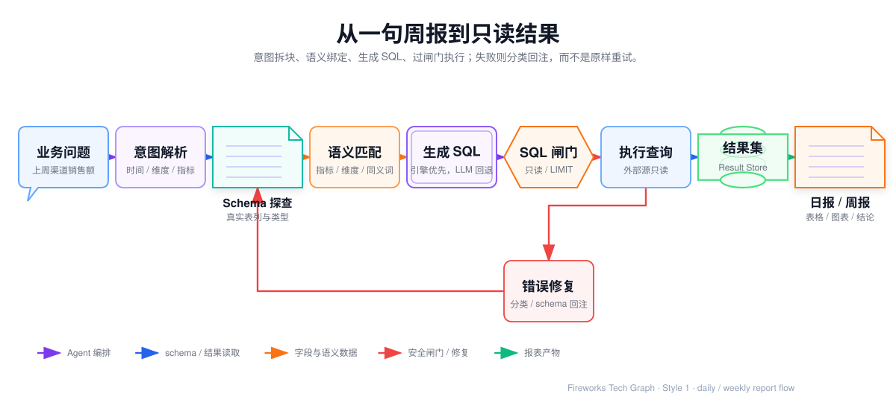

## 我参与的日报周报 SQL 生成流程

> 本文中的表名、字段名、日期、数值和接口名称均为脱敏或泛化示例，仅用于说明技术流程。



<InteractiveDiagram
  title="Text2SQL 日报周报流程"
  src="../../media/projects/baozun-lexicon/diagrams/text2sql-report-flow/index.html?embed=1"
  poster="../../media/projects/baozun-lexicon/diagrams/text2sql-report-flow/preview.png"
  description="从业务问题、意图解析和 Schema 探查，到 SQL 生成、只读执行、结果保存和报告交付。"
/>

### 1. 我如何拆解一条业务问题

业务人员可能会提出：

> 查询 2026 年 8 月 30 日各渠道销售额、支付订单量和退款金额，并与上周同日比较，生成日报。

这句话不能直接交给数据库执行。我会先将它拆解为查询意图：

| 查询要素 | 识别内容 |
| --- | --- |
| 当前周期 | 2026-08-30 |
| 对比周期 | 2026-08-23 |
| 统计维度 | 渠道 |
| 业务指标 | 销售额、支付订单量、退款金额 |
| 衍生计算 | 差值、环比变化率 |
| 排序方式 | 按当前销售额倒序 |

这一步的重点不是把自然语言机械改写成英文，而是确认一条 SQL 必须包含哪些事实。比如“上周同日”与“上一个自然周”不是同一个时间条件；“销售额”也不一定就是某个字段名称，它可能对应支付金额或其他已经审核过的口径。

当时间范围、业务时区或指标定义存在歧义时，我会把问题停在澄清环节，不让模型自行选择一个看似合理的答案。

### 2. 我如何确认真实表和字段

意图确定后，系统通过数据源元数据查询获得候选表、字段和类型。为了避免暴露实际数据结构，下面使用泛化后的示例：

| 逻辑含义 | 示例对象 | 类型 | 用途 |
| --- | --- | --- | --- |
| 渠道日报汇总 | daily_sales_summary | table | 查询主体 |
| 统计日期 | stat_date | date | 时间过滤 |
| 渠道 | channel | varchar | 分组维度 |
| 支付金额 | paid_amount | decimal | 求和 |
| 支付订单数 | paid_orders | bigint | 求和 |
| 退款金额 | refund_amount | decimal | 求和 |

元数据查询的意义，是把 SQL 生成限制在“数据库真实存在的对象”内。模型不能因为“渠道”这个中文词，就随意生成 channel_name、channel_id 或 sales_channel。字段类型也要参与判断：日期列用于时间过滤，数值列用于度量，文本列通常用于维度或筛选。

列画像还可以辅助判断字段是否适合做分组。例如空值率很高的列不适合直接作为报告维度，基数极高的列不适合默认用于日报汇总，低基数列的常见值可以帮助处理业务别名和数据库实际值之间的差异。

### 3. 我如何把业务词匹配到 SQL 计算对象

我会把自然语言中的业务词分成三类：

- **维度**：渠道、品牌、地区、日期等，用于筛选或 GROUP BY；
- **度量**：金额、订单数、件数等，需要确定求和、计数或其他聚合方式；
- **指标**：由一个或多个度量按照固定业务规则计算出的结果，例如销售额、退款率和环比变化率。

语义层的作用是保存这三类对象与真实数据字段之间的关系，并记录同义词、业务值映射、可用聚合方式和表间关联。

例如“销售额”需要绑定经过确认的支付金额口径；如果查询的是每日汇总表，支付订单数可能直接求和；如果查询的是订单明细，则可能需要去重计数。两种 SQL 都能执行，但含义完全不同，不能只根据字段类型决定。

在语义信息完整时，我会优先使用已治理的指标和维度生成 SQL；语义信息不完整时，生成结果只作为候选查询，后续需要加强人工核对。

### 4. 一个脱敏的 SQL 生成结果

假设 daily_sales_summary 确实按日期和渠道提供汇总数据，系统可能生成下面的查询：

```sql
WITH current_day AS (
    SELECT
        channel,
        SUM(paid_amount) AS current_sales,
        SUM(paid_orders) AS current_orders,
        SUM(refund_amount) AS current_refund
    FROM daily_sales_summary
    WHERE stat_date = '2026-08-30'
    GROUP BY channel
),
previous_day AS (
    SELECT
        channel,
        SUM(paid_amount) AS previous_sales
    FROM daily_sales_summary
    WHERE stat_date = '2026-08-23'
    GROUP BY channel
)
SELECT
    current_day.channel,
    current_day.current_sales,
    previous_day.previous_sales,
    current_day.current_sales
        - COALESCE(previous_day.previous_sales, 0) AS sales_difference,
    (
        current_day.current_sales
        - COALESCE(previous_day.previous_sales, 0)
    ) / NULLIF(previous_day.previous_sales, 0) AS wow_rate,
    current_day.current_orders,
    current_day.current_refund
FROM current_day
LEFT JOIN previous_day
    ON current_day.channel = previous_day.channel
ORDER BY current_day.current_sales DESC
LIMIT 100;
```

我关注的不是让 SQL 看起来复杂，而是让它满足业务和工程约束：

- 当前周期和对比周期使用一致的表、维度和聚合逻辑；
- 汇总表中的订单量与明细表中的订单量采用不同计算方式；
- 使用安全的除零处理；
- 使用 LEFT JOIN 保留当前周期有数据、对比周期无数据的渠道；
- 明确排序和返回上限；
- 物理对象以元数据结果为准，示例不能直接替代公司的真实 SQL。

### 5. 我如何控制 SQL 执行

生成 SQL 后，模型不会直接获得数据库连接，而是通过后端的查询能力发起请求。查询执行前，我会关注以下边界：

1. 只允许数据读取语句；
2. 拦截写入、删除、表结构变更和管理类语句；
3. 拒绝注释和多语句拼接，避免一条请求隐藏其他命令；
4. 控制返回行数和查询超时；
5. 使用只读账号和最小数据权限；
6. 保存查询请求、SQL 版本、执行状态和结果摘要；
7. 查询失败时只返回必要的错误信息，避免泄露敏感数据。

所以“AI 可以执行 SQL”更准确地说是：AI 可以提出 SQL 查询，由后端在受控权限下代为执行。模型没有修改或删除数仓数据的权限。

### 6. 查询失败时如何处理

我会先区分错误类型，再决定是否修复：

| 错误类型 | 处理方式 |
| --- | --- |
| SQL 语法错误 | 在不改变原查询意图的情况下定向修复 |
| 表或字段不存在 | 依据真实元数据重新匹配 |
| 权限错误 | 停止自动重试，转人工处理 |
| 查询超时 | 缩小范围、减少字段或改用汇总数据 |
| 结果为空 | 先判断是否为真实业务事实，再决定是否修改条件 |
| 指标含义不明确 | 回到业务澄清，不能直接猜测 |

例如模型误写了不存在的 channel_name，而实际元数据中只有 channel，系统可以返回有限的字段提示，再生成修复后的候选 SQL。修复后的 SQL 仍然需要重新经过安全检查，且修复次数必须有限。

### 7. SQL 结果如何变成日报和周报

查询成功后，我会把结果分成三部分：

- **表格数据**：渠道、销售额、订单量、退款金额和变化率；
- **图表数据**：渠道排名、当前周期与对比周期的柱状图或趋势图；
- **文字摘要**：基于已经返回的结果，生成增长、下降和异常说明。

日报与周报的差别主要在参数：

- 日报通常查询最近一个完整日；
- 周报通常查询一段完整周期，并与上一周期比较；
- 同一份报表应该只替换日期参数，不重新改变表、字段、JOIN 和指标公式；
- 报表中的数字必须来自查询结果，文字生成不能自行补充数字。

我会将首次生成的 SQL 视为草稿。经过技术和业务确认后，再保存为参数化 SQL 模板，由外围调度能力按日期执行。临时分析可以即时生成 SQL，正式日报和周报则使用已审核的稳定查询逻辑。

### 8. 这条流程对我的工作有什么帮助

这条能力让我可以用统一流程处理“业务问题、SQL 查询和报告结果”之间的转换：

- 面对业务问题时，先梳理时间、维度和指标；
- 面对数据源时，先依据元数据确认表和字段；
- 面对 SQL 时，同时检查语义、权限和资源消耗；
- 面对结果时，区分“查询成功”和“业务正确”；
- 面对固定报表时，保留审核后的 SQL 和查询版本。

我参与的重点不是让模型任意生成 SQL，而是让自然语言查询具备可解释、可校验、可追溯的执行过程。这样，Cognida 才能作为数仓之上的查询辅助层，为日报、周报和临时分析提供稳定的数据结果。
