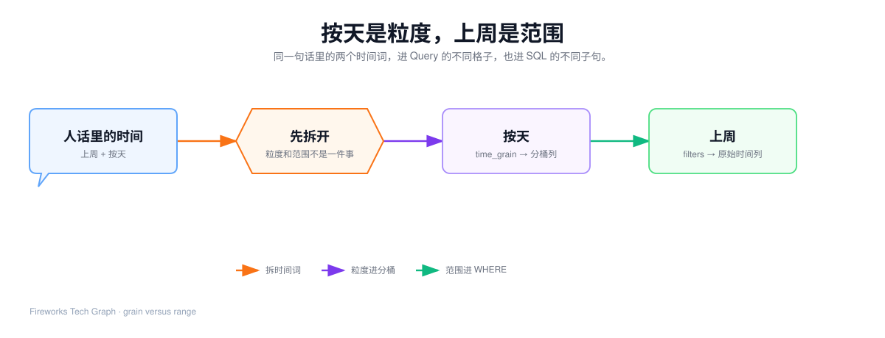
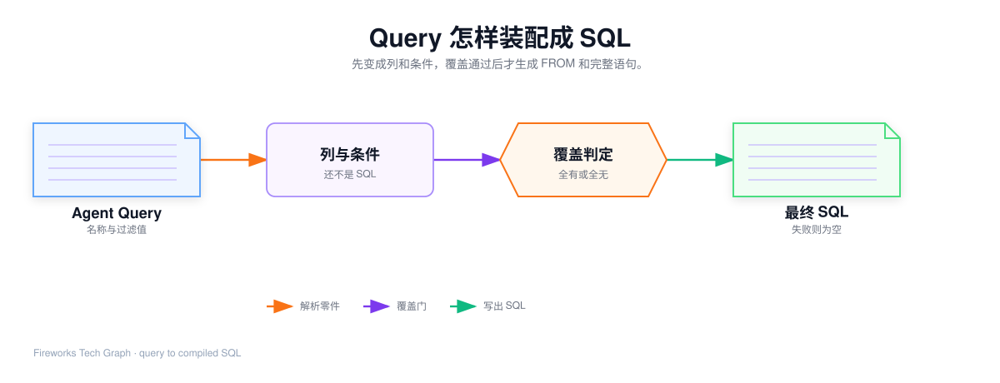
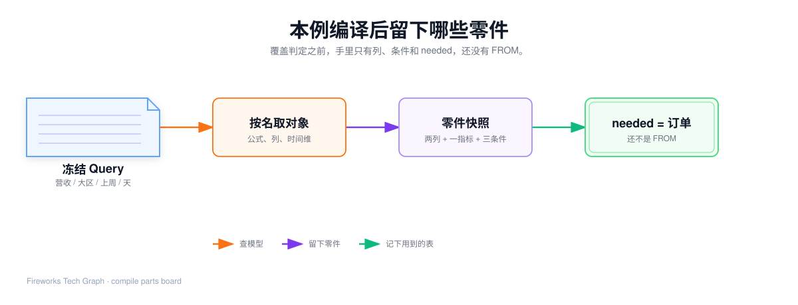

## 这篇要让你看懂什么

拿着 Agent 真正提交的 Query，用同一句人话走出**一条完整 SQL**。

1. Agent 只能返回什么字段，哪些东西根本不允许出现；
2. 「上周 / 华东 / GMV / 按天」分别进 Query 哪一格，为什么不能混；
3. 本例从 51 的模型包里实际用到哪些对象；
4. 每一步留下什么中间零件，怎样装配成 SELECT / WHERE / GROUP BY；
5. 合上文章后，能默写本例的 Query 和最终 SQL。

谁决定调用引擎见 [71](./71-agent-hit-path)，覆盖失败后怎样改工具见 [72](./72-agent-fallback-and-report)。跨表 JOIN、空 SQL、按版本复用，见 [62](./62-metricsql-join-and-assemble)。

---

## 1. Agent 返回的是 Query，不是 SQL

问数入口看完 [51](./51-semantic-objects-and-runtime-flow) 的目录卡之后，只允许产出结构化取数请求。引擎入口在实现里叫 `metricsql.Build(模型包, Query)`：一边是生效模型包，一边是这份请求。

合同就这一句：


| 字段 | 含义 | 可以填 | 不可以填 |
| --- | --- | --- | --- |
| `metrics` | 要算的指标 | `营收`、`GMV` | `SUM(pay_amount)`、任意表达式 |
| `dimensions` | 分组维度 | `大区`、`下单日期` | 物理表名、`GROUP BY` 片段 |
| `filters` | 维度名 + 白名单算子 + 业务标签 | `大区 = 华东` | JOIN、指标名、随便写的算子 |
| `time_grain` | 时间分桶 | `day` / `week` / `month` / `quarter` / `year` | 「上周」（那是范围） |
| `order_by` | 已选列上的排序 | `下单日期` 升序 | 未选中的列、任意表达式 |
| `limit` | 行数上限 | 正整数 | OFFSET |
| `dialect` | 目标库方言 | 一般由数据源推导，本例按 MySQL | 对话里发明函数名 |

算子白名单只有：`=` `!=` `>` `>=` `<` `<=` `like` `in`。没有 `between`，没有 `or`。范围用两条条件拼：`>=` 加 `<`。

下面这份是**非法**的，引擎不应接受：

```json
{
  "sql": "SELECT SUM(pay_amount) FROM fact_order",
  "metrics": ["营收"]
}
```

对话里出现物理表、ON、或指标公式，说明 51 的目录卡隔离已经破了。编译侧即使看见这些字段，也不会用它们生成 SQL。

---

## 2. 业务用语怎样拆进 Query


人话里的四个词，进四个不同的格子：

| 人话 | 进 Query 的哪一格 | 为什么不能进别的格子 |
| --- | --- | --- |
| GMV | `metrics: ["营收"]` | 同义词在模型里，指标名才有公式 |
| 华东区 | `filters` 里大区 = 华东；若还要看见分区，再把大区放进 `dimensions` | 过滤值不是维度名，也不能写成 JOIN |
| 按天 | `time_grain: "day"`，并带上时间维「下单日期」 | 「天」是分组粒度，不是过滤范围 |
| 上周 | `filters` 里下单日期的半开区间 | 引擎不认识「上周」这三个字 |

「上周」必须由 Agent **先算成绝对日期**再提交。引擎只接收字面量。本篇冻结的区间是 `[2026-09-07, 2026-09-14)`：含上周周一 0 点，不含本周周一 0 点。

本例还要把「大区」放进 `dimensions`：人话要「华东区的 GMV」，结果集仍按大区看见分区；如果只过滤不分组，SELECT 里就不会出现大区列。

冻结后的 Query（60 / 61 / 62 三篇同一份）：

```json
{
  "metrics": ["营收"],
  "dimensions": ["大区", "下单日期"],
  "filters": [
    { "field": "大区", "op": "=", "values": ["华东"] },
    { "field": "下单日期", "op": ">=", "values": ["2026-09-07"] },
    { "field": "下单日期", "op": "<", "values": ["2026-09-14"] }
  ],
  "time_grain": "day",
  "order_by": [{ "field": "下单日期", "desc": false }]
}
```

若 Agent 把指标写成 `GMV`，查找表仍打到同一条「营收」。口径不因为换了叫法而变。最终 SQL 的列别名用模型里的正式名「营收」，不是对话里的口头禅。

---

## 3. 按天是粒度，上周是范围

这是本篇最容易混的一对概念，必须先钉死。



| | 粒度 | 范围 |
| --- | --- | --- |
| 回答的问题 | 时间列按什么单位分组？ | 看哪一段数据？ |
| 人话 | 按天 / 按周 / 按月 | 上周、最近两个月 |
| Query 字段 | `time_grain` | `filters` 里的日期条件 |
| 改哪一列 | 时间维的**分桶表达式** | **原始**时间列 |
| 进哪个 SQL 子句 | SELECT 与 GROUP BY | WHERE |
| 本例 | `DATE_FORMAT(orders.created_at, '%Y-%m-%d')` | `created_at >= '2026-09-07' AND created_at < '2026-09-14'` |

两者可以同时存在。本例就是同时存在。把「上周」写成 `time_grain: "week"`，结果会变成「按自然周分组的全部历史」，不是「上周七天按天展开」。

---

## 4. 本例从 51 拿走哪些对象

编译开始前，内存里是 51 那份「电商销售」模型包。本例**不会用完整对象树**，只用下面这些：

| 对象 | 本例用到的字段 | 本例用不到 |
| --- | --- | --- |
| 模型头 | 名称「电商销售」、生效、版本 1 | 草稿模型 |
| 逻辑表「订单」 | 物理表 `fact_order`，别名 `orders` | 用户表（本例还不用 JOIN） |
| 指标「营收」 | 公式 `SUM(orders.pay_amount)`，同义词含 GMV | 净营收的 `{ }` 展开 |
| 度量「支付金额」 | 只在指标未命中时才降级用 | 本例指标已命中，不走降级 |
| 维度「大区」 | 表达式 `region`，无值映射 | — |
| 维度「下单日期」 | 表达式 `created_at`，类型=时间 | 主时间维自动注入（本例已经选了它） |
| 维度「订单状态」 | — | 本例没过滤状态 |
| 关系「订单 → 用户」 | — | 本例 needed 只有订单 |

大区库内就存「华东」，没有「华东 → east」的映射。所以过滤值会原样进 SQL。这不是漏了映射，是这个维度不需要映射。

---

## 5. Query 变成 SQL 的链路



| 顺序 | 读 Query | 读模型（见 [60](./60-metricsql-compile-engine)） | 本例留下什么 |
| --- | --- | --- | --- |
| 索引 | 无 | 整份模型包 | 按名查找 |
| 维度 | `dimensions` | 维度对象 | 两条分组列 |
| 指标 | `metrics` | 指标 / 度量 | 一条计算列 |
| 时间 | `time_grain` | 时间维 | 下单日期改成分桶表达式 |
| 过滤 | `filters` | 维度 + 值映射 | 三条 WHERE 零件 |
| 覆盖 | 上面的失败名 | — | 本例列表为空，继续 |
| JOIN | — | 逻辑表 + 关系 | 本例只有订单，不生成 JOIN |
| 装配 | `order_by`、`limit`、`dialect` | 不再查对象 | 一条 SQL |

失败出口的规则在 [62](./62-metricsql-join-and-assemble)。下面按命中路径把零件写出来。

---

## 6. 逐步变成零件



中间结果用脱敏快照，不是内部结构体名字。你复盘时，每一步都应能填出右栏。

### 6.1 索引：先能按名字找到对象

| 请求里的词 | 查找表打到 |
| --- | --- |
| 营收 / GMV / 销售额 | 同一条指标「营收」 |
| 大区 / 区域 | 同一条维度「大区」 |
| 下单日期 / 日期 | 同一条维度「下单日期」 |

索引本身不失败。对不上的词在后面取对象时才进入未覆盖列表。本例三个词都能查到。


### 6.2 维度：请求名变成分组列

请求字段：`dimensions: ["大区", "下单日期"]`。

| 请求名 | 模型对象 | 中间列（尚未分桶） | 记入 needed |
| --- | --- | --- | --- |
| 大区 | 订单上的区域列，无值映射 | `orders.region`，别名「大区」，不是时间 | 订单 |
| 下单日期 | 订单创建时间，类型=时间 | `orders.created_at`，别名「下单日期」，标成时间维 | 订单 |

过滤里的「华东」**不在这一步翻译**。本步只处理要展示、要分组的名。

若名称在查找表里不存在，把这个词记入未覆盖，不用相近维度顶上。

### 6.3 指标：名称变成计算列

请求字段：`metrics: ["营收"]`。查找顺序固定：

1. 先当指标名 / 同义词。命中则取公式；公式里若有 `{名称}`，再展开。
2. 再当度量名。指标库没有时，用度量的表达式套上默认聚合。
3. 两张表都没有。该名称记入未覆盖。


### 6.4 时间：只改已经标成时间的维度

`time_grain = day`，下单日期已被标成时间维。原始 `created_at` 带时分秒，直接 GROUP BY 会按秒拆开，看起来不像「按天」。

本步把表达式改成按天分桶（MySQL 示例）：

`DATE_FORMAT(orders.created_at, '%Y-%m-%d')`

SELECT 与 GROUP BY 必须用**同一份**表达式。方言只换函数写法：PostgreSQL 会变成 `TO_CHAR(..., 'YYYY-MM-DD')`，数字口径应对上。

本步结束后，下单日期列不再是原始 `created_at`。过滤步里的「上周」仍然打在原始时间列上。

若 Query 要了粒度，但 `dimensions` 里没选任何时间维，引擎会注入模型主时间维（通常就是下单日期）。本例已经选了，不注入。若模型里根本没有时间维，记未覆盖，不能静默返回一条不分桶的全时段汇总。

### 6.5 过滤：只生成 WHERE

三条条件分别处理。过滤字段必须是维度；指标名不能进 WHERE。

| 条件 | 翻译过程 | WHERE 零件 |
| --- | --- | --- |
| 大区 = 华东 | 字段命中维度；无值映射；值做字面量转义 | `orders.region = '华东'` |
| 下单日期 ≥ 2026-09-07 | 字段命中时间维；作用在**原始**时间列 | `orders.created_at >= '2026-09-07'` |
| 下单日期 < 2026-09-14 | 同上 | `orders.created_at < '2026-09-14'` |

值映射的规则是：命中才替换，未命中**原样透传**，不算未覆盖。本例大区没有映射，所以「华东」保持中文。

字面量要转义。`O'Reilly` 会变成 `'O''Reilly'`。名称已经在查找时丢掉，不会进 SQL。

算子不在白名单、字段不是维度，记未覆盖。

### 6.6 覆盖判定

到这里未覆盖列表为空。名称全部命中，算子合法，时间维存在。

> Covered 先记为可继续。真正写出 SQL 之前，还要能确定基表、并把 needed 里的表连上。

本例 needed = {订单}。基表就是订单事实表，**不生成 JOIN**。若 Query 再加维度「城市」，城市在用户表，needed 变成订单 + 用户，才走已登记的订单 → 用户。

### 6.7 零件包（装配前）

把上面收成一张表，后面装配只准读这张表：

| 零件类型 | 内容 |
| --- | --- |
| 分组列 1 | 表达式 `orders.region`，别名「大区」 |
| 分组列 2 | 表达式 `DATE_FORMAT(orders.created_at, '%Y-%m-%d')`，别名「下单日期」 |
| 计算列 | 表达式 `SUM(orders.pay_amount)`，别名「营收」 |
| WHERE | 大区等值 + 两条时间范围 |
| FROM | `fact_order AS orders`（无 JOIN） |
| 排序 | 字段「下单日期」，升序；必须能在分组列里找到 |
| 行数 | 未指定，不写 LIMIT |

---

## 7. 装配：零件按子句就位

装配不再查模型对象。顺序固定，不随输入改：

| 子句 | 放入什么 | 本例 |
| --- | --- | --- |
| SELECT | 先维度列，后指标列；别名用业务名 | 大区、下单日期、营收 |
| FROM | JOIN 规划给出的片段 | 只有订单 |
| WHERE | 过滤零件，AND 连接 | 三条 |
| GROUP BY | 所有维度列的**表达式**，不是别名 | `orders.region` 与分桶函数 |
| ORDER BY | Query 指定、且已在 SELECT 中的列 | 分桶后的下单日期 ASC |
| LIMIT | 正整数才写 | 本例没有 |

GROUP BY 必须与 SELECT 里的维度表达式同一份。写成 `GROUP BY \`下单日期\`` 在部分库能跑，但口径引擎统一用表达式，避免换库对不上。

排序字段不在本次 SELECT 里，不报错、不拼进 ORDER BY。防止 Agent 把未治理表达式塞进排序。本例「下单日期」在 SELECT 中，所以会写出 ORDER BY。

---

## 8. 最终 SQL

表名、列名按脱敏示例，口径与上面零件一致：

```sql
SELECT
  orders.region AS `大区`,
  DATE_FORMAT(orders.created_at, '%Y-%m-%d') AS `下单日期`,
  SUM(orders.pay_amount) AS `营收`
FROM fact_order AS orders
WHERE orders.region = '华东'
  AND orders.created_at >= '2026-09-07'
  AND orders.created_at < '2026-09-14'
GROUP BY
  orders.region,
  DATE_FORMAT(orders.created_at, '%Y-%m-%d')
ORDER BY DATE_FORMAT(orders.created_at, '%Y-%m-%d')
```

| 人话 / Query | SQL 里对应 | 不在 SQL 里的东西 |
| --- | --- | --- |
| GMV / `metrics: 营收` | `SUM(orders.pay_amount) AS 营收` | 对话里的单词 `GMV` |
| 按大区看见分区 | `orders.region` 进 SELECT 和 GROUP BY | — |
| 按天 | `DATE_FORMAT(...)` 同时出现在 SELECT 与 GROUP BY | `time_grain` 这个字段名 |
| 华东 | WHERE 等值，不是 JOIN | 值映射（本例没有） |
| 上周 | WHERE 时间范围，作用在原始时间列 | 「上周」三个字、按周分桶 |
| 没有城市 | 没有 JOIN | 用户表 |

对话全程看不到这条 SQL。引擎把它和数据源一起交给只读执行。

复盘时用这张检查表对着 SQL 打勾：SELECT 有没有业务别名、WHERE 有没有打在原始时间列、GROUP BY 是否与分桶表达式同一份、有没有多余 JOIN。

---

## 9. 只换一个词会怎样

这些变体用来确认你是在走规则，而不是背这一条 SQL。

### 9.1 指标写成 GMV

Query 的 `metrics` 改成 `["GMV"]`。查找表打到「营收」，公式不变，SQL 不变，列别名仍是「营收」。

### 9.2 漏掉下单日期，但留着按天

`dimensions` 只留 `["大区"]`，`time_grain` 仍是 `day`。引擎发现没有时间维，注入模型主时间维「下单日期」，再套分桶。结果 SQL 仍会按天分组，只是 Agent 没点名这个维度。

### 9.3 不要按天，只要上周华东一个数

去掉 `time_grain`，`dimensions` 只留 `["大区"]`。下单日期不再进 SELECT / GROUP BY，WHERE 里的上周区间仍在。结果是一行：华东区上周营收合计。

### 9.4 改成目录卡里没有的「实时库存」

```json
{ "metrics": ["实时库存"], "dimensions": ["下单日期"], "time_grain": "day" }
```

查找表没有该指标，也没有同名度量。未覆盖列表非空，**返回空 SQL**，不会先按天下单再硬凑一列库存。回退由 Agent 决定。完整失败规则见 62。

---
