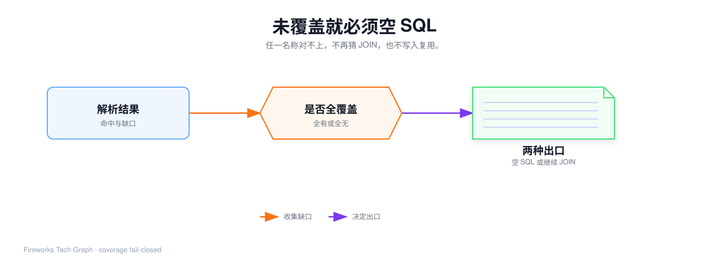
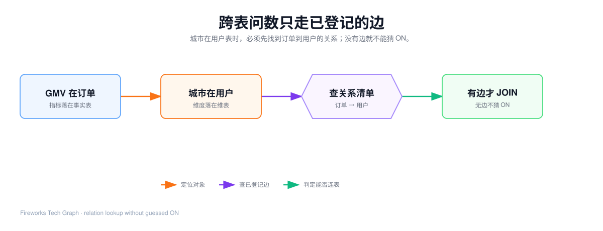
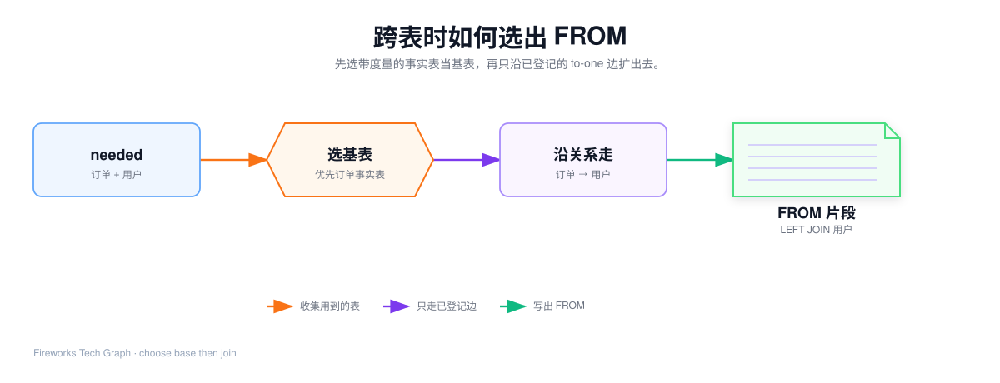
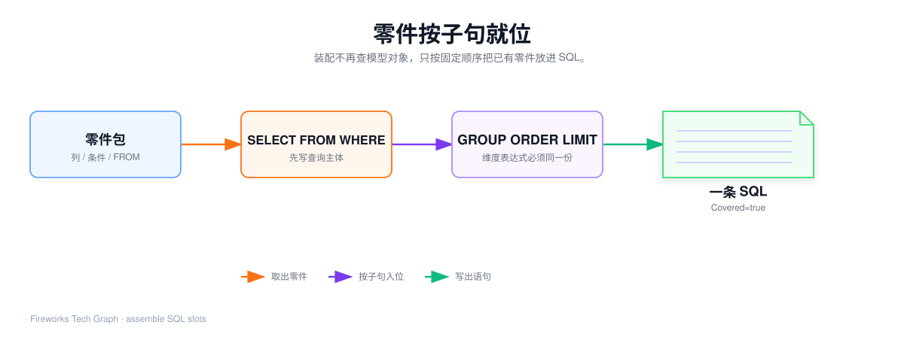
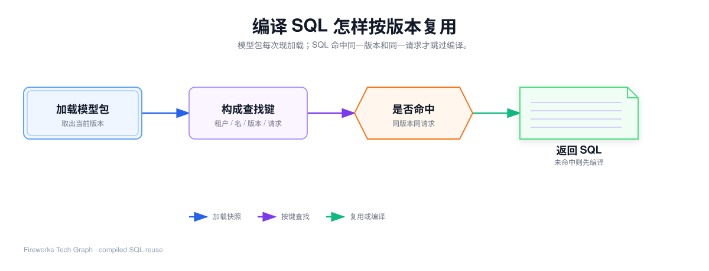

## 这篇要让你看懂什么

[61](./61-metricsql-name-resolution) 已经用「上周华东 GMV 按天」走出一条**单表命中**的 SQL。

1. 为什么失败必须是空 SQL，而不能先拼 SELECT；
2. 哪些缺口会进未覆盖列表，哪些看起来像错误、其实不算未覆盖；
3. 基表怎么选，没有边为什么不能猜 ON，桥接表为什么可以出现；
4. 七个 SQL 子句各自放哪些零件，单表和跨表差在哪一段；
5. 模型版本如何让旧 SQL 失效。

Agent 何时回退、缓存放在哪，本篇只给出 Covered 和 SQL 这两个信号。

贯穿例子继续用电商销售模型。命中路径仍认 61 那份冻结 Query；失败路径改指标为「实时库存」；跨表路径把维度换成「城市」。

---

## 1. 覆盖判定：失败必须是空 SQL

引擎的承诺：只有被语义模型**完全**接住的请求，才生成可执行 SQL。



覆盖判定不是单独的「再扫一遍模型」。

> 未覆盖列表非空 → Covered=false，SQL 必须是空字符串。不再做 JOIN，也不装配。

### 1.1 会记入未覆盖的情况

对齐实现，过滤字段必须是维度。

| 环节 | 触发条件 | 记入未覆盖的内容 |
| --- | --- | --- |
| 维度解析 | 维度名 / 同义词对不上 | 该名称 |
| 指标解析 | 指标名、度量名都对不上 | 该名称 |
| 指标展开 | `{引用}` 缺对象或成环 | 该指标名，并记一条原因 |
| 时间粒度 | `time_grain` 不是 day/week/month/quarter/year | `time_grain(非法值)` |
| 时间维度 | 要了分桶，模型里却没有任何时间维 | `time_grain(...): 模型无时间维度` |
| 过滤字段 | 字段不是维度 | 该字段名 |
| 过滤算子 | 不在 `=` `!=` `>` `>=` `<` `<=` `like` `in` | `字段(算子xx)` |
| 基表 | 名称都对上了，但选不出任何物理表 | 不往名称列表里塞词，Notes 记「无法确定基表」 |
| JOIN | needed 里有表，沿关系走不到 | Notes 记「跨表关系不足」 |

后两行也是 Covered=false、空 SQL。它们发生在名称列表已经空了之后，是第二道门。

### 1.2 看起来像错、却不算未覆盖

| 现象 | 引擎怎么做 | 为什么 |
| --- | --- | --- |
| 值映射里没有这个标签 | 原样把值写进 SQL | 「华东」这种本身就是物理值的维度必须能过 |
| ORDER BY 字段不在本次 SELECT | 丢掉这条排序，不报错 | 防止注入未治理表达式，但不必为此回退整句 |
| 没传 `time_grain` | 时间列保持原始精度 | 粒度是可选增强，不是必填 |
| 没有 LIMIT | 不写 LIMIT 子句 | `<= 0` 视为未指定 |

### 1.3 为什么必须是空字符串

如果某个字段没覆盖，却仍生成「能拼多少算多少」的半截 SQL：

1. 这条 SQL 可能被按版本写入复用；
2. 下次相同请求会命中旧语句，错误口径被固化；
3. 业务人员看见数字，会以为系统支持这个指标。

所以宁可漏报，也不误报。覆盖记录会记下缺的词，供治理补模型；

### 1.4 失败案例：实时库存

```json
{
  "metrics": ["实时库存"],
  "dimensions": ["下单日期"],
  "time_grain": "day"
}
```

逐步走：

| 步骤 | 结果 |
| --- | --- |
| 索引 | 查找表没有「实时库存」这个键 |
| 维度 | 「下单日期」命中，分组列准备好 |
| 指标 | 指标表没有、度量表也没有 → 名称进入未覆盖 |
| 时间 | 即使会给下单日期分桶，也不再重要 |
| 覆盖门 | 列表非空 → **立刻返回** |

出口不是「先按天 GROUP BY 再空一列库存」，而是：

```json
{
  "sql": "",
  "coverage": {
    "covered": false,
    "resolved_dimensions": ["下单日期"],
    "uncovered": ["实时库存"]
  }
}
```

回退到 `get_schema + sql_execute` 是 Agent 的事。引擎只保证：未覆盖结果**禁止写入复用**。

### 1.5 另外两个容易忽略的失败

**过滤用了指标名。** `filters: [{ "field": "营收", "op": ">", "values": ["10000"] }]`。营收是指标，不是维度。字段进入未覆盖，整句空 SQL。若业务真要筛金额，应在建模侧提供「支付金额」一类维度，或接受回退。

**要了按天，模型却没有时间维。** 不能静默返回一条不分桶的全时段汇总。那条 SQL 一旦被当成命中复用，口径就假了。

---

## 2. JOIN 规划：只走已登记的 to-one 边

单表案例不需要 JOIN。一旦维度或指标落到第二张逻辑表，needed 里就会出现多张表。





### 2.1 needed 是什么

needed 是解析过程中累积的逻辑表集合，不是 FROM 子句：

- 维度的归属表；
- 指标公式推断出的表；
- 过滤字段的归属表；
- 自动注入的主时间维所在表。


### 2.2 跨表 Query：上周各城市 GMV 按天

人话改成：「上周各城市的 GMV 是多少？按天展示。」

```json
{
  "metrics": ["营收"],
  "dimensions": ["城市", "下单日期"],
  "filters": [
    { "field": "下单日期", "op": ">=", "values": ["2026-09-07"] },
    { "field": "下单日期", "op": "<", "values": ["2026-09-14"] }
  ],
  "time_grain": "day",
  "order_by": [{ "field": "下单日期", "desc": false }]
}
```

| 请求名 | 落在哪张逻辑表 | 中间列 |
| --- | --- | --- |
| 营收 | 订单 | `SUM(orders.pay_amount)` |
| 城市 | 用户 | `users.city`，别名「城市」 |
| 下单日期 | 订单 | 按天分桶后的 `created_at` |

needed = {订单, 用户}。名称都对得上，覆盖门通过，进入 JOIN。

### 2.3 选基表

优先级固定，为了同一请求每次选出同一张表：

1. **优先某个指标归属的表。** 营收在订单上，本例直接选订单。
2. 否则取某个维度的表。
3. 只有一张逻辑表，就用那一张。
4. 多表且归属不清，从 needed 里挑**带度量的事实表**；多个事实表时用别名字典序，避免 map 遍历顺序把口径打乱。

为什么必须从事实表出发：从用户表出发再一对多连订单，同一客户的多笔订单会把 GMV 加重复。这就是扇出。建模期把订单 → 用户登记成 to-one，运行时不得反过来猜。

### 2.4 从基表扩出去

规则固定：

1. 初始 `included = {基表}`，先写出 `FROM fact_order AS orders`；
2. 反复扫描关系列表：一端已在 included、另一端还不在，就把新表接上；
3. JOIN 类型、ON 条件全部来自关系对象，引擎不改写；
4. 默认 LEFT JOIN。基表是事实表时，维表没匹配也不能丢掉订单行；
5. 扩完之后，needed 里每一张表都必须在 included 里。缺一张就 Covered=false。

本例模型里已有：订单 → 用户，左连接、to-one、`订单.用户标识 = 用户.主键`。一轮就能接上用户表：

```sql
FROM fact_order AS orders
LEFT JOIN dim_user AS users ON orders.user_id = users.id
```

**不判断「这个表有没有被 SELECT 用到」才 JOIN。** 只判断「能不能从已知表扩到未知表」。校验阶段才检查 needed 是否到齐。

### 2.5 没有这条边

把关系从模型里拿掉，城市仍然解析成功，needed 仍是 {订单, 用户}。覆盖门的名称列表是空的。JOIN 规划发现用户表走不到，于是：

> Covered=false，SQL 为空。Notes：逻辑表「用户」无可用关系连接到基表。

不能临时写一个 `ON orders.city = users.city`，也不能因为列名都叫 city 就自作聪明。猜 ON 会让口径随数据分布漂移，无法复盘。

### 2.6 桥接表：用户没点名，FROM 里却可能出现

`planFrom` 不是「只 JOIN needed」。它会把从基表沿关系**可达**的表接进来，因为 needed 里的表可能要靠中间表才能连通。

商品销售主题里常见三跳：明细 → 商品 → 品类。查询只要「品类」和「销售额」：

- needed = {明细, 品类}；
- 商品不在用户点名的对象里；
- 没有商品这一跳，品类永远走不到；
- FROM 里必须出现商品表。

多轮扫描就是为这个准备的：关系数组顺序不固定，第一轮可能先扫到「商品 → 品类」（商品还不在 included，跳过），第二轮才接上。无论登记顺序如何，结果必须同一条链。

缺一跳即失败，与单跳缺边相同。

### 2.7 只要 to-one

一对多会把金额放大。关系对象在 51 已经要求 to-one。运行时不再根据数据判断「这一次会不会扇出」。数据变了，SQL 不许变。

一对多风险属于建模期治理警告，不是编译期猜 INNER 还是 LEFT。

### 2.8 单表时仍会走规划

61 那份 Query 也会进 `chooseBase` / `planFrom`。基表是订单，关系扫一轮没有任何新表，返回的 FROM 就是 `fact_order AS orders`。不是「跳过 JOIN 步骤」，而是「规划结果里没有 JOIN」。

---

## 3. SQL 装配：零件按子句就位

覆盖通过、FROM 已有之后，装配不再查模型对象。



| 子句 | 放入什么 | 注意 |
| --- | --- | --- |
| SELECT | 先维度列（已分桶的时间列），后指标列 | 输出别名用业务名；标识符按方言加引号 |
| FROM / JOIN | JOIN 规划的整段字符串 | 装配不改 ON |
| WHERE | 过滤条件，AND 连接 | 时间范围作用在原始时间列；没有 OR |
| GROUP BY | 所有维度列的表达式 | 必须与 SELECT 里的维度表达式同一份 |
| ORDER BY | Query 指定、且已在 SELECT 中的列 | 未选中的字段直接丢掉 |
| LIMIT | 正整数才写 | 无 OFFSET |

方言只替换函数和标识符引号。同一口径在不同库上分桶函数不同，数字应对上。

### 3.1 61 的单表 SQL，就是这张表填出来的

对照 [61](./61-metricsql-name-resolution) 第 8 节：SELECT 三列、FROM 只有订单、WHERE 三条、GROUP BY 两列、ORDER BY 分桶日期。没有 LIMIT。

### 3.2 跨表时只多一段 JOIN

城市案例装配后：

```sql
SELECT
  users.city AS `城市`,
  DATE_FORMAT(orders.created_at, '%Y-%m-%d') AS `下单日期`,
  SUM(orders.pay_amount) AS `营收`
FROM fact_order AS orders
LEFT JOIN dim_user AS users ON orders.user_id = users.id
WHERE orders.created_at >= '2026-09-07'
  AND orders.created_at < '2026-09-14'
GROUP BY
  users.city,
  DATE_FORMAT(orders.created_at, '%Y-%m-%d')
ORDER BY DATE_FORMAT(orders.created_at, '%Y-%m-%d')
```

和 61 比，只有三处变了：

| 位置 | 61 华东单表 | 本例城市跨表 |
| --- | --- | --- |
| SELECT 第一列 | `orders.region AS 大区` | `users.city AS 城市` |
| FROM | 只有订单 | 多一段 LEFT JOIN 用户 |
| WHERE | 多一条大区 = 华东 | 只剩时间范围 |

指标列、时间分桶、GROUP BY 必须与 SELECT 同行，这些规则不变。

### 3.3 没有维度时没有 GROUP BY

`metrics: ["营收"]` 且 `dimensions` 为空、也不要 `time_grain`：整句是全局聚合，没有 GROUP BY。这仍然是合法命中，只要指标能解析。

### 3.4 排序与行数

`order_by: [{ "field": "营收", "desc": true }]` 会写成 `ORDER BY SUM(orders.pay_amount) DESC`。写成 `{ "field": "随机表达式" }` 则整条排序被丢掉。

`limit: 100` 才追加 `LIMIT 100`。`0` 或不传都不写。没有 OFFSET，避免对话用翻页语法绕过治理。

---

## 4. 按版本复用：加载模型包 ≠ 每次重算 SQL

51 每次问数都加载生效模型包，是为了口径以当前版本为准。SQL 不必每次走完全部分步。



复用键至少包含：

| 部分 | 为什么必须在键里 |
| --- | --- |
| 租户 | 不同租户同名模型不能串结果 |
| 模型名 | 电商销售和商品销售不能串 |
| 模型版本 | 口径一改，旧 SQL 必须失效 |
| 规范化后的 Query | 指标、维度、过滤、排序、行数、时间粒度、方言任一不同，SQL 就不同 |

命中：直接返回已编译 SQL。未命中：走 60 / 61 那条链，成功再写入。

失效只有三类：版本抬升、过期、方言判断不准因而宁可不写入。

**未覆盖的结果禁止写入。** 否则「实时库存」会变成一条可复用的空口径。

缓存放在哪、TTL 多少、工具层如何取放，见 [72](./72-agent-fallback-and-report)。本层只规定：版本是失效锚点。

---

## 5. 执行引擎到此结束

| 从哪来 | 交给谁 |
| --- | --- |
| 51 模型包 + Agent Query | 本层编译 |
| Covered=true + SQL | Agent 去只读执行 |
| Covered=false + 空 SQL | Agent 去词法回退 |

两种出口不要记成「成功 / 报错」。对引擎来说，未覆盖是**合法结果**：它诚实地告诉上层，这句话不在治理范围里。

| 路径 | Covered | SQL | 下一步不该做什么 |
| --- | --- | --- | --- |
| 治理命中 | true | 非空 | 不要再让模型改写这条 SQL |
| 回退词法 | false | 空字符串 | 不要把空 SQL 当查询结果展示，也不要写入复用 |

下一层从 [71](./71-agent-hit-path) 开始：谁调用引擎、命中路径如何执行、未覆盖如何换工具。

---
