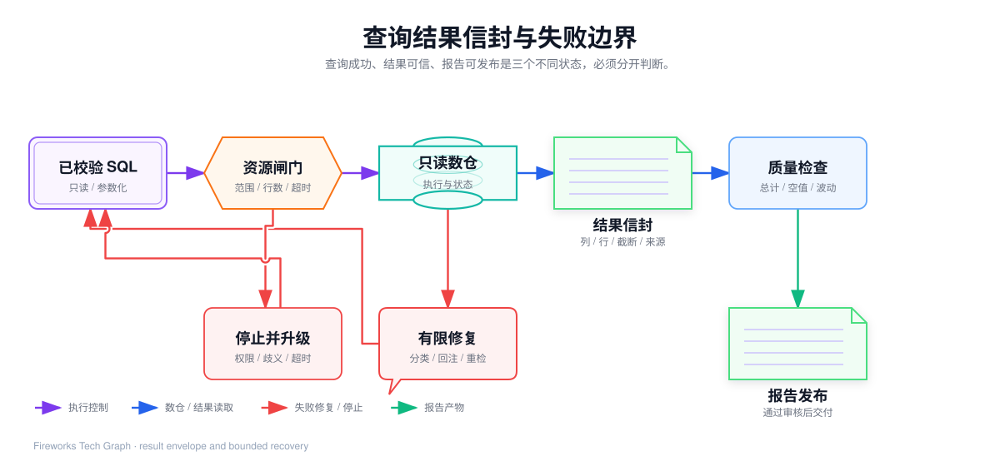
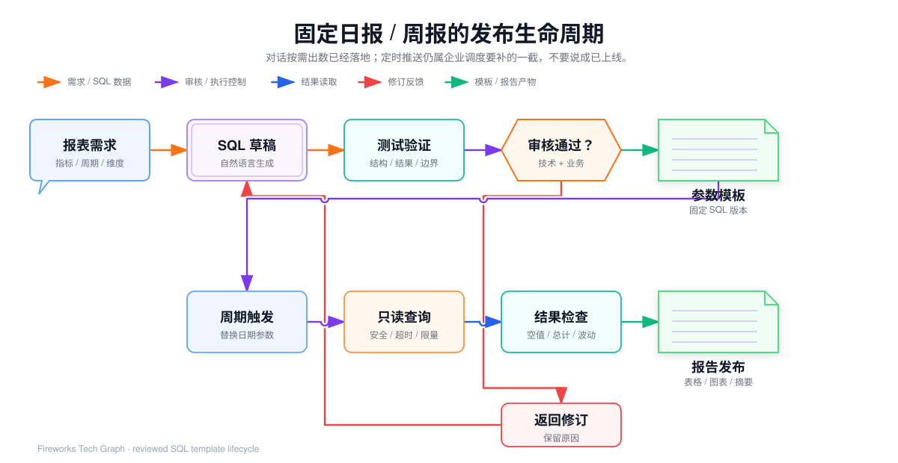

## 我参与的 SQL 安全与正确性验证

> 本文中的示例只用于说明方法，不包含公司源码、真实连接信息、内部配置、真实表名或未公开的业务规则。

## 1. “能执行”不等于“结果正确”

自然语言转 SQL 的风险有两类：

- **安全风险**：模型或用户提供了写入、删除、DDL、越权访问或高成本查询；
- **语义风险**：SQL 可以执行，但选错表、字段、时间、粒度、JOIN 或指标公式，导致日报和周报数字错误。

例如下面的 SQL 都可能正常执行，却不一定回答了同一个问题：

```sql
-- 业务问题：统计支付成功订单的销售额
SELECT SUM(order_amount) FROM order_detail;
SELECT SUM(paid_amount) FROM order_detail WHERE status = 'PAID';
SELECT SUM(paid_amount) FROM daily_sales_summary;
```

它们可能分别代表下单金额、支付金额明细和已汇总支付金额。SQL 引擎只负责执行，不负责判断业务口径。因此我把校验分为三道闸门：

1. SQL 是否是安全、可控的只读查询；
2. SQL 是否引用了真实 Schema 和已确认语义；
3. 结果是否满足日报周报的结构、范围和业务质量要求。


<InteractiveDiagram
  title="SQL 安全与正确性闸门"
  src="../../media/projects/baozun-lexicon/diagrams/sql-correctness-guardrails/index.html?embed=1"
  poster="../../media/projects/baozun-lexicon/diagrams/sql-correctness-guardrails/preview.png"
  description="SQL 候选经过语法、安全策略、Schema、只读执行和结果校验，固定报表再与审核基准和人工确认对照。"
/>

## 2. 第一层：应用级只读校验

项目中的 `sql_execute` 工具把查询行为收敛到 `SELECT` 或 `WITH`：

- 拒绝 `INSERT`、`UPDATE`、`DELETE`、`DROP`、`ALTER`、`CREATE`、`TRUNCATE` 等写入和结构变更语句；
- 拒绝 `GRANT`、`REVOKE`、`CALL`、`EXECUTE` 等管理或过程调用；
- 拒绝 `--` 和 `/* */` 注释，避免把隐藏语句或后续内容混入请求；
- 拒绝去掉末尾分号后仍包含分号的多语句；
- 只接受以 `SELECT` 或 `WITH` 开头的语句；
- 自动保证外层查询有 `LIMIT`，默认 100 行，上限 1000 行；
- 通过查询上下文设置 30 秒超时；
- 对死锁、锁等待和连接抖动等瞬时错误只做有限退避重试。

例如这条语句必须被拒绝：

```sql
UPDATE daily_sales_summary
SET paid_amount = paid_amount * 0.9
WHERE stat_date = '2026-08-30';
```

这条语句虽然以 `SELECT` 开头，但也不应放行：

```sql
SELECT * FROM order_detail; DELETE FROM order_detail;
```

应用层校验是第一道门，但不能作为唯一保护。字符串黑名单可能受 SQL 方言、编码和未来语法变化影响，所以还需要在数据库侧使用只读账号、只读事务、目标 Schema 白名单和最小权限。即使应用校验出现回归，数据库账号也不应该拥有修改数仓的权限。

## 3. 第二层：数据源路由和资源边界

Cognida 支持把外部数据源视为只读外部资源。查询工具的目标解析遵循：

```text
显式 database_id
  → 已注册外部数据源
空 database_id
  → 会话选定的数据源
仍为空
  → 应用业务库的兼容路径
非法 database_id / 没有 provider
  → 明确报错，不静默切换到其他库
```

语义模型绑定的数据源也要显式传给 `sql_execute`。如果一个语义模型的逻辑表绑定了多个不同数据源，系统不能随意挑一个库；这种模型属于建模错误，应返回未确定状态。

资源边界至少包括：

| 边界 | 控制方式 | 目的 |
| --- | --- | --- |
| 返回量 | 默认 100、最大 1000，外层 `LIMIT` | 防止 Agent 拉取无界结果 |
| 查询时长 | 30 秒上下文超时 | 防止单条查询长期占用连接 |
| 查询列 | 只选择报告所需列，避免 `SELECT *` | 降低网络和内存消耗 |
| 时间范围 | 报表必须有明确周期 | 防止全表扫描 |
| 数据源权限 | 外部源只读、按租户隔离 | 防止跨租户和写入 |
| 连接池 | 按租户和数据源管理，限制并发 | 防止 Agent 放大数据库连接 |
| 重试次数 | 只对瞬时错误有限重试 | 防止错误查询空转 |

`SELECT * FROM order_detail` 即使语法合法，也不适合直接作为日报查询：它缺少时间范围、列范围、聚合和结果上限。下钻明细应进入独立的分页和权限流程，不能和普通日报查询共用无界权限。

## 4. 第三层：Schema 和语义正确性

### 4.1 Schema 校验

SQL 生成后，我会先和 `get_schema` 返回的真实结构核对：

- 表是否存在；
- 字段是否存在；
- 字段类型是否适合日期过滤、分组和聚合；
- JOIN 两边的关联字段是否存在；
- SELECT、GROUP BY 和聚合关系是否匹配；
- SQL 中使用的时间字段是否符合报告口径；
- `database_id` 是否和表所属数据源一致。

例如模型生成 `channel_name`，而 Schema 中只有 `channel`，这不是让数据库直接报错后无限重试，而是把真实列信息回注给模型，生成一次定向修复，并重新通过全部闸门。

### 4.2 语义校验

Schema 只能说明数据库里有什么，语义模型还要说明业务上怎么理解：

| 对象 | 需要验证的内容 |
| --- | --- |
| Dimension | 是否可以筛选、分组；业务名称和物理枚举如何映射 |
| Measure | 默认聚合是 `SUM`、`COUNT`、`AVG` 还是去重计数 |
| Metric | 指标公式、过滤条件、时间字段、格式和口径描述 |
| Relation | 连接键、连接方向、连接后的粒度是否会重复 |
| Model | 模型版本、状态、数据源绑定和覆盖范围 |

项目语义引擎把 `Metric.Expr`、`Measure.Expr`、`Dimension.Expr` 和 `Relation.JoinCondition` 视为建模侧的可信 SQL 片段。因此这些表达式只能由受治理角色维护；Agent 可以提交指标选择和过滤值，不能未经审核把自然语言直接写入指标公式或 JOIN 条件。

## 5. 为什么要区分治理主路径和 Text2SQL 回退

对于“销售额、营收、客单价、转化率”等有固定口径的指标，优先走：

```text
semantic_models
  → 术语接地和歧义消解
  → semantic_query
  → metricsql 确定性装配 SQL
  → sql_execute
```

语义模型完整覆盖时，返回 `covered=true`，并记录模型名称、版本、已解析指标和维度；命中受信查询缓存时，还会返回 `cache_hit`，人工策展的查询可以标记 `golden`。模型版本进入缓存键，指标公式变化后不会继续复用旧 SQL。

当指标或维度未覆盖时，`semantic_query` 返回 `covered=false` 和 `uncovered`，再回退到：

```text
get_schema → 物理结构感知的 SQL 生成 → sql_execute
```

回退路径的价值是临时问题仍然可以查询，但它不能被隐藏成治理成功。报告中要标明“未命中治理口径，按物理 Schema 推断”；核心日报周报不能直接以这种结果自动发布，而应补充语义模型或进入人工确认。

## 6. 结果信封：查询成功和数据可用分开处理

项目使用 Result Store 保存完整结果，回灌 Agent 的只是有界结果信封。结果信封包括：

| 字段 | 含义 |
| --- | --- |
| `result_id` | 完整结果在 Result Store 中的引用 |
| `columns` | 列名和展示顺序 |
| `dtypes` | `number`、`bool`、`string`、`null` 等推断类型 |
| `row_count` | 结果总行数 |
| `samples` | 默认不超过 20 行的样本 |
| `aggregates` | 数值列的最小值、最大值、总和和计数等摘要 |
| `truncated` | 样本是否少于总行数 |
| `latency_ms` | 查询耗时 |
| `warning` | 行数限制、结果暂存失败等提示 |
| `executed_sql` | 实际执行的 SQL，例如补充 LIMIT 后的版本 |

完整行集和模型上下文分离，可以避免把上千行数据反复塞进 LLM。后续 `data_analysis`、`render_ui` 和报告组件通过 `result_id` 回源，且 Result Store 按租户和会话归属键隔离，避免拿到其他会话的结果。

我会把查询结果划分为三个状态：

```text
EXECUTED   = 数据库接受并完成了 SQL
TRUSTED    = 结构、口径、结果和来源通过检查
PUBLISHED  = 经过正式报表审核并允许交付
```

`EXECUTED` 不代表 `TRUSTED`，`TRUSTED` 也不自动代表 `PUBLISHED`。例如 SQL 成功返回空结果，可能是真实没有数据，也可能是日期边界或业务值映射错误；必须检查后才能决定下一步。



<InteractiveDiagram
  title="查询结果信封与失败边界"
  src="../../media/projects/baozun-lexicon/diagrams/text2sql-result-envelope/index.html?embed=1"
  poster="../../media/projects/baozun-lexicon/diagrams/text2sql-result-envelope/preview.png"
  description="查询成功、结果可信和报告发布分开判断，错误通过有限修复或停止升级处理。"
/>

## 7. 结果校验：怎样判断日报 SQL 正确

### 7.1 结构校验

对日报案例，我会检查：

- 是否使用了正确的当前周期和对比周期；
- 当前和对比查询是否使用同一指标、维度、聚合和过滤口径；
- 是否包含报告需要的所有列；
- `GROUP BY` 是否覆盖非聚合维度；
- JOIN 是否会改变事实表粒度；
- 排序和 LIMIT 是否符合报告要求；
- 变化率是否使用 `NULLIF` 处理零分母。

### 7.2 结果校验

查询返回后，再检查：

- 当前周期和对比周期是否都有结果；
- 行数是否在渠道数量合理范围内；
- 订单量、金额和退款是否出现不符合规则的 NULL、负数或异常突变；
- 分渠道汇总与独立总计是否一致；
- 对比值为 0 或不存在时展示是否符合口径；
- 报表中的每个数字是否都能追溯到结果集，而不是来自模型臆测。

### 7.3 Golden Query 和 Text2SQL 评测

固定日报和周报可以为每个问题保存人工审核的 Golden Query，包括问题、参数、SQL、预期结果集、允许差异、指标口径和版本。生成 SQL 经过同一测试数据或固定快照执行后，从三个维度评估：

| 指标 | 项目中的判断方式 | 解决的问题 |
| --- | --- | --- |
| `sql_exact_match` | SQL 归一化后是否和金标准完全一致 | 检查固定模板是否发生意外变化 |
| `sql_component_match` | SELECT、FROM、WHERE、JOIN、GROUP BY、ORDER BY、LIMIT 等组件的 F1 | 容忍空白、大小写和等价写法，发现结构偏差 |
| `sql_execution_accuracy` | 金标准与生成 SQL 结果集按无序多重集合比对 | 判断最终数据是否一致 |

执行准确率的评测口径也要诚实：金标准没有成功执行，就没有可比较基准，不应该伪装成生成正确或错误；金标准成功而生成结果缺失，则应记为失败，不能通过剔除失败样本虚高准确率。数字类型还要统一 `12`、`12.0`、`12.00` 的比较规则，同时保留 NULL 与空字符串的区别。

测试集至少要覆盖：

- 单日渠道汇总；
- 周期和上一周期比较；
- 跨月、跨周和业务时区边界；
- 对比周期无数据；
- 分组后去重计数；
- 退款和负数金额；
- 渠道别名、业务值映射和特殊字符；
- 新增字段、字段改名和 Schema 漂移。

## 8. 失败修复：什么可以自动做，什么必须停

我会把修复限制为局部、可解释、可重检的动作：

```text
SQL 执行失败
  → 分类错误
  → 回注最小必要 Schema / 列值线索
  → 修改候选 SQL
  → 重新执行安全、Schema、语义和资源检查
  → 成功后仍需结果校验
```

| 问题 | 可以做的动作 | 必须停止的情况 |
| --- | --- | --- |
| 字段拼写错误 | 从真实 Schema 中重新匹配 | 没有唯一候选 |
| 表名错误 | 结合表注释、字段和业务路径重新召回 | 多张表都可能正确 |
| 业务枚举不匹配 | 读取受控列画像或 ValueMap | 值含义无法确认 |
| SQL 方言错误 | 按数据源类型修正日期函数 | 数据源类型不确定 |
| 权限错误 | 返回权限问题 | 禁止绕过权限重试 |
| 结果为空 | 检查日期边界、映射和数据新鲜度 | 空结果原因不能解释 |
| 查询超时 | 缩小范围、少取列、换汇总表 | 仍然超时或扫描不可控 |
| 指标口径歧义 | 提交澄清问题 | 不能让模型猜公式 |

相同工具和错误类型持续失败时，失败护栏会阻止 Agent 空转，注入再规划信息或提前以部分完成结束。自修复次数要有限，且每次候选 SQL、错误类型、Schema 版本和执行结果都应留存，便于复盘和改进评测集。

## 9. 报表发布生命周期

固定日报周报不应该每天随机重写 SQL。我会把它分为：



<InteractiveDiagram
  title="固定日报 / 周报的发布生命周期"
  src="../../media/projects/baozun-lexicon/diagrams/text2sql-report-lifecycle/index.html?embed=1"
  poster="../../media/projects/baozun-lexicon/diagrams/text2sql-report-lifecycle/preview.png"
  description="自然语言负责生成查询草稿，审核后的参数化 SQL 模板负责稳定运行。"
/>

### 9.1 生成和审核阶段

1. 用自然语言描述日报或周报需求；
2. Data Agent 解析意图并生成治理查询或 Text2SQL 候选；
3. 做 Schema、语义、安全、资源和结果校验；
4. 在固定快照上执行 Golden Query 回归；
5. 技术人员确认表、列、JOIN、时间和性能边界；
6. 业务负责人确认指标口径、样例结果和空值规则；
7. 保存 SQL 模板、参数、模型版本、审核人和校验结果。

### 9.2 周期运行阶段

1. 调度器按日报或周报周期触发任务；
2. 只替换 `period_start`、`period_end` 和对比周期参数；
3. 用只读连接执行已审核 SQL；
4. 检查行数、空值、总计、波动、数据新鲜度和结果引用；
5. 代码生成表格、图表和派生数字，模型只组织事实性摘要；
6. 通过发布门禁后交付报告，保存 `query_id`、`result_id`、模板版本和执行记录；
7. 任一关键检查失败，阻断报告并通知负责人，不发布一份看似完整但未经验证的报告。
