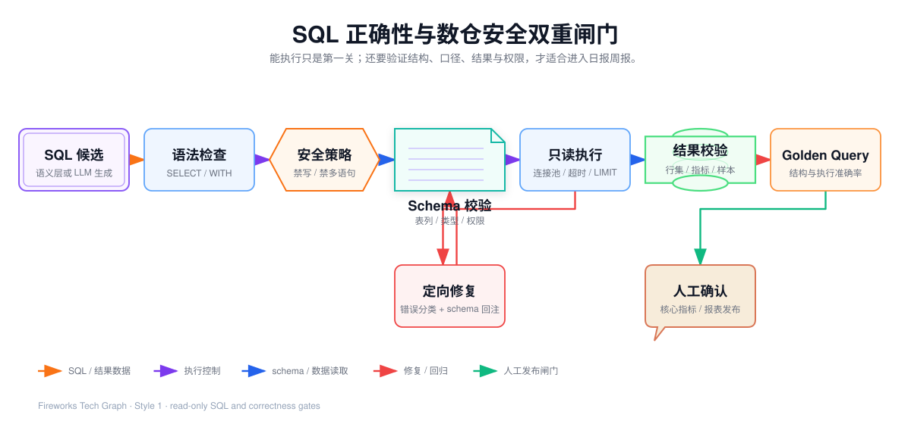

## 我参与的 SQL 安全与正确性验证

> 本文中的示例只用于说明方法，不包含公司源码、真实连接信息、内部配置、真实表名或未公开的业务规则。

### 1. 我如何理解 SQL 的安全和正确

自然语言转 SQL 不能只判断“数据库有没有返回结果”。我会把问题分成两个层面：

- **安全性**：SQL 是否可能修改、删除或影响数据；
- **正确性**：SQL 得到的结果是否符合业务问题和报表口径。

例如，下面几种情况都可能产生一个可执行的 SQL，但结果并不一定正确：

- 用下单金额代替支付金额；
- 把创建时间当成支付时间；
- 退款日期和订单日期混用；
- JOIN 明细数据后产生重复计数；
- 把上周同日误解为上一个自然周；
- 对比周期没有数据时错误计算变化率。

因此，我在这条链路中会设置两道闸门：

1. SQL 执行前，确保它是安全、可控的只读查询；
2. SQL 执行后，确认它的结构、语义和结果满足报表要求。



<InteractiveDiagram
  title="SQL 安全与正确性闸门"
  src="../../media/projects/baozun-lexicon/diagrams/sql-correctness-guardrails/index.html?embed=1"
  poster="../../media/projects/baozun-lexicon/diagrams/sql-correctness-guardrails/preview.png"
  description="SQL 候选经过语法、安全策略、Schema、只读执行和结果校验，固定报表再与审核基准和人工确认对照。"
/>

### 2. 第一关：限制 SQL 只能读取数据

我参与的查询链路会把 SQL 执行收敛为查询行为：

- 只接受数据读取语句；
- 拦截新增、修改、删除等写入操作；
- 拦截表结构变更和数据库管理操作；
- 拒绝注释和多语句拼接；
- 控制查询的返回行数；
- 设置查询超时和资源上限；
- 通过只读数据库账号和最小权限进一步保护数据源。

例如下面的语句不属于报表查询，即使模型生成了它，也应该在执行前被拒绝：

```sql
UPDATE daily_sales_summary
SET paid_amount = paid_amount * 0.9
WHERE stat_date = '2026-08-30';
```

这里的关键不是相信模型“不会写错”，而是从权限和执行工具层面限制模型只能读取数据。应用层的 SQL 检查是第一道门，数据库只读账号和权限配置是更底层的保护。

### 3. 第二关：限制查询资源

日报通常只需要按照渠道、品牌或地区汇总后的少量数据。如果模型直接查询大范围明细，可能造成不必要的数据库负载。

我会重点控制：

- 是否查询了无界的大量明细；
- 是否包含合理的时间范围；
- 是否只取报表需要的列；
- 是否有合理的排序和返回上限；
- 是否超过查询超时时间；
- 是否需要改用主题汇总数据。

例如：

```sql
SELECT *
FROM order_detail;
```

这类 SQL 即便语法正确，也不应直接作为日报查询发布。它缺少时间范围、字段范围和结果边界。对于明细下钻，应当使用单独的分页和权限控制，而不是让普通报表查询无限读取。

### 4. 第三关：Schema 校验

我会把生成的 SQL 与数据源元数据进行核对：

- 表是否存在；
- 字段是否存在；
- 字段类型是否适合日期过滤、分组或聚合；
- JOIN 两侧的关联字段是否存在；
- SELECT、GROUP BY 和聚合关系是否合理；
- 使用的时间字段是否与报告口径一致。

假设模型生成了 channel_name，但当前数据源实际返回的字段是 channel，系统不能直接执行这条 SQL，而是应根据元数据给出有限提示，再进入定向修复。

Schema 校验解决的是“SQL 写到了不存在的对象”这类问题，但它不能单独解决业务口径问题。一个存在的金额字段，仍然可能不是报告要求的销售额。

### 5. 第四关：语义校验

Schema 说明“数据库有什么”，语义层说明“业务上怎么理解”。

我会重点确认：

- 哪些字段是维度，可以筛选或分组；
- 哪些字段是度量，需要求和、计数或其他聚合；
- 指标由哪些度量组成；
- 指标使用什么过滤条件；
- 多张表之间如何关联；
- 业务名称和数据库实际值如何对应。

例如，业务定义“销售额”为支付成功订单的支付金额之和，那么 SQL 必须使用这个口径。不能因为另一列名称中包含 sales 或 amount，就自动把它当成销售额。

对于“销售额”“上周”“退款金额”这类可能有多种解释的词，我会先确认：

- 销售额是支付金额还是下单金额；
- 上周是前七天、上一个自然周还是上周同日；
- 退款金额按退款发生时间还是订单时间统计；
- 周报是否使用自然周、业务周或结算周期。

无法确认时，最正确的结果不是继续猜，而是返回澄清问题或将查询标记为待审核。

### 6. 第五关：结果校验

SQL 没有报错，只能说明数据库接受了它，不能证明日报已经正确。我会在结果返回后检查：

- 返回列是否覆盖报表需要的字段；
- 结果为空时，是否确实代表业务没有数据；
- 返回行数是否符合维度规模；
- 金额和订单数是否出现明显异常；
- NULL、0 和负数是否符合业务规则；
- 当前周期和对比周期是否完整；
- 变化率的分母为 0 时是否按约定展示；
- 分组结果与独立总计是否在允许误差内一致。

例如当前周期有某个渠道，但对比周期没有这个渠道。LEFT JOIN 可以保留该渠道，但“无历史数据”是否展示为 0，还是展示为空，需要由业务规则决定，不能在生成 SQL 时悄悄改变含义。

### 7. 用审核基准判断 SQL 是否真的正确

对于固定日报和周报，我会为已确认的报表保留审核过的查询基准，也可以理解为 Golden Query 或参数化 SQL 模板。

新生成的 SQL 可以从四个角度检查：

1. **结构是否一致**：表、字段、过滤条件、聚合、GROUP BY、JOIN 和排序是否符合预期；
2. **执行结果是否一致**：在测试数据或固定快照上执行后，关键结果是否一致；
3. **业务规则是否一致**：总金额、订单数、关键渠道和日期边界是否符合规则；
4. **数值误差是否可解释**：涉及小数、汇率或延迟数据时，是否在约定误差范围内。

我会把测试题覆盖到常见边界：

- 单日渠道汇总；
- 一周与上一周比较；
- 退款金额和退款率；
- 对比周期没有数据；
- 跨月、跨周和时区边界；
- 渠道别名和特殊字符；
- 明细表与汇总表的计数差异。

“SQL 精确匹配、结构匹配、执行准确率”可以帮助评价 Text2SQL 质量，但最终报表是否能发布，还需要结合业务指标负责人对口径和关键结果的确认。

### 8. 失败时如何修复，什么情况必须停止

我会优先处理局部、可验证的错误：

| 问题 | 处理方式 |
| --- | --- |
| 字段拼写错误 | 依据 Schema 重新匹配 |
| 表选择错误 | 依据业务语义和元数据重新选择 |
| 缺少结果上限 | 补充合理限制 |
| 日期格式或边界错误 | 依据已确认的时间规则修复 |
| SQL 语法错误 | 保留查询意图后定向修复 |

以下情况不能由模型自动修复后直接发布：

- 指标口径不明确；
- JOIN 关系不清楚，可能造成重复计算；
- 权限错误；
- 多次查询超时；
- 结果为空但原因不明；
- 与审核基准差异超过阈值；
- 使用了尚未审核的新表、新字段或新聚合方式。

遇到这些情况，我会停止自动链路，返回明确原因并进入人工确认。每次修复都应保留候选 SQL、错误类型和执行结果，修复次数也要设置上限。

### 9. 固定日报周报的发布方式

我会把日报周报分成“生成阶段”和“运行阶段”：

**生成阶段**

1. 用自然语言描述报表需求；
2. 生成第一版 SQL；
3. 检查 Schema、语义、安全和资源边界；
4. 在测试数据或固定快照上执行；
5. 与审核基准和关键结果对照；
6. 由技术和业务人员确认。

**运行阶段**

1. 保存已审核的参数化 SQL；
2. 按日期参数生成当天或当周的查询条件；
3. 定时执行查询；
4. 检查结果状态和关键质量条件；
5. 将结果交给日报或周报模板；
6. 保存查询版本和执行记录；
7. 出现异常时阻断报告发布。

这样可以利用自然语言转 SQL 提高初始 SQL 产出效率，又不会让正式报表每天随着模型随机变化。

### 10. 我对项目边界的把握

我会把 Cognida 的能力准确描述为：

- 业务问题理解和查询意图解析；
- 基于数据源元数据的表字段识别；
- 语义约束下的 SQL 生成；
- 只读 SQL 执行和资源控制；
- 查询失败后的有限修复；
- 结果保存和 Text2SQL 质量评估。

我不会把它描述成：

- 模型可以直接修改或删除公司数仓数据；
- 只要 SQL 能执行，报表结果就一定正确；
- 自然语言已经替代了指标管理和人工审核；
- 当前链路已经自动完成公司的正式报表发布。

如果实际使用的数据仓库采用其他数据库引擎，还需要补充对应的数据源、SQL 方言、权限、超时和资源管理适配。无论使用哪种引擎，SQL 安全检查、语义确认、结果校验和正式报表审核都应保留。

### 11. 我的项目总结

我参与的重点是把自然语言查询变成一条受控的 SQL 处理链路：先理解业务问题，再依据真实元数据和业务语义生成查询，执行前限制权限和资源，执行后检查结构与结果，最后将通过审核的结果用于日报和周报。

这个功能的核心价值不是让 AI 代替数据团队随意操作数仓，而是降低 SQL 查询门槛，同时保留数仓查询应有的安全性、正确性和可追溯性。
