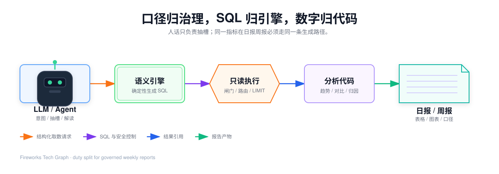
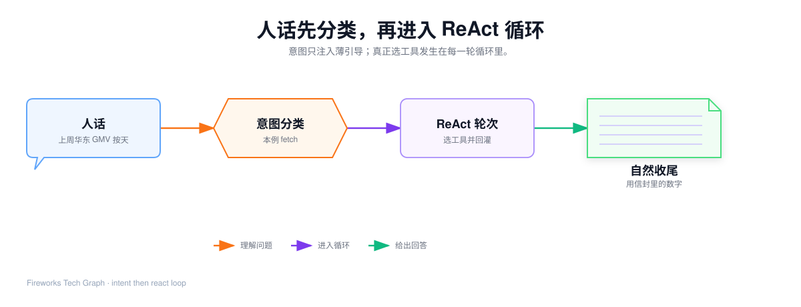
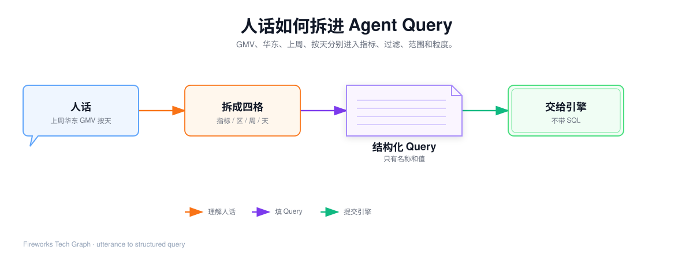
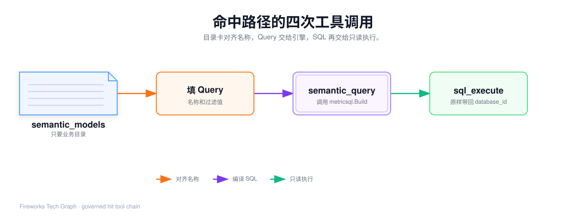
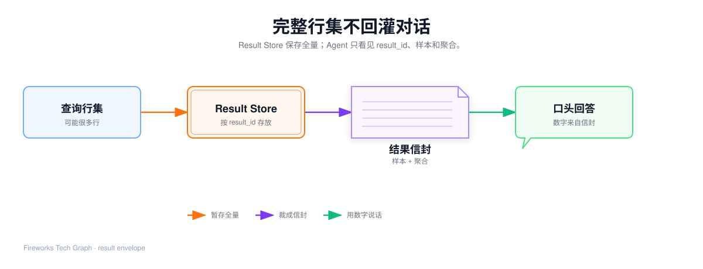

## 这篇要让你看懂什么

[62](./62-metricsql-join-and-assemble) 已经把编译停在两种合法出口：Covered=true 带一条 SQL，或 Covered=false 带空字符串。本篇换一条纵轴：谁决定调用引擎、命中时如何把这句话变成**可以引用的数字**。

1. Agent 是调度器，不是第二套 SQL 生成器；
2. 循环开始前意图只注入薄引导，真正选工具发生在每一轮；
3. 目录卡、Query、`semantic_query`、`sql_execute` 各自吃什么、吐什么；
4. `database_id` 为什么必须原样回传；
5. 合上文章后，能默写本例的工具顺序和结果信封字段。

未覆盖如何换工具、只读闸门细则、周报如何拆章，见 [72](./72-agent-fallback-and-report)。本篇假设走**治理命中**。

贯穿例子仍是：

> 上周华东区的 GMV 是多少？按天展示。

---

## 1. 62 交出来的，还不是数字

引擎不连库、不算趋势、不写周报。它交给上层的是：

| 字段 | 命中时 | 未覆盖时 |
| --- | --- | --- |
| `covered` | true | false |
| `sql` | 61 那条确定性 SQL | 空字符串 |
| `uncovered` | 空 | 缺的词 |
| `database_id` | 模型绑的数仓 | 空 |

合同就这一句：

> Agent 负责理解问题和选工具；口径仍归模型，SQL 仍归引擎，数字仍归只读执行。

对话里如果直接出现 `SUM(pay_amount)`，说明 51 的目录卡隔离已经破了，本层也不该把它当 Query 提交。



---

## 2. 循环前：先分类，再进入 ReAct

请求从会话进来后，先做一次意图分类，再进入实现里叫 `execLoop` 的循环。分类失败会走词法关键词兜底，保证总能给出一类。



| 意图 | 含义 | 本例是不是 |
| --- | --- | --- |
| `fetch` | 直接取数、多少、列出 | **是。** 「是多少」是取数 |
| `trend` | 走势、环比、同比 | 否。本例没问变化幅度 |
| `attribution` | 为什么、根因 | 否 |
| `report` | 周报、看板、综合解读 | 否。单句取数不是周报 |
| `ambiguous` | 过短、纯问候 | 否 |
| `general` | 有数据诉求但不属于上面几类 | 否 |

`fetch` 注入的薄引导大意是：受治理指标优先 `semantic_query`，否则再 `get_schema`；单值/单行不必再分析。引导**不是**硬编码的工具脚本。下一轮仍由模型根据观察自己选工具。

常见误解：六类意图等于六套独立引擎。错。内核只有一个循环；三类复杂意图才会额外注入方法论，本例用不到。

---

## 3. 每一轮只做一件事

循环的一步很短：

1. 看当前消息（含上一轮工具观察）；
2. 决定调用哪个工具，或不再调用、直接回答；
3. 工具结果回灌成下一条观察。

没有工具调用，就是自然收尾。本例命中路径通常是三到四轮工具，然后收尾。不要把「最多 24 轮」理解成本例真的会跑 24 次。

本篇用到的工具只有这些：

| 工具 | 作用 | 本例会不会调用                 |
| --- | --- |--------------------------------|
| `semantic_models` | 列出目录卡 | 会。先对齐名称                 |
| `ground_terms` | 口语接到规范名 | 可选。目录卡同义词已够时可不调 |
| `semantic_query` | 提交 Query，调用 `metricsql.Build` | 会                             |
| `sql_execute` | 只读执行 | 会                             |
| `get_schema` | 探物理表 | 不会                           |

写操作工具在本会话的 read 权限下进不去。不要在取数故事里出现 `UPDATE`。

---

## 4. 和前置的流程关联

| 上游 | 本例直接用 |
| --- | --- |
| 51 目录卡 | 指标「营收」（同义词含 GMV）、维度「大区」「下单日期」 |
| 61 冻结 Query | `metrics` / `dimensions` / `filters` / `time_grain` / `order_by` |
| 61 最终 SQL | `semantic_query` 命中后原样返回，本篇不重写装配 |
| 62 出口 | 本例 Covered=true，走只读执行 |

「上周」仍然由 Agent **先算成绝对日期**再写入 Query。引擎不认识这三个字。冻结区间与 61 相同：`[2026-09-07, 2026-09-14)`。



---

## 5. 逐步走命中路径



下面每一步都应能填出「请求」和「观察」。复盘时合上文章默写右栏。

### 5.1 `semantic_models`：只看目录卡

请求（脱敏）：

```json
{ "model": "电商销售" }
```

观察里只有业务目录，没有物理表、没有 JOIN、没有 `completed`：

| 目录里能看见 | 目录里不能看见 |
| --- | --- |
| 营收，口径「已支付金额之和」，同义词 GMV / 销售额 | `SUM(orders.pay_amount)` |
| 大区、下单日期 | `fact_order`、`orders.region` |
| 模型版本 1 | 数据源连接串 |

若租户有多份生效模型，「电商销售」和「商品销售」会并列。本例必须在后续请求里带上 `model: "电商销售"`，否则 `semantic_query` 会提示指定其一，而不是猜。

常见误解：目录卡就是给模型写 SQL 用的 schema。错。写 SQL 用的物理结构在 `get_schema`，本篇用不到。

### 5.2 可选：`ground_terms`

若担心「GMV」和「华东区」对不上，可以先接地：

```json
{ "model": "电商销售", "terms": ["GMV", "华东区", "上周"] }
```

本例预期：GMV → 营收（指标）；华东区 → 大区（维度）。「上周」不是指标名，未命中规范名——它本来就该被 Agent 换成日期，不必为此回退。

若某个词 `ambiguous=true` 或 `unresolved=true`，应先反问，不要硬猜进 Query。本例没有歧义，可以跳过这一轮。

### 5.3 填 Query 并调用 `semantic_query`

请求必须是 61 那种结构化字段，外加模型名。实现里工具处理函数会 `resolveBundle` → 查受信缓存 → `metricsql.Build`。

```json
{
  "model": "电商销售",
  "metrics": ["营收"],
  "dimensions": ["大区", "下单日期"],
  "filters": [
    { "field": "大区", "op": "=", "values": ["华东"] },
    { "field": "下单日期", "op": ">=", "values": ["2026-09-07"] },
    { "field": "下单日期", "op": "<", "values": ["2026-09-14"] }
  ],
  "time_grain": "day",
  "order_by": [{ "field": "下单日期", "desc": false }]
}
```

命中后的观察（脱敏，SQL 正文见 61 第 8 节）：

```json
{
  "covered": true,
  "sql": "SELECT orders.region AS `大区`, DATE_FORMAT(...) AS `下单日期`, SUM(orders.pay_amount) AS `营收` FROM fact_order AS orders WHERE ...",
  "database_id": "ecommerce_dw",
  "model": "电商销售",
  "model_version": 1,
  "resolved_metrics": ["营收"],
  "resolved_dimensions": ["大区", "下单日期"],
  "cache_hit": false
}
```

这一步 Agent **不得改写 SQL**。公式和 JOIN 已经钉死。若 `cache_hit=true`，SQL 仍是同一条，只是跳过了本次编译。

常见误解：`semantic_query` 会把数查回来。错。它只返回 SQL 和数据源，下一轮才执行。

### 5.4 `sql_execute`：必须带上 `database_id`

```json
{
  "sql": "<上一步返回的 SQL>",
  "database_id": "ecommerce_dw"
}
```

治理 SQL 是裸物理表名。不传 `database_id`，可能打到应用自己的元数据库，结果是空表或错库。工具描述里把这件事写成 MUST，复盘时也要能说出来。

执行侧会做：只读校验、尾部 LIMIT、30 秒超时、瞬时故障有界重试。细则在 72。本例只要记住：命中路径和回退路径**共用同一道闸门**。

### 5.5 结果信封，不是全量表



完整行集写入 Result Store，回灌对话的只是信封：

```json
{
  "result_id": "rs_east_gmv_day",
  "columns": ["大区", "下单日期", "营收"],
  "row_count": 7,
  "samples": [
    { "大区": "华东", "下单日期": "2026-09-07", "营收": 1280000 },
    { "大区": "华东", "下单日期": "2026-09-08", "营收": 1315000 }
  ],
  "aggregates": { "营收": { "sum": 9100000, "min": 1210000, "max": 1420000, "count": 7 } },
  "truncated": false
}
```

| 字段 | 含义 | 本例 |
| --- | --- | --- |
| `result_id` | 后续分析/画图按引用取全量 | 必须保住，压缩上下文时也不能丢 |
| `samples` | 默认最多约 20 行 | 7 天全部可放进样本 |
| `aggregates` | 数值列的 min/max/sum/count | 周合计应来自这里或全量引用，不靠口算 |
| `truncated` | 样本是否少于总行数 | 本例 false |
| `executed_sql` | 实际跑的语句（可能被加上 LIMIT） | 可以对照 61 |

Agent 收尾时应引用信封里的数字说话，例如「上周华东按天的营收合计约 910 万，样本见 `rs_east_gmv_day`」。它不应再发明一列「净营收」。

---

## 6. 本例工具顺序（默写用）

| 轮次 | 工具 | 关键入参 | 关键观察 |
| --- | --- | --- | --- |
| 循环前 | 意图分类 | 原话 | `fetch` + 取数 playbook |
| 1 | `semantic_models` | `model=电商销售` | 目录卡含营收 / 大区 / 下单日期 |
| 2 | `semantic_query` | 61 冻结 Query | `covered=true`，SQL，`database_id` |
| 3 | `sql_execute` | SQL + `database_id` | `result_id` + 7 行信封 |
| 收尾 | 无工具 | — | 用信封叙述，不改口径 |

`ground_terms` 可插在第 1、2 轮之间。插入与否不改变 Query 合同。

同一会话里如果马上再问同一句，`semantic_query` 可能 `cache_hit=true`，`sql_execute` 还可能复用会话内相同 SQL 的 `result_id`。数字必须仍对上 61 那条 SQL，否则就是串了缓存键。

---

## 7. 只换一个词会怎样

这些变体用来确认你是在走调度规则，而不是背这一条链路。

### 7.1 指标写成 GMV

目录卡同义词命中「营收」。Query 可以填 `GMV` 或 `营收`，引擎列别名仍是「营收」。工具顺序不变。

### 7.2 人话改成「出上周经营周报」

意图变成 `report`。不能再用本篇三轮取数收尾。拆章、并行主题、未覆盖章如何标明，见 72。

### 7.3 改成目录里没有的「实时库存」

第 2 轮 `semantic_query` 会返回 `covered=false`、`sql=""`、`uncovered: ["实时库存"]`、`fallback_hint` 指向 `get_schema + sql_execute`。本篇到此停住，不得假装命中。完整回退在 72。

### 7.4 漏传 `database_id`

SQL 仍可能被执行，但打错库。这不是引擎的错，是本层违反了工具合同。复盘时要能指出这一步。

---