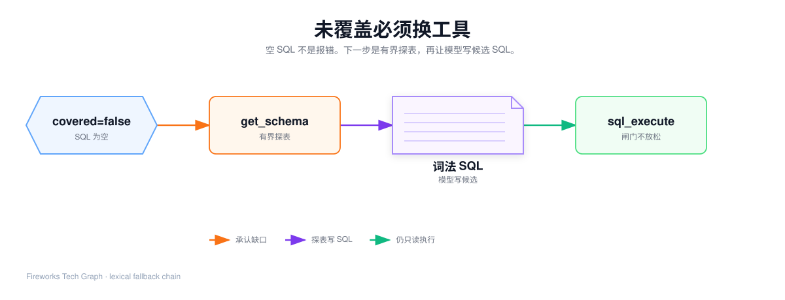
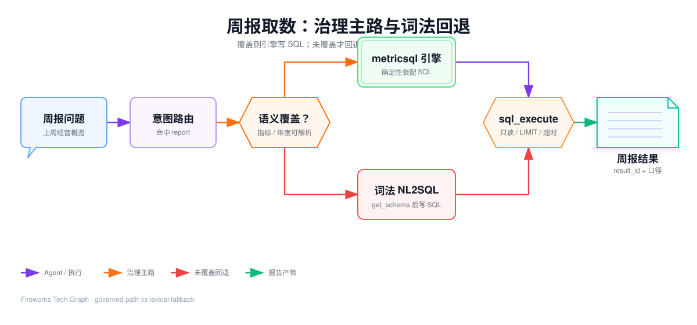
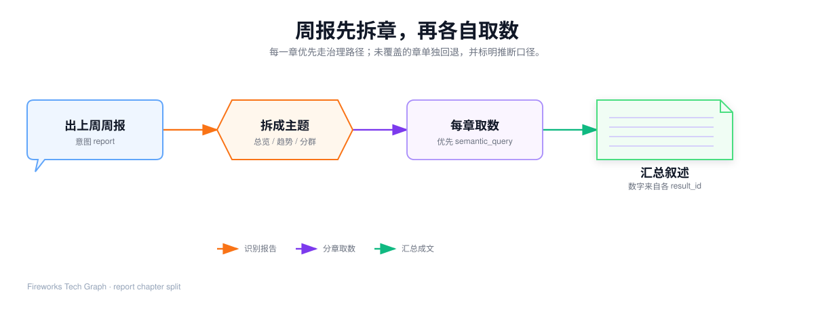

## 这篇要让你看懂什么

[71](./71-agent-hit-path) 已经用「上周华东 GMV 按天」走出一条**治理命中**的工具链。本篇补三种 71 故意没展开的情况：名称对不上、执行闸门、一句话要出整份周报。

1. 为什么空 SQL 之后必须换工具，而不能改写引擎返回的语句；
2. `get_schema` 如何有界探表，词法 SQL 为什么可信等级更低；
3. 只读闸门、LIMIT、超时、信封字段各自挡住什么；
4. 受信缓存谁来取放，未覆盖为什么禁止写入；
5. 周报如何拆章，每一章怎样优先走 71 的命中路径。

子代理内部翻表、Skill 全文、风控审批流，不是本篇主线。本篇停在「调度层把 62 的两种出口接完」。

---

## 1. 未覆盖必须换工具

引擎的承诺延续到这里：Covered=false 时 SQL 是空字符串。Agent 若把空字符串拿去 `sql_execute`，只会得到一句非法 SQL。正确动作是**改工具**，不是补半截 SELECT。





`semantic_query` 在未覆盖时会多给两个字段：`uncovered` 列出缺的词，`fallback_hint` 写明下一步用 `get_schema + sql_execute`。这是给循环看的观察，不是给业务人员看的周报结论。

### 1.1 失败案例：实时库存

71 末尾换成的请求：

```json
{
  "model": "电商销售",
  "metrics": ["实时库存"],
  "dimensions": ["下单日期"],
  "time_grain": "day"
}
```

观察：

```json
{
  "covered": false,
  "sql": "",
  "uncovered": ["实时库存"],
  "fallback_hint": "存在未覆盖名称，改用 get_schema + sql_execute 走词法 NL2SQL",
  "resolved_dimensions": ["下单日期"]
}
```

逐步走：

| 步骤 | 结果 |
| --- | --- |
| 目录卡 | 没有「实时库存」 |
| Query | Agent 仍可能提交这个名称（它不知道一定失败） |
| `metricsql.Build` | 名称进未覆盖，空 SQL |
| 工具层 | **不写入**受信缓存 |
| 下一轮 | 必须换 `get_schema`，不能对空 SQL 执行 |

覆盖记录会记下缺的词，供治理补模型。那不是 51 的对象树，也不进入 SQL。

### 1.2 `get_schema` 必须有界

词法路径需要物理表结构。工具禁止一次把全库灌进对话：

| 传参 | 返回 | 上限 |
| --- | --- | --- |
| `table_name` | 该表完整列 | 一张 |
| 只有 `keywords` | 按相关度的候选表+列 | 最多 15 张 |
| 两者都不传 | 轻量目录（表名+描述，不含列） | 最多 300 张 |

本例关键词可用「库存 商品」。得到候选后，再对真正像库存事实表的那张传 `table_name`，必要时看列画像里的枚举事实。不要把应用库的用户表、任务表一并塞进上下文。

`database_id` 在回退路径里仍然要显式指定外部数仓。会话隐式选库同样会打错库。

### 1.3 词法 SQL 是候选，不是口径

模型根据表结构写出 SELECT 之后，仍然只能交给 `sql_execute`。和 61 的差别：

| | 治理命中 | 词法回退 |
| --- | --- | --- |
| 谁写 SQL | `metricsql.Build` | 对话里的模型 |
| 口径 | 建模钉死 | 这次推断，下次可能变 |
| JOIN | 只走已登记 to-one 边 | 可能猜 ON |
| 回答里要标明 | 治理口径 | **推断口径**，不能当正式周报数字 |
| 写入受信 SQL 缓存 | 可以（方言可信时） | 不可以冒充 Verified |

常见误解：回退路径可以绕过 LIMIT。错。闸门不看 SQL 是谁写的。

### 1.4 本例探表快照

下一轮不要传空参数灌全库。先用关键词收敛：

```json
{ "database_id": "ecommerce_dw", "keywords": "库存 商品" }
```

观察（脱敏）可能是：候选里有商品维表、订单明细，**没有**名叫实时库存的治理指标。再对最像库存事实的表精确取列：

```json
{ "database_id": "ecommerce_dw", "table_name": "fact_sku_stock" }
```

模型这才写出词法 SQL。下面这份**可以**交给 `sql_execute`（仍只读），但回答里必须写成推断口径：

```sql
SELECT warehouse, sku_id, qty
FROM fact_sku_stock
WHERE snapshot_date = '2026-09-15'
```

下面这些**不能**执行：

| SQL | 为什么拦 |
| --- | --- |
| `UPDATE fact_sku_stock SET qty = qty - 1` | 黑名单 UPDATE |
| `SELECT * FROM fact_sku_stock; DROP TABLE fact_sku_stock` | 多语句 / DDL |
| 空字符串 | 上一步 covered=false 的 SQL |

探不到表就应承认「模型未覆盖且库里也定位不到」，反问业务要哪张库存快照，而不是用订单表凑一个库存。

---

## 2. 只读闸门：两条路径共用

`sql_execute` 的合同：

> 只执行 SELECT / WITH；自动封顶行数；超时 30 秒；完整行集进 Result Store；回灌的是信封。

| 检查 | 挡住什么 | 缺了会怎样 |
| --- | --- | --- |
| 必须以 SELECT 或 WITH 开头 | 随便一段文本 | 工具直接失败 |
| 黑名单关键词 | INSERT / UPDATE / DELETE / DDL / GRANT 等 | 对话会话默认 read，写工具进不去；这里是第二道 |
| 禁止 `--` 注释 | 注释注入把后面的语句藏起来 | 失败 |
| 尾部 LIMIT | 无上限扫表 | 默认 100、封顶 1000；子查询里的 LIMIT 不算外层已限行 |
| 30 秒超时 | 慢查询拖死会话 | 失败，可修复观察交回循环 |
| 数据源路由 | 打错库 | `database_id` 空则回落会话库 |

瞬时死锁、锁等待会在工具内做有界重试。非瞬时错误立即返回，不在工具里死循环。

会话内相同库、相同执行 SQL，在 TTL 内可以复用已有 `result_id`，观察里会带「未重复执行」的警告。这是防 runaway，不是改口径。

常见误解：Agent 持有数据库连接。错。模型只能调工具；连库、鉴权、跑查询的是后端。

---

## 3. 信封字段要能默写

71 已经展示过本例信封。这里把「看起来像错、其实合法」钉死，避免复盘时和 62 的未覆盖表搞混。

| 现象 | 引擎 / 执行侧怎么做 | 算不算失败 |
| --- | --- | --- |
| `truncated=true` | 样本少于总行数 | 否。应按 `result_id` 取全量，不要用样本加总当周报 |
| 没有 `result_id` | 暂存失败或存储未启用 | 降级为仅样本，下游按引用会失败，应提示重跑 |
| ORDER BY 字段不在 SELECT | 62 已丢掉排序 | 否。执行侧不再补排序 |
| 值映射未命中 | 62 原样比对 | 可能 0 行，但是命中路径，不是 `covered=false` |
| `max_rows>1000` | 压到 1000 | 否 |

后续 `data_analysis` / `render_ui` 应传 `result_id`，不要把样本行复制进下一轮提示。上下文压缩时必须保住这个句柄，否则分析链会断。

---

## 4. 受信缓存：工具层取放，版本是锚点

62 只规定键里必须有模型版本。真正 Get / Put 发生在 `semantic_query` 工具里。

| 部分 | 为什么在键里 |
| --- | --- |
| 租户 | 不同租户同名模型不能串 |
| 模型名 | 电商销售和商品销售不能串 |
| 模型版本 | 口径一改，旧 SQL 必须失效 |
| 规范化 Query | 指标、维度、过滤、排序、行数、粒度、方言任一不同，SQL 就不同 |

命中：`cache_hit=true`，跳过 `Build`，仍要 `sql_execute`。未命中：走 60 / 61，成功且方言可信再写入，TTL 默认 24 小时。

**未覆盖禁止写入。** 方言是连接失败后的猜测时也不写入，避免把可能错分桶函数的 SQL 固化。

Result Store 是另一份缓存：存的是**行集**，TTL 更短（默认约 30 分钟）。不要把「命中受信 SQL」说成「命中查询结果」。

Golden Query 是人工策展、优先返回的受信 SQL，仍然要过只读执行。它不能替代 61 的编译讲解，只说明正式报表可以钉死一条已审核语句。

---

## 5. 周报：先拆章，再各自取数

人话改成「出上周经营周报」时，意图是 `report`，不能套 71 的三轮取数收尾。



引导大意：把报告拆成若干主题；重活扇出，只回传结论摘要 + `result_id`；主循环负责汇总，不要在主上下文里逐章展开撑爆窗口。

本篇用脱敏三章举例，不必把七个子代理背下来：

| 章 | 人话主题 | 优先工具 | 失败时 |
| --- | --- | --- | --- |
| 总览 | 上周 GMV、订单数、客单价 | 各打一次 `semantic_query` | 缺哪个指标，哪一格标明推断或「未覆盖」 |
| 趋势 | 按天 GMV | 与 71 相同，只要去掉大区过滤或保留 | 同 71 |
| 分群 | 渠道或大区对比 | 维度换成渠道 / 大区 | 渠道若未建模，该章走 `get_schema` |

总览章的三条 Query 仍然只含名称。例如客单价：

```json
{
  "model": "电商销售",
  "metrics": ["客单价"],
  "filters": [
    { "field": "下单日期", "op": ">=", "values": ["2026-09-07"] },
    { "field": "下单日期", "op": "<", "values": ["2026-09-14"] }
  ]
}
```

趋势章几乎就是 71 的冻结 Query，可以去掉大区过滤，让全国按天展开。分群章把 `dimensions` 换成 `["渠道"]`；若目录卡没有渠道，这一章单独回退，总览章的 GMV 仍走治理，**不要**因为一章失败把整份周报改成裸 Text2SQL。

规则：

1. 每一章单独提交 Query，不要让模型一次写六段 JOIN；
2. 能走治理的章，数字必须来自信封或 `result_id`；
3. 走词法的章，正文里写明「推断口径，非正式」；
4. 汇总叙述可以在模型侧组织，关键数字不得口算；
5. 当前对话按需出数，**还没有**「每天定时推送正式日报」的调度。面试时主动说这句，比把规划说成上线更加分。

常见误解：周报 skill 会替代语义模型。错。skill 约束章节结构和输出形态，口径仍在 51 的对象上。

---

## 6. 执行层到此结束

| 从哪来 | 交给谁 |
| --- | --- |
| 62 Covered=true + SQL + `database_id` | 71 `sql_execute` → 信封 |
| 62 Covered=false + 空 SQL | 本篇 `get_schema` → 词法 SQL → 同一道闸门 |
| 多章 `result_id` | 分析 / 渲染 / 人写解读 |
| 未审核数字 | 不能当正式周报发布 |

两种出口仍然不要记成「成功 / 报错」：

| 路径 | 可信等级 | 下一步不该做什么 |
| --- | --- | --- |
| 治理命中 | 周报主路 | 不要再让模型改写这条 SQL |
| 词法回退 | 探索降级 | 不要把推断数字写进正式口径，也不要写入 Verified 缓存 |

---

、、

