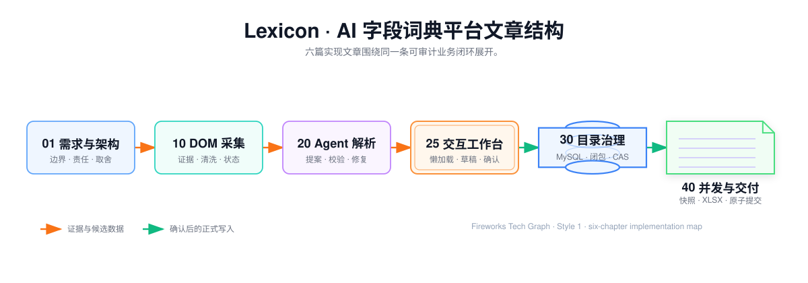

## Lexicon · AI 字段词典平台

> 这是一份Lexicon的全栈技术专栏。它系统拆解 DOM-SCOUT 内部定制采集、受限 Agent 业务语义解析、交互工作台、目录树事务并发、数据库并发和异步 XLSX 字典交付。

---

## 先看这一页

如果你要系统理解项目需求、完整技术方案和核心实现，先读：

- **[00 · Lexicon项目技术总纲](./project-knowledge-directory)**：从全栈职责、端到端架构、关键取舍到完整文章目录的技术地图。

然后阅读 **[01 · 完整需求定位与架构](./01-platform-catalog-architecture)**，建立项目边界、端到端链路和关键取舍。

如果你要深聊技术，按这个顺序往下读：

- **[10 · DOM-SCOUT 驱动的页面字段采集](./10-dom-field-capture)**：开源能力如何内部定制，人工如何选区，插件如何清洗，证据如何进入 Agent。
- **[20 · 受限 Agent 层级解析](./20-agent-hierarchy-parsing)**：Agent 怎么把证据变成可验收的候选字段树。
- **[25 · 字段治理交互工作台](./25-full-stack-workbench)**：采集、解析、目录审核和导出任务如何形成统一交互闭环。
- **[30 · 平台字段目录结构治理](./30-platform-field-structure-management)**：目录树不变量、生命周期与一致性。
- **[40 · 数据库并发与 XLSX 字典交付](./40-field-dictionary-data-delivery)**：从数据库快照到异步导出、原子交付与高并发边界。

---

## 阅读导航

| 章节 | 主题 | 你会带走什么 |
| --- | --- | --- |
| [00 · Lexicon项目技术总纲](./project-knowledge-directory) | 全栈职责、整体架构、技术取舍、知识目录 | 一份可逐章展开的项目技术地图 |
| [01 · 完整需求定位与架构](./01-platform-catalog-architecture) | 需求边界、角色、链路、取舍 | 一张端到端架构图 |
| [10 · DOM-SCOUT 驱动的页面字段采集](./10-dom-field-capture) | 插件定制、人工选区、清洗、补采与降级 | `DomSnapshot` 证据契约 |
| [20 · 受限 Agent 层级解析](./20-agent-hierarchy-parsing) | 解析编排、提示、反馈 | 可验收的候选字段树 |
| [25 · 字段治理交互工作台](./25-full-stack-workbench) | 采集、解析、审核、目录和导出交互 | 一条完整的前后端状态链路 |
| [30 · 平台字段目录结构治理](./30-platform-field-structure-management) | 树不变量、生命周期、一致性 | 目录结构的"地基" |
| [40 · 数据库并发与 XLSX 字典交付](./40-field-dictionary-data-delivery) | 数据库并发、快照、XLSX、原子交付 | 不影响采集的可复现交付物 |

---

## 平台全景（可交互）

<InteractiveDiagram
  title="Lexicon端到端全景"
  src="../../media/projects/baozun-lexicon/diagrams/platform-overview/index.html?embed=1"
  poster="../../media/projects/baozun-lexicon/diagrams/platform-overview/preview.png"
  description="从字段采集、层级解析、草稿确认、目录治理到字典交付的闭环能力地图。"
/>

---

## 一张图看懂文档结构

---

> **说明**由于为公司内部实现项目，相关源码，数据库结构，具体代码实现等都进行脱敏和安全防护，该项目文章只只分享工作流和大概的实现线路。
