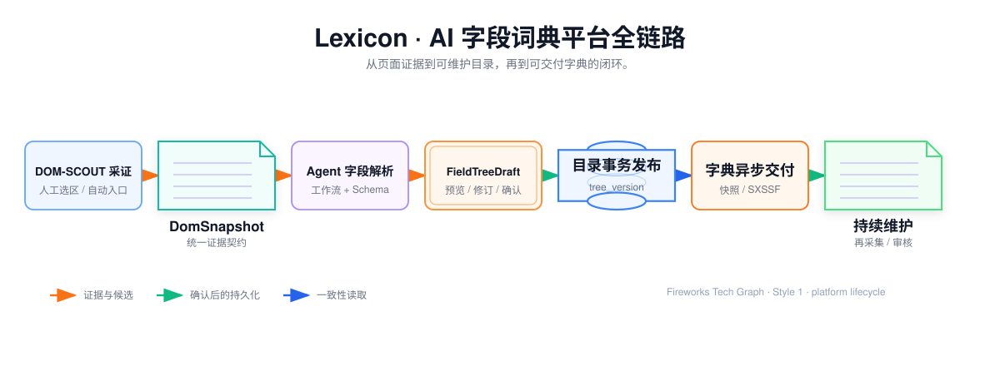
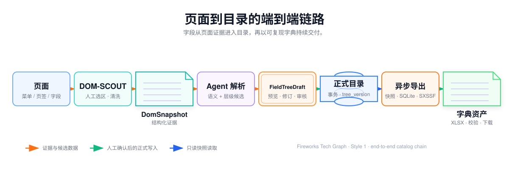
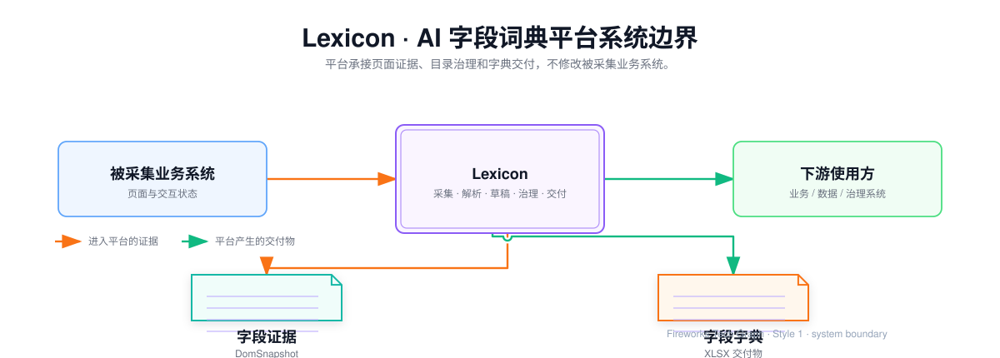
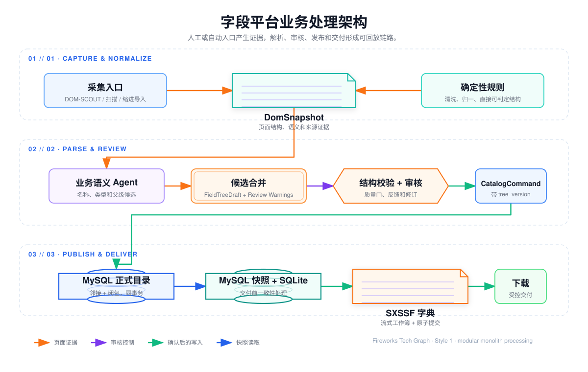
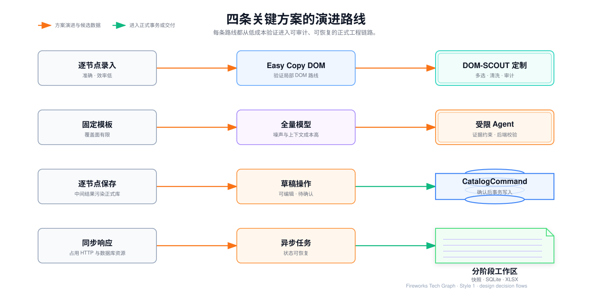

## Lexicon · AI 字段词典平台项目技术总纲

Lexicon把业务后台中的菜单、页面、页签、区块、表单字段、表格列和指标定义，沉淀为具有统一身份、层级关系、来源证据和版本记录的目录资产。

平台通过 DOM-SCOUT 内部定制插件采集页面证据，经客户端清洗、输入归一和受限 Agent 生成 `HierarchyProposal`，再由后端编译为 `FieldTreeDraft`。业务人员在交互工作台中预览、修订并确认，前端随后提交带基线版本的 `CatalogCommand`，由后端事务写入正式目录。正式目录按层查询，并通过 MySQL 一致性快照、SQLite 阶段工作区和异步任务生成字段字典 XLSX。

## 1. 系统职责和边界

### 1.1 端到端责任

- **采集端**：DOM-SCOUT 内部定制、人工选区、多选区和父子导航、受限 Playwright 自动入口、证据预览与补采；
- **平台前端**：目录树懒加载、游标分页、批量录入、拖拽意图、草稿差异审核、任务进度和安全下载；
- **应用后端**：采集任务、解析任务、草稿编译、目录命令、目录查询、导出任务和文件元数据；
- **领域模型**：`DomSnapshot`、`HierarchyProposal`、`FieldTreeDraft`、`DraftOperation`、目录不变量、任务状态机和版本基线；
- **数据与文件**：MySQL 正式目录和闭包关系、SQLite 导出快照、临时工作区、XLSX 和本地/对象存储；
- **Agent 工程**：规则路由、Prompt 组装、白名单工具、结构校验、定向修复和人工反馈；
- **工程边界**：认证、REST、SSE、容量限制、事务重试、日志追踪和部署配置。

平台负责从页面证据到目录资产和字典产物的治理链路，但不修改被采集系统的业务逻辑，不把页面文本当作系统指令，也不替下游数据仓库定义指标计算公式。

### 1.2 正式数据和候选数据

从页面证据到最终交付的状态流转见图：

`FieldTreeDraft` 是人工确认前的唯一候选事实来源，浏览器中的树只是视图缓存。没有确认不能插入 `catalog_nodes`、更新 `catalog_nodes` 或写入闭包表；确认后也不提交整棵浏览器树，而是由后端基于当前目录重新校验被接受的命令。

## 2. 总体技术架构

采用模块化单体与端口适配结构。领域规则不依赖浏览器驱动、模型 SDK、MyBatis 或文件系统；这些外部适配器可以替换，但树不变量、草稿确认闸门、任务状态机和文件原子提交规则不改变。

关键原则：

1. 页面内容先被转换为受约束的结构化证据；
2. 插件负责选区和清洗，输入归一负责安全校验，Agent 负责有限的业务语义判断；
3. Agent 只能调用白名单领域工具，不能直接写正式目录；
4. 提案必须经过后端编译、结构校验和人工审核，才能成为目录命令；
5. 目录写入使用节点 `version`、平台 `tree_version`、稳定锁序和闭包事务；
6. 大数据量交付从一致性快照异步流式生成，并与采集线程、目录写线程隔离；
7. 任务、草稿和阶段文件保留可恢复状态，失败不会被浏览器刷新抹掉。

## 3. 关键设计取舍

四条路线的方案演进关系见图：

### 3.1 采集方案演进

逐节点录入准确但效率低；Easy Copy DOM 验证了“业务人员定范围、DOM 提供证据”的路线，但缺少多选、页面上下文、状态指纹和统一审计。DOM-SCOUT 内部定制补齐多选高亮、父子导航、结构摘要、脱敏和 Agent 输入格式。缩进文本保留为确定性批量录入入口，和 DOM 证据共用后续草稿与目录命令链路。

### 3.2 解析方案演进

固定模板覆盖不了不同组件库；全量模型直接处理页面噪声又容易受上下文长度和提示注入影响。最终采用人工定界、双层清洗、结构事实抽取、受限 Agent 语义判断、后端校验和业务人员确认的组合。Agent 输出 `HierarchyProposal`，后端才编译 `FieldTreeDraft`，二者不能混为同一个前端树对象。

### 3.3 写入方案演进

解析中间结果不得逐节点写入正式表。草稿用与目录树兼容的 `id、parentId、level、children、nodeType` 结构渲染，并额外携带 `sourceRefs、reviewRequired、validationIssues、reviewStatus`。确认后只把被接受的 `DraftOperation` 转为带 `baseTreeVersion` 和节点版本的 `CatalogCommand`，由一次事务完成最终校验。

### 3.4 交付方案演进

同步导出会占用 HTTP 线程、数据库连接、JVM 内存和响应缓冲。当前实现将任务登记、MySQL RR 快照、SQLite 清洗、SXSSF 写入、SHA-256 校验、原子文件提交和下载拆开；MySQL 连接在快照完成后释放，本地阶段可从 manifest 和行文件恢复。

## 01 · 完整需求定位与全栈架构

说明字段散落、定义漂移、页面改版返工和字典交付困难，建立 Platform、`DomSnapshot`、`HierarchyProposal`、`FieldTreeDraft`、`DraftOperation`、Catalog Node、`CatalogCommand` 和 Export Task 的共同语境。

本章应覆盖角色和端到端边界、前后端与 Agent 责任、模块化单体依赖方向、正常链路、错误边界、核心对象关系以及从人工目录工具演进为字段治理平台的设计依据。

## 10 · DOM-SCOUT 驱动的半智能字段采集

说明 DOM-SCOUT 的内部定制边界、人工选区、多选区、Easy Copy DOM 降级、缩进导入和受限 Playwright 如何统一进入 `DomSnapshot`。细化 heading、label、table header、ARIA、placeholder、DOM 包含关系、Tab/折叠/弹窗/滚动/分页状态，以及 Shadow DOM、iframe、虚拟列表和 Canvas 的降级。

本章同时定义简化 HTML、结构事实、页面状态指纹、动作白名单、停止条件、敏感值剥离、证据去重、超限和部分完成，并给出页面夹具、证据预览和错误原因。

## 20 · 受限 Agent 层级解析

说明 Evidence Agent 如何在有限工具和预算内完成二次取证、层级分析、字段命名/类型、反思和定向修复。重点区分 `DomSnapshot`、`EvidencePack`、`HierarchyProposal` 与 `FieldTreeDraft` 的契约边界，以及父级存在、唯一父级、无环、类型、来源证据和前端结构校验。

本章还应定义 `RepairFeedback`、局部重算、SSE 阶段事件、`TREE_DRAFT_READY/REVIEW_REQUIRED/PARTIAL` 结果、人工复核入口和父级准确率、人工修改率、证据缺口率、平均耗时等指标。

## 25 · 字段治理交互工作台

这是全栈交互核心章节，完整说明：

- 目录树节点最小字段、分支状态、平台切换、面包屑、搜索和节点详情；
- 根节点/直接子节点懒加载、`hasChildren`、keyset 游标、祖先链补齐、版本失效和 NDJSON 大树读取；
- 空格/Tab 自适应缩进、公共缩进归一、缺失中间层、重复兄弟、行号错误和批量容量限制；
- 拖拽意图、前端预检、乐观更新、回滚、节点 CAS 和 `tree_version` 冲突；
- DOM-SCOUT、Easy Copy DOM、受限 Playwright、快照预览、清洗告警和 SSE 观察；
- `FieldTreeDraft`、变化类型、差异审核、部分接受、拒绝、局部重算和人工确认闸门；
- 任务轮询、失败摘要、安全下载、401/409/422/429 和网络断线恢复；
- 浏览器视图状态、服务端任务状态和正式目录事实的持久化边界。 。

## 30 · 平台字段目录结构治理

说明 MySQL 8.0+ InnoDB 中 `platforms、catalog_nodes、catalog_node_details、catalog_node_closure` 的职责、逻辑外键、生成列同级唯一索引、邻接表与闭包表的取舍，以及根、层级、类型、顺序、逻辑删除和最大深度不变量。

本章细化新增、批量新增、改名、详情更新、子树移动、删除、恢复的事务顺序；`READ_COMMITTED`、节点 ID 升序锁定、锁后复查、CAS、MySQL 死锁/锁等待边界、平台 `tree_version` 递增、keyset 查询、祖先路径、完整树阈值、NDJSON 流和闭包巡检/重建。

## 40 · 数据库并发与 XLSX 字典交付

- `export_tasks/export_task_details` 的字段、索引、幂等键、创建准入、任务归属和文件元数据；
- `PENDING/RUNNING/RETRYING/SUCCESS/FAILED/CANCELED` 状态机、条件领取、单调进度、重试、恢复和单实例/多实例边界；
- MySQL `REPEATABLE_READ` 非锁定快照、server cursor、1000 行批次、一个源读取 permit、600 秒超时和连接池保护；
- SQLite 分阶段快照、manifest、有效路径 DFS、`rows/*.bin`、异常分支隔离和阶段恢复；
- Apache POI `SXSSFWorkbook` 100 行窗口、16 列表头、当前已实现列与空列、Excel 行上限、字符串写入和公式注入防护；
- `.xlsx.part`、大小/SHA-256、原子移动、成功元数据、下载条件、7 天保留和 24 小时工作区清理；
- 导出与采集、目录写入、SSE 和查询线程的资源隔离；
- 连接池、Tomcat、导出执行器、信号量、磁盘、锁等待、队列和多实例租约的高并发工程边界；
- 快照一致性、重复领取、进程中断、容量超限、坏树、下载和内容安全验收。

## 数仓与智能报表专题

原有六篇文章说明 Lexicon 如何从页面采集、字段解析走到字段目录和 XLSX 交付；下面三篇把边界延伸到 Cognida 的自然语言转 SQL 场景。这里的“承接”指业务词典可以帮助理解查询意图，真实表名、物理列名和指标口径仍必须来自数仓 Schema 与人工审核。

### 50 · Text2SQL 报表查询架构

说明 Cognida 如何作为日报、周报的自然语言查询入口和受治理 SQL 执行层：Data Agent 解析问题，Schema 提供真实表列，语义模型管理指标和维度，sql_execute 负责只读查询，Result Store 保存结果。文章同时区分当前已实现能力与公司正式报表需要补齐的调度、模板和数仓适配。

### 60 · 从自然语言到日报周报 SQL

用“查询某日各渠道销售额并与上周同日比较”的脱敏案例，拆解时间、维度、指标、Schema 探查、语义匹配、SQL 生成、执行修复和表格/图表结果。固定日报周报采用审核后的参数化 SQL 模板，临时分析再使用即时 Text2SQL。

### 70 · SQL 安全边界与正确性验证

说明 SELECT/WITH 白名单、危险语句拦截、注释和多语句拒绝、LIMIT、超时、只读账号、Schema 校验、语义校验、结果校验和 Golden Query。重点强调 SQL 能执行不等于报表正确，正式报表必须经过业务确认和版本化发布。

这三篇的核心链路是：

> Lexicon 业务字段词典 → Cognida Schema 与语义匹配 → 生成候选 SQL → 只读安全执行 → 结果校验 → 审核后的日报 / 周报。
