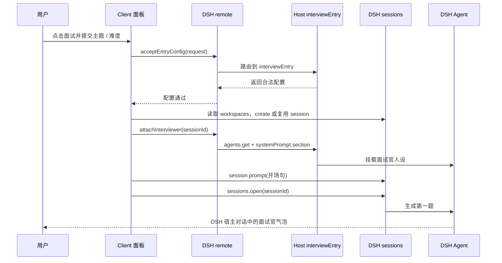

这份文档回答一个问题：`interview-dsh` 作为插件，怎样接入 DeepSeek Harness（DSH），怎样让 DSH 加载它，怎样让网页 Client 调用 Host，以及一次面试请求怎样经过宿主服务完成。

这里的“架构”指 **DSH 宿主与插件之间的组织方式**，不是插件内部的业务分层。插件包怎样组织见 [20 插件化机制](./20-plugin-mechanism)。

<InteractiveDiagram
  title="DSH 插件从装配到面试运行的架构流转"
  src="/media/projects/dsh-harness-plugin/diagrams/architecture-flow/index.html?embed=1"
  poster="/media/projects/dsh-harness-plugin/diagrams/architecture-flow/preview.webp"
  description="Host 注册业务端口，Client 接入宿主插槽，再通过 remote 驱动会话、评估与工作区落盘。"
/>

## 1. 先给结论：谁初始化、谁暴露、谁调用

当前项目**不初始化一套自己的 Harness**。DSH Desktop 已经是宿主运行时，负责启动 Cordis、注册宿主服务、创建 Web Client 运行环境，并加载插件。

插件只交付两半：

- **Host**：运行在 DSH 的插件进程中，向 DSH 注册 `interviewEntry` 业务服务。它使用 DSH 注入的 `agents`、`llm`、`agentDefaultModel` 和 `fs`。
- **Client**：运行在 DSH Web 页面中，从 DSH 获取 `slots` 和 `remote`，注册按钮和面板，并发起用户操作。

因此调用关系是：

```text
DSH 启动 Host
  → Host 用 ctx.provide() 向 DSH 注册 interviewEntry
  → DSH 启动 Client 并注入 slots / remote
  → Client 用 slots 接入宿主页面
  → Client 用 remote 调用 Host 的 interviewEntry
  → Host 使用 DSH 注入的 agents / llm / fs 完成工作
  → 结果通过 remote 回到 Client 面板
```

Client 不直接 import Host 函数，Host 也不直接操作网页组件。两边由 DSH 的运行时和远程调用桥接连接。

## 2. DSH 和插件各自拥有的东西

| 所属 | 能力 | 说明 |
|---|---|---|
| DSH 宿主 | 插件运行时 / Cordis | 发现插件、加载模块、创建 `ctx`、调用 `apply`、管理生命周期 |
| DSH 宿主 | `sessions` / `workspaces` | Web 侧会话、项目分组、会话创建与打开 |
| DSH 宿主 | `agents` | Host 侧获取会话 Agent、修改 Agent 系统提示 |
| DSH 宿主 | `llm` / `agentDefaultModel` | Host 侧模型调用和默认模型 |
| DSH 宿主 | `fs` | Host 侧受策略保护的工作区读写 |
| DSH 宿主 | `slots` | Web 侧界面插槽 |
| DSH 宿主 | `remote` | Web Client 到 Host 的远程服务桥 |
| 插件 Host | `interviewEntry` | 面试配置、提示词、人设、评估、轮次和落盘用例 |
| 插件 Client | 面试按钮和教练面板 | 界面注册、用户操作、状态展示 |
| 插件 Shared | 类型和错误码 | 两端共同遵守的请求、响应和错误契约 |

插件**使用** DSH 的基础能力，不复制这些基础能力。插件只把自己的业务能力注册回 DSH。

## 3. 安装包怎样告诉 DSH 加载两半

根 `package.json` 是 DSH 看到的插件清单：

```json
{
  "main": "./lib/index.js",
  "exports": {
    ".": "./lib/index.js",
    "./client": "./lib/client.js",
    "./typert": "./lib/typert.host.js"
  },
  "dsh": {
    "bundle": { "patch": "./cordis.patch.yml" },
    "client": {
      "platform": "web",
      "inject": [
        "@deepseek-ai/dsh-client-runtime",
        "@deepseek-ai/dsh-api-remotes",
        "@deepseek-ai/dsh-client-ui-layout",
        "@deepseek-ai/dsh-client-ui-conversation"
      ]
    }
  }
}
```

`cordis.patch.yml` 把插件插入 DSH 的插件表：

```yaml
- insert:
    - id: interview-dsh
      name: interview-dsh
```

构建前，源码在 `backend/` 和 `frontend/`；构建后，DSH 只加载 `lib/`：

```text
backend/src/infra/dsh/index.ts  →  lib/index.js       Host
backend/src/typert.host.ts      →  lib/typert.host.js  Host 端契约
frontend/dist/client.js         →  lib/client.js      Client
```

DSH 不编译插件的 TypeScript，也不运行 `backend/` 或 `frontend/` 源码。`lib/` 是安装器真正加载的运行表面。

## 4. 启动阶段：DSH 怎样装配 Host

### 4.1 DSH 先准备自己的 Host 服务

DSH 启动时先建立自己的服务容器。`agents`、`llm`、`agentDefaultModel` 和 `fs` 已经属于 DSH，插件只在 Host 的 `inject` 中声明依赖：

```ts
export const name = 'interview-dsh';
export const inject = ['agents', 'llm', 'agentDefaultModel', 'fs'];
```

这不是插件创建服务，而是告诉 Cordis：调用 Host `apply(ctx)` 前，请把这些宿主服务放进 `ctx`。

### 4.2 DSH 调用 Host 的 `apply`

Host 入口由 `backend/src/infra/dsh/index.ts` 导出：

```ts
export { apply, inject, name } from './adapter.js';
```

DSH 调用 `backend/src/infra/dsh/adapter.ts` 的 `apply(ctx)`。这个 `apply` 做的关键事情是组装插件服务，然后注册到 DSH：

```ts
ctx.provide('interviewEntry', service);
```

这里的 `interviewEntry` 是 DSH 服务表里的一个业务服务名。之后，DSH 远程系统才能按 `interviewEntry` 找到插件 Host。

Host 的 `apply` 不注册按钮、输入栏、右栏或浮层，也不调用 `session.prompt`。它只负责把插件业务挂入 DSH，并把 DSH 的 Host API 接给业务用例。

## 5. 启动阶段：DSH 怎样装配 Client

### 5.1 DSH 注入 Client 上下文

Client 入口导出：

```ts
export const name = 'interview-dsh';
export const inject = ['slots', 'remote'];
```

DSH 先根据 `package.json` 的 `dsh.client.inject` 准备官方前端包，再调用 Client 的 `apply(ctx)`。此时 `ctx` 是 DSH 创建的网页侧运行上下文，至少包含：

```text
ctx.slots   DSH 页面插槽
ctx.remote  DSH 远程调用桥
ctx.effect  生命周期清理
ctx.inject  作用域注入
ctx.get     服务探测
```

`inject` 是依赖声明，`ctx` 是宿主实际交给插件的运行时对象；插件没有创建 `slots` 和 `remote`。

### 5.2 Client 用 `slots` 接入页面

输入栏按钮通过官方插槽注册：

```ts
ctx.slots.inject('conversation.input.right', () =>
  ctx.slots.register(
    { name: 'conversation.input.right', id: 'interview-dsh', label: '面试' },
    () => createElement(InterviewTriggerButton, ...),
  ),
);
```

教练面板通过 `shell.overlay` 注册：

```ts
ctx.slots.inject('shell.overlay', () =>
  ctx.slots.register(
    { name: 'shell.overlay', id: ENTRY_OVERLAY_ID, label: '面试' },
    () => createElement(InterviewSlotPanel, ...),
  ),
);
```

这表示插件把组件交给 DSH 的界面插槽，由 DSH 决定何时渲染和销毁。插件没有创建第二个聊天页，也没有改写 DSH 输入框。

### 插槽位置和像素位置由谁决定

Slot 是 DSH 前端组件树中预先定义的渲染位置。插件传入的是 Slot 名称和组件，不传屏幕坐标：

```text
conversation.input.right
  → DSH 对话输入栏在自己的布局中渲染这个 Slot
  → 插件注册的按钮进入输入栏右侧操作区
```

本机 DSH 的 `conversation.input.right` 定义为输入栏操作行的右端、主发送按钮之前；DSH 对话组件负责把该 Slot 渲染到这个位置。插件组件最终的像素位置由 DSH 的 DOM 结构、宿主 CSS、容器布局和当前视口共同决定，会随窗口尺寸和响应式布局变化，不是通过插件里的 `x/y` 坐标固定出来的。

注册项的 `order` 是同一个 Slot 内的排列顺序。本插件为按钮声明 `order: 9`，它表示列表顺序，不代表像素偏移或屏幕坐标。

`shell.overlay` 则是由 DSH 页面框架渲染的全局浮层 Slot，内容位于各页面列和滚动容器之上。这个 Slot 给插件一个可挂载的浮层层级；抽屉的实际几何位置由插件组件自己的 CSS 决定。本插件用 `position: fixed`、`top/right/bottom` 和固定最大宽度把面板定位到视口右侧。因此：

- Slot 决定组件接入宿主界面的哪个语义区域；
- `order` 决定同一列表 Slot 中贡献项的先后；
- 宿主布局和组件 CSS 决定最终屏幕尺寸与像素位置。

### 5.3 Client 用 `remote` 接入 Host

Client 将远程方法描述挂到 DSH：

```ts
await ctx.remote.$mount(interviewEntryRemote);
```

描述中写明：

```text
package   interview-dsh
service   interviewEntry
namespace interviewEntry
method    acceptEntryConfig
```

还会声明参数和返回值的 JSON 编解码规则。Host 侧的 `lib/typert.host.js` 有同一套服务名、命名空间、方法名和契约。

匹配成功后，DSH 才知道：

```text
Client 的 remote.interviewEntry.acceptEntryConfig(request)
  → Host 的 interviewEntry.acceptEntryConfig(request)
```

这是一条 DSH 远程调用，不是 JavaScript 直接引用。Client 不 import Host 的 `createInterviewEntryPort`，也不通过 `fetch('/api/...')` 绕过 DSH。

## 6. 两种 Client 调用方向

当前插件的 Client 有两种完全不同的调用方式。

### 6.1 Client 直接调用 DSH Web API

`sessions` 和 `workspaces` 属于 DSH 的网页侧服务。Client 在用户点击开始时探测它们：

```text
ctx.get('sessions')
ctx.get('workspaces')
```

然后直接调用：

```text
sessions.create(...)
sessions.binding(sessionId).session.prompt(...)
sessions.open(sessionId)
workspaces.list.getSnapshot()
```

这些调用不经过插件 Host，因为它们本来就是 DSH Web 侧提供的会话控制能力。

### 6.2 Client 通过 DSH remote 调用插件 Host

面试业务方法通过远程桥调用：

```text
remote.interviewEntry.acceptEntryConfig(...)
remote.interviewEntry.attachInterviewer(...)
remote.interviewEntry.briefCoach(...)
remote.interviewEntry.watchCoachTurn(...)
remote.interviewEntry.endRound(...)
```

DSH 收到请求后，按服务名和方法名找到 Host 的 `interviewEntry`，在 Host 进程执行。Host 再使用自己 `ctx` 中的 `agents`、`llm` 和 `fs`。

因此不能把所有事情都简单说成“Client 调 Host”：

```text
Client → DSH Web API
  会话、工作区、开场 prompt、切换会话

Client → DSH remote → Host → DSH Host API
  配置、系统提示、教练评估、轮次结束、工作区档案
```

## 7. 用户点击“开始面试”时的完整调用链



关键点是：Host 不替 Client 调用网页侧 `session.prompt`，Client 也不直接访问 Host 侧 `agents.get`。两边各自调用自己所在运行环境里的 DSH API。

## 8. 面试运行阶段的流转

### 8.1 题目出现后

第一题出现在 DSH 宿主对话后，Host 生成开卷要点和知识链。知识链包括知识点、考察层、考察意图和三档下一问约束，按难度裁剪后写入 Agent 的 `interview:chain` 系统段。

系统段只对 Agent 可见，不进入用户气泡。知识链替换必须等 Agent idle；插件不能在面试官生成半句时改写系统提示。

### 8.2 候选人作答后

候选人继续使用 DSH 原输入框作答。面试官沿同一宿主会话继续生成，插件不再用 `prompt` 催问。

Host 使用 `agents.get(sessionId)` 看守日志，确认出现新的完整考生答案且 Agent idle 后：

1. 读取完整问答。
2. 用宿主默认模型通过 `llm.stream` 生成对照、五维和覆盖判断。
3. 若 Jev 已启用且调用成功，用 Jev 的五档结果；否则使用对照结果。
4. 通过 Typert remote 把教练结果回传 Client。
5. 由代码决定留在原卡、创建 `Qn.m` 子卡或创建下一个 `Qn`。

教练输出只写入面板卡片，不 append 到 DSH 对话；评分 JSON、知识链和导演词不能进入气泡。

### 8.3 结束本轮

用户点击“结束本场”后：

1. Client 请求 Host 停止本轮看守。
2. Host 摘掉 `interview:chain`。
3. Host 挂载收尾系统段。
4. Client 对考场 `session.prompt` 恰好发送一次可见短句“结束面试”。
5. Host 写入逐题卡片、`qa.md` 和 `summary.md`。
6. Client 回到入口，考场会话和面试官人设保留。

收尾导演词留在系统段，不能写进用户气泡。收尾或落盘失败必须在面板可见。

## 9. 会话和文件属于谁

考场会话属于 DSH 的 `sessions`，不是插件自己实现的聊天。插件只保存这场会话对应的轮次状态和档案。

```text
.dsh-interview/<exam-session-id>/
  index.json
  round-<n>-<slug>/
    session.json
    cards/Q1.md
    cards/Q1.1.md
    qa.md
    summary.md
```

文件写入由 Host 使用 DSH 的 `ctx.fs`，先通过 `resolve` 得到受策略保护的目标，再写入工作区。不能使用 `node:fs`，不能让 Client 直接写文件。

上一轮结束后，在同一个考场重新开始：

- 复用同一个 DSH session id；
- 摘掉上一轮收尾段；
- 使用新的 `round-*` 目录；
- 保留旧的 `qa.md`、`summary.md` 和 `cards/`。

## 10. 边界和失败处理

### 对话边界

DSH 对话是唯一的问答表面。插件面板不能自建消息列表、输入框或聊天气泡。插件可见用户句只有开场句和“结束面试”。

### Host / Client 边界

- Host 只在 `backend/src/infra/dsh/` 调用 `agents`、`llm`、`fs` 等 Host API。
- Client 只在 `frontend/src/infra/dsh/` 调用 `slots`、`remote`、`sessions`、`workspaces` 等 Web API。
- `features`、`services` 和 `data` 不直接依赖 DSH SDK。
- Client 不 import Host 内部实现；Host 不注册网页组件。
